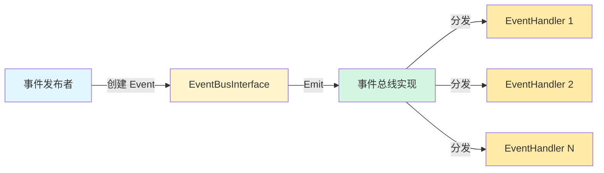

# event_bus_message_contracts 模块深度解析

## 1. 模块概览

在分布式系统中，组件之间的解耦和松耦合通信是一个核心挑战。`event_bus_message_contracts` 模块通过定义事件驱动架构的核心契约，为整个系统提供了一个轻量级的事件总线抽象。这个模块不是一个完整的事件总线实现，而是定义了事件系统的**语言**和**接口**——类似于定义了交通规则和信号灯标准，而不是建造整个道路网络。

## 2. 架构



### 架构角色

1. **事件发布者**：创建 `Event` 结构体并通过 `EventBusInterface.Emit()` 发布事件
2. **EventBusInterface**：核心接口契约，定义了事件总线的基本操作
3. **事件总线实现**：实现 `EventBusInterface` 接口，负责事件的实际分发
4. **事件处理器**：注册到事件总线上，处理特定类型的事件

### 数据流向

1. 事件发布者创建一个 `Event` 结构体，填充所有必要字段
2. 调用 `EventBusInterface.Emit()` 方法将事件发布到总线
3. 事件总线实现接收事件，并查找所有注册了对应 `EventType` 的处理器
4. 事件总线将事件分发给每个匹配的处理器
5. 每个处理器执行自己的业务逻辑，可能返回错误

## 3. 核心问题与解决方案

### 为什么需要这个模块？

想象一个复杂的聊天系统，当用户发送一条消息时，可能需要触发以下操作：
- 更新对话历史
- 触发流式响应生成
- 记录日志和指标
- 通知监控系统
- 更新缓存

如果这些组件直接相互调用，代码会变得紧密耦合，难以测试和扩展。一个 naive 的解决方案是让每个组件知道所有其他组件，但这会导致"意大利面条式"的依赖关系。

### 设计洞察

这个模块采用了**发布-订阅模式**（Publish-Subscribe Pattern）的核心思想，但将其简化为最本质的契约。关键洞察是：**定义事件系统的接口与实现分离**，这样：
1. 依赖事件系统的代码只需要依赖这个轻量级契约，而不是具体实现
2. 不同的事件总线实现可以互换，只要满足相同的接口
3. 避免了循环依赖问题

## 4. 核心组件解析

### 4.1 Event 结构体

```go
type Event struct {
    ID        string                 // Event ID
    Type      EventType              // Event type (uses EventType from chat_manage.go)
    SessionID string                 // Session ID
    Data      interface{}            // Event data
    Metadata  map[string]interface{} // Event metadata
    RequestID string                 // Request ID
}
```

**设计意图**：
- **统一事件信封**：`Event` 结构体是所有事件的"信封"，不管事件内容是什么，都有统一的元数据字段
- **可追踪性**：`ID`、`SessionID`、`RequestID` 三个字段构成了完整的追踪链路，支持分布式追踪
- **灵活负载**：`Data` 字段使用 `interface{}` 类型，允许任何类型的事件数据，提供了最大的灵活性
- **扩展元数据**：`Metadata` 是一个键值对映射，用于存储不需要强类型约束的额外信息

**设计权衡**：
- 使用 `interface{}` 失去了一些类型安全，但换取了极大的灵活性
- 固定的元数据字段确保了所有事件都有基本的可观测性

### 4.2 EventBusInterface 接口

```go
type EventBusInterface interface {
    On(eventType EventType, handler EventHandler)
    Emit(ctx context.Context, evt Event) error
}
```

**设计意图**：
- **最小接口原则**：只定义了两个核心方法——注册处理器和发布事件
- **上下文感知**：`Emit` 方法接收 `context.Context`，支持超时、取消和链路追踪
- **错误处理**：`Emit` 返回 `error`，允许事件总线实现报告发布失败

### 4.3 EventHandler 类型

```go
type EventHandler func(ctx context.Context, evt Event) error
```

**设计意图**：
- **函数式接口**：使用函数类型而不是接口，简化了处理器的定义
- **上下文传递**：处理器接收 `context.Context`，可以访问链路追踪信息
- **错误反馈**：处理器可以返回错误，允许事件总线实现处理失败情况

## 5. 架构角色与数据流

### 架构定位

`event_bus_message_contracts` 模块位于系统的**核心契约层**，它的主要角色是：
1. 定义事件系统的语言
2. 打破依赖循环
3. 提供扩展点

## 6. 设计决策与权衡

### 6.1 接口与实现分离

**决策**：将事件总线的接口定义在 `types` 包中，而具体实现放在其他地方

**原因**：
- **避免循环依赖**：如果具体实现也在这个包中，可能会导致依赖循环
- **提高可测试性**：可以轻松创建 mock 实现来测试依赖事件总线的代码
- **支持多种实现**：可以有不同的事件总线实现（如内存实现、分布式实现）

### 6.2 灵活的事件数据类型

**决策**：使用 `interface{}` 作为 `Data` 字段的类型

**权衡**：
- ✅ 优点：极大的灵活性，任何类型都可以作为事件数据
- ❌ 缺点：失去了编译时类型安全，需要运行时类型断言

**替代方案考虑**：
- 使用泛型（Go 1.18+）：但这会增加接口的复杂度，且不是所有场景都需要
- 使用具体类型：但这会限制事件系统的适用范围

### 6.3 同步 vs 异步发布

**决策**：`Emit` 方法是同步的（返回 `error`）

**权衡**：
- ✅ 优点：调用者可以立即知道事件是否成功发布
- ❌ 缺点：如果处理器执行时间长，会阻塞发布者

**注意**：这个决策只是接口设计，具体实现可以选择异步处理，但需要通过其他方式通知调用者结果。

## 7. 使用指南与最佳实践

### 7.1 发布事件

```go
evt := types.Event{
    ID:        generateEventID(),
    Type:      types.MessageReceived,
    SessionID: sessionID,
    Data:      messageData,
    Metadata:  map[string]interface{}{"source": "chat_api"},
    RequestID: requestID,
}

if err := eventBus.Emit(ctx, evt); err != nil {
    log.Printf("Failed to emit event: %v", err)
}
```

### 7.2 注册事件处理器

```go
handler := func(ctx context.Context, evt types.Event) error {
    switch data := evt.Data.(type) {
    case MessageData:
        // 处理消息数据
    default:
        return fmt.Errorf("unexpected data type: %T", data)
    }
    return nil
}

eventBus.On(types.MessageReceived, handler)
```

### 7.3 最佳实践

1. **总是填充追踪字段**：确保 `ID`、`SessionID`、`RequestID` 都被正确设置
2. **使用类型安全的包装函数**：为常用事件类型创建包装函数，减少类型断言错误
3. **保持处理器轻量**：避免在处理器中执行长时间运行的操作
4. **正确处理错误**：处理器返回的错误应该被事件总线实现适当地处理

## 8. 注意事项与陷阱

### 8.1 循环依赖风险

确保：
- 不要在这个包中导入具体的事件总线实现
- 事件总线实现应该依赖这个包，而不是反过来

### 8.2 类型安全问题

使用 `interface{}` 意味着失去了编译时类型安全。建议：
- 为常用事件类型创建辅助函数
- 在处理器中进行严格的类型检查
- 考虑使用代码生成来创建类型安全的事件包装器

### 8.3 错误处理

事件处理器返回的错误应该被谨慎处理：
- 不要让一个处理器的错误影响其他处理器的执行
- 考虑实现重试机制或死信队列
- 确保错误被适当记录和监控

## 9. 依赖关系

### 被依赖模块

这个模块是一个底层契约模块，几乎不依赖其他模块，除了：
- `context` 包：用于上下文传递

### 依赖此模块的模块

根据模块树结构，以下模块可能依赖此模块：
- [platform_infrastructure_and_runtime-event_bus_and_agent_runtime_event_contracts](platform_infrastructure_and_runtime-event_bus_and_agent_runtime_event_contracts.md)
- [application_services_and_orchestration](application_services_and_orchestration.md)

## 10. 总结

`event_bus_message_contracts` 模块是一个小巧但至关重要的模块，它定义了整个系统事件驱动架构的核心契约。通过将接口与实现分离，它实现了：
- 组件之间的解耦
- 灵活的事件传递机制
- 完整的可追踪性支持
- 避免循环依赖的解决方案

虽然它只是一个契约模块，但它的设计决策影响着整个系统的架构风格和可扩展性。理解这个模块的设计思想，对于理解整个系统的事件驱动架构至关重要。
