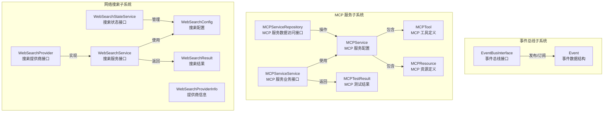

# mcp_web_search_and_eventing_contracts 模块深度解析

## 1. 模块概述

想象一下，你正在构建一个智能助手系统，这个系统需要能够：
- 与外部工具和服务进行通信（如 MCP 服务）
- 在互联网上搜索最新信息
- 在系统各组件之间传递事件和消息

这个模块就是系统的"合同中心"——它定义了所有这些交互的通用语言和接口规范。就像不同国家之间的贸易需要统一的合同模板一样，这个模块为 MCP 服务集成、网络搜索和事件总线提供了标准化的数据模型和接口契约。

### 1.1 解决的核心问题

在没有这个模块之前，系统面临三个主要挑战：

1. **MCP 服务集成的碎片化**：每个 MCP 服务可能有不同的配置方式、认证机制和通信协议，导致集成代码重复且难以维护
2. **网络搜索提供商的异构性**：Bing、Google、DuckDuckGo 等搜索引擎有不同的 API 格式和响应结构，切换提供商需要大量修改
3. **事件传递的不一致性**：系统各组件之间的事件传递没有统一规范，导致耦合度高、难以测试和扩展

这个模块通过定义统一的契约（Contracts）来解决这些问题——它不提供具体实现，而是规定了"应该是什么样子"，让各个实现方遵循相同的规则。

### 1.2 在系统中的位置

这个模块位于 `core_domain_types_and_interfaces` 之下，是整个系统的核心契约层。它的设计理念是"依赖倒置"——高层模块（如应用服务）和低层模块（如具体实现）都依赖于这些抽象契约，而不是相互依赖。

```
┌─────────────────────────────────────────────────────────────┐
│                   应用服务层 (Application Services)           │
│  (mcp_connectivity_and_protocol_models, web_search_orchest…) │
└─────────────────────────────────────────────────────────────┘
                              ▲
                              │ 依赖
                              │
┌─────────────────────────────────────────────────────────────┐
│         mcp_web_search_and_eventing_contracts (本模块)       │
│  ┌──────────────┐  ┌──────────────┐  ┌──────────────────┐  │
│  │  Event Bus   │  │   MCP 服务   │  │   网络搜索契约    │  │
│  │   契约       │  │   契约       │  │                  │  │
│  └──────────────┘  └──────────────┘  └──────────────────┘  │
└─────────────────────────────────────────────────────────────┘
                              ▲
                              │ 实现
                              │
┌─────────────────────────────────────────────────────────────┐
│                   基础设施层 (Infrastructure)                 │
│  (event_bus_and_agent_runtime_event_contracts, 具体 MCP 实现)│
└─────────────────────────────────────────────────────────────┘
```

## 2. 核心架构与组件

这个模块可以分为三个相对独立但又协同工作的子系统：

### 2.1 架构全景图



### 2.2 子系统详解

#### 2.2.1 事件总线子系统

**设计意图**：提供一个松耦合的事件传递机制，让系统组件之间可以在不知道彼此存在的情况下进行通信。

**核心组件**：
- `EventBusInterface`：定义了事件总线的基本操作（注册处理器、发布事件）
- `Event`：事件的数据结构，包含 ID、类型、会话 ID、数据和元数据

**设计亮点**：
- 使用接口而非具体实现，避免了循环依赖问题
- 事件数据使用 `interface{}` 类型，保持了灵活性
- 包含 `RequestID` 和 `SessionID`，便于分布式追踪和会话关联

#### 2.2.2 MCP 服务子系统

**设计意图**：为 MCP（Model Context Protocol）服务提供统一的配置模型和管理接口，支持多种传输方式（SSE、HTTP Streamable、Stdio）。

**核心组件**：
- `MCPService`：MCP 服务的核心配置模型，包含传输类型、认证、高级配置等
- `MCPServiceService`：MCP 服务的业务逻辑接口
- `MCPServiceRepository`：MCP 服务的数据访问接口
- `MCPTool`、`MCPResource`：MCP 服务暴露的工具和资源定义
- `MCPTestResult`：MCP 服务连接测试的结果

**设计亮点**：
- 支持多种传输方式，适应不同的 MCP 服务实现
- 敏感数据（API Key、Token）自动脱敏，保护安全
- 完整的数据库映射（GORM）和 JSON 序列化支持
- 提供默认配置（`GetDefaultAdvancedConfig`），简化使用

#### 2.2.3 网络搜索子系统

**设计意图**：为网络搜索功能提供统一的契约，支持多个搜索引擎提供商，并提供 RAG（检索增强生成）压缩能力。

**核心组件**：
- `WebSearchConfig`：搜索配置，包含提供商、API Key、最大结果数、压缩方法等
- `WebSearchResult`：单个搜索结果的数据结构
- `WebSearchProviderInfo`：搜索提供商的元信息
- `WebSearchService`：搜索服务的业务接口
- `WebSearchProvider`：搜索提供商的适配接口
- `WebSearchStateService`：搜索临时状态管理接口

**设计亮点**：
- 支持多种压缩方法（none、summary、extract、rag），适应不同场景
- 临时知识库状态管理，支持 RAG 压缩而不污染主知识库
- 黑名单机制，过滤不需要的搜索结果
- 完整的提供商抽象，易于添加新的搜索引擎

## 3. 关键设计决策

### 3.1 契约优先（Contract-First）设计

**决策**：将所有核心契约放在独立的 `types` 包中，与具体实现分离。

**权衡分析**：
| 方面 | 选择（契约优先） | 替代方案（实现优先） |
|------|-----------------|---------------------|
| 耦合度 | 低，各层依赖抽象 | 高，各层依赖具体实现 |
| 可测试性 | 高，易于 mock 接口 | 低，需要依赖真实实现 |
| 前期成本 | 较高，需要先设计契约 | 较低，可以快速开始编码 |
| 长期维护 | 容易，契约稳定后变更影响小 | 困难，实现变更可能波及多处 |

**为什么这样选择**：
这是一个典型的"磨刀不误砍柴工"的决策。对于一个需要长期维护和扩展的系统来说，契约优先的设计虽然前期需要更多思考，但能够大大降低后续的维护成本。特别是在多团队协作的场景下，明确的契约能够减少沟通成本和集成风险。

### 3.2 多种传输方式的统一抽象

**决策**：在 `MCPService` 中使用 `TransportType` 枚举来统一支持 SSE、HTTP Streamable 和 Stdio 三种传输方式。

**权衡分析**：
- **统一配置模型**：优点是用户体验一致，缺点是某些字段对某些传输方式是可选的（如 `URL` 只对 SSE/HTTP 必需）
- **条件验证**：需要在业务逻辑层进行条件验证（如 Stdio 必须有 `StdioConfig`），增加了复杂度但提高了安全性

**为什么这样选择**：
虽然可以为每种传输方式创建单独的配置模型，但那样会导致 API 碎片化和用户体验不一致。通过统一模型并在业务层进行验证，既保持了简洁性，又确保了正确性。

### 3.3 网络搜索的临时知识库设计

**决策**：在 `WebSearchService` 中使用临时知识库进行 RAG 压缩，并通过 `WebSearchStateService` 管理其状态。

**权衡分析**：
- **临时知识库**：优点是不会污染主知识库，缺点是需要额外的状态管理
- **Redis 存储状态**：优点是高性能、支持过期，缺点是增加了基础设施依赖

**为什么这样选择**：
RAG 压缩需要将搜索结果暂时存储为知识片段，但这些片段不应该对用户可见或长期保留。使用临时知识库 + Redis 状态管理是一个优雅的解决方案——既满足了功能需求，又保持了系统的整洁性。

### 3.4 事件总线的简化设计

**决策**：`EventBusInterface` 只定义了最核心的 `On` 和 `Emit` 方法，而没有包含更复杂的功能（如事件持久化、重试机制）。

**权衡分析**：
| 特性 | 当前设计 | 如果包含复杂功能 |
|------|---------|-----------------|
| 接口复杂度 | 低，易于实现 | 高，实现难度大 |
| 灵活性 | 高，可以在实现层添加功能 | 低，所有实现都必须支持所有功能 |
| 适用场景 | 适合多种实现（内存、分布式等） | 可能过度设计 |

**为什么这样选择**：
这是"接口隔离原则"的典型应用——客户端不应该依赖它不需要的接口。通过保持接口简洁，不同的实现可以根据自己的需求添加功能（如某些实现可能需要持久化，而某些内存实现则不需要）。

## 4. 数据流程分析

### 4.1 MCP 服务集成流程

让我们跟踪一个典型的 MCP 服务创建和测试流程：

```
1. 用户创建 MCP 服务配置
   ↓
2. HTTP 层接收请求，验证并转换为 MCPService 结构体
   ↓
3. MCPServiceService.CreateMCPService 被调用
   ↓
4. MCPServiceRepository.Create 持久化到数据库
   ↓
5. 用户测试 MCP 服务连接
   ↓
6. MCPServiceService.TestMCPService 被调用
   ↓
7. 建立与 MCP 服务的连接（根据 TransportType）
   ↓
8. 获取工具和资源列表
   ↓
9. 返回 MCPTestResult 给用户
```

**关键依赖**：
- `MCPServiceService` 依赖 `MCPServiceRepository` 进行数据持久化
- 具体的 MCP 连接逻辑不在这个模块中，而是在 `platform_infrastructure_and_runtime.mcp_connectivity_and_protocol_models` 中

### 4.2 网络搜索流程

```
1. 用户发起搜索请求
   ↓
2. WebSearchService.Search 被调用，传入 WebSearchConfig
   ↓
3. 根据 provider 字段选择对应的 WebSearchProvider 实现
   ↓
4. WebSearchProvider.Search 执行实际搜索
   ↓
5. 返回 WebSearchResult 列表
   ↓
6. 如果配置了 RAG 压缩：
   - 检查是否已有临时知识库状态
   - 如果没有，创建临时知识库
   - 将搜索结果存入临时知识库
   - 执行 RAG 压缩
   - 更新临时知识库状态
   ↓
7. 返回最终结果
```

**关键依赖**：
- `WebSearchService` 依赖 `KnowledgeBaseService` 和 `KnowledgeService` 进行 RAG 压缩
- `WebSearchStateService` 用于管理临时知识库的状态

### 4.3 事件总线流程

```
1. 组件 A 想要发布事件
   ↓
2. 创建 Event 结构体，设置 Type、Data、SessionID 等
   ↓
3. 调用 EventBusInterface.Emit
   ↓
4. 事件总线查找所有注册的 EventHandler
   ↓
5. 依次调用每个 handler（通常是异步的）
   ↓
6. 组件 B 的 handler 接收并处理事件
```

**关键设计**：
- 事件发布者和订阅者完全解耦
- 事件处理通常是异步的，不会阻塞发布者
- `RequestID` 和 `SessionID` 用于追踪和关联

## 5. 子模块概览

### 5.1 event_bus_message_contracts

**职责**：定义事件总线的消息契约。

**核心组件**：`EventBusInterface`、`Event`。

**设计意图**：提供一个简单但足够灵活的事件传递抽象，避免系统组件之间的直接耦合。

**详细文档**：[event_bus_message_contracts](core_domain_types_and_interfaces-mcp_web_search_and_eventing_contracts-event_bus_message_contracts.md)

### 5.2 mcp_service_domain_models

**职责**：定义 MCP 服务的领域模型和数据结构。

**核心组件**：`MCPService`、`MCPTool`、`MCPResource`、`MCPTestResult` 等。

**设计意图**：为 MCP 服务提供统一的配置模型，支持多种传输方式和认证机制。

**详细文档**：[mcp_service_domain_models](core_domain_types_and_interfaces-mcp_web_search_and_eventing_contracts-mcp_service_domain_models.md)

### 5.3 mcp_service_interfaces

**职责**：定义 MCP 服务的业务逻辑和数据访问接口。

**核心组件**：`MCPServiceService`、`MCPServiceRepository`。

**设计意图**：分离关注点，让业务逻辑和数据访问都依赖于抽象而非具体实现。

**详细文档**：[mcp_service_interfaces](core_domain_types_and_interfaces-mcp_web_search_and_eventing_contracts-mcp_service_interfaces.md)

### 5.4 web_search_domain_models

**职责**：定义网络搜索的领域模型和数据结构。

**核心组件**：`WebSearchConfig`、`WebSearchResult`、`WebSearchProviderInfo`。

**设计意图**：为网络搜索提供统一的数据模型，支持多个搜索引擎提供商。

**详细文档**：[web_search_domain_models](core_domain_types_and_interfaces-mcp_web_search_and_eventing_contracts-web_search_domain_models.md)

### 5.5 web_search_service_and_state_interfaces

**职责**：定义网络搜索的服务接口和状态管理接口。

**核心组件**：`WebSearchService`、`WebSearchProvider`、`WebSearchStateService`。

**设计意图**：提供灵活的搜索服务抽象，支持临时知识库的状态管理。

**详细文档**：[web_search_service_and_state_interfaces](core_domain_types_and_interfaces-mcp_web_search_and_eventing_contracts-web_search_service_and_state_interfaces.md)

## 6. 与其他模块的关系

### 6.1 依赖关系

这个模块是一个典型的"契约"模块，它被很多其他模块依赖，但自己几乎不依赖其他模块（除了一些基础库如 `uuid`、`gorm`）。

**被以下模块依赖**：
- `platform_infrastructure_and_runtime.mcp_connectivity_and_protocol_models`：实现 MCP 服务的连接逻辑
- `platform_infrastructure_and_runtime.event_bus_and_agent_runtime_event_contracts`：实现事件总线
- `application_services_and_orchestration.retrieval_and_web_search_services`：实现网络搜索业务逻辑
- `data_access_repositories.agent_configuration_and_external_service_repositories`：实现 MCP 服务的数据访问
- `http_handlers_and_routing`：处理相关的 HTTP 请求

### 6.2 数据契约边界

这个模块定义了清晰的数据契约边界：
- 所有输入输出都使用本模块定义的结构体
- 接口方法的参数和返回值类型都明确指定
- 避免使用 `map[string]interface{}` 等松散类型，除非确实需要灵活性

## 7. 新贡献者指南

### 7.1 常见陷阱与注意事项

#### 7.1.1 敏感数据处理

**陷阱**：忘记调用 `MaskSensitiveData()` 方法，导致 API Key 或 Token 泄露。

**正确做法**：
```go
// 在返回给前端之前，务必调用
service.MaskSensitiveData()
```

#### 7.1.2 条件字段验证

**陷阱**：创建 MCP 服务时，没有根据 `TransportType` 验证必需的字段。

**正确做法**：在业务逻辑层进行条件验证：
```go
if service.TransportType == types.MCPTransportStdio {
    if service.StdioConfig == nil {
        return errors.New("stdio config is required for stdio transport")
    }
}
```

#### 7.1.3 临时知识库清理

**陷阱**：网络搜索完成后，忘记清理临时知识库。

**正确做法**：确保在适当的时候调用 `WebSearchStateService.DeleteWebSearchTempKBState`。

### 7.2 扩展指南

#### 7.2.1 添加新的 MCP 传输方式

1. 在 `MCPTransportType` 中添加新的枚举值
2. 在 `MCPService` 结构体中添加必要的配置字段（如果需要）
3. 在业务逻辑层添加相应的验证和处理逻辑

#### 7.2.2 添加新的网络搜索提供商

1. 实现 `WebSearchProvider` 接口
2. 在提供商注册表中注册（在其他模块中）
3. 确保返回的 `WebSearchResult` 符合契约

#### 7.2.3 扩展事件总线

1. 如果需要添加新的事件类型，在 `EventType` 枚举中添加（在其他文件中）
2. 创建相应的事件数据结构
3. 在实现层添加处理逻辑

### 7.3 测试建议

由于这是一个契约模块，测试重点应该是：
1. 结构体的序列化/反序列化（JSON、数据库）
2. 辅助方法的正确性（如 `MaskSensitiveData`、`GetDefaultAdvancedConfig`）
3. 接口契约的符合性（使用 mock 进行测试）

## 8. 总结

`mcp_web_search_and_eventing_contracts` 模块是整个系统的"合同中心"，它通过定义清晰的契约和接口，为 MCP 服务集成、网络搜索和事件总线提供了统一的语言和规范。

这个模块的设计体现了几个重要的软件工程原则：
- **依赖倒置原则**：高层模块和低层模块都依赖于抽象
- **接口隔离原则**：接口应该小而专注，不应该包含客户端不需要的方法
- **契约优先设计**：先定义"是什么"，再考虑"怎么做"

虽然这个模块本身不包含复杂的业务逻辑，但它的设计质量直接影响到整个系统的可维护性、可扩展性和可测试性。对于新加入团队的开发者来说，理解这个模块的设计意图和使用方式是非常重要的。
