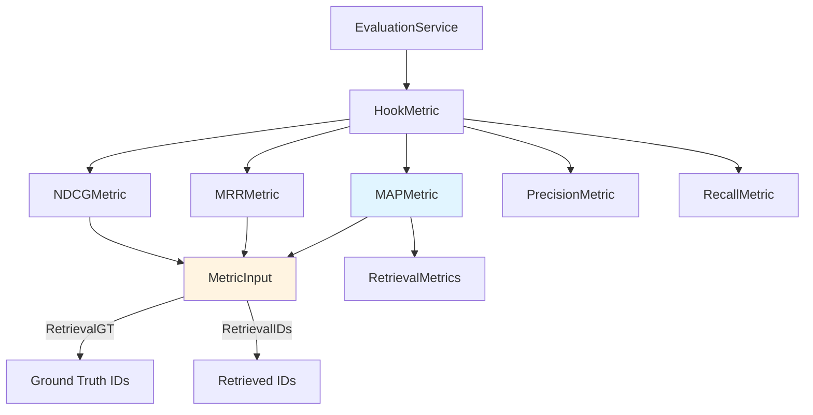

# Mean Average Precision (MAP) Metric

## 概述

在知识检索系统中，一个核心问题是：**如何衡量检索结果的质量？** 当用户提出一个问题，系统从知识库中检索出 10 个文档片段，我们如何判断这个检索结果是"好"还是"坏"？

`mean_average_precision_metric` 模块给出的答案是：**不仅要看检索出了多少相关文档，还要看这些相关文档在结果列表中的排名位置**。这正是 Mean Average Precision (MAP) 指标的核心思想。

想象你在图书馆找书。图书管理员给你一摞书，说"这些都可能对你有用"。如果相关的书都堆在最上面，你很快就能找到需要的信息——这是好的检索。如果相关的书被埋在底部，你需要翻很久——这是差的检索。MAP 指标就是用来量化这种"相关文档是否排在前面"的能力。

本模块实现了 MAP 指标的计算逻辑，它是检索质量评估体系中的关键组件，与 [MRR](mrr_metric.md)、[NDCG](ndcg_metric.md) 等指标一起，为检索引擎的优化提供可量化的反馈信号。

## 架构与数据流

### 模块在系统中的位置



### 数据流追踪

MAP 指标的计算遵循一个清晰的数据流：

1. **输入阶段**：[EvaluationService](evaluation_service.md) 执行检索任务后，收集检索结果和标准答案，构造 `MetricInput` 对象
2. **计算阶段**：`MAPMetric.Compute()` 被调用，执行核心的 MAP 计算逻辑
3. **聚合阶段**：计算结果被写入 `RetrievalMetrics.MAP` 字段，与其他指标一起返回给调用方

**关键数据契约**：

| 数据对象 | 来源 | 去向 | 作用 |
|---------|------|------|------|
| `MetricInput` | EvaluationService | MAPMetric | 携带检索结果和标准答案 |
| `RetrievalGT` ([][]int) | 评估任务定义 | MAPMetric | 每个查询的相关文档 ID 列表 |
| `RetrievalIDs` ([]int) | 检索引擎输出 | MAPMetric | 实际检索出的文档 ID 序列 |
| `float64` | MAPMetric | RetrievalMetrics | 最终 MAP 分数 (0-1) |

## 核心组件深度解析

### MAPMetric 结构体

```go
type MAPMetric struct{}
```

**设计意图**：这是一个无状态的指标计算器。注意它没有任何字段——这是因为 MAP 计算是纯函数式的：给定相同的输入，永远产生相同的输出，不需要维护任何内部状态。

**为什么选择无状态设计？**

1. **线程安全**：多个评估任务可以并发调用同一个 `MAPMetric` 实例，无需加锁
2. **可复用性**：不需要为每次计算创建新实例，减少内存分配
3. **测试友好**：没有隐藏状态，单元测试只需关注输入输出

**替代方案对比**：
- 如果设计为有状态（例如缓存中间结果），会在并发场景下引入复杂的锁机制
- 如果使用函数而非结构体，会失去接口一致性（无法实现 `Metrics` 接口）

### Compute 方法

```go
func (m *MAPMetric) Compute(metricInput *types.MetricInput) float64
```

**职责**：计算 Mean Average Precision 分数

**参数**：
- `metricInput *types.MetricInput`：包含检索评估所需的全部数据
  - `RetrievalGT [][]int`：标准答案，二维数组。外层每个元素代表一个查询，内层是该查询的相关文档 ID 列表
  - `RetrievalIDs []int`：检索结果，一维数组。按相关性降序排列的文档 ID 序列

**返回值**：
- `float64`：MAP 分数，范围 [0, 1]。1 表示完美检索（所有相关文档都排在最前面），0 表示没有检索到任何相关文档

#### 算法实现解析

让我们逐段分析计算逻辑，理解每个步骤的设计考量：

**第一步：构建标准答案集合**

```go
gtSets := make([]map[int]struct{}, len(gts))
for i, gt := range gts {
    gtSets[i] = make(map[int]struct{})
    for _, docID := range gt {
        gtSets[i][docID] = struct{}{}
    }
}
```

**为什么用 `map[int]struct{}` 而不是切片？**

这是一个典型的**空间换时间**优化。后续需要频繁判断"某个检索出的文档 ID 是否在标准答案中"：
- 使用切片：每次判断需要 O(n) 线性扫描
- 使用 map：每次判断是 O(1) 哈希查找

对于大规模评估（成千上万个文档），这个优化可以将计算复杂度从 O(n²) 降到 O(n)。

**第二步：标记命中位置**

```go
predHits := make([]bool, len(ids))
for i, predID := range ids {
    if _, ok := gtSet[predID]; ok {
        predHits[i] = true
    } else {
        predHits[i] = false
    }
}
```

这一步将检索结果转换为布尔序列，`predHits[k] = true` 表示第 k 个检索出的文档是相关的。

**设计洞察**：这里将"文档 ID 比较"与"排名计算"解耦。先完成 ID 匹配，再独立计算排名指标。这种分离使得代码更易读，也便于后续扩展（例如添加权重计算）。

**第三步：计算平均精度 (Average Precision)**

```go
for k := 0; k < len(predHits); k++ {
    if predHits[k] {
        hitCount++
        ap += float64(hitCount) / float64(k+1)
    }
}
```

这是 MAP 计算的核心。让我们用例子说明：

假设标准答案有 3 个相关文档 `{A, B, C}`，检索结果是 `[A, X, B, Y, C]`（X、Y 是不相关文档）：

| 排名 k | 检索文档 | 是否相关 | hitCount | Precision@k | 累加 AP |
|-------|---------|---------|----------|-------------|--------|
| 0 | A | ✓ | 1 | 1/1 = 1.0 | 1.0 |
| 1 | X | ✗ | 1 | - | 1.0 |
| 2 | B | ✓ | 2 | 2/3 ≈ 0.67 | 1.67 |
| 3 | Y | ✗ | 2 | - | 1.67 |
| 4 | C | ✓ | 3 | 3/5 = 0.6 | 2.27 |

最终 AP = 2.27 / 3 ≈ 0.76

**关键理解**：AP 只在命中相关文档时累加精度值，这确保了"相关文档排得越靠前，分数越高"。

**第四步：归一化与聚合**

```go
if hitCount > 0 {
    ap /= float64(hitCount)
}
apSum += ap
```

这里有一个**重要的设计决策**：归一化因子使用 `hitCount`（实际命中的相关文档数）而非 `len(gtSet)`（标准答案中的相关文档总数）。

**这意味着什么？**

- 如果标准答案有 5 个相关文档，但检索只找到 3 个，AP 会除以 3 而非 5
- 这实际上计算的是"在找到的相关文档中，平均精度是多少"
- 未找到的相关文档通过较低的 `hitCount` 间接惩罚了分数

**边界情况处理**：

```go
if len(gtSets) == 0 {
    return 0
}
return apSum / float64(len(gtSets))
```

当没有标准答案时返回 0，避免除零错误。这是一个防御性编程实践。

## 依赖关系分析

### 上游依赖

| 依赖组件 | 依赖类型 | 耦合程度 | 说明 |
|---------|---------|---------|------|
| `types.MetricInput` | 数据契约 | 紧耦合 | 输入数据结构，变更会直接影响本模块 |
| `types.interfaces.Metrics` | 接口契约 | 松耦合 | 实现该接口，可被任何期望 Metrics 的代码调用 |

**耦合分析**：
- 与 `MetricInput` 的耦合是必要的——这是数据输入的唯一通道
- 如果 `MetricInput` 增加字段（例如添加权重信息），`MAPMetric` 可以选择性忽略，保持向后兼容

### 下游调用者

| 调用者 | 调用场景 | 期望行为 |
|-------|---------|---------|
| [HookMetric](metric_hook.md) | 评估任务执行中 | 快速返回数值结果，无副作用 |
| [EvaluationService](evaluation_service.md) | 批量评估 | 支持并发调用，结果可聚合 |

**调用模式**：
```go
// 典型调用模式
mapMetric := NewMAPMetric()
score := mapMetric.Compute(&types.MetricInput{
    RetrievalGT:  [][]int{{1, 2, 3}, {4, 5}},
    RetrievalIDs: []int{1, 4, 2, 6, 7},
})
```

### 同级组件关系

MAP 与以下指标共同构成检索质量评估矩阵：

- [PrecisionMetric](precision_metric.md)：只关注"找对了多少"，不考虑排名
- [RecallMetric](recall_metric.md)：只关注"找全了多少"，不考虑排名
- [MRRMetric](mrr_metric.md)：只关注"第一个相关文档排在哪"
- [NDCGMetric](ndcg_metric.md)：考虑排名，且支持分级相关性

**指标选择指南**：
- 需要综合评估排名质量 → 使用 MAP
- 只关心首个命中 → 使用 MRR
- 相关性有等级区分（部分相关/完全相关）→ 使用 NDCG

## 设计决策与权衡

### 决策 1：单查询 vs 多查询支持

**现状**：`RetrievalGT` 是二维数组 `[][]int`，支持多个查询的批量评估。

**权衡**：
- ✅ 优势：一次调用可评估整个测试集，减少函数调用开销
- ❌ 劣势：内存占用较大，需要同时加载所有查询的标准答案

**替代方案**：
- 每次只计算单个查询的 AP，由调用方负责聚合
- 这会简化 `Compute` 方法，但增加调用方的复杂度

**为什么选择当前方案？**
评估场景通常是离线批量处理，内存不是瓶颈，而 API 简洁性更重要。

### 决策 2：二值相关性假设

**现状**：代码假设文档要么相关（在 GT 中）要么不相关，没有"部分相关"的概念。

**权衡**：
- ✅ 优势：实现简单，计算高效
- ❌ 劣势：无法表达细粒度的相关性（例如 0-5 分的相关度）

**替代方案**：
- 使用 `map[int]float64` 存储带权重的 GT
- 参考 [NDCGMetric](ndcg_metric.md) 的实现，支持分级相关性

**为什么选择当前方案？**
大多数检索评估场景中，二值相关性已足够。如需分级评估，应使用 NDCG 而非 MAP。

### 决策 3：归一化策略

**现状**：AP 归一化使用 `hitCount`（实际命中数）而非 `len(gtSet)`（GT 总数）。

**影响分析**：
- 当检索召回率低时，分数会被双重惩罚（命中少 + 归一化分母小）
- 这符合 MAP 的标准定义，但可能与某些变体（如 MAP@K）不同

**注意事项**：
如果未来需要实现 MAP@K（只考虑前 K 个结果），需要修改归一化逻辑。

## 使用指南

### 基本用法

```go
import (
    "github.com/Tencent/WeKnora/internal/application/service/metric"
    "github.com/Tencent/WeKnora/internal/types"
)

// 创建指标实例
mapMetric := metric.NewMAPMetric()

// 准备评估数据
input := &types.MetricInput{
    // 两个查询的标准答案
    RetrievalGT: [][]int{
        {101, 102, 103},  // 查询 1 的相关文档
        {201, 202},       // 查询 2 的相关文档
    },
    // 检索结果（假设是两个查询结果的合并或单次查询）
    RetrievalIDs: []int{101, 999, 102, 888, 103},
}

// 计算 MAP
score := mapMetric.Compute(input)
// score ≈ 0.78
```

### 在评估流水线中的使用

```go
// EvaluationService 中的典型使用模式
func (s *EvaluationService) evaluateTask(task *EvaluationTask) *RetrievalMetrics {
    metrics := &RetrievalMetrics{}
    
    mapMetric := metric.NewMAPMetric()
    mrrMetric := metric.NewMRRMetric()
    ndcgMetric := metric.NewNDCGMetric(10)
    
    metricInput := &types.MetricInput{
        RetrievalGT:  task.GroundTruth,
        RetrievalIDs: task.RetrievedIDs,
    }
    
    metrics.MAP = mapMetric.Compute(metricInput)
    metrics.MRR = mrrMetric.Compute(metricInput)
    metrics.NDCG10 = ndcgMetric.Compute(metricInput)
    
    return metrics
}
```

### 配置选项

当前实现**无配置项**——这是一个刻意的设计选择：

- MAP 的定义是标准化的，不应有"可配置的 MAP"
- 如需变体（如 MAP@K），应创建新类型而非添加配置

## 边界情况与注意事项

### 边界情况 1：空标准答案

```go
input := &types.MetricInput{
    RetrievalGT:  [][]int{},  // 没有标准答案
    RetrievalIDs: []int{1, 2, 3},
}
score := mapMetric.Compute(input)  // 返回 0
```

**行为**：返回 0，表示无法评估。调用方应检查此情况。

### 边界情况 2：空检索结果

```go
input := &types.MetricInput{
    RetrievalGT:  [][]int{{1, 2, 3}},
    RetrievalIDs: []int{},  // 没有检索结果
}
score := mapMetric.Compute(input)  // 返回 0
```

**行为**：正确返回 0，表示检索完全失败。

### 边界情况 3：GT 与检索结果无交集

```go
input := &types.MetricInput{
    RetrievalGT:  [][]int{{1, 2, 3}},
    RetrievalIDs: []int{4, 5, 6},  // 完全不相关
}
score := mapMetric.Compute(input)  // 返回 0
```

**行为**：正确返回 0。

### 注意事项 1：多查询评估的语义

当 `RetrievalGT` 包含多个查询时，`RetrievalIDs` 应该是**所有查询检索结果的合并**还是**单个查询的结果**？

**当前实现的假设**：`RetrievalIDs` 是单个查询的结果，`RetrievalGT` 的多个子数组代表多个评估样本。每个 GT 子数组都会与完整的 `RetrievalIDs` 进行比较。

如果需要对多个独立查询分别评估，应在调用方循环处理：

```go
var scores []float64
for i, gt := range multiQueryGT {
    input := &types.MetricInput{
        RetrievalGT:  [][]int{gt},
        RetrievalIDs: queryResults[i],
    }
    scores = append(scores, mapMetric.Compute(input))
}
```

### 注意事项 2：浮点数精度

MAP 计算涉及多次浮点除法，累积误差可能导致微小偏差：

```go
// 理论上应该相等的情况
score1 := mapMetric.Compute(input1)  // 0.6666666666666666
score2 := mapMetric.Compute(input2)  // 0.6666666666666667
```

**建议**：比较分数时使用容差：
```go
if math.Abs(score1-score2) < 1e-9 {
    // 认为相等
}
```

### 注意事项 3：性能考量

对于大规模评估（10 万 + 文档），注意：

1. **GT 集合构建**：O(n) 时间复杂度，n 为 GT 文档数
2. **命中检测**：O(m) 时间复杂度，m 为检索结果数
3. **总体复杂度**：O(q × (n + m))，q 为查询数

**优化建议**：
- 复用 `MAPMetric` 实例，避免重复分配
- 对于超大规模评估，考虑并行处理不同查询

## 扩展点

### 扩展方向 1：MAP@K

如需实现只考虑前 K 个结果的 MAP@K：

```go
type MAPAtKMetric struct {
    k int
}

func (m *MAPAtKMetric) Compute(input *types.MetricInput) float64 {
    // 截断 RetrievalIDs 到前 K 个
    ids := input.RetrievalIDs
    if len(ids) > m.k {
        ids = ids[:m.k]
    }
    // 复用现有逻辑...
}
```

### 扩展方向 2：加权 MAP

如需支持不同查询的权重不同：

```go
type WeightedMAPMetric struct {
    weights []float64  // 每个查询的权重
}
```

### 扩展方向 3：流式计算

如需支持流式检索结果（逐个返回文档）：

```go
type StreamingMAPMetric struct {
    gtSet     map[int]struct{}
    hitCount  int
    apSum     float64
    totalSeen int
}

func (s *StreamingMAPMetric) AddDocument(docID int) float64 {
    // 增量更新 AP
}
```

## 相关模块

- [MRR Metric](mrr_metric.md) — 平均倒数排名，关注首个命中位置
- [NDCG Metric](ndcg_metric.md) — 支持分级相关性的排名指标
- [Precision Metric](precision_metric.md) — 查准率，不考虑排名
- [Recall Metric](recall_metric.md) — 查全率，不考虑排名
- [Evaluation Service](evaluation_service.md) — 评估任务编排
- [Metric Hook](metric_hook.md) — 指标收集与聚合

## 参考资源

- [Information Retrieval: MAP 指标的标准定义](https://en.wikipedia.org/wiki/Mean_average_precision)
- [TREC 评估指南](https://trec.nist.gov/)
