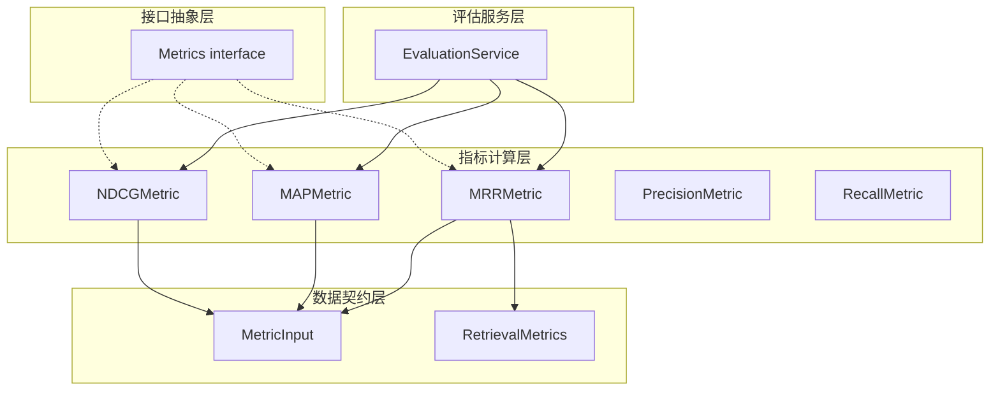

# Mean Reciprocal Rank (MRR) 评估指标模块

## 模块概述

想象你在一个图书馆里找书 —— 图书管理员给你递来一摞书，你一本本翻看，直到找到第一本真正有用的。**Mean Reciprocal Rank (MRR)** 衡量的就是"你平均需要翻到第几本才能找到第一本有用的书"。如果第一本就有用，得满分 1 分；如果到第三本才有用，得 1/3 分；如果翻完整摞书都没找到，得 0 分。

`mean_reciprocal_rank_metric` 模块实现了这个经典的信息检索评估指标，用于量化检索系统的**首位相关文档发现效率**。与 [MAP 指标](application_services_and_orchestration.md) 关注所有相关文档的排序质量不同，MRR 只关心**第一个相关文档出现的位置** —— 这在用户通常只查看前几条结果的场景中（如搜索引擎、问答系统）尤为关键。

该模块位于评估指标体系的核心层，与 [`MRRMetric`](#mrrmetric-核心结构)、[`MAPMetric`](application_services_and_orchestration.md)、[`NDCGMetric`](application_services_and_orchestration.md) 共同构成检索质量评估的"位置敏感指标"家族，输出结果汇入 [`RetrievalMetrics`](#数据契约) 结构体供上层服务使用。

---

## 架构定位与数据流

### 模块在评估体系中的位置



### 数据流追踪

MRR 指标的计算遵循一条清晰的数据管道：

1. **输入准备**：[`EvaluationService`](application_services_and_orchestration.md) 收集评估数据，构造 [`MetricInput`](#数据契约) 对象，其中 `RetrievalGT` 包含每个查询的真实相关文档 ID 列表，`RetrievalIDs` 包含检索系统返回的文档 ID 序列

2. **指标计算**：调用 `MRRMetric.Compute()` 方法，对每个查询找出第一个出现在检索结果中的相关文档，计算其位置的倒数

3. **结果聚合**：所有查询的倒数分数求平均，得到最终 MRR 分数，写入 [`RetrievalMetrics.MRR`](#数据契约) 字段

4. **上层消费**：[`EvaluationService`](application_services_and_orchestration.md) 将完整的 `RetrievalMetrics` 返回给 HTTP 处理器或存储到评估结果仓库

这个设计遵循**单一职责原则** —— MRR 模块只负责计算，不关心数据来源或结果用途，通过 [`Metrics`](#接口抽象) 接口与评估框架解耦。

---

## 核心组件深度解析

### `MRRMetric` 核心结构

```go
type MRRMetric struct{}
```

**设计意图**：这是一个**无状态指标计算器**。注意它没有任何字段 —— 这与 [`NDCGMetric`](application_services_and_orchestration.md) 形成鲜明对比（后者有 `k int` 字段用于配置截断位置）。MRR 的设计哲学是"开箱即用"，不需要配置任何超参数，因为它的定义本身就是固定的：只关心第一个相关文档的位置。

**为什么选择无状态设计？**

这是一个经过权衡的决策。MRR 的数学定义本身不包含可调参数（不像 NDCG@k 需要指定 k 值），因此引入状态只会增加不必要的复杂性。如果未来需要支持"MRR@k"变体，可以通过方法参数而非结构体字段实现，保持核心结构的简洁性。

#### `NewMRRMetric()` 构造函数

```go
func NewMRRMetric() *MRRMetric {
    return &MRRMetric{}
}
```

**设计模式**：这里使用了**工厂函数模式**而非直接 `&MRRMetric{}`。虽然当前实现看起来多余，但它为未来扩展预留了空间：
- 可以在构造函数中注入依赖（如日志器、指标注册表）
- 可以返回接口类型而非具体类型，增强测试可替换性
- 保持与同包其他指标（如 [`NDCGMetric`](application_services_and_orchestration.md)）的 API 一致性

#### `Compute()` 计算方法

```go
func (m *MRRMetric) Compute(metricInput *types.MetricInput) float64
```

**方法签名解析**：
- **接收者**：值接收者 `m *MRRMetric`（虽然是无状态的，但遵循接口实现惯例）
- **参数**：`*types.MetricInput` 指针传递，避免大结构体拷贝
- **返回**：`float64` 标量分数，范围 [0, 1]

**算法内部机制**：

这个方法实现了一个**两阶段查找算法**，可以类比为"先建索引，再查询"：

**阶段一：构建倒排索引（Ground Truth 预处理）**
```go
gtSets := make([]map[int]struct{}, len(gts))
for i, gt := range gts {
    gtSets[i] = make(map[int]struct{})
    for _, docID := range gt {
        gtSets[i][docID] = struct{}{}
    }
}
```

这里将每个查询的真实相关文档列表转换为 `map[int]struct{}` 集合。为什么这么做？

- **时间复杂度优化**：原始 `[][]int` 的查找是 O(n) 线性扫描，转换为 `map` 后降为 O(1) 常数时间
- **内存效率**：`struct{}` 是零大小类型，比 `map[int]bool` 节省内存
- **语义清晰**：`map[int]struct{}` 在 Go 中是集合的标准表达方式

**阶段二：顺序扫描检索结果**
```go
for _, gtSet := range gtSets {
    for i, predID := range ids {
        if _, ok := gtSet[predID]; ok {
            sumRR += 1.0 / float64(i+1)
            break // 只考虑第一个相关文档
        }
    }
}
```

这里实现了 MRR 的核心逻辑：
1. 遍历每个查询的真实相关文档集合
2. 按顺序扫描检索结果（`ids` 保持原始排序）
3. 找到**第一个**命中真实集合的文档时，计算 `1/(i+1)` 并立即跳出循环
4. 如果扫描完所有结果都没找到，该查询贡献 0 分

**边界情况处理**：
```go
if len(gtSets) == 0 {
    return 0
}
return sumRR / float64(len(gtSets))
```

当没有真实标签时返回 0 而非 panic，这是一个**防御性编程**决策 —— 评估系统可能在冷启动或数据异常时遇到空标签，返回 0 比崩溃更合理。

---

## 数据契约与接口抽象

### `Metrics` 接口抽象

```go
type Metrics interface {
    Compute(metricInput *types.MetricInput) float64
}
```

**架构角色**：这是评估指标体系的**统一抽象层**。所有指标（MRR、MAP、NDCG、Precision、Recall）都实现这个接口，使得 [`EvaluationService`](application_services_and_orchestration.md) 可以以多态方式调用它们，无需关心具体实现。

**设计权衡**：
- **优点**：指标可插拔，新增指标无需修改评估服务代码
- **缺点**：所有指标必须接受相同的 `MetricInput`，限制了指标的灵活性（例如文本生成指标需要 `GeneratedTexts`，检索指标需要 `RetrievalGT`）

### `MetricInput` 数据契约

```go
type MetricInput struct {
    RetrievalGT    [][]int  // 检索真实标签：每个查询的相关文档 ID 列表
    RetrievalIDs   []int    // 检索结果：系统返回的文档 ID 序列
    GeneratedTexts string   // 生成文本：用于 BLEU/ROUGE 等指标
    GeneratedGT    string   // 生成真实标签：用于文本相似度指标
}
```

**字段语义解析**：

| 字段 | 用途 | MRR 如何使用 |
|------|------|-------------|
| `RetrievalGT` | 检索任务的真实标签，二维数组表示多个查询 | 转换为 `map` 集合用于快速查找 |
| `RetrievalIDs` | 检索系统返回的文档 ID 序列（已排序） | 顺序扫描，找到第一个命中 `RetrievalGT` 的位置 |
| `GeneratedTexts` | 文本生成任务的输出 | MRR 不使用 |
| `GeneratedGT` | 文本生成任务的真实答案 | MRR 不使用 |

**隐式契约**：
1. `RetrievalIDs` 的长度代表检索系统的返回数量，MRR 会扫描全部结果
2. `RetrievalGT[i]` 对应第 i 个查询的真实标签，与 `RetrievalIDs` 的查询顺序必须一致
3. 文档 ID 是整数类型，调用方需确保 ID 空间的唯一性

### `RetrievalMetrics` 结果容器

```go
type RetrievalMetrics struct {
    Precision float64 `json:"precision"`
    Recall    float64 `json:"recall"`
    NDCG3     float64 `json:"ndcg3"`
    NDCG10    float64 `json:"ndcg10"`
    MRR       float64 `json:"mrr"`
    MAP       float64 `json:"map"`
}
```

**架构角色**：这是检索评估结果的**标准输出格式**。MRR 分数最终会填入 `MRR` 字段，与其他指标一起返回给前端或存储到数据库。

**设计观察**：NDCG 有 `@3` 和 `@10` 两个变体，但 MRR 只有一个 —— 这反映了 MRR 的设计特性：它天然关注"第一个相关文档"，不需要指定截断位置 k。

---

## 设计决策与权衡分析

### 决策 1：只考虑第一个相关文档 vs 考虑所有相关文档

**选择**：MRR 只计算第一个相关文档的位置倒数

**替代方案**：[MAP（Mean Average Precision）](application_services_and_orchestration.md) 会考虑所有相关文档的排序质量

**权衡分析**：
- **MRR 的优势**：计算简单 O(n)，语义直观，适合"找到第一个答案即可"的场景（如问答系统）
- **MRR 的劣势**：忽略了第二个、第三个相关文档的排序质量，无法区分"只有一个相关文档在位置 3"和"有三个相关文档分别在位置 3、4、5"
- **为什么选择 MRR**：在知识库检索场景中，用户通常只需要找到**一个**相关文档即可解决问题，MRR 更贴合实际用户体验

### 决策 2：无状态设计 vs 可配置设计

**选择**：`MRRMetric` 没有任何配置字段

**对比**：[`NDCGMetric`](application_services_and_orchestration.md) 有 `k int` 字段用于配置 `NDCG@k`

**权衡分析**：
- **无状态的优势**：API 简单，无需管理配置生命周期，线程安全（无可变状态）
- **无状态的劣势**：无法支持"MRR@k"变体（虽然这种变体在实践中很少用）
- **为什么选择无状态**：MRR 的标准定义不包含 k 参数，引入配置会增加不必要的复杂性

### 决策 3：使用 `map[int]struct{}` 而非线性扫描

**选择**：将真实标签转换为哈希集合

**替代方案**：对每个 `predID` 遍历 `gt` 切片进行线性查找

**权衡分析**：
- **哈希集合**：O(1) 查找，O(n) 预处理空间，适合真实标签较多的场景
- **线性扫描**：O(n) 查找，O(1) 空间，适合真实标签很少（如 1-2 个）的场景
- **为什么选择哈希集合**：在评估场景中，真实标签数量不确定，哈希集合提供了更稳定的性能保证

### 决策 4：空标签返回 0 而非错误

**选择**：`if len(gtSets) == 0 { return 0 }`

**替代方案**：返回错误或使用 `panic`

**权衡分析**：
- **返回 0**：评估流程可以继续，但可能掩盖数据质量问题
- **返回错误**：强制调用方处理异常，但增加 API 复杂度
- **为什么选择返回 0**：评估服务通常批量处理大量查询，单个查询的标签缺失不应中断整体评估，0 分是一个合理的"惩罚"

---

## 使用指南与示例

### 基本使用模式

```go
import (
    "github.com/Tencent/WeKnora/internal/application/service/metric"
    "github.com/Tencent/WeKnora/internal/types"
)

// 1. 创建指标实例
mrr := metric.NewMRRMetric()

// 2. 准备评估数据
input := &types.MetricInput{
    RetrievalGT: [][]int{
        {101, 102},      // 查询 1 的相关文档 ID
        {201},           // 查询 2 的相关文档 ID
        {301, 302, 303}, // 查询 3 的相关文档 ID
    },
    RetrievalIDs: []int{101, 103, 102, 201, 301}, // 检索结果（简化示例）
}

// 3. 计算 MRR 分数
score := mrr.Compute(input)
// score = (1/1 + 1/4 + 1/5) / 3 = 0.483
```

### 在评估服务中的集成

```go
// 伪代码：EvaluationService 如何使用 MRR
func (s *EvaluationService) Evaluate(task *types.EvaluationTask) (*types.EvaluationDetail, error) {
    mrr := metric.NewMRRMetric()
    
    var metrics types.RetrievalMetrics
    for _, query := range task.Queries {
        input := &types.MetricInput{
            RetrievalGT:  query.GroundTruth,
            RetrievalIDs: query.RetrievedIDs,
        }
        metrics.MRR += mrr.Compute(input)
    }
    metrics.MRR /= float64(len(task.Queries))
    
    return &types.EvaluationDetail{Metrics: metrics}, nil
}
```

### 配置选项

**MRR 没有配置选项** —— 这是设计决策的一部分。如果需要调整评估行为，考虑以下替代方案：

| 需求 | 推荐方案 |
|------|---------|
| 只评估前 k 个结果 | 在调用 `Compute()` 前截断 `RetrievalIDs` |
| 加权 MRR（不同查询权重不同） | 在评估服务层实现加权平均 |
| 过滤特定文档类型 | 在数据准备阶段过滤 `RetrievalIDs` |

---

## 边界情况与注意事项

### 边界情况 1：检索结果中没有相关文档

```go
input := &types.MetricInput{
    RetrievalGT:  [][]int{{101, 102}},
    RetrievalIDs: []int{999, 998, 997}, // 没有命中
}
score := mrr.Compute(input) // 返回 0.0
```

**行为**：该查询贡献 0 分到总和。这是符合 MRR 定义的 —— 如果找不到相关文档，倒数排名为 0。

### 边界情况 2：真实标签为空

```go
input := &types.MetricInput{
    RetrievalGT:  [][]int{}, // 没有查询
    RetrievalIDs: []int{101, 102},
}
score := mrr.Compute(input) // 返回 0.0
```

**行为**：返回 0 而非 panic。注意这与"每个查询的真实标签为空"不同：

```go
input := &types.MetricInput{
    RetrievalGT:  [][]int{{}}, // 有一个查询，但该查询没有相关文档
    RetrievalIDs: []int{101, 102},
}
score := mrr.Compute(input) // 返回 0.0（该查询贡献 0 分）
```

### 边界情况 3：多个相关文档在检索结果中

```go
input := &types.MetricInput{
    RetrievalGT:  [][]int{{101, 102, 103}},
    RetrievalIDs: []int{999, 102, 101, 103}, // 102 在位置 2，101 在位置 3
}
score := mrr.Compute(input) // 返回 1/2 = 0.5
```

**行为**：只计算**第一个**命中的相关文档（102 在位置 2），忽略后续的 101 和 103。这是 MRR 与 MAP 的关键区别。

### 性能注意事项

1. **大规模评估**：MRR 的时间复杂度为 O(q × n)，其中 q 是查询数，n 是平均检索结果数。对于万级查询的评估任务，考虑并行计算。

2. **内存使用**：每个查询的真实标签会转换为 `map`，如果真实标签数量很大（如数千个），内存开销可能显著。

3. **ID 类型限制**：当前实现假设文档 ID 是 `int` 类型。如果系统使用字符串 ID（如 UUID），需要在调用 `Compute()` 前进行映射转换。

### 常见陷阱

**陷阱 1：混淆 0-based 和 1-based 索引**

```go
// 错误：使用 0-based 索引计算倒数
sumRR += 1.0 / float64(i) // 当 i=0 时会除零错误！

// 正确：MRR 使用 1-based 位置
sumRR += 1.0 / float64(i+1) // 位置 1 对应索引 0
```

**陷阱 2：忘记 `break` 导致计算所有相关文档**

```go
// 错误：这会计算所有相关文档的倒数和（变成 MAP 的逻辑）
for i, predID := range ids {
    if _, ok := gtSet[predID]; ok {
        sumRR += 1.0 / float64(i+1)
        // 缺少 break
    }
}

// 正确：找到第一个就停止
for i, predID := range ids {
    if _, ok := gtSet[predID]; ok {
        sumRR += 1.0 / float64(i+1)
        break
    }
}
```

**陷阱 3：查询顺序不一致**

```go
// 错误：RetrievalGT 和 RetrievalIDs 的查询顺序不匹配
input := &types.MetricInput{
    RetrievalGT:  [][]int{query1GT, query2GT}, // 顺序：query1, query2
    RetrievalIDs: []int{query2Results..., query1Results...}, // 顺序：query2, query1
}
// 这会导致错误的评估结果！
```

---

## 相关模块参考

- **[MAP 指标](application_services_and_orchestration.md)**：考虑所有相关文档排序质量的指标，适合需要召回多个相关文档的场景
- **[NDCG 指标](application_services_and_orchestration.md)**：考虑文档相关性等级（而不仅是相关/不相关）的折扣累积增益指标
- **[Precision/Recall 指标](application_services_and_orchestration.md)**：不关心排序位置的基础检索质量指标
- **[EvaluationService](application_services_and_orchestration.md)**： orchestration 层服务，负责调用 MRR 等指标进行批量评估
- **[MetricInput](core_domain_types_and_interfaces.md)**：评估数据的标准输入契约
- **[RetrievalMetrics](core_domain_types_and_interfaces.md)**：评估结果的标准输出容器

---

## 扩展指南

### 如何添加新的变体指标

如果需要实现 MRR 的变体（如 MRR@k），建议遵循以下模式：

```go
// 1. 创建新结构体（而非修改现有 MRRMetric）
type MRRAtKMetric struct {
    k int
}

// 2. 实现 Metrics 接口
func (m *MRRAtKMetric) Compute(input *types.MetricInput) float64 {
    // 在扫描时增加 k 截断逻辑
    for i, predID := range ids {
        if i >= m.k {
            break // 只考虑前 k 个结果
        }
        // ... 其余逻辑与 MRRMetric 相同
    }
}
```

**为什么不建议修改现有 `MRRMetric`？**
- 保持向后兼容：现有调用方不需要修改
- 单一职责：每个结构体只负责一种指标变体
- 测试隔离：可以独立测试不同变体的行为

### 如何集成自定义指标

1. 实现 [`Metrics`](#接口抽象) 接口
2. 在 [`EvaluationService`](application_services_and_orchestration.md) 中注册新指标
3. 在 [`RetrievalMetrics`](#数据契约) 或 `GenerationMetrics` 中添加结果字段
4. 更新 HTTP 响应结构以暴露新指标

---

## 总结

`mean_reciprocal_rank_metric` 模块是一个**专注、高效、无状态**的检索评估指标实现。它的核心价值在于：

1. **语义清晰**：直接回答"用户平均需要查看多少结果才能找到第一个相关文档"
2. **计算高效**：O(q × n) 时间复杂度，适合大规模评估
3. **设计简洁**：无状态、无配置、无依赖，易于理解和测试

理解这个模块的关键是把握它的设计哲学：**只做一件事（计算第一个相关文档的位置倒数），并把它做好**。当需要更复杂的排序质量评估时，应结合 [MAP](application_services_and_orchestration.md) 和 [NDCG](application_services_and_orchestration.md) 等指标使用。
