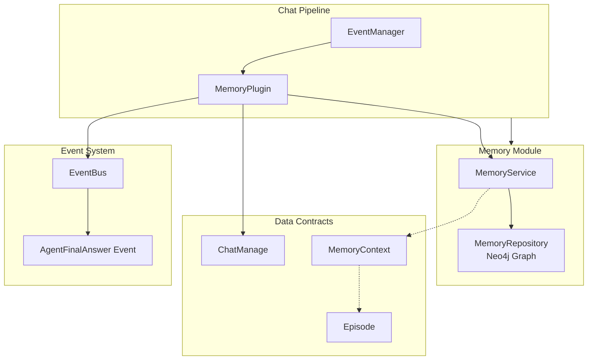

# Memory and Context Enrichment Module

## 概述：为什么需要这个模块？

想象一下，你正在和一个非常聪明但患有"短期失忆症"的助手对话。它能完美回答当前问题，但一旦对话超过几轮，它就忘记了你们之前讨论过什么。用户不得不反复重申背景信息，体验极其割裂。

**这就是 LLM 的原生困境**：上下文窗口有限，无法无限制地累积对话历史。 naive 的解决方案是把所有历史消息都塞进 prompt，但这会迅速耗尽 token 预算，且无关信息会干扰模型判断。

`memory_and_context_enrichment` 模块的核心设计洞察是：**记忆不应该是完整的录像，而应该是可检索的摘要索引**。它像一个"对话图书管理员"——不会记住你说过的每个字，但会在需要时快速找到相关的过往对话片段，以精简的摘要形式注入当前上下文。

这个模块通过两个关键操作实现这一目标：
1. **记忆检索（Retrieval）**：在用户提问时，根据当前查询语义，从历史对话中召回相关的"记忆片段"（Episodes）
2. **记忆存储（Storage）**：在对话结束后，异步地将本轮对话压缩成摘要，存入图数据库供未来检索

这种设计使得 Agent 能够在不占用大量 token 的前提下，拥有"长期记忆"能力，显著提升多轮对话的连贯性和个性化体验。

---

## 架构与数据流



### 架构角色解析

| 组件 | 架构角色 | 职责 |
|------|----------|------|
| **MemoryPlugin** | 管道插件 / 编排器 | 在 Chat Pipeline 的特定阶段介入，协调记忆检索与存储流程 |
| **MemoryService** | 领域服务 | 封装记忆业务逻辑，协调 Repository 与 Model 服务 |
| **MemoryRepository** | 持久化层 | 基于 Neo4j 图数据库存储和检索记忆片段 |
| **ChatManage** | 上下文载体 | 在管道各阶段之间传递请求状态和中间数据 |
| **EventManager** | 插件注册中心 | 管理插件与事件的绑定关系 |
| **EventBus** | 流式事件总线 | 在流式响应场景下通知插件响应完成 |

### 数据流追踪：一次完整的记忆增强对话

#### 阶段一：记忆检索（MEMORY_RETRIEVAL 事件）

```
用户提问 → Chat Pipeline 触发 MEMORY_RETRIEVAL → MemoryPlugin.OnEvent()
    ↓
检查 EnableMemory 标志 → 若关闭则跳过
    ↓
使用 RewriteQuery（或原始 Query）作为检索关键词
    ↓
调用 MemoryService.RetrieveMemory(userID, query)
    ↓
MemoryRepository.FindRelatedEpisodes() 在 Neo4j 中检索相关 Episodes
    ↓
返回 MemoryContext{RelatedEpisodes, RelatedEntities, RelatedRelations}
    ↓
将 Episodes 格式化为文本，追加到 ChatManage.UserContent
    ↓
继续管道下一环节（next()）
```

**关键设计点**：检索失败不会阻断管道。如果 Neo4j 不可用或查询超时，日志记录错误后继续执行，保证系统降级可用。

#### 阶段二：记忆存储（MEMORY_STORAGE 事件）

```
LLM 生成响应完成 → Chat Pipeline 触发 MEMORY_STORAGE → MemoryPlugin.OnEvent()
    ↓
先执行 next() 确保后续插件完成
    ↓
检查 EnableMemory 标志
    ↓
分支判断：
├─ 非流式响应：ChatResponse 已就绪 → 直接提取用户问题和助手回答
└─ 流式响应：订阅 EventBus 的 AgentFinalAnswer 事件 → 等待 Done 信号
    ↓
构造 messages[] = [{role: "user"}, {role: "assistant"}]
    ↓
启动 goroutine 异步调用 MemoryService.AddEpisode()
    ↓
MemoryService 调用 LLM 生成对话摘要 → 提取实体和关系 → 存入 Neo4j
    ↓
返回（不等待存储完成）
```

**关键设计点**：存储操作完全异步，不阻塞用户响应。即使存储失败，用户也无感知，仅日志记录错误。

---

## 核心组件深度解析

### MemoryPlugin

**设计意图**：作为 Chat Pipeline 中的一个可插拔环节，将记忆能力以"横切关注点"的方式注入对话流程，避免将记忆逻辑耦合到核心问答逻辑中。

**内部机制**：
- 实现 `Plugin` 接口，通过 `ActivationEvents()` 声明自己关心 `MEMORY_RETRIEVAL` 和 `MEMORY_STORAGE` 两个事件
- `OnEvent()` 方法根据事件类型分发到 `handleRetrieval()` 或 `handleStorage()`
- 持有 `MemoryService` 接口引用，通过依赖注入获得具体实现

**参数与返回值**：
- `NewMemoryPlugin(eventManager, memoryService)`：构造函数，自动向 EventManager 注册自身
- `OnEvent(ctx, eventType, chatManage, next)`：
  - `ctx`：请求上下文，携带 trace ID 和超时控制
  - `eventType`：触发事件类型
  - `chatManage`：共享状态对象，插件通过修改其字段传递数据
  - `next`：责任链模式的下一环节，调用它继续管道执行
  - 返回 `*PluginError`：nil 表示成功，非 nil 表示错误（但检索错误通常不中断管道）

**副作用**：
- 检索阶段：修改 `chatManage.UserContent`，追加记忆文本
- 存储阶段：启动后台 goroutine 调用 `MemoryService.AddEpisode()`

**使用示例**：
```go
// 在 Chat Pipeline 初始化时注册
memoryPlugin := NewMemoryPlugin(eventManager, memoryService)

// 插件自动在以下事件触发时执行：
// - types.MEMORY_RETRIEVAL：检索记忆并注入上下文
// - types.MEMORY_STORAGE：存储本轮对话为新的记忆片段
```

---

### MemoryService（接口与实现）

**接口定义**：
```go
type MemoryService interface {
    AddEpisode(ctx, userID, sessionID string, messages []types.Message) error
    RetrieveMemory(ctx, userID, query string) (*types.MemoryContext, error)
}
```

**设计意图**：作为记忆领域的服务层，封装"如何将对话转化为记忆"和"如何根据查询召回记忆"的核心业务逻辑。

**内部机制**（基于 `internal.application.service.memory.service.MemoryService` 实现）：
- 持有 `MemoryRepository`（Neo4j 图存储）和 `ModelService`（LLM 调用）
- `AddEpisode()` 流程：
  1. 调用 LLM 对 `messages` 生成摘要（Summary）
  2. 从对话中提取实体（Entities）和关系（Relationships）
  3. 构造 `Episode` 对象，调用 `repo.SaveEpisode()` 存入图数据库
- `RetrieveMemory()` 流程：
  1. 对 `query` 进行关键词提取或向量化
  2. 调用 `repo.FindRelatedEpisodes()` 检索相关 Episodes
  3. 构造并返回 `MemoryContext`

**数据契约**：
- `Episode`：记忆片段，包含 `ID`, `UserID`, `SessionID`, `Summary`, `CreatedAt`
- `MemoryContext`：检索结果，包含 `RelatedEpisodes`, `RelatedEntities`, `RelatedRelations`

**依赖关系**：
- **被谁调用**：`MemoryPlugin` 在检索和存储阶段调用
- **调用谁**：`MemoryRepository`（持久化）、`ModelService`（LLM 摘要生成）

---

### ChatManage

**设计意图**：作为 Chat Pipeline 的"共享状态容器"，在管道各阶段之间传递请求参数、中间结果和最终响应。

**与记忆相关的字段**：
| 字段 | 类型 | 用途 |
|------|------|------|
| `EnableMemory` | bool | 控制是否启用记忆功能（用户或会话级配置） |
| `Query` | string | 用户原始问题 |
| `RewriteQuery` | string | 经过改写优化的查询（用于记忆检索） |
| `UserContent` | string | 最终发送给 LLM 的用户内容（记忆检索结果追加到这里） |
| `ChatResponse` | *ChatResponse | 非流式场景下的完整响应 |
| `EventBus` | EventBusInterface | 流式场景下的事件总线 |
| `UserID` / `SessionID` | string | 用于记忆归属和检索 |

**隐式契约**：
- `MemoryPlugin` 假设 `RewriteQuery` 优先于 `Query` 用于检索（如果存在）
- 存储阶段假设 `EventBus` 在流式场景下会发出 `AgentFinalAnswer` 事件

---

### MemoryRepository（Neo4j 图存储）

**接口定义**：
```go
type MemoryRepository interface {
    SaveEpisode(ctx, episode, entities, relations) error
    FindRelatedEpisodes(ctx, userID, keywords, limit) ([]*Episode, error)
    IsAvailable(ctx) bool
}
```

**设计意图**：利用图数据库的语义关联能力，将记忆片段（Episodes）与实体（Entities）、关系（Relationships）建立连接，实现基于语义的记忆检索。

**存储模型**：
```
(:Episode {id, user_id, summary, created_at})-[:CONTAINS]->(:Entity {name, type})
(:Entity)-[:RELATED_TO]->(:Entity)
```

**检索策略**：
- 根据 `userID` 隔离数据
- 根据 `keywords` 匹配实体或摘要文本
- 返回按相关性排序的 Episodes 列表

**依赖**：Neo4j Go Driver

---

## 设计决策与权衡

### 1. 异步存储 vs 同步存储

**选择**：记忆存储完全异步（goroutine），不阻塞用户响应。

**权衡**：
- ✅ **优点**：用户感知延迟最低，即使存储失败也不影响对话体验
- ❌ **缺点**：存在极小概率丢失记忆（如服务在 goroutine 完成前崩溃）
- 🔧 **缓解**：生产环境应确保优雅关闭时等待后台任务完成

**替代方案**：同步存储会在存储完成后才返回响应，增加 200-500ms 延迟，但保证记忆不丢失。当前设计优先用户体验。

### 2. 摘要存储 vs 原始对话存储

**选择**：存储 LLM 生成的对话摘要，而非原始消息。

**权衡**：
- ✅ **优点**：token 占用极低，检索效率高，语义更浓缩
- ❌ **缺点**：丢失细节，无法还原完整对话
- 🔧 **缓解**：Episode 保留 `SessionID`，需要时可回溯原始消息（通过 `MessageRepository`）

**设计洞察**：记忆的目的是"提示"而非"复现"。摘要足以唤醒上下文，细节可按需加载。

### 3. 插件化架构 vs 硬编码集成

**选择**：MemoryPlugin 作为 Chat Pipeline 的可插拔插件。

**权衡**：
- ✅ **优点**：记忆功能可独立启用/禁用，测试和替换方便，符合单一职责
- ❌ **缺点**：增加一层间接性，调试时需要理解插件机制
- 🔧 **扩展点**：可通过实现 `Plugin` 接口添加新的记忆策略（如基于时间的遗忘、基于重要性的筛选）

### 4. 图数据库 vs 向量数据库

**选择**：使用 Neo4j 存储记忆，而非向量数据库。

**权衡**：
- ✅ **优点**：天然支持实体 - 关系建模，便于实现"基于实体的记忆关联"（如提到"项目 A"时自动关联所有相关对话）
- ❌ **缺点**：需要额外维护 Neo4j 集群，查询语法复杂
- 🔧 **背景**：系统已有 Neo4j 用于知识图谱，复用基础设施

**替代方案**：纯向量检索（如 Milvus）适合语义相似度匹配，但难以表达结构化关系。

### 5. 失败静默 vs 失败中断

**选择**：记忆检索/存储失败仅记录日志，不中断管道。

**权衡**：
- ✅ **优点**：系统鲁棒性强，记忆服务宕机不影响核心问答
- ❌ **缺点**：问题难以及时发现，可能长期"静默降级"
- 🔧 **建议**：配合监控告警（如记忆检索错误率 > 5% 触发告警）

---

## 使用指南与配置

### 启用记忆功能

记忆功能通过 `ChatManage.EnableMemory` 字段控制，通常在会话创建时设置：

```go
// 在创建会话或发起 QA 请求时
chatManage := &types.ChatManage{
    EnableMemory: true,  // 启用记忆
    UserID:       "user_123",
    SessionID:    "session_456",
    Query:        "我们上次讨论的项目进度如何？",
    // ... 其他配置
}
```

### 记忆检索的触发条件

1. `EnableMemory == true`
2. `MEMORY_RETRIEVAL` 事件被触发（由 Chat Pipeline 在检索阶段发出）
3. `MemoryService.RetrieveMemory()` 成功返回

检索结果以以下格式追加到 `UserContent`：
```
[原始用户问题]

Relevant Memory:
- 2024-01-15 (Summary: 讨论了项目 A 的技术架构，决定使用微服务...)
- 2024-01-10 (Summary: 确定了项目时间表，第一阶段在 3 月底完成...)
```

### 记忆存储的触发条件

1. `EnableMemory == true`
2. `MEMORY_STORAGE` 事件被触发（由 Chat Pipeline 在响应完成后发出）
3. 流式场景下等待 `AgentFinalAnswer` 事件的 `Done=true`

### 调试与日志

记忆操作的日志级别为 `Info`，关键日志包括：
- `"Start to retrieve memory"` / `"End to retrieve memory"`
- `"Retrieved memory: %s"`（打印检索到的记忆文本）
- `"Start to store memory"` / `"End to store memory"`
- `"failed to retrieve memory: %v"` / `"failed to add episode: %v"`（错误日志）

**排查问题**：
1. 检查日志中是否有 "Start to retrieve memory" 但无 "End" → 可能 Neo4j 超时
2. 检查 "Retrieved memory" 为空 → 可能关键词不匹配或记忆库为空
3. 检查 "failed to add episode" → 可能 LLM 摘要生成失败或 Neo4j 写入失败

---

## 边界情况与注意事项

### 1. 流式与非流式响应的处理差异

**问题**：非流式响应下 `ChatResponse` 立即可用，流式响应需要等待事件。

**处理**：
- 非流式：直接读取 `chatManage.ChatResponse.Content`
- 流式：订阅 `EventBus.On(EventAgentFinalAnswer)`，累积 `Content` 直到 `Done=true`

**陷阱**：如果在流式场景下错误地读取 `ChatResponse`（此时为 nil），会导致空指针或丢失响应内容。

### 2. 并发安全

**问题**：`handleStorage()` 中启动的 goroutine 访问 `chatManage` 字段。

**处理**：在 goroutine 启动前捕获 `userID` 和 `sessionID` 到局部变量：
```go
userID := chatManage.UserID
sessionID := chatManage.SessionID
go func() {
    p.memoryService.AddEpisode(ctx, userID, sessionID, messages)
}()
```

**陷阱**：如果直接在 goroutine 中访问 `chatManage.UserID`，可能因 `chatManage` 被复用而导致数据竞争。

### 3. 记忆检索的关键词选择

**当前逻辑**：优先使用 `RewriteQuery`，回退到 `Query`。

**问题**：如果 `RewriteQuery` 经过过度优化，可能偏离用户原意，导致检索不相关记忆。

**建议**：监控 `RewriteQuery` 与 `Query` 的语义差异，必要时可配置为始终使用原始 `Query`。

### 4. 记忆膨胀与遗忘策略

**当前限制**：模块本身没有实现记忆遗忘或压缩机制， Episodes 会无限累积。

**风险**：
- 检索结果可能包含过时信息
- 图数据库存储成本增长

**建议扩展**：
- 实现基于时间的 TTL（如 90 天前的记忆自动归档）
- 实现基于重要性的筛选（如仅存储被用户标记为"重要"的对话）
- 定期合并相似 Episodes（如将同一主题的多个片段合并为一个）

### 5. 多租户与数据隔离

**当前实现**：`FindRelatedEpisodes()` 使用 `userID` 作为隔离键。

**注意**：确保 Neo4j 查询中正确过滤 `user_id` 属性，避免跨用户记忆泄露。

### 6. 依赖服务的可用性

**依赖链**：
```
MemoryPlugin → MemoryService → MemoryRepository (Neo4j)
                          → ModelService (LLM)
```

**故障模式**：
- Neo4j 不可用：检索返回空，存储失败（日志记录）
- LLM 不可用：摘要生成失败，存储跳过

**建议**：在 `MemoryService` 层实现健康检查（如 `IsAvailable()`），在管道入口处快速失败。

---

## 相关模块参考

- **[chat_pipeline_plugins_and_flow](application_services_and_orchestration.md#chat_pipeline_plugins_and_flow)**：Chat Pipeline 的整体架构和插件机制
- **[conversation_context_and_memory_services](application_services_and_orchestration.md#conversation_context_and_memory_services)**：MemoryService 的详细实现和上下文管理策略
- **[graph_retrieval_and_memory_repositories](data_access_repositories.md#graph_retrieval_and_memory_repositories)**：Neo4j MemoryRepository 的持久化细节
- **[agent_conversation_and_runtime_contracts](core_domain_types_and_interfaces.md#agent_conversation_and_runtime_contracts)**：`ChatManage`、`Episode`、`MemoryContext` 等类型定义

---

## 扩展方向

如果你需要增强记忆功能，以下是可行的扩展点：

1. **自定义记忆检索策略**：实现新的 `MemoryService`，使用向量相似度而非关键词匹配
2. **记忆重要性评分**：在 `AddEpisode()` 中引入 LLM 评估对话重要性，仅存储高价值对话
3. **跨会话记忆关联**：扩展 `MemoryContext` 支持跨 Session 的记忆链接
4. **记忆编辑 API**：允许用户手动删除或修正记忆片段
5. **记忆可视化**：基于 Neo4j 图结构生成用户的"记忆图谱"
