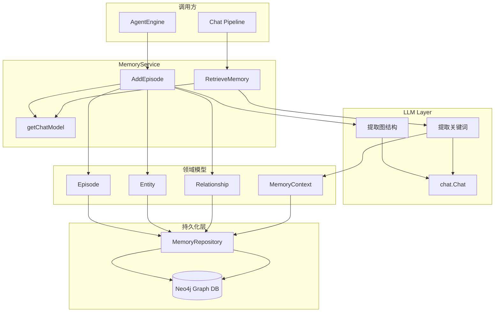

# Memory Extraction and Recall Service

## 模块概述

想象一下，你正在和一个 AI 助手进行多轮对话。如果每次对话都是"从零开始"，助手就无法记住你之前提到的关键信息、偏好或上下文。`memory_extraction_and_recall_service` 模块解决的正是这个问题 —— 它让系统能够**从对话中自动提取结构化知识**，并在后续对话中**智能召回相关记忆**。

这个模块的核心洞察是：**对话本身就是知识的载体**。但原始对话文本是杂乱、冗余且难以直接检索的。因此，模块采用了一种"提取 - 存储 - 召回"的三段式架构：

1. **提取阶段**：使用 LLM 从对话中抽取实体（Entity）、关系（Relationship）和摘要（Summary），形成结构化的"记忆片段"（Episode）
2. **存储阶段**：将提取结果持久化到图数据库（Neo4j），建立用户 - 会话 - 实体的关联网络
3. **召回阶段**：当用户发起新查询时，先用 LLM 提取关键词，再在图数据库中检索相关记忆片段

这种设计的精妙之处在于**用 LLM 做语义理解，用图数据库做高效检索** —— 两者各司其职，避免了"用锤子拧螺丝"的反模式。如果只用向量检索，会丢失实体间的结构化关系；如果只用规则提取，又无法处理开放域对话的复杂性。

---

## 架构与数据流



### 架构角色分析

`MemoryService` 在整个系统中扮演**记忆编排器**的角色：

| 维度 | 说明 |
|------|------|
| **上游调用者** | `AgentEngine`（在对话结束后调用 `AddEpisode`）、`ChatPipeline` 中的 `MemoryPlugin`（在回答前调用 `RetrieveMemory`） |
| **下游依赖** | `MemoryRepository`（图数据库访问）、`ModelService`（获取 LLM 实例） |
| **数据契约** | 输入是原始对话消息列表，输出是结构化的 `MemoryContext` 或无返回（仅持久化） |
| **核心抽象** | `Episode`（记忆片段）、`Entity`（实体）、`Relationship`（关系） |

### 数据流追踪

#### 写入路径（AddEpisode）

```
用户对话结束
    ↓
AgentEngine.AddEpisode(userID, sessionID, messages[])
    ↓
MemoryService.AddEpisode()
    ├── 1. 拼接对话文本："user: xxx\nassistant: yyy\n..."
    ├── 2. 调用 LLM（带 JSON Schema 约束）→ extractionResult
    ├── 3. 创建 Episode 对象（含 summary、timestamp）
    └── 4. MemoryRepo.SaveEpisode(episode, entities[], relations[])
            ↓
        Neo4j 写入节点和边
```

#### 读取路径（RetrieveMemory）

```
用户发起新查询
    ↓
MemoryPlugin 调用 RetrieveMemory(userID, query)
    ↓
MemoryService.RetrieveMemory()
    ├── 1. 调用 LLM 提取关键词 → keywordsResult
    ├── 2. MemoryRepo.FindRelatedEpisodes(userID, keywords[], limit=5)
    └── 3. 组装 MemoryContext 返回
            ↓
        ChatPipeline 将记忆注入上下文
```

---

## 核心组件详解

### MemoryService

**设计意图**：作为记忆管理的**唯一入口**，封装所有与 LLM 交互和图数据库操作的复杂性。调用方无需关心"如何提取"、"存到哪里"，只需声明"我要存这段对话"或"我要查相关记忆"。

```go
type MemoryService struct {
    repo         interfaces.MemoryRepository  // 图数据库访问抽象
    modelService interfaces.ModelService      // LLM 模型获取工厂
}
```

#### 关键方法

##### `AddEpisode(ctx, userID, sessionID, messages)`

**目的**：将一次会话转化为可检索的结构化记忆。

**内部机制**：
1. **可用性检查**：先调用 `repo.IsAvailable()`，避免在图数据库不可用时浪费 LLM 调用
2. **对话拼接**：将 `[]Message` 序列化为 `"role: content\n"` 格式的纯文本
3. **LLM 提取**：使用 `extractGraphPrompt` 模板，要求 LLM 输出符合 `extractionResult` JSON Schema 的结构
4. **结果解析**：`json.Unmarshal` 反序列化，失败则返回错误（**注意：这里没有重试机制**）
5. **持久化**：调用 `repo.SaveEpisode()` 一次性写入 Episode、Entity、Relationship

**参数说明**：
- `userID`：记忆的所有者，用于隔离不同用户的数据
- `sessionID`：关联到具体会话，支持后续追溯
- `messages`：原始对话历史，**调用方需确保已过滤敏感信息**

**返回值**：`error`，成功返回 `nil`

**副作用**：
- Neo4j 中创建新的 Episode 节点
- 创建/更新 Entity 节点（可能合并已存在实体）
- 创建 Relationship 边

**设计权衡**：
- **同步写入 vs 异步队列**：当前选择同步，优点是调用方能立即知道写入是否成功，缺点是增加对话结束时的延迟。如果未来对话量增长，可考虑改为异步（通过事件总线触发）
- **全量提取 vs 增量提取**：当前每次调用都重新提取整段对话，优点是实现简单，缺点是重复计算。优化方向是只提取新增消息

##### `RetrieveMemory(ctx, userID, query)`

**目的**：根据当前查询，召回最相关的历史记忆片段。

**内部机制**：
1. **关键词提取**：使用 `extractKeywordsPrompt` 让 LLM 从查询中抽取 3-5 个核心关键词
2. **图检索**：调用 `repo.FindRelatedEpisodes()`，在 Neo4j 中按关键词匹配 Episode
3. **结果组装**：将 `[]*Episode` 转换为 `MemoryContext` 返回

**参数说明**：
- `userID`：确保只检索当前用户的记忆（**隐私隔离的关键**）
- `query`：用户当前查询，**长度应合理控制**（过长会导致关键词提取质量下降）

**返回值**：`*types.MemoryContext`，包含 `RelatedEpisodes` 列表

**设计权衡**：
- **关键词检索 vs 向量检索**：当前使用关键词匹配，优点是可控、可解释，缺点是语义匹配能力弱。`MemoryContext` 结构预留了 `RelatedEntities` 和 `RelatedRelations` 字段，暗示未来可能扩展为混合检索
- **固定 limit=5**：硬编码在 `RetrieveMemory` 中，**缺乏灵活性**。应改为配置项或参数

##### `getChatModel(ctx)`

**目的**：动态获取一个可用的 KnowledgeQA 类型 LLM 实例。

**内部机制**：
1. 调用 `modelService.ListModels()` 获取所有模型
2. 遍历找到第一个 `Type == ModelTypeKnowledgeQA` 的模型
3. 调用 `modelService.GetChatModel(modelID)` 返回实例

**设计问题**：
- **性能隐患**：每次提取都重新 `ListModels()`，**应增加缓存层**
- **单点故障**：如果找不到 KnowledgeQA 模型，直接返回错误，**没有降级策略**

---

### extractionResult & keywordsResult

这两个是**内部 DTO（Data Transfer Object）**，用于约束 LLM 的输出格式。

```go
type extractionResult struct {
    Summary       string                `json:"summary"`
    Entities      []*types.Entity       `json:"entities"`
    Relationships []*types.Relationship `json:"relationships"`
}

type keywordsResult struct {
    Keywords []string `json:"keywords"`
}
```

**设计意图**：利用 LLM 的 **JSON Mode** 或 **Function Calling** 能力，强制模型输出结构化数据，避免后续解析的不确定性。

**关键字段说明**：
- `Summary`：对话摘要，用于快速浏览记忆片段
- `Entities[].Title/Type/Description`：实体名称、类型（如 Person/Location/Concept）、描述
- `Relationships[].Source/Target/Description/Weight`：关系的起点、终点、描述、权重

**潜在问题**：
- **Schema 漂移**：如果 LLM 输出不符合预期结构，`json.Unmarshal` 会失败。当前没有容错处理
- **字段映射**：`Relationship.Weight` 在提取时使用 `float64`，但 `types.Relationship` 中是 `Strength int`，存在类型转换丢失

---

## 依赖分析

### 上游调用者

| 调用方 | 调用场景 | 期望行为 |
|--------|----------|----------|
| `AgentEngine` | 会话结束时 | 异步写入记忆，不阻塞用户响应 |
| `MemoryPlugin`（ChatPipeline） | 回答用户前 | 同步检索，延迟应 < 200ms |
| `EvaluationService` | 评估记忆质量 | 批量读取，支持分页 |

### 下游依赖

| 依赖项 | 用途 | 耦合度 |
|--------|------|--------|
| `MemoryRepository` | 图数据库 CRUD | **强耦合**：接口变更会直接影响本模块 |
| `ModelService` | 获取 LLM 实例 | **中耦合**：依赖模型注册机制，但可替换具体模型 |
| `types.Entity/Relationship` | 领域模型 | **强耦合**：字段变更需同步修改提取逻辑 |

### 数据契约

#### 写入契约（SaveEpisode）
```go
SaveEpisode(ctx, episode *Episode, entities []*Entity, relations []*Relationship) error
```
- **前置条件**：`episode.ID` 必须唯一，`entities` 和 `relations` 可为空
- **后置条件**：Neo4j 中存在对应的节点和边，支持后续按 `userID` 和关键词查询

#### 读取契约（FindRelatedEpisodes）
```go
FindRelatedEpisodes(ctx, userID, keywords []string, limit int) ([]*Episode, error)
```
- **前置条件**：`keywords` 至少 1 个，`limit > 0`
- **后置条件**：返回按相关性排序的 Episode 列表，数量 ≤ limit

---

## 设计决策与权衡

### 1. 为什么用 LLM 提取而不是规则？

**问题**：对话中的实体和关系是开放域的，规则无法覆盖所有情况。

**选择**：使用 LLM + JSON Schema 约束。

**权衡**：
- ✅ 优点：泛化能力强，能处理未见过的实体类型
- ❌ 缺点：成本高（每次提取都调用 LLM）、延迟高（~500ms）、结果不稳定（依赖模型质量）

**替代方案**：
- 使用 NER 模型（如 spaCy）+ 关系抽取模型：成本更低，但需要训练数据
- 混合方案：规则处理高频模式，LLM 处理长尾

### 2. 为什么用图数据库而不是向量数据库？

**问题**：记忆的本质是**关联网络**，而非独立片段。

**选择**：Neo4j 存储 Entity 和 Relationship，支持 Cypher 查询。

**权衡**：
- ✅ 优点：天然支持关系遍历（如"找出与 A 相关的所有 B"）、可解释性强
- ❌ 缺点：关键词匹配语义能力弱、需要额外维护图结构

**未来方向**：图 + 向量混合检索（Entity 嵌入向量，同时支持语义和结构查询）

### 3. 为什么同步写入而不是异步？

**当前实现**：`AddEpisode` 是同步阻塞的。

**权衡**：
- ✅ 优点：调用方能立即知道写入是否成功，便于错误处理
- ❌ 缺点：增加会话结束时的延迟，用户体验下降

**改进建议**：
```go
// 改为异步，通过事件总线触发
func (s *MemoryService) AddEpisodeAsync(ctx, userID, sessionID, messages) {
    go func() {
        _ = s.AddEpisode(ctx, userID, sessionID, messages)
    }()
}
```

### 4. 为什么关键词提取用 LLM 而不是 TF-IDF？

**选择**：让 LLM 从查询中提取关键词。

**权衡**：
- ✅ 优点：能理解语义（如"苹果公司的 CEO" → ["苹果", "CEO"]）
- ❌ 缺点：每次检索都调用 LLM，成本高

**替代方案**：
- 缓存高频查询的关键词结果
- 使用轻量级模型（如 DistilBERT）做关键词提取

---

## 使用示例

### 写入记忆

```go
// 在 AgentEngine 中，会话结束时调用
messages := []types.Message{
    {Role: "user", Content: "我想了解北京的气候"},
    {Role: "assistant", Content: "北京属于温带季风气候..."},
}

err := memoryService.AddEpisode(ctx, "user-123", "session-456", messages)
if err != nil {
    log.Errorf("Failed to add episode: %v", err)
}
```

### 检索记忆

```go
// 在 MemoryPlugin 中，回答前调用
query := "北京冬天冷吗？"
memoryCtx, err := memoryService.RetrieveMemory(ctx, "user-123", query)
if err != nil {
    log.Errorf("Failed to retrieve memory: %v", err)
    return // 降级：不使用记忆
}

// 将记忆注入上下文
if len(memoryCtx.RelatedEpisodes) > 0 {
    contextBuilder.AddSystemPrompt(fmt.Sprintf(
        "相关记忆：%s", 
        memoryCtx.RelatedEpisodes[0].Summary,
    ))
}
```

### 配置依赖

```go
// 初始化服务
repo := neo4j.NewMemoryRepository(config.Neo4jConfig)
modelService := model.NewModelService(config.ModelConfig)
memoryService := memory.NewMemoryService(repo, modelService)
```

---

## 边界情况与陷阱

### 1. LLM 输出解析失败

**场景**：LLM 返回的 JSON 不符合 `extractionResult` Schema。

**当前行为**：`json.Unmarshal` 返回错误，整个写入失败。

**风险**：如果模型质量波动，会导致大量记忆写入失败，且调用方难以感知原因。

**建议**：
```go
// 增加降级逻辑
var result extractionResult
if err := json.Unmarshal([]byte(resp.Content), &result); err != nil {
    log.Warnf("LLM output parsing failed, using fallback: %v", err)
    // 降级：只保存摘要，不保存实体和关系
    result.Summary = resp.Content
    result.Entities = []*types.Entity{}
    result.Relationships = []*types.Relationship{}
}
```

### 2. 图数据库不可用

**场景**：Neo4j 连接断开或超时。

**当前行为**：`repo.IsAvailable()` 返回 `false`，直接返回错误。

**风险**：记忆功能完全不可用，且没有通知机制。

**建议**：
- 增加重试机制（指数退避）
- 写入本地队列，后续异步补偿
- 发送告警事件到监控系统

### 3. 用户隐私泄露

**场景**：`RetrieveMemory` 没有严格校验 `userID`。

**当前行为**：依赖 `repo.FindRelatedEpisodes()` 内部实现隔离。

**风险**：如果 Repository 层实现有漏洞，可能导致跨用户记忆泄露。

**建议**：
- 在 Service 层增加二次校验
- 审计日志记录所有记忆访问
- 支持用户删除自己的记忆（GDPR 合规）

### 4. 关键词提取质量不稳定

**场景**：用户查询模糊（如"那个东西"），LLM 无法提取有效关键词。

**当前行为**：返回空关键词列表，`FindRelatedEpisodes` 返回空结果。

**风险**：静默失败，用户得不到记忆增强。

**建议**：
- 设置关键词最小数量（如至少 1 个）
- 降级策略：使用查询原文作为关键词
- 记录低质量提取案例，用于模型优化

### 5. 模型选择硬编码

**场景**：`getChatModel` 选择第一个 `KnowledgeQA` 类型模型。

**风险**：
- 如果注册了多个 KnowledgeQA 模型，选择不可控
- 如果模型被删除，没有降级

**建议**：
```go
// 支持配置优先模型 ID
func (s *MemoryService) getChatModel(ctx context.Context) (chat.Chat, error) {
    // 1. 优先使用配置的模型
    if s.config.MemoryModelID != "" {
        return s.modelService.GetChatModel(ctx, s.config.MemoryModelID)
    }
    // 2. 降级：查找第一个可用模型
    // ...
}
```

---

## 扩展点

### 1. 自定义提取 Prompt

当前 `extractGraphPrompt` 和 `extractKeywordsPrompt` 是硬编码常量。

**扩展方式**：
```go
type MemoryServiceConfig struct {
    ExtractGraphPrompt    string
    ExtractKeywordsPrompt string
    MaxKeywords           int
    MaxEpisodes           int
}

func NewMemoryService(repo, modelService, config) *MemoryService {
    // 使用配置的 Prompt
}
```

### 2. 支持批量写入

当前 `AddEpisode` 一次处理一个会话。

**扩展方式**：
```go
func (s *MemoryService) AddEpisodesBatch(ctx, episodes []EpisodeInput) error {
    // 批量调用 LLM（如果模型支持）
    // 批量写入图数据库（事务优化）
}
```

### 3. 记忆更新/合并

当前只有"新增"，没有"更新"逻辑。

**扩展方式**：
```go
func (s *MemoryService) UpdateEpisode(ctx, episodeID string, messages []Message) error {
    // 1. 查找已有 Episode
    // 2. 合并新旧实体和关系
    // 3. 更新图数据库
}
```

---

## 相关模块

- [Agent Engine](agent_runtime_and_tools.md)：调用 `AddEpisode` 的 upstream
- [Chat Pipeline](application_services_and_orchestration.md)：`MemoryPlugin` 调用 `RetrieveMemory`
- [Memory Repository](data_access_repositories.md)：底层图数据库实现
- [Model Service](application_services_and_orchestration.md)：提供 LLM 实例
- [Event Bus](platform_infrastructure_and_runtime.md)：可用于异步记忆写入

---

## 运维考虑

### 监控指标

| 指标 | 说明 | 告警阈值 |
|------|------|----------|
| `memory_extract_latency_ms` | LLM 提取耗时 | P99 > 1000ms |
| `memory_retrieve_latency_ms` | 记忆检索耗时 | P99 > 500ms |
| `memory_extract_error_rate` | 提取失败率 | > 5% |
| `memory_repo_unavailable` | 图数据库不可用 | 持续 > 1min |

### 容量规划

- **Episode 数量**：假设每用户每天 10 次会话，10 万用户 → 100 万 Episode/天
- **Entity 数量**：每 Episode 平均 5 个 Entity → 500 万 Entity/天
- **存储估算**：每个 Entity ~500 字节 → 2.5GB/天（需定期归档）

### 数据迁移

如需更换图数据库（如 Neo4j → Nebula），需：
1. 实现新的 `MemoryRepository` 适配层
2. 数据导出/导入脚本
3. 双写验证（新旧库同时写入，对比结果）
