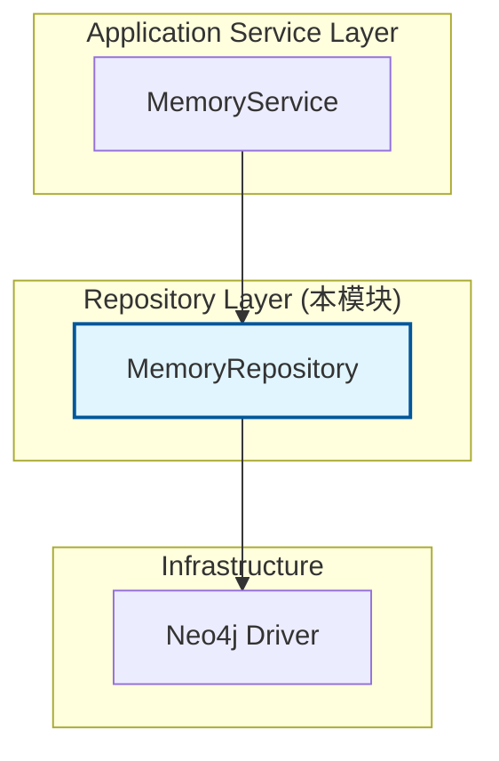

# Memory Graph Repository 模块深度解析

## 概述：为什么需要这个模块？

想象一下，你正在和一个 AI 助手进行多轮对话。你们聊到了"张三"这个人，几天后你又问起"上次提到的张三怎么样了"。如果系统只依赖简单的关键词匹配或向量相似度，它可能无法准确定位到之前关于"张三"的具体对话上下文。

**Memory Graph Repository** 模块解决的正是这个问题：它将对话历史以**图结构**的形式持久化到 Neo4j 图数据库中，使得系统能够基于**实体（Entity）**和**关系（Relationship）**进行语义化的记忆检索。

### 核心问题空间

 naive 的方案会怎么做？
- 方案 A：把整段对话存成文本，用向量检索 → 丢失了实体间的结构化关系
- 方案 B：用关系型数据库存对话记录 → 难以高效查询"提到过张三和李四的所有对话"
- 方案 C：纯内存缓存 → 重启后记忆丢失，无法跨会话复用

本模块的设计洞察是：**对话记忆的本质是一个动态增长的知识图谱**。每次对话（Episode）会提及若干实体（Entity），实体之间存在关系（Relationship）。用图数据库存储这种天然的网络结构，查询效率远高于在关系型数据库中做多表 JOIN。

### 模块定位

这是 `data_access_repositories` 模块组中的**图检索与记忆存储层**，向上为 [`MemoryService`](application_services_and_orchestration.md#memory_extraction_and_recall_service) 提供持久化接口，向下直接操作 Neo4j 数据库。



---

## 架构与数据流

### 核心抽象：记忆图谱的三层模型

理解这个模块的关键是掌握其**数据模型**：

```
┌─────────────────────────────────────────────────────────────┐
│                      记忆图谱结构                            │
│                                                             │
│   ┌──────────┐     MENTIONS      ┌──────────┐              │
│   │ Episode  │ ────────────────> │  Entity  │              │
│   │ (对话片段) │                  │  (实体)   │              │
│   └──────────┘                   └────┬─────┘              │
│         │                              │                    │
│         │ created_at, summary          │ type, description  │
│         │                              │                    │
│         ▼                              ▼                    │
│   ┌──────────┐                 ┌──────────────┐            │
│   │ Episode  │                 │    Entity    │            │
│   └──────────┘                 └──────┬───────┘            │
│                                       │                    │
│                                       │ RELATED_TO         │
│                                       │ (带权重和描述)       │
│                                       ▼                    │
│                                 ┌──────────────┐            │
│                                 │    Entity    │            │
│                                 └──────────────┘            │
└─────────────────────────────────────────────────────────────┘
```

**类比理解**：
- **Episode（片段）**：像是一本日记中的一页，记录某次对话的摘要
- **Entity（实体）**：像是日记中提到的人名、地名、概念
- **MENTIONS 关系**：这一页日记"提到"了哪些实体
- **RELATED_TO 关系**：实体之间有什么关联（如"张三 - 同事→李四"）

### 数据流追踪

#### 写入流程：SaveEpisode

```
MemoryService.SaveEpisode()
       │
       ▼
MemoryRepository.SaveEpisode()  ◄── 本模块核心方法
       │
       ├─► 开启 Neo4j 写会话
       │
       ├─► 事务内执行：
       │    1. MERGE Episode 节点（按 ID 去重）
       │    2. 对每个 Entity：
       │       - MERGE Entity 节点（按 name 去重）
       │       - CREATE (Episode)-[:MENTIONS]->(Entity)
       │    3. 对每个 Relationship：
       │       - MATCH 源和目标 Entity
       │       - MERGE (源)-[:RELATED_TO]->(目标)
       │
       └─► 提交事务 / 回滚
```

#### 读取流程：FindRelatedEpisodes

```
MemoryService.FindRelatedEpisodes()
       │
       ▼
MemoryRepository.FindRelatedEpisodes()  ◄── 本模块核心方法
       │
       ├─► 开启 Neo4j 读会话
       │
       ├─► 执行 Cypher 查询：
       │    MATCH (e:Episode)-[:MENTIONS]->(n:Entity)
       │    WHERE e.user_id = $user_id AND n.name IN $keywords
       │    RETURN DISTINCT e
       │
       └─► 将 Neo4j Node 转换为 types.Episode
```

### 依赖关系分析

| 依赖方向 | 组件 | 契约/接口 | 说明 |
|---------|------|----------|------|
| **被调用** | [`MemoryService`](application_services_and_orchestration.md#memory_extraction_and_recall_service) | `interfaces.MemoryRepository` | 服务层调用本仓库进行记忆持久化 |
| **调用** | `neo4j.Driver` | Neo4j Go Driver API | 直接依赖官方驱动，无中间抽象层 |
| **实现** | `interfaces.MemoryRepository` | 接口契约 | 定义 `IsAvailable`, `SaveEpisode`, `FindRelatedEpisodes` |

**耦合分析**：
- **紧耦合**：直接依赖 Neo4j Go Driver v6，更换图数据库需要重写整个模块
- **松耦合**：通过 `interfaces.MemoryRepository` 接口与上层解耦，可轻松切换实现（如未来增加 PostgreSQL 实现）
- **数据契约**：依赖 `types.Episode`, `types.Entity`, `types.Relationship` 三个核心领域模型

---

## 组件深度解析

### MemoryRepository 结构体

```go
type MemoryRepository struct {
    driver neo4j.Driver
}
```

**设计意图**：这是一个典型的**仓库模式（Repository Pattern）**实现。结构体本身无状态，仅持有数据库驱动实例，所有方法都是幂等的。

**为什么这样设计？**
- **无状态**：便于并发调用，无需考虑锁竞争
- **依赖注入**：driver 通过构造函数注入，便于单元测试时替换为 mock
- **单一职责**：只负责 Episode/Entity/Relationship 的 CRUD，不处理业务逻辑

---

### NewMemoryRepository 构造函数

```go
func NewMemoryRepository(driver neo4j.Driver) interfaces.MemoryRepository
```

**参数说明**：
- `driver`：Neo4j 数据库连接驱动，由上层（通常是 DI 容器或初始化代码）传入

**返回值**：
- 返回 `interfaces.MemoryRepository` 接口而非具体类型 → **依赖倒置原则**的体现

**设计考量**：
这里返回接口类型而非 `*MemoryRepository`，使得调用方只依赖抽象，不依赖具体实现。如果未来需要切换到其他图数据库（如 Nebula Graph），只需新增一个实现相同接口的结构体，调用方代码无需修改。

---

### IsAvailable 方法

```go
func (r *MemoryRepository) IsAvailable(ctx context.Context) bool
```

**目的**：健康检查接口，用于判断图数据库是否可用。

**实现细节**：
```go
return r.driver != nil
```

**为什么这么简单？**
- 这是一个**轻量级检查**，仅验证驱动是否已初始化
- 不做实际的网络探测（如 ping Neo4j），避免引入额外延迟
- 真正的连接健康检查应在更上层（如连接池）处理

**使用场景**：
在 [`MemoryService`](application_services_and_orchestration.md#memory_extraction_and_recall_service) 中，调用记忆功能前可先检查 `IsAvailable()`，如果返回 false 则降级到纯文本检索。

---

### SaveEpisode 方法（核心写入逻辑）

```go
func (r *MemoryRepository) SaveEpisode(
    ctx context.Context, 
    episode *types.Episode, 
    entities []*types.Entity, 
    relations []*types.Relationship
) error
```

**职责**：原子性地保存一个对话片段及其关联的实体和关系。

#### 内部 mechanics：三步事务

**第一步：创建 Episode 节点**
```cypher
MERGE (e:Episode {id: $id})
SET e.user_id = $user_id,
    e.session_id = $session_id,
    e.summary = $summary,
    e.created_at = $created_at
```

**设计决策**：使用 `MERGE` 而非 `CREATE`
- **为什么？** `MERGE` 是"存在则更新，不存在则创建"的语义
- **好处**：同一 episode 重复保存时不会报错，实现幂等性
- **代价**：每次都会更新 `created_at` 字段（可能是 bug 或设计疏忽）

**第二步：创建 Entity 节点并建立 MENTIONS 关系**
```cypher
MERGE (n:Entity {name: $name})
SET n.type = $type,
    n.description = $description
WITH n
MATCH (e:Episode {id: $episode_id})
MERGE (e)-[:MENTIONS]->(n)
```

**关键设计点**：
1. **Entity 按 name 去重**：`MERGE (n:Entity {name: $name})`
   - **优点**：避免重复实体（如多次提到"张三"只创建一个节点）
   - **风险**：不同上下文中同名但不同义的实体会被错误合并（如两个都叫"张三"的人）

2. **先 WITH 再 MATCH**：Cypher 语法要求，确保 entity 创建后再关联 episode

3. **MENTIONS 关系无属性**：仅表示"提到"，不记录提到的时间、上下文等元数据
   - **权衡**：简化模型 vs 丢失信息

**第三步：创建 Entity 间的 RELATED_TO 关系**
```cypher
MATCH (s:Entity {name: $source})
MATCH (t:Entity {name: $target})
MERGE (s)-[r:RELATED_TO {description: $description}]->(t)
SET r.weight = $weight
```

**潜在问题**：
- 如果源或目标 Entity 不存在，`MATCH` 会失败，整个事务回滚
- **没有错误恢复机制**：调用方需确保先保存 Entity 再保存 Relationship

#### 事务边界与错误处理

```go
_, err := session.ExecuteWrite(ctx, func(tx neo4j.ManagedTransaction) (interface{}, error) {
    // 所有操作在一个事务内
})
```

**设计权衡**：
- **优点**：保证原子性，要么全部成功，要么全部回滚
- **缺点**：长事务可能锁住资源，影响并发性能
- **改进空间**：可考虑分阶段提交（先保存 Episode，再异步保存 Entity 和 Relation）

#### 时间序列化

```go
episode.CreatedAt.Format(time.RFC3339)
```

**为什么用 RFC3339？**
- Neo4j 不原生支持时间类型，需存为字符串
- RFC3339 是 ISO 8601 的简化版，可排序、可解析
- **风险**：读取时需精确匹配此格式，否则解析失败

---

### FindRelatedEpisodes 方法（核心读取逻辑）

```go
func (r *MemoryRepository) FindRelatedEpisodes(
    ctx context.Context, 
    userID string, 
    keywords []string, 
    limit int
) ([]*types.Episode, error)
```

**职责**：根据关键词（实体名）查找相关的历史对话片段。

#### 查询策略分析

```cypher
MATCH (e:Episode)-[:MENTIONS]->(n:Entity)
WHERE e.user_id = $user_id AND n.name IN $keywords
RETURN DISTINCT e
ORDER BY e.created_at DESC
LIMIT $limit
```

**设计洞察**：
1. **反向索引查询**：从 Entity 反查 Episode，而非遍历所有 Episode
   - **性能优势**：Neo4j 对节点属性有索引时，此查询复杂度为 O(log N)
   - **对比**：如果用 SQL，需要 `JOIN episode_entity_map` 表

2. **DISTINCT 去重**：一个 Episode 可能提到多个匹配的 Entity，需去重

3. **按时间倒序**：最近的对话优先返回，符合用户预期

4. **关键词 IN 查询**：支持批量查询多个实体
   - **使用场景**：用户问"张三和李四上次聊了什么"，keywords = ["张三", "李四"]

#### 结果转换的脆弱性

```go
createdAtStr := episodeNode.Props["created_at"].(string)
createdAt, _ := time.Parse(time.RFC3339, createdAtStr)
```

**问题**：
- 使用 `_` 忽略了解析错误 → 如果格式不匹配，`createdAt` 会是零值
- 直接类型断言 `.(string)` → 如果 Neo4j 返回其他类型，会 panic

**改进建议**：
```go
createdAtStr, ok := episodeNode.Props["created_at"].(string)
if !ok {
    return nil, fmt.Errorf("invalid created_at type")
}
createdAt, err := time.Parse(time.RFC3339, createdAtStr)
if err != nil {
    return nil, fmt.Errorf("parse created_at: %v", err)
}
```

---

## 设计决策与权衡

### 1. 为什么选择 Neo4j 而非向量数据库？

| 维度 | Neo4j（图数据库） | 向量数据库 |
|-----|-----------------|-----------|
| **实体关系查询** | 原生支持，高效遍历 | 需额外建模 |
| **多跳查询** | `MATCH (a)-[*2..3]->(b)` | 不支持 |
| **精确匹配** | 属性索引，O(log N) | 近似搜索 |
| **语义相似度** | 不支持 | 核心能力 |

**本模块的选择**：用 Neo4j 存储**结构化记忆**（实体和关系），配合向量数据库存储**语义嵌入**。这是**正交的设计**，而非二选一。

### 2. MERGE vs CREATE：幂等性的代价

**选择 MERGE 的理由**：
- 网络重试时不会因重复插入而失败
- 支持"更新已有记忆"的场景（如修正实体描述）

**代价**：
- 性能略低于 CREATE（需先检查是否存在）
- 可能掩盖业务逻辑错误（如意外覆盖数据）

### 3. 实体去重策略：按 name 而非 (name, type)

**当前实现**：
```cypher
MERGE (n:Entity {name: $name})
```

**问题**：
- "苹果"（水果）和"苹果"（公司）会被合并成一个节点
- 类型信息仅作为属性存储，不参与去重

**替代方案**：
```cypher
MERGE (n:Entity {name: $name, type: $type})
```

**为什么没这么做？**
- 可能是为了支持"同一实体有多种类型"的场景
- 或是设计疏忽，待改进

### 4. 同步阻塞 vs 异步写入

**当前实现**：`SaveEpisode` 同步等待事务提交

**权衡**：
- **同步**：简单可靠，调用方立即可知写入结果
- **异步**：降低延迟，但需处理写入失败的回滚逻辑

**适用场景**：
- 对话结束后批量保存记忆 → 可异步
- 实时提取实体并关联 → 需同步

---

## 使用指南与示例

### 基本使用模式

```go
// 1. 初始化仓库（通常在应用启动时）
driver := neo4j.NewDriver(...)
repo := neo4j.NewMemoryRepository(driver)

// 2. 保存对话记忆
episode := &types.Episode{
    ID:        "ep_123",
    UserID:    "user_456",
    SessionID: "sess_789",
    Summary:   "讨论了项目进度和张三的任务分配",
    CreatedAt: time.Now(),
}

entities := []*types.Entity{
    {Title: "张三", Type: "Person", Description: "项目组成员"},
    {Title: "项目 A", Type: "Project", Description: "正在开发的产品"},
}

relations := []*types.Relationship{
    {Source: "张三", Target: "项目 A", Description: "负责", Weight: 0.9},
}

err := repo.SaveEpisode(ctx, episode, entities, relations)

// 3. 检索相关记忆
episodes, err := repo.FindRelatedEpisodes(ctx, "user_456", []string{"张三"}, 5)
```

### 与 MemoryService 的协作

本模块不直接暴露给 HTTP Handler，而是通过 [`MemoryService`](application_services_and_orchestration.md#memory_extraction_and_recall_service) 封装：

```
HTTP Handler → MemoryService → MemoryRepository → Neo4j
```

**为什么这样分层？**
- Service 层可添加缓存、降级、日志等横切关注点
- Repository 层专注数据持久化，保持纯粹

---

## 边界情况与陷阱

### 1. 实体名称冲突

**场景**：用户 A 和用户 B 都提到了"张三"，但指的是不同的人。

**当前行为**：两个用户会共享同一个"张三"Entity 节点。

**影响**：
- 用户 A 可能检索到用户 B 提到"张三"的对话（如果查询时未过滤 user_id）
- 实体描述会被后写入的用户覆盖

**缓解措施**：
- 查询时始终带上 `user_id` 过滤（当前 `FindRelatedEpisodes` 已做到）
- 未来可考虑 `(user_id, name)` 联合去重

### 2. 关系创建时实体不存在

**场景**：先调用 `SaveEpisode` 传入 relations，但对应的 Entity 尚未创建。

**当前行为**：`MATCH (s:Entity {name: $source})` 失败，整个事务回滚。

**错误信息**：
```
failed to create relationship between 张三 and 李四: ...
```

**正确用法**：
- 确保 `entities` 列表包含 relations 中引用的所有实体
- 或分两次调用：先保存 Entity，再保存 Relation

### 3. 时间格式不一致

**场景**：手动在 Neo4j 中修改了 `created_at` 字段，格式不是 RFC3339。

**当前行为**：`time.Parse` 失败，返回零值时间，无错误提示。

**调试技巧**：
```cypher
MATCH (e:Episode) 
WHERE e.created_at CONTAINS "T"  // RFC3339 包含 T 分隔符
RETURN count(e)
```

### 4. 长尾查询性能

**场景**：某个 Entity 被上万个 Episode 引用（如"系统"、"用户"等通用实体）。

**当前行为**：查询包含这些关键词时，需遍历大量 MENTIONS 边。

**优化建议**：
- 在 Entity 节点上添加 `is_common` 标记，查询时排除
- 或限制单个 Entity 的最大引用数，超过后创建副本

### 5. 事务超时

**场景**：一次性保存包含数百个 Entity 和 Relation 的 Episode。

**当前行为**：Neo4j 事务可能超时（默认 30 秒）。

**缓解措施**：
- 分批保存：先存 Episode，再异步存 Entity 和 Relation
- 调整 Neo4j 事务超时配置

---

## 扩展点与演进方向

### 1. 支持多租户隔离

**当前**：通过 `user_id` 属性逻辑隔离。

**改进**：使用 Neo4j 的 Database 功能物理隔离不同租户的数据。

### 2. 增加记忆删除接口

**缺失功能**：只有保存和查询，没有删除 Episode 或 Entity 的方法。

**建议接口**：
```go
DeleteEpisode(ctx context.Context, episodeID string) error
PruneUnusedEntities(ctx context.Context) error  // 清理未被任何 Episode 引用的 Entity
```

### 3. 支持关系权重衰减

**场景**：很久之前建立的关系可能已失效。

**改进**：在查询时根据 `created_at` 对权重进行时间衰减：
```cypher
RETURN e, r.weight * exp(-0.01 * duration.between(e.created_at, datetime()).days) AS decayed_weight
```

### 4. 增加批量查询接口

**当前**：`FindRelatedEpisodes` 一次只能查一组 keywords。

**改进**：支持批量查询多组 keywords，减少网络往返。

---

## 相关模块参考

- [`MemoryService`](application_services_and_orchestration.md#memory_extraction_and_recall_service)：调用本模块的上层服务，负责记忆提取和召回的业务逻辑
- [`Neo4jRepository`](data_access_repositories.md#neo4j_retrieval_repository)：同项目的另一个 Neo4j 仓库实现，用于知识图谱检索
- [`types.Episode`](core_domain_types_and_interfaces.md#memory_state_and_episode_models)：Episode 领域模型定义
- [`types.Entity`](core_domain_types_and_interfaces.md#graph_entity_relationship_builder_contracts)：Entity 领域模型定义
- [`types.Relationship`](core_domain_types_and_interfaces.md#graph_entity_relationship_builder_contracts)：Relationship 领域模型定义

---

## 总结

**Memory Graph Repository** 是一个设计简洁但意图明确的模块：

1. **核心价值**：用图结构存储对话记忆，支持基于实体的语义检索
2. **关键抽象**：Episode-Entity-Relationship 三层模型
3. **设计亮点**：事务保证原子性、MERGE 实现幂等性、接口抽象便于测试
4. **主要风险**：实体名称冲突、时间解析脆弱、缺少删除接口

对于新加入的开发者，理解这个模块的关键是**建立图思维**：不要把它看作"存对话的地方"，而是"存对话中实体关系网络的地方"。这种思维转变是掌握本模块设计精髓的关键。
