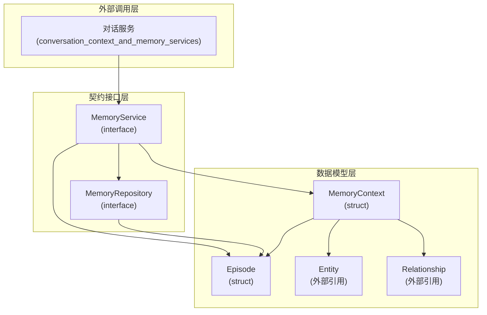
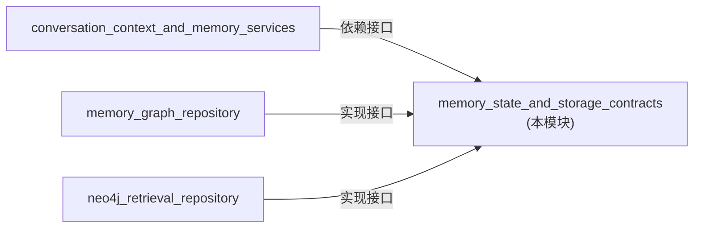

# memory_state_and_storage_contracts 模块技术深度解析

## 为什么这个模块存在

想象一下，当你与一个 AI 助手连续对话多轮后，它突然忘记了你们之前讨论过的重要信息。这就是 `memory_state_and_storage_contracts` 模块要解决的核心问题。

在 AI 助手系统中，用户的对话不是孤立的——每一轮对话都建立在前一轮的基础上。如果没有记忆能力，系统就像是一个患有健忘症的助手，每次对话都从零开始，无法理解上下文、引用之前的话题，或根据用户的历史偏好进行个性化回应。

这个模块定义了记忆系统的**核心契约和数据模型**，为整个系统提供了一个统一的记忆抽象层。它不直接实现记忆的存储和检索逻辑，而是定义了"什么是记忆"、"记忆如何组织"以及"记忆系统应该提供什么能力"的标准接口。

## 核心概念与心智模型

### 记忆系统的核心抽象

可以将这个模块想象成一个**智能归档系统**：

1. **Episode（剧集/片段）**：就像电视剧的一集，代表一次完整的对话交互。它包含对话的摘要、参与者、时间戳等元数据，是记忆的基本组织单位。
   
2. **MemoryContext（记忆上下文）**：当你需要回忆某些事情时，系统从档案库中提取的相关信息集合。它不仅包括相关的对话片段，还包括提取出的实体和关系，就像你回忆某件事时，脑海中浮现的不仅是事件本身，还有相关的人物和他们之间的关系。

3. **MemoryService（记忆服务）**：这个系统的"图书管理员"，负责处理新对话的归档和旧记忆的检索。它知道如何从对话中提取有价值的信息，也知道如何根据当前查询找到最相关的记忆。

4. **MemoryRepository（记忆仓库）**：这个系统的"书架"，负责实际的数据存储和检索。它提供了底层的持久化能力，但不关心如何提取或组织记忆。

## 架构与数据流向

### 模块架构图



### 关键数据流

让我们追踪两个核心操作的完整数据流：

#### 1. 添加记忆（AddEpisode）

当用户完成一次对话会话后，系统需要将这次对话保存为记忆：

```
用户会话结束 
    ↓
[conversation_context_and_memory_services] 捕获完整对话历史
    ↓
调用 MemoryService.AddEpisode(userID, sessionID, messages)
    ↓
MemoryService 实现层（本模块只定义接口）处理：
    - 从 messages 中提取关键实体（Entity）
    - 识别实体间的关系（Relationship）
    - 生成对话摘要（Summary）
    - 创建 Episode 结构体
    ↓
调用 MemoryRepository.SaveEpisode(episode, entities, relations)
    ↓
MemoryRepository 实现层将数据持久化到图数据库
```

#### 2. 检索记忆（RetrieveMemory）

当用户开始新对话时，系统需要回忆相关的历史信息：

```
用户发送新查询
    ↓
[conversation_context_and_memory_services] 接收查询
    ↓
调用 MemoryService.RetrieveMemory(userID, query)
    ↓
MemoryService 实现层处理：
    - 从查询中提取关键词
    - 调用 MemoryRepository.FindRelatedEpisodes()
    - 获取相关的 Episode 列表
    - 补充相关的 Entity 和 Relationship
    ↓
组装 MemoryContext 并返回
    ↓
对话服务将 MemoryContext 注入到 LLM 提示词中
    ↓
AI 助手能够基于历史上下文进行回应
```

## 设计决策与权衡

### 1. 契约优先的设计

**选择**：将接口定义与数据模型放在一起，形成完整的契约包。

**为什么这样做**：
- **明确边界**：清晰地划分了"记忆系统是什么"和"记忆系统如何实现"之间的界限
- **便于测试**：可以轻松创建 mock 实现进行单元测试
- **支持多实现**：未来可以有基于 Neo4j、Memory Graph 或其他技术的不同实现

**权衡**：
- ✅ 优点：灵活性高，解耦彻底
- ⚠️ 缺点：增加了一层抽象，初期开发可能感觉有点"重"

### 2. Episode 作为基本记忆单元

**选择**：将一次完整的会话（Session）作为一个 Episode 存储，而不是单独存储每条消息。

**为什么这样做**：
- **语义完整性**：一次会话通常有一个统一的主题，作为整体存储更符合人类记忆的方式
- **检索效率**：减少需要处理的记忆单元数量，提高检索速度
- **摘要价值**：Episode 包含摘要字段，可以快速浏览而不必读取完整对话

**权衡**：
- ✅ 优点：检索高效，语义清晰
- ⚠️ 缺点：如果会话很长或主题分散，可能会影响检索精度

### 3. 图结构的记忆组织

**选择**：MemoryContext 包含 Episode、Entity 和 Relationship，暗示了图数据结构。

**为什么这样做**：
- **关联检索**：图结构天然适合"找到与 X 相关的所有事物"这类查询
- **知识表示**：实体和关系是知识的基本构建块，图结构能很好地表示
- **推理能力**：未来可以基于图结构进行更复杂的推理和关联

**权衡**：
- ✅ 优点：强大的关联查询能力，支持复杂推理
- ⚠️ 缺点：图数据库通常更复杂，运维成本更高

### 4. 分离 Service 和 Repository 接口

**选择**：将业务逻辑（MemoryService）和数据访问（MemoryRepository）分离为两个接口。

**为什么这样做**：
- **单一职责**：Service 关心"如何处理记忆"，Repository 关心"如何存储记忆"
- **可替换性**：可以更换存储技术而不改变业务逻辑
- **测试友好**：可以独立测试两个层

**权衡**：
- ✅ 优点：关注点分离，易于维护和测试
- ⚠️ 缺点：简单场景下可能显得过度设计

## 与其他模块的关系

### 依赖关系



### 关键交互模块

1. **[conversation_context_and_memory_services](application_services_and_orchestration-conversation_context_and_memory_services.md)**
   - 这是本模块的主要消费者
   - 它使用 MemoryService 来存储和检索对话记忆
   - 它将 MemoryContext 整合到 LLM 的上下文中

2. **[memory_graph_repository](data_access_repositories-graph_retrieval_and_memory_repositories-memory_graph_repository.md)**
   - 这是 MemoryRepository 接口的一个可能实现
   - 它负责将记忆数据存储到内存图结构中

3. **[neo4j_retrieval_repository](data_access_repositories-graph_retrieval_and_memory_repositories-neo4j_retrieval_repository.md)**
   - 这是 MemoryRepository 接口的另一个可能实现
   - 它使用 Neo4j 图数据库进行持久化存储

## 新贡献者指南

### 快速入门

1. **理解核心概念**：先阅读 `internal/types/memory.go`，理解 Episode 和 MemoryContext 的结构
2. **理解接口契约**：再阅读 `internal/types/interfaces/memory.go`，理解系统需要提供什么能力
3. **查看实现示例**：参考 [memory_graph_repository](data_access_repositories-graph_retrieval_and_memory_repositories-memory_graph_repository.md) 了解如何实现这些接口

### 常见陷阱

1. **不要假设只有一个实现**：代码应该依赖接口，而不是具体实现
2. **注意并发安全**：MemoryRepository 的实现需要考虑并发访问的情况
3. **处理缺失数据**：RetrieveMemory 可能返回空的 MemoryContext，调用方需要优雅处理
4. **Entity 和 Relationship 的来源**：这些类型是从外部模块引入的，确保理解它们的结构和语义

### 扩展点

1. **自定义 MemoryService**：如果需要不同的记忆提取或检索策略，可以实现自己的 MemoryService
2. **自定义 MemoryRepository**：如果需要支持新的存储后端（如 Dgraph、JanusGraph），可以实现 MemoryRepository 接口
3. **增强 Episode 结构**：可以考虑添加更多元数据字段，如情感标签、重要性评分等

## 子模块

本模块包含以下子模块，每个子模块都有更详细的文档：

- [memory_state_and_episode_models](memory_state_and_storage_contracts-memory_state_and_episode_models.md)：定义记忆系统的核心数据结构
- [memory_service_contract](memory_state_and_storage_contracts-memory_service_contract.md)：定义记忆服务的接口契约
- [memory_repository_contract](memory_state_and_storage_contracts-memory_repository_contract.md)：定义记忆仓库的接口契约
