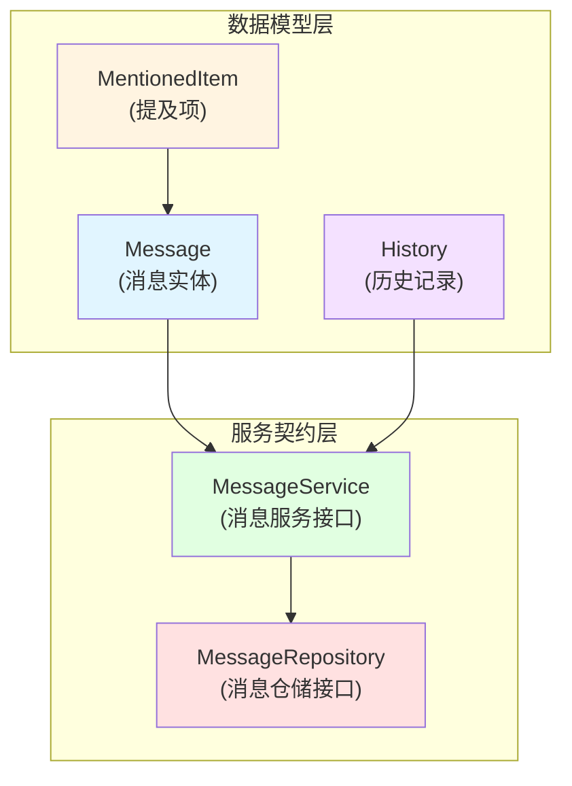

# message_history_and_mentions_contracts 模块深度解析

## 模块概述

想象一下，你正在与一个智能助手进行对话。你问了一个问题，助手回答了，引用了一些文档；然后你接着问了另一个问题，助手记得之前的对话内容；有时候你还会在问题中明确提及某个知识库或文件。这个模块就是专门负责记录和管理这一切的。

**核心问题**：如何可靠地存储和检索对话历史，同时精确追踪用户提及的资源以及系统使用的知识来源？

**解决方案**：该模块定义了一套完整的数据模型和接口契约，用于表示消息、提及项、对话历史，并提供标准化的服务层和仓储层接口。它不仅仅是数据结构的定义，更是整个对话系统的"记忆基础设施"。

## 架构概览



### 架构解读

这个模块采用了清晰的分层设计：

1. **数据模型层**：定义了三个核心实体
   - `Message`：对话消息的完整表示，包含内容、角色、引用等
   - `MentionedItem`：用户在消息中 @提及 的知识库或文件
   - `History`：简化的历史记录视图，用于上下文传递

2. **服务契约层**：定义了两层接口
   - `MessageService`：业务逻辑层接口，提供消息的 CRUD 操作
   - `MessageRepository`：数据访问层接口，继承自服务接口并扩展了特定功能

这种设计的关键在于**接口与实现分离**。该模块只定义"是什么"和"应该能做什么"，而不关心"怎么做"，这使得不同的实现可以无缝替换。

## 核心设计理念

### 1. 数据的双重视角：完整存储 vs 精简使用

你可能注意到了模块中同时存在 `Message` 和 `History` 两个结构。这不是重复，而是**数据的双重视角**设计：

- `Message` 是**存储视角**：包含所有元数据（ID、时间戳、软删除标记、Agent 执行步骤等），适合持久化
- `History` 是**使用视角**：只保留查询-回答对和知识引用，适合传递给 LLM 作为上下文

**设计权衡**：
- ✅ 优势：存储完整信息供审计和展示，同时给 LLM 提供精简上下文避免冗余
- ⚠️ 代价：需要维护两种数据结构的一致性，增加了转换逻辑

### 2. JSON 字段的优雅处理：Driver.Valuer + sql.Scanner

观察 `MentionedItems` 和 `AgentSteps` 类型，你会发现它们都实现了 `driver.Valuer` 和 `sql.Scanner` 接口。这是 Go 中处理复杂类型数据库存储的经典模式。

```go
// 简化的概念示意
type MentionedItems []MentionedItem

// 写入数据库时序列化为 JSON
func (m MentionedItems) Value() (driver.Value, error) {
    return json.Marshal(m)
}

// 从数据库读取时反序列化
func (m *MentionedItems) Scan(value interface{}) error {
    return json.Unmarshal(value.([]byte), m)
}
```

**为什么这样设计？**
- 🎯 保持 Go 代码中的类型安全（可以直接操作 `[]MentionedItem`）
- 🎯 利用数据库的 JSON/JSONB 类型支持灵活查询
- 🎯 封装序列化细节，上层代码无需感知

### 3. AgentSteps 的"冗余"存储策略

注意 `Message` 结构中的这行注释：
> Stored for user history display, but NOT included in LLM context to avoid redundancy

这是一个经过深思熟虑的设计决策：

- **存储但不使用**：Agent 的完整推理步骤被保存下来，用于在 UI 上展示给用户看
- **上下文排除**：但在构建 LLM 上下文时，这些步骤不会被包含进去，因为：
  1. LLM 已经知道自己是如何推理的（这就是它生成的）
  2. 避免占用宝贵的上下文窗口
  3. 减少 token 消耗

这体现了**为不同受众优化数据**的设计思想。

### 4. 接口继承：MessageRepository extends MessageService

`MessageRepository` 接口嵌入了 `MessageService`，这是一个有趣的设计：

```go
type MessageRepository interface {
    MessageService  // 继承所有服务接口方法
    GetFirstMessageOfUser(ctx context.Context, sessionID string) (*types.Message, error)
}
```

**设计意图**：
- 仓储层是服务层的超集——它可以做服务层能做的一切，还能做更多
- 这种设计使得仓储实现可以直接被当作服务使用（在简单场景下）
- 扩展方法（如 `GetFirstMessageOfUser`）是数据访问特有的，不属于通用业务逻辑

## 数据流程分析

让我们追踪一条消息从创建到检索的完整生命周期：

### 消息创建流程

```
用户输入 
  → 构造 Message 对象（设置 Content、Role、SessionID、MentionedItems）
  → 调用 MessageService.CreateMessage()
  → BeforeCreate 钩子触发（生成 UUID、初始化切片）
  → MessageRepository 实现持久化到数据库
  → 返回保存后的 Message（带有 ID、CreatedAt 等）
```

**关键点**：`BeforeCreate` 钩子确保了即使调用者忘记初始化某些字段，数据也能保持完整性。

### 历史消息检索流程

```
需要构建 LLM 上下文
  → 调用 MessageService.GetRecentMessagesBySession(sessionID, limit)
  → 仓储层按时间倒序查询数据库
  → 返回 Message 列表
  → （可选）转换为 History 列表传递给 LLM
```

**关键点**：注意 `GetRecentMessagesBySession` 和 `GetMessagesBySessionBeforeTime` 这两个方法，它们支持不同的历史检索策略——前者适合简单的"最近 N 条"，后者适合更复杂的时间窗口或断点续传场景。

## 设计权衡与决策

### 决策 1：软删除 vs 硬删除

**选择**：使用 `gorm.DeletedAt` 实现软删除

**权衡分析**：
- ✅ 可恢复性：误删的消息可以找回
- ✅ 审计追踪：保留完整的历史记录
- ⚠️ 存储膨胀：已删除的数据仍然占用空间
- ⚠️ 查询复杂度：需要在查询时过滤已删除记录（GORM 会自动处理）

**为什么这样选**：在对话系统中，数据的完整性通常比存储空间更重要。

### 决策 2：JSONB vs 单独关联表

**选择**：使用 JSONB 存储 `AgentSteps`、`MentionedItems`、`KnowledgeReferences`

**替代方案**：为这些集合创建单独的数据库表，通过外键关联

**权衡分析**：

| 维度 | JSONB 方案 | 关联表方案 |
|------|-----------|-----------|
| 查询灵活性 | 支持 JSON 查询，但有限 | 完全灵活的 SQL 查询 |
| 写入性能 | 单次写入，快 | 多次写入，慢 |
| 一致性 | 单条记录，原子性 | 需要事务保证 |
|  schema 演化 | 灵活，无需迁移 | 需要 ALTER TABLE |

**为什么选择 JSONB**：
- 这些集合通常是"写一次，读多次"的模式
- 查询需求相对简单（通常只是整体读取）
- 消息创建的性能至关重要
- schema 可能随 Agent 能力变化而频繁调整

### 决策 3：ID 生成策略

**选择**：使用 UUID 在应用层生成 ID（`BeforeCreate` 钩子中）

**替代方案**：数据库自增 ID

**权衡分析**：
- ✅ UUID：分布式友好，无需数据库往返，可以在创建前就知道 ID
- ⚠️ UUID：索引效率略低，占用空间更大（36字符 vs 整数）
- ✅ 自增 ID：紧凑，索引高效，有序
- ⚠️ 自增 ID：需要数据库生成，分布式环境复杂

**为什么选择 UUID**：现代系统的分布式特性通常比存储效率更重要。

## 子模块说明

该模块包含三个紧密相关的子模块：

1. **[message_entities_and_mention_items](core_domain_types_and_interfaces-agent_conversation_and_runtime_contracts-message_history_and_mentions_contracts-message_entities_and_mention_items.md)**
   - 负责定义消息实体和提及项的数据结构
   - 包含 `Message`、`MentionedItem` 等核心类型
   - 实现了数据库序列化/反序列化逻辑

2. **[conversation_history_aggregate_models](core_domain_types_and_interfaces-agent_conversation_and_runtime_contracts-message_history_and_mentions_contracts-conversation_history_aggregate_models.md)**
   - 定义对话历史的聚合模型
   - 包含 `History` 类型，用于上下文传递
   - 关注于历史记录的业务语义而非存储细节

3. **[message_service_and_repository_contracts](core_domain_types_and_interfaces-agent_conversation_and_runtime_contracts-message_history_and_mentions_contracts-message_service_and_repository_contracts.md)**
   - 定义消息服务和仓储的接口契约
   - 包含 `MessageService` 和 `MessageRepository` 接口
   - 建立了消息管理的标准操作集

## 与其他模块的关系

### 依赖方向

```
message_history_and_mentions_contracts
    ↓ 被依赖
session_lifecycle_and_conversation_controls_contracts
    ↓ 被依赖
agent_conversation_and_runtime_contracts
```

### 关键交互

1. **与 [session_lifecycle_and_conversation_controls_contracts](core_domain_types_and_interfaces-agent_conversation_and_runtime_contracts-session_lifecycle_and_conversation_controls_contracts.md)**
   - Session 聚合根持有 Message 集合
   - 会话生命周期管理会触发消息的创建和查询

2. **与 [chat_pipeline_plugins_and_flow](application_services_and_orchestration-chat_pipeline_plugins_and_flow.md)**
   - `history_context_loading` 插件使用本模块的接口加载历史消息
   - 消息中的 `KnowledgeReferences` 被检索插件使用

3. **与 [conversation_history_repositories](data_access_repositories-content_and_knowledge_management_repositories-conversation_history_repositories.md)**
   - 该模块实现了 `MessageRepository` 接口
   - 是本模块契约的具体实现者

## 新贡献者指南

### 常见陷阱

1. **忘记初始化切片字段**
   ```go
   // ❌ 错误：可能导致 nil 序列化问题
   msg := &types.Message{Content: "hello", Role: "user"}
   
   // ✅ 正确：显式初始化或依赖 BeforeCreate
   msg := &types.Message{
       Content:           "hello", 
       Role:              "user",
       KnowledgeReferences: make(types.References, 0),
       // ...
   }
   ```

2. **混淆 Message 和 History 的使用场景**
   - 存储和展示：用 `Message`
   - 构建 LLM 上下文：考虑用 `History`（或筛选后的 Message）

3. **修改接口时的兼容性**
   - `MessageService` 是核心契约，修改前确认所有实现者都能更新
   - 优先考虑添加新方法而非修改现有方法签名

### 扩展建议

1. **需要添加新的消息元数据？**
   - 考虑是否真的需要每个人都携带这个字段
   - 如果是可选的，考虑放在 JSON 字段中而非顶级字段

2. **需要更复杂的查询？**
   - 先评估是否真的需要——大多数场景"最近 N 条"足够
   - 如果确实需要，在 `MessageRepository` 中添加新方法，不要修改 `MessageService`

3. **需要支持不同的存储后端？**
   - 实现 `MessageRepository` 接口即可，上层代码无需改动
   - 利用 `MentionedItems` 等类型已有的序列化逻辑

## 总结

`message_history_and_mentions_contracts` 模块是整个对话系统的"记忆核心"。它看似只是定义了一些数据结构和接口，但实际上体现了许多深思熟虑的设计决策：

- **双重视角**的数据模型（存储 vs 使用）
- **优雅的类型映射**（Go 类型 ↔ JSONB）
- **有选择的冗余**（存储 Agent 步骤但不传给 LLM）
- **接口驱动**的设计（契约与实现分离）

理解这些设计决策背后的"为什么"，比单纯记住"是什么"更重要。这将帮助你在使用和扩展这个模块时，做出与原作者意图一致的决策。
