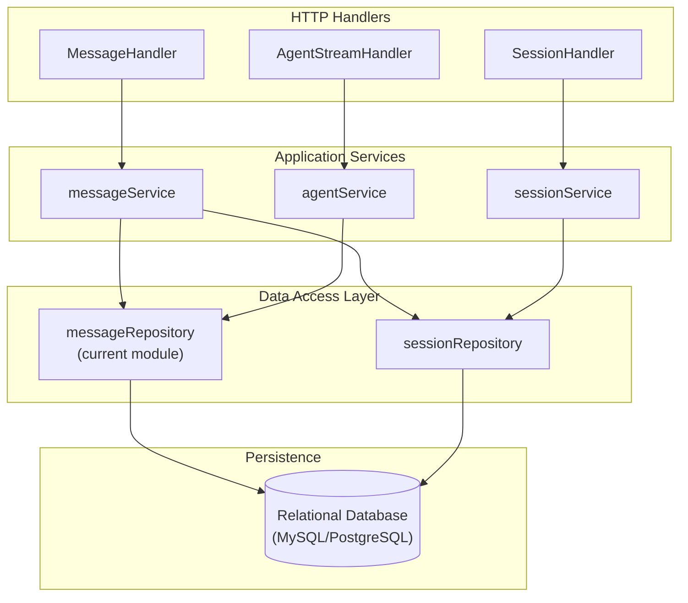
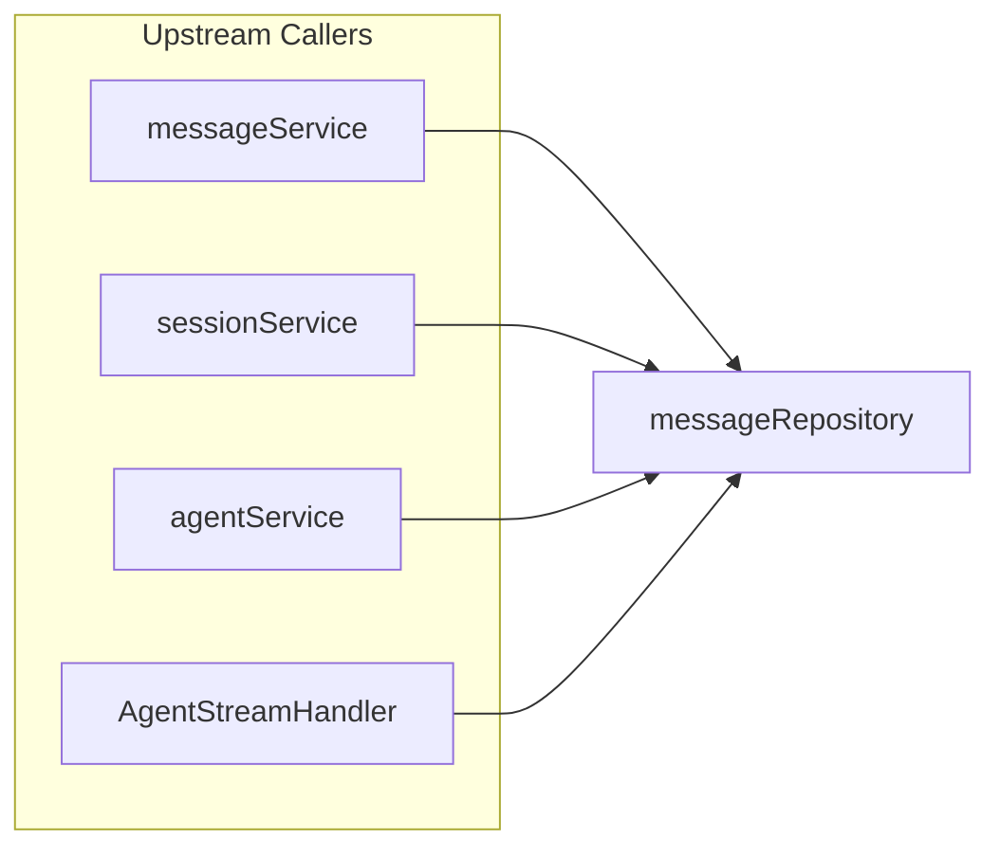

# Message History and Trace Persistence

## 概述

想象你正在与一个 AI 助手进行多轮对话。每一句你说过的话、助手每一次的思考过程、每一个调用的工具、每一处引用的知识库片段——这些都需要被可靠地保存下来，以便后续回溯、展示和上下文构建。`message_history_and_trace_persistence` 模块正是承担这一职责的核心持久化层。

这个模块的本质是一个**会话消息的仓储实现**（Repository Pattern），它解决了以下关键问题：

1. **对话状态的持久化**：用户与 Agent 的多轮对话需要跨越请求边界保持一致性，naive 的内存存储无法应对服务重启或水平扩展
2. **Agent 执行轨迹的完整记录**：与传统聊天不同，Agent 的思考过程（Thought）、工具调用（Tool Calls）、知识引用（Knowledge References）需要被结构化存储，而非简单的文本消息
3. **高效的上下文检索**：LLM 需要历史对话作为上下文，但全量加载会超出 token 限制，模块提供了多种检索策略（分页、时间窗口、最近 N 条）
4. **会话隔离与数据一致性**：每条消息必须正确归属到会话，删除操作需要级联约束，软删除支持数据恢复

模块采用 GORM 作为 ORM 层，底层存储为关系型数据库（MySQL/PostgreSQL），通过仓储模式向上层服务提供统一的接口抽象。

---

## 架构与数据流



### 架构角色解析

**模块定位**：这是典型的**仓储层（Repository Layer）**，位于领域服务之下、数据库之上。它的职责非常聚焦：

- ✅ **做什么**：消息的 CRUD 操作、会话维度的消息查询、时间窗口检索
- ❌ **不做什么**：业务逻辑校验、会话生命周期管理、消息内容生成

**数据流向**（以用户发送消息为例）：

1. `MessageHandler` 接收 HTTP 请求，解析消息内容
2. `messageService` 执行业务逻辑（验证会话存在性、构建消息对象）
3. `messageRepository.CreateMessage()` 将消息写入数据库
4. 对于 Agent 回复，`agentService` 会调用 `UpdateMessage()` 更新 `agent_steps` 和 `knowledge_references` 字段

**关键依赖关系**：

| 调用方 | 被调用方法 | 使用场景 |
|--------|-----------|---------|
| `messageService` | 全部方法 | 消息 CRUD 操作的主要入口 |
| `sessionService` | `GetMessagesBySession()` | 获取会话历史用于上下文构建 |
| `agentService` | `CreateMessage()`, `UpdateMessage()` | 记录 Agent 执行轨迹 |
| `AgentStreamHandler` | `GetMessageByRequestID()` | 流式响应时追踪请求状态 |

---

## 核心组件深度解析

### `messageRepository` 结构体

```go
type messageRepository struct {
    db *gorm.DB
}
```

这是模块的唯一核心组件，一个无状态的仓储实现。它仅持有一个 GORM 数据库连接句柄，所有方法都是纯函数式的（无内部状态依赖），这使得它在并发环境下是安全的，可以被多个 goroutine 共享使用。

**设计意图**：为什么是结构体而不是包级函数？

1. **接口实现**：需要实现 `interfaces.MessageRepository` 接口，结构体是 Go 中实现接口的标准方式
2. **依赖注入**：通过构造函数 `NewMessageRepository()` 注入数据库连接，便于测试时替换为 mock
3. **扩展性**：未来若需要添加缓存层、连接池等状态，结构体提供了扩展点

---

### 方法详解

#### `CreateMessage(ctx, message)`

**职责**：将新消息持久化到数据库

**内部机制**：
```go
func (r *messageRepository) CreateMessage(ctx context.Context, message *types.Message) (*types.Message, error) {
    if err := r.db.WithContext(ctx).Create(message).Error; err != nil {
        return nil, err
    }
    return message, nil
}
```

这是一个典型的 GORM 创建操作，但有几个关键设计点：

1. **上下文传递**：`WithContext(ctx)` 确保数据库操作可被取消，避免长尾请求占用连接
2. **原地返回**：返回传入的 `message` 指针而非副本，减少内存分配（调用方已持有该对象）
3. **主键生成**：`types.Message.ID` 是 `varchar(36)`，预期调用方在传入前已生成 UUID

**调用时机**：
- 用户发送消息时立即创建（`role="user"`）
- Agent 开始响应时先创建占位消息（`role="assistant"`, `is_completed=false`）
- 流式响应完成后更新 `is_completed=true`

**潜在陷阱**：如果 `message.ID` 已存在，GORM 会报错而非更新。调用方需确保 ID 唯一性。

---

#### `GetMessage(ctx, sessionID, messageID)`

**职责**：获取单条消息，带会话隔离校验

**内部机制**：
```go
func (r *messageRepository) GetMessage(ctx context.Context, sessionID string, messageID string) (*types.Message, error) {
    var message types.Message
    if err := r.db.WithContext(ctx).Where(
        "id = ? AND session_id = ?", messageID, sessionID,
    ).First(&message).Error; err != nil {
        return nil, err
    }
    return &message, nil
}
```

**关键设计**：`WHERE id = ? AND session_id = ?` 是**防御性编程**的体现。

为什么不只用 `id` 查询？因为：
1. **会话隔离**：防止通过遍历 `messageID` 跨会话窃取消息（ID 可能是可猜测的 UUID）
2. **数据一致性**：确保消息确实属于该会话，避免业务逻辑错误

**返回值约定**：如果消息不存在，返回 `gorm.ErrRecordNotFound` 错误（调用方需用 `errors.Is()` 判断）。

---

#### `GetMessagesBySession(ctx, sessionID, page, pageSize)`

**职责**：分页获取会话的全部消息，按时间正序排列

**内部机制**：
```go
func (r *messageRepository) GetMessagesBySession(
    ctx context.Context, sessionID string, page int, pageSize int,
) ([]*types.Message, error) {
    var messages []*types.Message
    if err := r.db.WithContext(ctx).Where("session_id = ?", sessionID).Order("created_at ASC").
        Offset((page - 1) * pageSize).Limit(pageSize).Find(&messages).Error; err != nil {
        return nil, err
    }
    return messages, nil
}
```

**设计权衡**：

| 选择 | 理由 |
|------|------|
| `created_at ASC` | 历史消息展示需要时间正序（旧→新） |
| 1-based 页码 | `(page - 1) * pageSize` 符合前端分页习惯 |
| 返回切片指针 | `[]*types.Message` 避免大对象拷贝，消息体可能包含大量 `agent_steps` |

**性能考虑**：当会话消息量达到数千条时，深分页（`page=1000`）会导致 `OFFSET` 扫描大量行。对于超大会话，建议改用 `GetMessagesBySessionBeforeTime()` 基于时间游标分页。

---

#### `GetRecentMessagesBySession(ctx, sessionID, limit)`

**职责**：获取最近 N 条消息，用于 LLM 上下文构建

**内部机制**：
```go
func (r *messageRepository) GetRecentMessagesBySession(
    ctx context.Context, sessionID string, limit int,
) ([]*types.Message, error) {
    var messages []*types.Message
    if err := r.db.WithContext(ctx).Where(
        "session_id = ?", sessionID,
    ).Order("created_at DESC").Limit(limit).Find(&messages).Error; err != nil {
        if err == gorm.ErrRecordNotFound {
            return nil, nil  // 空会话不是错误
        }
        return nil, err
    }
    // 关键：重新按时间正序排序，并处理同时刻消息的角色优先级
    slices.SortFunc(messages, func(a, b *types.Message) int {
        cmp := a.CreatedAt.Compare(b.CreatedAt)
        if cmp == 0 {
            if a.Role == "user" {  // 用户消息优先
                return -1
            }
            return 1
        }
        return cmp
    })
    return messages, nil
}
```

**这是整个模块最复杂的方法**，包含两个关键设计：

**1. 为什么先 `DESC` 查询再 `ASC` 排序？**

数据库按 `created_at DESC` 取最近 N 条最高效（利用索引），但 LLM 上下文需要时间正序。在内存中重排序的代价（O(n log n)，n 通常≤50）远小于数据库的 `ORDER BY ASC` + `OFFSET` 组合。

**2. 同时刻消息的角色优先级逻辑**

```go
if a.Role == "user" {
    return -1  // 用户消息排前面
}
return 1       // 助手消息排后面
```

这解决了一个边界情况：**当用户消息和助手回复在同一秒创建时**（高并发场景可能出现），确保用户消息在前。这是因为：
- LLM 上下文必须是交替的 `user→assistant` 对话
- 如果顺序颠倒，模型会混淆对话逻辑

**空会话处理**：`ErrRecordNotFound` 被转换为 `nil, nil`（无错误、空列表），这是**语义化错误处理**的体现——空会话是正常状态，不应报错。

---

#### `GetMessagesBySessionBeforeTime(ctx, sessionID, beforeTime, limit)`

**职责**：基于时间游标的消息检索，用于深会话的分页加载

**内部机制**：与 `GetRecentMessagesBySession` 类似，但增加了 `created_at < beforeTime` 条件。

**使用场景**：
```
用户滚动到会话顶部 → 前端加载更早的消息
→ 调用此方法，beforeTime=最早消息的 created_at
→ 避免 OFFSET 深分页的性能问题
```

**时间复杂度对比**：
- `GetMessagesBySession(page=1000)`：O(1000 × pageSize) 行扫描
- `GetMessagesBySessionBeforeTime()`：O(pageSize) 索引查找

---

#### `UpdateMessage(ctx, message)`

**职责**：更新消息内容（主要用于 Agent 响应完成后的状态更新）

**内部机制**：
```go
func (r *messageRepository) UpdateMessage(ctx context.Context, message *types.Message) error {
    return r.db.WithContext(ctx).Model(&types.Message{}).Where(
        "id = ? AND session_id = ?", message.ID, message.SessionID,
    ).Updates(message).Error
}
```

**关键更新字段**：
- `is_completed`: 流式响应完成后标记为 `true`
- `agent_steps`: Agent 执行轨迹（思考、工具调用）
- `knowledge_references`: 引用的知识片段
- `content`: 流式累积的完整回复内容

**并发安全**：GORM 的 `Updates()` 是原子操作，但如果有多个 goroutine 同时更新同一消息（如并行工具执行），需要调用方加锁。

---

#### `DeleteMessage(ctx, sessionID, messageID)`

**职责**：软删除消息（设置 `deleted_at` 时间戳）

**内部机制**：GORM 的软删除通过 `gorm.DeletedAt` 字段实现，查询时自动添加 `deleted_at IS NULL` 条件。

**设计意图**：为什么是软删除？
1. **数据恢复**：误删后可通过清除 `deleted_at` 恢复
2. **审计追踪**：保留删除记录用于合规审计
3. **外键约束**：避免硬删除导致关联数据（如评价记录）悬空

**注意**：调用方需注意 GORM 的软删除行为——`Find()` 不会返回已删除记录，但 `Unscoped().Find()` 会。

---

#### `GetFirstMessageOfUser(ctx, sessionID)`

**职责**：获取用户在会话中的第一条消息，用于自动生成会话标题

**内部机制**：
```go
func (r *messageRepository) GetFirstMessageOfUser(ctx context.Context, sessionID string) (*types.Message, error) {
    var message types.Message
    if err := r.db.WithContext(ctx).Where(
        "session_id = ? and role = ?", sessionID, "user",
    ).Order("created_at ASC").First(&message).Error; err != nil {
        return nil, err
    }
    return &message, nil
}
```

**使用场景**：`sessionService` 在创建会话后异步调用此方法，提取用户首句消息的前 20 个字符作为会话标题（"关于 XXX 的咨询"）。

**性能优化**：`role = 'user'` 条件可利用复合索引 `(session_id, role, created_at)` 加速。

---

#### `GetMessageByRequestID(ctx, sessionID, requestID)`

**职责**：通过请求 ID 追踪消息，用于流式响应的状态查询

**内部机制**：
```go
func (r *messageRepository) GetMessageByRequestID(
    ctx context.Context, sessionID string, requestID string,
) (*types.Message, error) {
    var message types.Message
    result := r.db.WithContext(ctx).
        Where("session_id = ? AND request_id = ?", sessionID, requestID).
        First(&message)
    
    if result.Error != nil {
        if result.Error == gorm.ErrRecordNotFound {
            return nil, nil  // 消息尚未创建，不是错误
        }
        return nil, result.Error
    }
    return &message, nil
}
```

**设计背景**：在流式响应场景中：
1. 客户端发起 SSE 请求，生成 `requestID`
2. `AgentStreamHandler` 创建消息时记录 `requestID`
3. 客户端轮询 `/messages?request_id=xxx` 查询消息状态
4. 此方法支持通过 `requestID` 而非 `messageID` 查询（客户端此时还不知道 `messageID`）

**返回值约定**：与 `GetRecentMessagesBySession` 一致，`ErrRecordNotFound` 转换为 `nil, nil`。

---

## 数据模型详解

### `types.Message` 结构

```go
type Message struct {
    ID                 string         // UUID 主键
    SessionID          string         // 所属会话 ID
    RequestID          string         // 请求追踪 ID
    Content            string         // 消息文本
    Role               string         // "user" | "assistant" | "system"
    KnowledgeReferences References   // JSON 存储的知识引用
    AgentSteps         AgentSteps     // JSONB 存储的 Agent 执行轨迹
    MentionedItems     MentionedItems // JSONB 存储的@提及项
    IsCompleted        bool           // 生成完成标志
    CreatedAt          time.Time
    UpdatedAt          time.Time
    DeletedAt          gorm.DeletedAt // 软删除
}
```

**字段设计洞察**：

| 字段 | 类型选择 | 设计理由 |
|------|---------|---------|
| `KnowledgeReferences` | `json` | 只读查询，无需 JSONB 的索引能力 |
| `AgentSteps` | `jsonb` | 可能需要查询特定工具调用，JSONB 支持路径查询 |
| `MentionedItems` | `jsonb` | 同上，支持按提及的知识库 ID 过滤 |
| `ID` | `varchar(36)` | UUID 字符串，避免自增 ID 的信息泄露风险 |

**AgentSteps 的特殊性**：
```go
type AgentSteps []AgentStep
type AgentStep struct {
    Iteration int
    Thought   string     // LLM 思考过程
    ToolCalls []ToolCall // 工具调用列表
    Timestamp time.Time
}
```

这是 Agent 与普通聊天的核心区别——每一步的思考都被完整记录。但注意注释中的关键说明：

> Stored for user history display, but NOT included in LLM context to avoid redundancy

**设计权衡**：`AgentSteps` 仅用于前端展示（让用户看到 Agent 的思考过程），但构建 LLM 上下文时会过滤掉，因为：
1. **Token 效率**：思考过程已体现在最终回复中，重复输入浪费 token
2. **模型混淆**：历史思考过程可能干扰当前对话的推理

---

## 依赖分析

### 上游依赖（谁调用本模块）



**调用频率热点**：
1. `GetRecentMessagesBySession()` - 每次 LLM 调用前都会执行（最高频）
2. `CreateMessage()` - 每条用户消息和 Agent 回复各一次
3. `UpdateMessage()` - 流式响应中可能多次更新（累积内容、更新步骤）

### 下游依赖（本模块调用谁）

本模块**仅依赖 GORM**，无其他内部模块依赖。这是仓储层的典型特征——它是依赖图的叶子节点。

**数据库 Schema 约束**：
- 外键：`session_id` 逻辑外键（无数据库级 FK 约束，由应用层保证）
- 索引：`deleted_at`（软删除）、预期有 `(session_id, created_at)` 复合索引

---

## 设计决策与权衡

### 1. 仓储模式 vs 主动记录模式

**选择**：仓储模式（Repository Pattern）

```go
// 仓储模式（当前实现）
repo := NewMessageRepository(db)
messages, _ := repo.GetMessagesBySession(ctx, sessionID, page, pageSize)

// 主动记录模式（未采用）
messages, _ := types.Message{}.FindBySessionID(sessionID)
```

**理由**：
- ✅ **可测试性**：接口 `interfaces.MessageRepository` 可轻松 mock
- ✅ **依赖倒置**：服务层依赖接口而非具体实现
- ✅ **单一职责**：消息模型只定义数据结构，不包含持久化逻辑

**代价**：需要额外的接口定义和构造函数，代码量略增。

---

### 2. 软删除 vs 硬删除

**选择**：软删除（`gorm.DeletedAt`）

**理由**：
- ✅ **数据恢复**：运营误删后可快速恢复
- ✅ **审计合规**：保留删除记录用于追溯
- ✅ **关联完整性**：避免评价记录、分享记录等关联数据悬空

**代价**：
- ❌ **存储增长**：删除的数据仍占用空间（需定期归档）
- ❌ **查询复杂度**：需确保所有查询都尊重软删除（GORM 自动处理）

---

### 3. JSON vs JSONB 字段类型

**选择**：混合使用

| 字段 | 类型 | 理由 |
|------|------|------|
| `knowledge_references` | `json` | 只读展示，无需索引 |
| `agent_steps` | `jsonb` | 可能需要查询特定工具调用 |
| `mentioned_items` | `jsonb` | 可能需要按提及的 KB ID 过滤 |

**权衡**：JSONB 写入时解析开销更大，但支持索引和路径查询。对于读多写少的场景（消息创建后很少更新），JSONB 的查询优势更明显。

---

### 4. 内存排序 vs 数据库排序

**选择**：`GetRecentMessagesBySession()` 在内存中重排序

**理由**：
- 数据库按 `DESC` 取最近 N 条利用索引最高效
- 内存排序 O(n log n) 对于 n≤50 可忽略不计
- 避免数据库 `ORDER BY ASC` + `LIMIT` 的 filesort

**边界情况**：如果 `limit` 增大到数百条，应重新评估此设计。

---

### 5. 会话隔离校验

**选择**：所有查询都带 `session_id` 条件

**理由**：
- **安全**：防止 ID 遍历攻击
- **一致性**：确保消息归属正确

**代价**：查询条件略复杂，但这是必要的安全开销。

---

## 使用指南

### 基本用法

```go
// 1. 创建仓库（通常在应用启动时）
repo := repository.NewMessageRepository(db)

// 2. 创建消息
msg := &types.Message{
    ID:        uuid.New().String(),
    SessionID: sessionID,
    RequestID: requestID,
    Content:   "你好",
    Role:      "user",
}
created, err := repo.CreateMessage(ctx, msg)

// 3. 获取会话历史（用于 LLM 上下文）
recent, err := repo.GetRecentMessagesBySession(ctx, sessionID, 20)

// 4. 更新 Agent 回复
msg.Content = "完整的回复内容"
msg.AgentSteps = agentSteps
msg.IsCompleted = true
err = repo.UpdateMessage(ctx, msg)

// 5. 分页加载历史消息
messages, err := repo.GetMessagesBySession(ctx, sessionID, page, pageSize)
```

### 时间游标分页模式

```go
// 首次加载
messages, _ := repo.GetRecentMessagesBySession(ctx, sessionID, 50)
earliestTime := messages[0].CreatedAt

// 加载更多（用户滚动到顶部）
older, _ := repo.GetMessagesBySessionBeforeTime(ctx, sessionID, earliestTime, 50)
```

### 错误处理最佳实践

```go
msg, err := repo.GetMessage(ctx, sessionID, messageID)
if err != nil {
    if errors.Is(err, gorm.ErrRecordNotFound) {
        // 消息不存在，返回 404
        return nil, http.ErrNotFound
    }
    // 其他数据库错误
    return nil, err
}
```

---

## 边界情况与陷阱

### 1. 空会话的返回值不一致

**问题**：
- `GetMessage()` 返回 `ErrRecordNotFound`
- `GetRecentMessagesBySession()` 返回 `nil, nil`
- `GetMessageByRequestID()` 返回 `nil, nil`

**建议**：调用方需统一处理——使用 `errors.Is(err, gorm.ErrRecordNotFound)` 判断，而非直接检查 `err != nil`。

---

### 2. 同时刻消息的角色顺序

**场景**：高并发下，用户消息和助手回复可能在同一秒创建。

**当前处理**：`GetRecentMessagesBySession()` 和 `GetMessagesBySessionBeforeTime()` 都有角色优先级逻辑。

**陷阱**：`GetMessagesBySession()` **没有**此逻辑！如果分页加载时遇到同时刻消息，顺序可能颠倒。

**修复建议**：在 `GetMessagesBySession()` 中也添加相同的排序逻辑，或确保 `created_at` 有毫秒级精度。

---

### 3. 软删除的级联影响

**问题**：删除消息后，关联的评价记录、分享记录仍指向该消息。

**当前状态**：无级联删除逻辑，需手动处理关联数据。

**建议**：在 `messageService` 中添加级联删除逻辑，或添加数据库级外键约束（`ON DELETE CASCADE`）。

---

### 4. AgentSteps 的序列化开销

**问题**：`AgentSteps` 是嵌套 JSON 结构，深度序列化和反序列化可能成为性能瓶颈。

**优化建议**：
- 对于超长对话，考虑压缩存储（gzip）
- 或分离存储：消息表只存摘要，详细步骤存单独表

---

### 5. 深分页性能

**问题**：`GetMessagesBySession(page=10000)` 会扫描大量行。

**当前缓解**：提供 `GetMessagesBySessionBeforeTime()` 作为替代。

**建议**：在文档中明确推荐时间游标分页，或在 `page > 100` 时自动切换策略。

---

## 扩展点

### 添加新的查询方法

遵循现有模式：
```go
func (r *messageRepository) GetMessagesByRole(
    ctx context.Context, sessionID string, role string,
) ([]*types.Message, error) {
    var messages []*types.Message
    err := r.db.WithContext(ctx).
        Where("session_id = ? AND role = ?", sessionID, role).
        Order("created_at ASC").
        Find(&messages).Error
    return messages, err
}
```

### 添加缓存层

在仓储层之上添加缓存：
```go
type cachedMessageRepository struct {
    repo  interfaces.MessageRepository
    cache *redis.Client
}

func (r *cachedMessageRepository) GetRecentMessagesBySession(
    ctx context.Context, sessionID string, limit int,
) ([]*types.Message, error) {
    // 先查缓存
    cached, _ := r.cache.Get(ctx, cacheKey).Result()
    if cached != nil {
        return unmarshal(cached), nil
    }
    // 缓存未命中，查数据库
    messages, err := r.repo.GetRecentMessagesBySession(ctx, sessionID, limit)
    if err == nil {
        r.cache.Set(ctx, cacheKey, marshal(messages), 5*time.Minute)
    }
    return messages, err
}
```

---

## 相关模块

- [Session Lifecycle Persistence](session_lifecycle_persistence.md) - 会话仓储，与消息仓储配合使用
- [Message Service](message_service.md) - 消息服务层，封装业务逻辑
- [Agent Conversation API](agent_conversation_api.md) - Agent 对话接口，消息的主要生产者
- [LLM Context Management](llm_context_management.md) - 上下文管理，消息的主要消费者

---

## 总结

`message_history_and_trace_persistence` 模块是一个设计精良的仓储实现，它：

1. **职责单一**：专注于消息的持久化，不包含业务逻辑
2. **接口清晰**：通过 `interfaces.MessageRepository` 定义明确契约
3. **性能友好**：提供多种检索策略应对不同场景
4. **安全考虑**：会话隔离、软删除、上下文传递

主要改进空间在于：
- 统一空值返回约定
- 完善深分页策略
- 考虑缓存层优化高频查询

对于新贡献者，理解本模块的关键是把握其**仓储层定位**——它是数据的守门人，而非业务的决策者。
