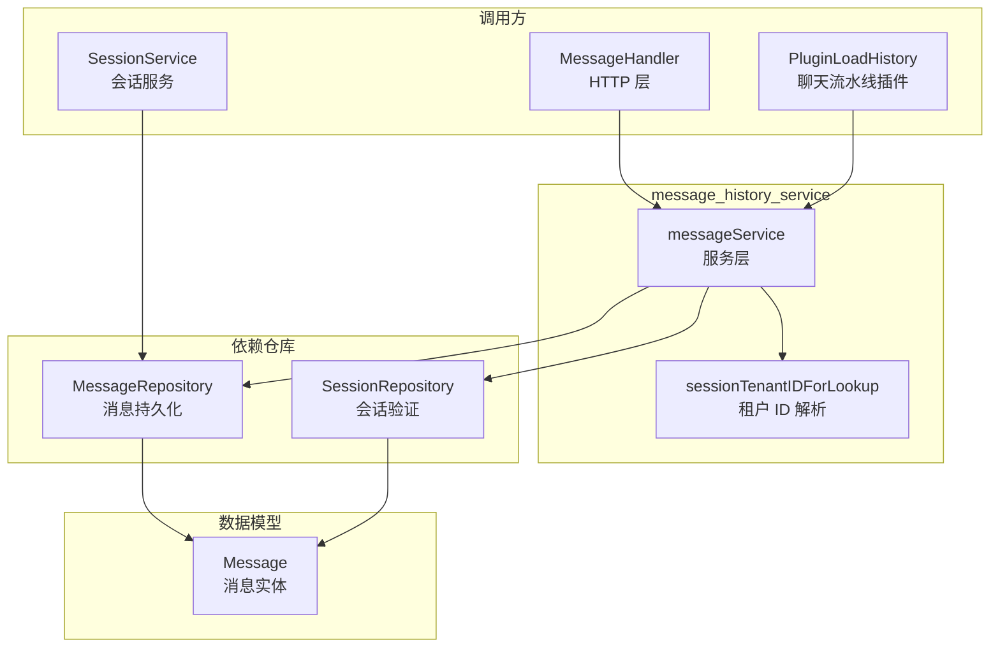

# message_history_service 模块深度解析

## 模块概述

想象一下你在设计一个聊天系统 —— 最直观的想法可能是"用户发消息就存起来，需要时再读出来"。但真正落地时，问题远比这复杂：**消息属于谁**（租户隔离）

`message_history_service` 模块正是为了解决这些问题而生。它不是简单的 CRUD 封装，而是**会话消息的生命周期管家** —— 确保每条消息都归属于有效的会话、正确的租户，并提供多种检索策略来支撑不同的使用场景（分页加载、时间轴回溯、最近 N 条快速加载）。它的核心设计洞察是：**消息不能独立存在，必须始终在会话的上下文中被管理**，因此所有操作都强制进行会话存在性校验，从源头杜绝"孤儿消息"的产生。

## 架构与数据流



### 架构角色解析

`message_history_service` 在整个系统中扮演**服务层协调者**的角色：

1. **对上游**（HTTP Handler、聊天流水线插件）：提供统一的消息操作接口，屏蔽底层存储细节
2. **对下游**（Repository）：封装业务规则（如会话校验、租户隔离），确保只有合法的操作能到达数据层
3. **横向协作**：与 [`session_service`](session_service.md) 共享 `SessionRepository`，保持会话验证逻辑的一致性

### 关键数据流：消息创建链路

```
用户请求 → MessageHandler.CreateMessage 
         → messageService.CreateMessage 
         → 从 Context 提取 TenantID 
         → SessionRepository.Get(验证会话存在)
         → MessageRepository.CreateMessage(持久化)
         → 返回创建的消息
```

这个链路中，**会话验证是必经关卡** —— 如果会话不存在，消息创建会在服务层被拦截，不会污染数据层。

## 核心组件深度解析

### messageService 结构体

```go
type messageService struct {
    messageRepo interfaces.MessageRepository
    sessionRepo interfaces.SessionRepository
}
```

这是典型的**依赖注入模式**实现。两个仓库依赖各有分工：
- `messageRepo`：负责消息的 CRUD 操作，是真正的数据访问层
- `sessionRepo`：负责会话存在性校验，是业务规则的守门人

**为什么不在 Repository 层做会话校验**？这是一个关键的设计权衡。Repository 层应该专注于单一实体的持久化逻辑，而"消息必须属于有效会话"是跨实体的业务规则，放在 Service 层更合适。这样设计的好处是：
1. Repository 保持纯粹，可被其他服务复用（如 `sessionService` 也直接使用 `messageRepo`）
2. Service 层集中管理业务规则，便于理解和维护
3. 测试时可以独立 Mock 两个 Repository

### sessionTenantIDForLookup 函数

```go
func sessionTenantIDForLookup(ctx context.Context) (uint64, bool) {
    if v := ctx.Value(types.SessionTenantIDContextKey); v != nil {
        if tid, ok := v.(uint64); ok && tid != 0 {
            return tid, true
        }
    }
    if v := ctx.Value(types.TenantIDContextKey); v != nil {
        if tid, ok := v.(uint64); ok {
            return tid, true
        }
    }
    return 0, false
}
```

这个辅助函数体现了**共享代理场景下的租户隔离策略**。理解它需要知道一个背景：当用户使用共享 Agent 时，会话和消息应该归属于**会话所有者**的租户，而不是**当前调用者**的租户。

函数的查找优先级是：
1. 优先使用 `SessionTenantIDContextKey`（共享 Agent 场景，会话所有者的租户 ID）
2. 回退到 `TenantIDContextKey`（普通场景，当前用户的租户 ID）

**这是一个典型的"上下文覆盖"模式** —— 通过 Context 传递一个可选的覆盖值，在不改变函数签名的情况下支持特殊场景。这种设计的优点是向后兼容，缺点是隐式依赖 Context 键值，需要在文档中明确说明。

### CreateMessage 方法

```go
func (s *messageService) CreateMessage(ctx context.Context, message *types.Message) (*types.Message, error)
```

**核心逻辑**：
1. 从 Context 提取 `TenantID`（使用标准键，不使用 `sessionTenantIDForLookup`）
2. 调用 `SessionRepository.Get` 验证会话存在
3. 调用 `MessageRepository.CreateMessage` 创建消息

**为什么这里不用 `sessionTenantIDForLookup`**？因为创建消息时，会话已经存在，会话的租户 ID 就是当前请求的租户 ID。共享代理场景的租户覆盖只在**读取历史消息**时需要（确保读取的是会话所有者的消息）。

**侧效应**：
- 如果会话不存在，返回错误，消息不会被创建
- 成功时返回完整的 `*types.Message`（包含生成的 ID、时间戳等）

### GetRecentMessagesBySession 方法

```go
func (s *messageService) GetRecentMessagesBySession(
    ctx context.Context, sessionID string, limit int,
) ([]*types.Message, error)
```

这是**聊天流水线加载历史消息**的核心入口。与 `GetMessagesBySession`（分页）不同，它用于获取"最近 N 条"消息，典型场景是：
- 用户打开会话时加载最近 20 条消息
- LLM 上下文窗口填充时获取最近的对话历史

**关键设计点**：
1. 使用 `sessionTenantIDForLookup` 获取租户 ID（支持共享代理场景）
2. 先验证会话存在，再获取消息
3. 按时间倒序返回（最新的在前）

### GetMessagesBySessionBeforeTime 方法

```go
func (s *messageService) GetMessagesBySessionBeforeTime(
    ctx context.Context, sessionID string, beforeTime time.Time, limit int,
) ([]*types.Message, error)
```

这是**时间轴滚动加载**的实现。当用户向上滚动查看更早的历史消息时，前端传递最后一条消息的时间戳，后端返回该时间之前的 N 条消息。

**为什么需要这个方法而不是简单分页**？因为消息可能动态插入（如编辑、系统消息），简单的页码分页会导致重复或遗漏。基于时间戳的游标分页是更健壮的方案。

## 依赖关系分析

### 上游调用方

| 调用方 | 使用场景 | 依赖的方法 |
|--------|----------|-----------|
| [`MessageHandler`](#) | HTTP API 暴露 | `CreateMessage`, `GetMessage`, `GetMessagesBySession`, `DeleteMessage` |
| [`PluginLoadHistory`](chat_pipeline_plugins.md) | 聊天流水线加载历史 | `GetRecentMessagesBySession` |
| [`SessionService`](session_service.md) | 会话级操作（如批量删除） | 直接调用 `MessageRepository`（绕过 Service） |

**注意**：`SessionService` 直接使用 `MessageRepository` 而非 `MessageService`，这是因为会话删除时需要批量操作消息，Service 层的单条操作接口不够高效。这是一种**合理的规则突破** —— 同一模块内的服务可以直接访问 Repository 以优化性能。

### 下游依赖

| 依赖 | 类型 | 作用 |
|------|------|------|
| `MessageRepository` | 接口 | 消息持久化操作 |
| `SessionRepository` | 接口 | 会话存在性验证 |
| `Message` | 数据模型 | 消息实体定义 |
| `Context Keys` | 常量 | 租户 ID 上下文传递 |

### 数据契约：Message 结构

```go
type Message struct {
    ID                string         // 主键 (UUID)
    SessionID         string         // 所属会话 ID
    RequestID         string         // 请求追踪 ID
    Content           string         // 消息内容
    Role              string         // "user" | "assistant" | "system"
    KnowledgeReferences References   // 知识引用 (JSON)
    AgentSteps        AgentSteps     // Agent 执行步骤 (JSONB, 仅 assistant)
    MentionedItems    MentionedItems // @提及项 (JSONB, 仅 user)
    IsCompleted       bool           // 生成是否完成
    CreatedAt         time.Time      // 创建时间
    UpdatedAt         time.Time      // 更新时间
    DeletedAt         gorm.DeletedAt // 软删除标记
}
```

**关键字段说明**：
- `AgentSteps`：存储 Agent 的推理过程和工具调用，**但不会发送给 LLM**（避免冗余），仅用于前端展示
- `KnowledgeReferences`：记录回答引用的知识块，用于溯源
- `DeletedAt`：使用 GORM 软删除，支持消息恢复和审计

## 设计决策与权衡

### 1. 会话校验放在 Service 层而非 Repository 层

**选择**：在 `messageService` 的每个方法中显式调用 `SessionRepository.Get` 验证会话存在。

**替代方案**：
- 在 `MessageRepository` 内部做校验
- 使用数据库外键约束

**权衡分析**：
| 方案 | 优点 | 缺点 |
|------|------|------|
| Service 层校验（当前） | 业务规则集中、Repository 可复用、错误信息更丰富 | 每个方法都要写校验逻辑、略冗余 |
| Repository 层校验 | 代码复用、不易遗漏 | Repository 耦合会话概念、难以被其他场景复用 |
| 数据库外键 | 最强一致性保证 | 删除会话时需级联删除、跨租户场景复杂、迁移成本高 |

**为什么选择当前方案**：系统需要支持跨租户共享场景（共享 Agent、共享知识库），数据库外键会限制这种灵活性。Service 层校验在保持数据一致性的同时，为业务逻辑留出了足够的操作空间。

### 2. 租户 ID 的双层 Context 查找

**选择**：`sessionTenantIDForLookup` 优先查找 `SessionTenantIDContextKey`，回退到 `TenantIDContextKey`。

**替代方案**：
- 显式传递 `tenantID` 参数
- 使用不同的 Service 实例处理共享场景

**权衡分析**：
- 显式参数最清晰，但会污染所有方法签名
- 不同 Service 实例最隔离，但增加工厂复杂度
- Context 查找最隐蔽，但保持接口简洁

**为什么选择当前方案**：共享代理是**少数场景**，大多数请求使用标准租户 ID。用 Context 覆盖的方式可以最小化对主流路径的影响，符合"为常见场景优化"的原则。但代价是**隐式依赖**，需要通过文档和测试覆盖来弥补。

### 3. 同步阻塞的 Repository 调用

**选择**：所有 Repository 调用都是同步的，没有使用异步或批量化。

**替代方案**：
- 异步写入消息（提升响应速度）
- 批量读取消息（减少数据库往返）

**权衡分析**：
- 异步写入会丢失即时一致性，用户可能看到"发送成功"但消息未持久化
- 批量读取会增加复杂度，且聊天场景通常是增量加载

**为什么选择当前方案**：消息是**核心数据**，需要强一致性保证。聊天场景的读写模式是"写少读多、增量加载"，同步调用足够应对，且简化了错误处理和事务管理。

## 使用指南与示例

### 创建消息

```go
// 1. 准备消息对象
msg := &types.Message{
    ID:        uuid.New().String(),
    SessionID: "session-123",
    Content:   "你好，请帮我查询知识库",
    Role:      "user",
    CreatedAt: time.Now(),
}

// 2. 设置上下文（包含租户 ID）
ctx := context.WithValue(context.Background(), types.TenantIDContextKey, uint64(1001))

// 3. 调用服务创建
createdMsg, err := messageService.CreateMessage(ctx, msg)
if err != nil {
    // 处理错误（可能是会话不存在）
    return err
}
```

### 加载最近历史消息（聊天流水线场景）

```go
// 1. 设置上下文（共享代理场景需要设置 SessionTenantIDContextKey）
ctx := context.WithValue(context.Background(), types.TenantIDContextKey, uint64(1001))
// 如果是共享代理，额外设置：
// ctx = context.WithValue(ctx, types.SessionTenantIDContextKey, uint64(2002))

// 2. 获取最近 20 条消息
messages, err := messageService.GetRecentMessagesBySession(ctx, "session-123", 20)
if err != nil {
    return err
}

// 3. 转换为 LLM 上下文格式
history := make([]llm.Message, 0, len(messages))
for _, msg := range messages {
    history = append(history, llm.Message{
        Role:    msg.Role,
        Content: msg.Content,
    })
}
```

### 时间轴滚动加载

```go
// 用户滚动到最早的一条消息，获取其时间戳
lastMsgTime := messages[len(messages)-1].CreatedAt

// 获取该时间之前的 20 条消息
olderMessages, err := messageService.GetMessagesBySessionBeforeTime(
    ctx, "session-123", lastMsgTime, 20,
)
```

## 边界情况与陷阱

### 1. 租户 ID 缺失导致 panic

**问题**：部分方法直接使用 `ctx.Value(types.TenantIDContextKey).(uint64)`，如果 Context 中没有该键，会导致类型断言 panic。

```go
// ⚠️ 危险代码（CreateMessage 中）
tenantID := ctx.Value(types.TenantIDContextKey).(uint64) // 可能 panic
```

**安全做法**：使用 `sessionTenantIDForLookup` 的模式，先检查再断言：
```go
tenantID, ok := ctx.Value(types.TenantIDContextKey).(uint64)
if !ok {
    return nil, errors.New("tenant ID not found in context")
}
```

**修复建议**：统一使用 `sessionTenantIDForLookup` 或添加显式检查。

### 2. 共享代理场景的租户 ID 混淆

**问题**：如果在创建消息时错误地使用了 `SessionTenantIDContextKey`，可能导致消息归属于错误的租户。

**规则**：
- **创建/更新/删除**：使用 `TenantIDContextKey`（当前请求者）
- **读取历史**：使用 `sessionTenantIDForLookup`（支持共享代理覆盖）

### 3. 软删除的消息仍可被查询

**问题**：`Message` 使用 GORM 软删除（`DeletedAt` 字段），但 Repository 层的查询方法可能没有自动过滤已删除的消息。

**检查点**：确保 `MessageRepository` 的所有查询方法都包含 `WHERE deleted_at IS NULL` 条件。

### 4. 会话校验的性能开销

**问题**：每个消息操作都要先查询一次会话，增加了数据库往返。

**优化策略**：
- 在高频场景（如流式消息追加）中，可以考虑缓存会话存在性
- 或者在批量操作时，先批量验证会话，再批量操作消息

### 5. AgentSteps 不应发送给 LLM

**问题**：`Message.AgentSteps` 包含 Agent 的推理过程，如果在构建 LLM 上下文时直接序列化整个 `Message`，会导致冗余信息发送给 LLM。

**正确做法**：在 [`PluginLoadHistory`](chat_pipeline_plugins.md) 或 [`ContextManager`](context_manager.md) 中，只提取 `Role` 和 `Content` 字段，忽略 `AgentSteps`。

## 相关模块参考

- [`session_service.md`](session_service.md)：会话生命周期管理，与消息服务紧密协作
- [`chat_pipeline_plugins.md`](chat_pipeline_plugins.md)：聊天流水线插件，使用消息服务加载历史
- [`context_manager.md`](context_manager.md)：LLM 上下文管理，消费消息历史
- [`message_trace_and_tool_events_api.md`](message_trace_and_tool_events_api.md)：消息追踪和工具事件 API

## 总结

`message_history_service` 是一个**设计克制、职责清晰**的服务层模块。它的核心价值不在于复杂的逻辑，而在于**一致性地执行业务规则**（会话校验、租户隔离），为上层提供可靠的消息管理能力。理解它的关键是把握两个设计原则：

1. **消息不能脱离会话存在** —— 所有操作都强制校验会话
2. **租户隔离是隐式契约** —— 通过 Context 传递，支持共享场景的灵活覆盖

对于新贡献者，最需要警惕的是**租户 ID 的上下文传递**和**软删除的一致性处理** —— 这两点是系统中最容易出错的隐蔽角落。
