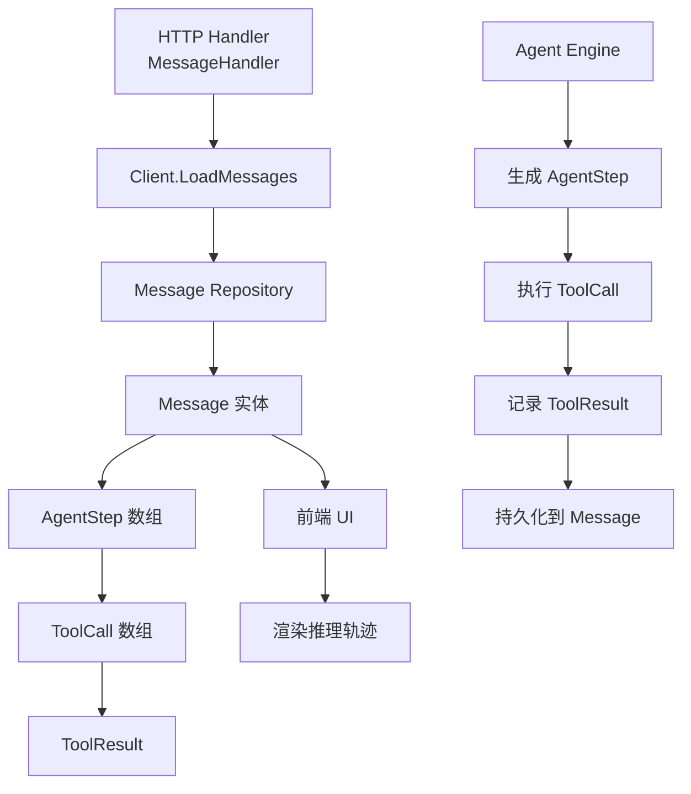

# Message Trace and Tool Events API

## 概述：为什么需要这个模块

想象你在调试一个复杂的 AI 助手系统：用户问了一个问题，Agent 开始思考、调用工具、再思考、再调用工具……最终给出答案。当用户问"为什么 Agent 会做出这个决定？"或者"工具调用失败时发生了什么？"时，你需要一个完整的"黑匣子"来重现整个推理过程。

`message_trace_and_tool_events_api` 模块就是这个黑匣子的读取器。它不是简单地存储对话历史，而是**完整记录 Agent 的 ReAct 推理循环**——每一次思考（Thought）、每一个工具调用（ToolCall）、每一次执行结果（ToolResult），以及它们之间的时间关系。这种细粒度的追踪对于调试 Agent 行为、分析工具性能、以及向用户解释 AI 决策过程至关重要。

 naive 的方案可能只是存储最终的问答对，但那样会丢失 Agent 的推理路径。本模块的设计洞察在于：**Agent 的价值不仅在于答案，更在于它如何得到答案**。因此，消息模型必须能够嵌套地表达这种层次化的执行轨迹。

---

## 架构与数据流



### 组件角色说明

| 组件 | 架构角色 | 职责 |
|------|----------|------|
| `Message` | 聚合根 | 会话中的单条消息，包含完整的内容和推理轨迹 |
| `AgentStep` | 迭代记录器 | 记录 ReAct 循环的单次迭代（思考 + 行动） |
| `ToolCall` | 调用描述符 | 描述一次工具调用的元数据和执行结果 |
| `ToolResult` | 执行结果容器 | 封装工具执行的成功/失败状态及输出数据 |
| `MessageListResponse` | 传输包装器 | 分页/批量消息的标准响应格式 |

### 数据流向

**写入路径**（Agent 执行时）：
1. `AgentEngine` 在每次 ReAct 迭代中生成 `AgentStep`
2. 每个 `ToolCall` 执行后填充 `ToolResult`
3. 所有步骤组装到 `Message` 的 `AgentSteps` 字段
4. 通过 `messageRepository` 持久化到数据库

**读取路径**（前端展示时）：
1. `MessageHandler` 调用 `Client.LoadMessages`
2. 从 `messageRepository` 加载消息及嵌套的 Agent 步骤
3. 前端按迭代顺序渲染思考过程和工具调用链

---

## 核心组件深度解析

### Message：会话消息的聚合根

```go
type Message struct {
    ID                  string          `json:"id"`
    SessionID           string          `json:"session_id"`
    RequestID           string          `json:"request_id"`
    Content             string          `json:"content"`
    Role                string          `json:"role"`
    KnowledgeReferences []*SearchResult `json:"knowledge_references"`
    AgentSteps          []AgentStep     `json:"agent_steps,omitempty"`
    IsCompleted         bool            `json:"is_completed"`
    CreatedAt           time.Time       `json:"created_at"`
    UpdatedAt           time.Time       `json:"updated_at"`
}
```

**设计意图**：`Message` 不仅仅是对话中的一句话，它是**一次用户请求或一次 Agent 响应的完整快照**。关键字段的设计反映了这种丰富性：

- `RequestID` 的存在表明系统支持请求级别的追踪，这对于分布式环境下的日志关联至关重要
- `AgentSteps` 仅在 assistant 角色的消息中存在（通过 `omitempty` 暗示），因为用户消息不需要记录推理过程
- `KnowledgeReferences` 将检索结果与消息绑定，使得答案的可追溯性成为可能
- `IsCompleted` 字段支持流式响应的状态管理——在流式传输完成前，消息可能处于部分完成状态

**使用注意**：`AgentSteps` 是切片而非指针，这意味着即使没有步骤也会序列化为空数组而非 `null`（除非使用 `omitempty`）。在判断消息是否包含 Agent 轨迹时，应检查 `len(Message.AgentSteps) > 0` 而非检查 `nil`。

---

### AgentStep：ReAct 循环的单次迭代

```go
type AgentStep struct {
    Iteration int        `json:"iteration"`
    Thought   string     `json:"thought"`
    ToolCalls []ToolCall `json:"tool_calls"`
    Timestamp time.Time  `json:"timestamp"`
}
```

**心智模型**：将 `AgentStep` 理解为 Agent 推理过程中的一个"帧"。就像视频由连续的帧组成，Agent 的完整推理过程由有序的 `AgentStep` 序列构成。每个帧包含：

1. **Iteration**：迭代序号（从 0 开始），用于在 UI 中按顺序展示推理步骤
2. **Thought**：LLM 的"内心独白"——它在决定调用工具前的推理过程
3. **ToolCalls**：该迭代中执行的所有工具调用（可能为 0 个或多个）
4. **Timestamp**：精确的时间戳，用于性能分析和调试

**设计权衡**：`ToolCalls` 是切片而非单个工具，这反映了 ReAct 模式的一个变体——Agent 可以在一次思考后并行调用多个工具。这种设计增加了复杂性（需要处理工具间的依赖关系），但提升了执行效率。

**关键约束**：`Iteration` 字段是理解 Agent 行为顺序的关键。如果看到 `Iteration` 不连续或重复，通常意味着数据持久化或传输过程中出现了问题。

---

### ToolCall：工具调用的完整描述

```go
type ToolCall struct {
    ID         string                 `json:"id"`
    Name       string                 `json:"name"`
    Args       map[string]interface{} `json:"args"`
    Result     *ToolResult            `json:"result"`
    Reflection string                 `json:"reflection,omitempty"`
    Duration   int64                  `json:"duration"`
}
```

**为什么需要 ID**：`ID` 字段来自 LLM 的 function call 响应，用于将工具调用与 LLM 的原始请求关联。在调试时，可以通过这个 ID 追溯到 LLM 为什么会选择这个工具。

**Args 的设计**：使用 `map[string]interface{}` 而非结构化类型，这是因为不同工具的参数 schema 差异巨大。这种灵活性付出了类型安全的代价，但避免了为每个工具定义单独的请求类型。

**Reflection 的深意**：这个可选字段记录了 Agent 对工具执行结果的"反思"。例如，工具返回了空结果，Agent 可能会记录"搜索结果为空，尝试扩大搜索范围"。这是实现自我修正 Agent 的关键机制。

**Duration 的用途**：以毫秒为单位记录执行时间，这对于识别性能瓶颈至关重要。如果某个工具 consistently 有高 `Duration`，可能需要优化其实现或添加缓存。

---

### ToolResult：工具执行的结果容器

```go
type ToolResult struct {
    Success bool                   `json:"success"`
    Output  string                 `json:"output"`
    Data    map[string]interface{} `json:"data,omitempty"`
    Error   string                 `json:"error,omitempty"`
}
```

**双重输出设计**：`Output` 和 `Data` 的分离反映了一个关键洞察——工具结果既需要人类可读的描述（用于向用户展示），也需要机器可读的结构化数据（用于后续工具调用或程序化处理）。

**Success vs Error**：`Success` 是布尔标志，`Error` 是错误详情。这种设计允许快速判断执行状态（检查 `Success`），同时保留详细的错误信息（检查 `Error`）。注意：`Success=false` 时 `Error` 应该有值，这是一个隐式契约。

**使用陷阱**：`Data` 字段是 `map[string]interface{}`，在访问其内容时需要类型断言。建议在使用前检查 `ToolResult.Success`，因为失败时的 `Data` 可能是未定义的。

---

### Client 方法：消息的加载与删除

#### LoadMessages：分页加载的核心

```go
func (c *Client) LoadMessages(
    ctx context.Context,
    sessionID string,
    limit int,
    beforeTime *time.Time,
) ([]Message, error)
```

**游标式分页**：`beforeTime` 参数实现了基于时间游标的分页，而非传统的页码分页。这种设计在实时系统中更可靠——当新消息不断插入时，页码分页会导致重复或遗漏，而时间游标能保证一致性。

**使用模式**：
```go
// 首次加载最近 20 条
messages, err := client.GetRecentMessages(ctx, sessionID, 20)

// 加载更多历史消息
if len(messages) > 0 {
    oldestTime := messages[len(messages)-1].CreatedAt
    more, err := client.GetMessagesBefore(ctx, sessionID, oldestTime, 20)
}
```

#### DeleteMessage：级联删除的边界

```go
func (c *Client) DeleteMessage(ctx context.Context, sessionID string, messageID string) error
```

**隐式契约**：删除消息时，相关的 `AgentSteps`、`ToolCalls` 等嵌套数据会一并删除（因为它们是消息的组成部分，而非独立实体）。但如果系统中有其他服务引用了这条消息的 ID（如日志、指标），这些引用会变成悬空引用。删除操作应谨慎使用，通常只用于 GDPR 合规场景。

---

## 依赖关系分析

### 上游依赖（谁调用本模块）

| 调用方 | 调用场景 | 期望的数据 |
|--------|----------|------------|
| `MessageHandler` | HTTP API 请求 | 完整的消息列表，包含 Agent 轨迹 |
| `AgentStreamHandler` | 流式响应组装 | 增量更新的消息状态 |
| 前端应用 | UI 渲染 | 可展示的对话历史和推理过程 |

### 下游依赖（本模块调用谁）

| 被调用方 | 调用目的 | 数据契约 |
|----------|----------|----------|
| `messageRepository` | 持久化/加载消息 | `Message` 实体与数据库记录的映射 |
| `sessionRepository` | 验证 Session 存在性 | `SessionID` 必须有效 |
| `Client.doRequest` | HTTP 请求发送 | 标准请求/响应格式 |

### 数据契约的关键点

1. **SessionID 有效性**：所有消息操作都要求 `SessionID` 对应一个存在的会话。如果会话已被删除，消息操作应返回明确的错误（而非静默失败）。

2. **时间戳格式**：`beforeTime` 使用 `time.RFC3339Nano` 格式序列化，确保纳秒级精度。跨服务传递时间时应保持此格式。

3. **AgentSteps 的可选性**：用户消息的 `AgentSteps` 应为空切片。后端在序列化时应使用 `omitempty` 避免冗余数据。

---

## 设计决策与权衡

### 1. 嵌套结构 vs 扁平化存储

**选择**：采用嵌套结构（Message → AgentSteps → ToolCalls → ToolResult）

**权衡**：
- ✅ 优点：数据局部性好，单次查询即可获取完整轨迹；代码直观，符合领域模型
- ❌ 缺点：消息对象可能变得很大（复杂推理可能有 10+ 步骤，每步多个工具）；更新单个工具结果需要重写整个消息

**替代方案**：将 `AgentStep` 和 `ToolCall` 作为独立表存储，通过外键关联。这适合需要频繁更新工具结果的场景，但会增加查询复杂度。

### 2. 同步记录 vs 异步事件流

**选择**：同步记录到消息对象

**权衡**：
- ✅ 优点：数据一致性强，消息完成即表示轨迹完整
- ❌ 缺点：工具执行时间会累加到请求延迟中；长推理链可能导致超时

**观察**：系统中存在 `event_bus` 模块（见 [platform_infrastructure_and_runtime](platform_infrastructure_and_runtime.md)），可用于异步事件记录。当前设计可能是为了简化一致性保证，但在高负载场景下可能需要重新评估。

### 3. 反射字段的可选性

**选择**：`Reflection` 字段为 `omitempty`

**权衡**：
- ✅ 优点：不是所有工具调用都需要反思，避免存储冗余空字符串
- ❌ 缺点：前端需要处理字段存在/不存在两种情况

**设计意图**：反思是高级 Agent 功能，基础 Agent 可能不使用。这种设计允许渐进式增强。

---

## 使用示例与最佳实践

### 场景 1：渲染 Agent 推理过程

```go
// 加载消息
messages, err := client.GetRecentMessages(ctx, sessionID, 50)
if err != nil {
    return err
}

// 找到最后一条 assistant 消息
for _, msg := range messages {
    if msg.Role == "assistant" && len(msg.AgentSteps) > 0 {
        // 按迭代顺序渲染
        for _, step := range msg.AgentSteps {
            fmt.Printf("Step %d: %s\n", step.Iteration, step.Thought)
            
            for _, call := range step.ToolCalls {
                if call.Result.Success {
                    fmt.Printf("  ✓ %s (%dms): %s\n", 
                        call.Name, call.Duration, call.Result.Output)
                } else {
                    fmt.Printf("  ✗ %s: %s\n", 
                        call.Name, call.Result.Error)
                }
                
                // 显示反思（如果有）
                if call.Reflection != "" {
                    fmt.Printf("    → %s\n", call.Reflection)
                }
            }
        }
    }
}
```

### 场景 2：分析工具性能

```go
// 收集所有工具调用的耗时
toolDurations := make(map[string][]int64)

for _, msg := range messages {
    for _, step := range msg.AgentSteps {
        for _, call := range step.ToolCalls {
            toolDurations[call.Name] = append(
                toolDurations[call.Name], 
                call.Duration,
            )
        }
    }
}

// 计算平均耗时
for tool, durations := range toolDurations {
    var sum int64
    for _, d := range durations {
        sum += d
    }
    fmt.Printf("%s: avg %dms (%d calls)\n", 
        tool, sum/int64(len(durations)), len(durations))
}
```

### 场景 3：调试失败的工具调用

```go
// 查找所有失败的工具调用
for _, msg := range messages {
    for _, step := range msg.AgentSteps {
        for _, call := range step.ToolCalls {
            if call.Result != nil && !call.Result.Success {
                log.Printf(
                    "Tool failure: %s in step %d, error: %s, args: %v",
                    call.Name, step.Iteration, call.Result.Error, call.Args,
                )
            }
        }
    }
}
```

---

## 边界情况与注意事项

### 1. 空 AgentSteps 的处理

用户消息或简单回复可能没有 `AgentSteps`。代码中应始终检查 `len(msg.AgentSteps) > 0` 而非假设字段存在：

```go
// ❌ 错误：可能 panic
if msg.AgentSteps[0].Thought != "" { ... }

// ✅ 正确
if len(msg.AgentSteps) > 0 && msg.AgentSteps[0].Thought != "" { ... }
```

### 2. 工具结果为 nil 的情况

`ToolCall.Result` 是指针类型，可能为 `nil`（工具调用尚未执行完成）。在流式响应场景中尤其需要注意：

```go
// ✅ 安全访问
if call.Result != nil && call.Result.Success {
    // 处理成功结果
}
```

### 3. 时间游标的边界条件

使用 `GetMessagesBefore` 时，如果 `beforeTime` 精确等于某条消息的创建时间，该消息**不会**被包含在结果中（查询条件是 `< beforeTime` 而非 `<=`）。这是预期行为，确保分页不重复。

### 4. 大消息的序列化开销

复杂推理可能产生数 MB 的消息对象（大量工具调用和结果）。在以下场景需要注意：
- HTTP 响应压缩应启用
- 前端渲染应考虑虚拟滚动
- 数据库字段类型应使用 `TEXT` 或 `JSONB` 而非 `VARCHAR`

### 5. 并发修改风险

如果多个服务同时更新同一条消息（如流式响应中逐步添加 `AgentSteps`），可能发生竞态条件。应确保：
- 消息更新由单一服务（`messageService`）协调
- 使用乐观锁或版本号防止覆盖

---

## 相关模块参考

- **[session_lifecycle_api](session_lifecycle_api.md)**：会话的创建、停止和标题生成，消息所属的父级容器
- **[agent_conversation_api](agent_conversation_api.md)**：Agent 对话的高级接口，内部使用本模块记录轨迹
- **[session_streaming_and_llm_calls_api](session_streaming_and_llm_calls_api.md)**：流式响应和 LLM 调用，与 AgentSteps 的生成密切相关
- **[agent_runtime_and_tools](agent_runtime_and_tools.md)**：工具的定义和执行，`ToolCall` 中调用的工具在此模块实现
- **[data_access_repositories](data_access_repositories.md)**：`messageRepository` 的具体实现，负责消息的持久化

---

## 扩展点

### 添加新的 Agent 事件类型

如果需要记录超出 `Thought` 和 `ToolCall` 的事件（如 Agent 的自我评估），可以：

1. 在 `AgentStep` 中添加新字段（如 `Evaluation string`）
2. 或在 `ToolCall` 中添加元数据字段（如 `Metadata map[string]string`）

**注意**：添加字段时应考虑向后兼容性——旧版本客户端应能忽略新字段。

### 自定义工具结果格式

`ToolResult.Data` 的 `map[string]interface{}` 设计允许工具返回任意结构化数据。对于特定工具类型，可以定义辅助函数进行类型安全的访问：

```go
func (tr *ToolResult) GetSearchResults() ([]SearchResult, error) {
    data, ok := tr.Data["results"].([]interface{})
    if !ok {
        return nil, fmt.Errorf("invalid results format")
    }
    // 转换为 SearchResult 切片
}
```

---

## 总结

`message_trace_and_tool_events_api` 模块的核心价值在于**将 Agent 的黑盒推理过程透明化**。通过 `Message → AgentStep → ToolCall → ToolResult` 的层次化结构，它捕获了从高层思考到低层工具执行的完整链路。

理解这个模块的关键是认识到：**消息不仅是通信单元，更是执行轨迹的容器**。这种设计使得调试、分析和解释 Agent 行为成为可能，是构建可信赖 AI 系统的基础设施。
