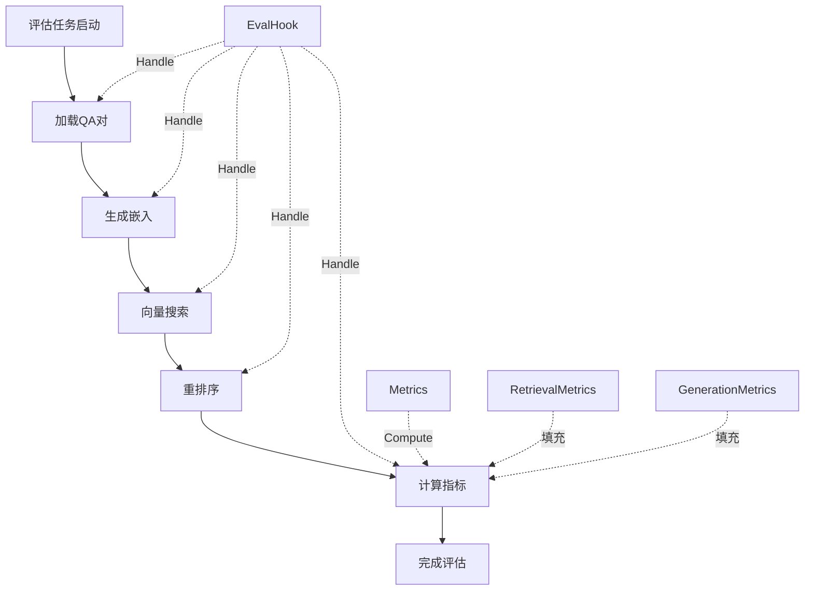

# 指标模型与扩展钩子 (metric_models_and_extension_hooks)

## 概述

这个模块是整个评估系统的"度量核心"。它定义了评估过程中使用的所有指标数据结构，以及允许在评估流程中插入自定义逻辑的扩展钩子。

想象一下，如果你要评估一个搜索引擎的效果，你需要一套标准化的指标（准确率、召回率、NDCG等）来衡量结果的好坏；同样，评估文本生成质量需要BLEU、ROUGE等指标。这个模块就像是评估系统的"工具箱"——不仅提供了现成的度量工具，还设计了灵活的接口，让你可以在评估流程的不同阶段插入自定义逻辑，就像在流水线上添加质检点一样。

## 核心组件

本模块包含三个主要子模块，分别负责不同方面的功能：

- [generation_metric_models](core_domain_types_and_interfaces-evaluation_dataset_and_metric_contracts-metric_models_and_extension_hooks-generation_metric_models.md) - 文本生成质量指标的数据模型
- [retrieval_metric_models](core_domain_types_and_interfaces-evaluation_dataset_and_metric_contracts-metric_models_and_extension_hooks-retrieval_metric_models.md) - 检索质量指标的数据模型  
- [metric_extension_interfaces](core_domain_types_and_interfaces-evaluation_dataset_and_metric_contracts-metric_models_and_extension_hooks-metric_extension_interfaces.md) - 指标计算和评估流程的扩展接口

### 1. 指标数据模型

#### RetrievalMetrics（检索指标）
```go
type RetrievalMetrics struct {
    Precision float64 // 准确率：检索结果中相关文档的比例
    Recall    float64 // 召回率：相关文档被检索到的比例
    NDCG3     float64 // 前3个结果的归一化折损累计增益
    NDCG10    float64 // 前10个结果的归一化折损累计增益
    MRR       float64 // 平均倒数排名：衡量第一个相关结果出现的位置
    MAP       float64 // 平均准确率：综合衡量检索质量
}
```

**设计意图**：这些指标都是信息检索领域的标准评估指标。选择这些指标是因为它们从不同角度衡量检索系统的性能：
- `Precision` 和 `Recall` 是基础指标，衡量"查准"和"查全"
- `NDCG` 考虑了排名位置，位置越靠前的相关结果贡献越大
- `MRR` 关注第一个相关结果的位置，这对用户体验很重要
- `MAP` 是综合指标，平衡了精度和召回

#### GenerationMetrics（生成指标）
```go
type GenerationMetrics struct {
    BLEU1 float64 // BLEU-1：1-gram的精确率
    BLEU2 float64 // BLEU-2：2-gram的精确率
    BLEU4 float64 // BLEU-4：4-gram的精确率
    ROUGE1 float64 // ROUGE-1：1-gram的召回率
    ROUGE2 float64 // ROUGE-2：2-gram的召回率
    ROUGEL float64 // ROUGE-L：最长公共子序列
}
```

**设计意图**：这些是文本生成评估的标准指标：
- `BLEU` 系列关注精确率，衡量生成文本与参考文本的重合度
- `ROUGE` 系列关注召回率，从不同角度衡量生成质量
- 提供多个n-gram级别的指标，可以更细致地分析生成质量

### 2. 扩展接口

#### Metrics 接口
```go
type Metrics interface {
    Compute(metricInput *types.MetricInput) float64
}
```

**设计意图**：这是一个统一的指标计算接口。通过这个接口，系统可以支持自定义指标的计算，而不需要修改核心评估逻辑。任何实现了 `Compute` 方法的类型都可以作为指标使用。

#### EvalHook 接口
```go
type EvalHook interface {
    Handle(ctx context.Context, state types.EvalState, index int, data interface{}) error
}
```

**设计意图**：这是评估流程的钩子接口。它允许在评估的不同阶段（如开始、加载数据、向量搜索、重排序等）插入自定义逻辑。这对于监控、调试、日志记录等场景非常有用。

## 架构与数据流



**数据流说明**：
1. 评估任务从启动到完成经历多个阶段
2. 在每个阶段，`EvalHook` 可以被触发执行自定义逻辑
3. 最后阶段计算指标，使用 `Metrics` 接口和预定义的指标结构
4. 最终结果填充到 `RetrievalMetrics` 和 `GenerationMetrics` 中

## 设计决策与权衡

### 1. 指标结构 vs 接口分离
**决策**：将指标数据结构（`RetrievalMetrics`、`GenerationMetrics`）与计算接口（`Metrics`）分离
**原因**：
- 数据结构用于存储和传输结果，需要稳定
- 接口用于计算，需要灵活可扩展
- 分离后可以独立演化这两个部分

### 2. EvalHook 的通用设计
**决策**：`EvalHook` 使用 `interface{}` 作为数据参数
**权衡**：
- 优点：灵活性高，可以传递任何类型的数据
- 缺点：类型不安全，需要在实现中进行类型断言
- 选择原因：评估流程中不同阶段的数据类型差异很大，使用通用接口是最实用的选择

### 3. 指标的完整性 vs 简洁性
**决策**：提供一组完整的标准指标
**原因**：
- 这些都是学术界和工业界广泛使用的指标
- 完整的指标集可以满足大多数评估需求
- 用户可以根据需要选择关注的指标，不需要全部使用

## 使用指南与注意事项

### 如何自定义指标
1. 实现 `Metrics` 接口的 `Compute` 方法
2. 在评估流程中注册你的自定义指标
3. 结果可以存储在自定义结构中，或者扩展现有结构

### 如何使用 EvalHook
1. 实现 `EvalHook` 接口的 `Handle` 方法
2. 根据 `state` 参数判断当前评估阶段
3. 根据需要处理 `data` 参数（注意类型断言）
4. 在评估任务启动时注册你的 hook

### 注意事项
- `EvalHook` 的执行会影响评估性能，避免在 hook 中执行耗时操作
- 指标计算假设输入数据是有效的，使用前需要确保数据质量
- 中文文本处理依赖全局的 `Jieba` 实例，确保在使用前正确初始化
- `EvalState` 枚举值有固定的顺序，依赖这个顺序的逻辑需要小心维护

## 与其他模块的关系

- 这个模块被 [evaluation_dataset_and_metric_services](evaluation-dataset-and-metric-services.md) 模块使用
- 它依赖于 [core_domain_types_and_interfaces](core-domain-types-and-interfaces.md) 中的基础类型
- 具体的指标计算实现在 [retrieval_quality_metrics](evaluation-dataset-and-metric-services-retrieval-quality-metrics.md) 和 [generation_text_overlap_metrics](evaluation-dataset-and-metric-services-generation-text-overlap-metrics.md) 模块中
