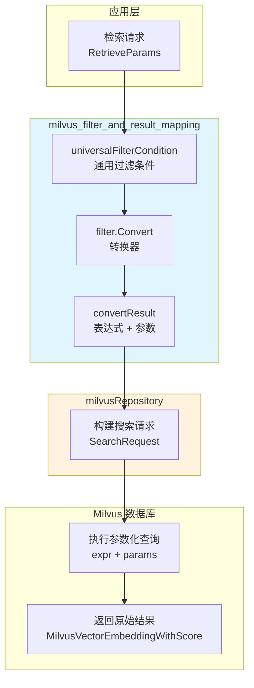

# Milvus Filter and Result Mapping 模块深度解析

## 概述：为什么需要这个模块

想象一下，你正在构建一个支持多租户、多知识库的智能检索系统。上层业务逻辑希望用一种统一的方式表达过滤条件——比如"只搜索属于知识库 A 且创建时间在最近 7 天内的文档"。但底层存储使用的是 Milvus 向量数据库，它有自己特定的过滤表达式语法。

**`milvus_filter_and_result_mapping` 模块的核心使命就是充当这个"翻译层"**：它将上层应用定义的通用过滤条件（`universalFilterCondition`）转换为 Milvus 能够理解的参数化表达式，同时安全地处理参数绑定，防止注入攻击。

这个模块存在的根本原因是**抽象与实现的分离**：
- 上层业务代码不应该知道 Milvus 的表达式语法细节
- 过滤逻辑需要支持复杂的嵌套条件（AND/OR 组合）
- 参数化查询是防止注入攻击的必要手段
- 结果需要统一映射回应用层的数据模型

如果采用朴素方案——直接在业务层拼接 Milvus 表达式字符串——会导致代码难以维护、容易出错，且存在严重的安全隐患。本模块通过结构化的条件表示和递归转换机制，优雅地解决了这些问题。

---

## 架构与数据流



**数据流 walkthrough**：

1. **入口**：应用层发起检索请求，携带 `RetrieveParams`，其中包含过滤条件
2. **条件表示**：过滤条件被序列化为 `universalFilterCondition` 结构——这是一个树形结构，叶子节点是比较操作（如 `eq`、`gt`），内部节点是逻辑操作（`and`、`or`）
3. **递归转换**：`filter.Convert` 方法递归遍历条件树，为每个叶子节点生成参数化的表达式片段，并累积参数映射
4. **表达式组装**：对于逻辑节点，将子表达式用 `and`/`or` 连接，合并参数集合
5. **查询执行**：生成的 `exprStr` 和 `params` 被传递给 Milvus 客户端执行
6. **结果返回**：Milvus 返回的原始结果由 `milvusRepository` 进一步映射为应用层模型

这个模块在架构中扮演**网关转换器**的角色——它不关心业务逻辑，只负责语法翻译和安全参数绑定。

---

## 核心组件深度解析

### `universalFilterCondition`：通用过滤条件的抽象表示

**设计意图**：这个结构体是整个模块的"输入语言"。它用一种与具体数据库无关的方式表示过滤条件，使得上层代码可以用统一的 API 表达复杂的查询逻辑。

```go
type universalFilterCondition struct {
    Field    string `json:"field,omitempty"`
    Operator string `json:"operator"`
    Value    any    `json:"value,omitempty"`
}
```

**关键字段说明**：

| 字段 | 作用 | 设计考量 |
|------|------|----------|
| `Field` | 指定要过滤的元数据字段名 | 使用 `omitempty` 因为逻辑操作符（and/or）不需要字段 |
| `Operator` | 定义比较或逻辑操作类型 | 支持 12 种操作符，覆盖常见查询场景 |
| `Value` | 比较值或子条件数组 | 使用 `any` 实现多态——比较操作是标量，逻辑操作是条件数组 |

**为什么需要自定义 JSON 编解码**：

`universalFilterCondition` 实现了 `UnmarshalJSON` 和 `MarshalJSON`，这并非多余的设计。关键在于**逻辑操作符的特殊处理**：

当 `Operator` 是 `and` 或 `or` 时，`Value` 字段必须是一个 `[]*universalFilterCondition` 数组。但 Go 的 `encoding/json` 包无法自动将 JSON 数组递归解码为同类型结构体指针数组。自定义解码器通过以下步骤解决：

1. 先用辅助类型 `Alias` 解码原始 JSON，避免无限递归
2. 检测操作符类型，如果是逻辑操作符，手动遍历 `Value` 数组
3. 对每个子条件重新 Marshal 再 Unmarshal，完成递归解码

这种设计使得 API 调用者可以发送如下嵌套 JSON：

```json
{
  "operator": "and",
  "value": [
    {
      "field": "knowledge_base_id",
      "operator": "eq",
      "value": "kb-123"
    },
    {
      "operator": "or",
      "value": [
        {
          "field": "created_at",
          "operator": "gte",
          "value": 1704067200
        },
        {
          "field": "is_pinned",
          "operator": "eq",
          "value": true
        }
      ]
    }
  ]
}
```

**隐式契约**：
- 比较操作符（`eq`、`gt` 等）必须提供 `Field` 和 `Value`
- 逻辑操作符（`and`、`or`）的 `Value` 必须是条件数组
- `in` 操作符的 `Value` 必须是非空切片
- `between` 操作符的 `Value` 必须是恰好两个元素的切片

---

### `filter.Convert`：递归转换引擎

**核心方法签名**：
```go
func (c *filter) Convert(cond *universalFilterCondition) (*convertResult, error)
```

**内部工作机制**：

`Convert` 方法本身只是一个入口，真正的逻辑在四个私有方法中分发：

1. **`convertCondition`**：调度中心，根据 `Operator` 类型路由到具体处理器
2. **`convertComparisonCondition`**：处理标量比较（eq、ne、gt、gte、lt、lte、like、not like）
3. **`convertLogicalCondition`**：处理逻辑组合（and、or），递归调用子条件
4. **`convertInCondition`**：处理集合成员判断（in、not in）
5. **`convertBetweenCondition`**：处理范围查询（between）

**参数化表达式生成策略**：

模块采用**模板参数化**方式生成 Milvus 表达式，而非直接拼接值。例如：

```go
// 输入条件
{Field: "created_at", Operator: "gte", Value: 1704067200}

// 生成的表达式和参数
exprStr: "created_at >= {created_at_1}"
params:  {"created_at_1": 1704067200}
```

这种设计的关键优势：
- **防止注入攻击**：用户输入的值不会直接出现在表达式字符串中
- **类型安全**：Milvus 客户端负责参数的类型序列化和转义
- **可复用性**：相同的表达式模板可以绑定不同的参数值重复使用

**参数命名规则**：

```go
func (c *filter) convertParamName(field string, counter *int) string {
    *counter++
    return fmt.Sprintf("%s_%d", strings.ReplaceAll(field, ".", "_"), *counter)
}
```

这里有两个值得注意的设计细节：

1. **替换点号**：Milvus 的模板参数名不支持 `.` 字符，所以 `user.id` 会被转换为 `user_id_1`
2. **计数器后缀**：同一字段可能在表达式中出现多次（如 `between` 操作），计数器确保参数名唯一

**逻辑条件的表达式拼接**：

`convertLogicalCondition` 使用迭代方式累积子表达式：

```go
condResult.exprStr = fmt.Sprintf(
    "(%s) %s (%s)",
    condResult.exprStr,
    strings.ToLower(cond.Operator),
    childRes.exprStr,
)
maps.Copy(condResult.params, childRes.params)
```

这里用括号包裹每个子表达式，确保运算优先级正确。例如，对于 `A and B or C`，会生成 `((A) and (B)) or (C)`，避免歧义。

---

### `convertResult`：转换结果的载体

```go
type convertResult struct {
    exprStr string
    params  map[string]any
}
```

这个结构体看似简单，但承载了**表达式与参数的绑定关系**。在递归转换过程中，每个子条件返回自己的 `convertResult`，父条件负责合并它们：

- `exprStr` 通过逻辑操作符连接
- `params` 通过 `maps.Copy` 合并（参数名已保证唯一，不会冲突）

最终，顶层 `Convert` 调用返回的 `convertResult` 包含完整的表达式和所有参数，可直接传递给 Milvus 客户端。

---

### 辅助函数：类型安全与格式化

**`formatValue` 函数**：

虽然当前代码中 `formatValue` 未被直接调用（因为采用参数化查询），但它展示了模块对类型处理的考量：

```go
func formatValue(value any) string {
    switch v := value.(type) {
    case string:
        return fmt.Sprintf("\"%s\"", escapeDoubleQuotes(v))
    case time.Time:
        return fmt.Sprintf("%d", v.Unix())
    // ... 其他类型
    }
}
```

这个函数可能用于调试日志或未来非参数化查询场景。它统一处理了：
- 字符串的双引号包裹和转义
- 时间类型到 Unix 时间戳的转换
- 布尔值到 `true`/`false` 的转换

**`escapeDoubleQuotes` 函数**：

```go
func escapeDoubleQuotes(s string) string {
    return strings.ReplaceAll(s, "\"", "\\\"")
}
```

这是防止表达式注入的第二道防线——即使参数化失败，转义也能避免恶意输入破坏表达式结构。

---

## 依赖关系分析

### 上游调用者

根据模块树，本模块被以下组件依赖：

| 调用者 | 依赖关系 | 期望 |
|--------|----------|------|
| [`milvusRepository`](milvus_repository_implementation.md) | 直接调用 `filter.Convert` | 获取可执行的 Milvus 表达式和参数 |
| [`RetrieveEngine`](../../core_domain_types_and_interfaces.md) | 通过 Repository 间接使用 | 统一的检索接口，不感知底层过滤语法 |

**数据契约**：
- **输入**：`*universalFilterCondition`（通常从 `RetrieveParams.Filters` 反序列化而来）
- **输出**：`*convertResult`（包含 `exprStr` 和 `params`）
- **错误处理**：任何无效条件都会返回明确的错误信息，调用者需处理这些错误

### 下游被调用者

本模块不依赖外部服务，只使用 Go 标准库：
- `encoding/json`：JSON 编解码
- `reflect`：运行时类型检查（验证 `in` 和 `between` 的值类型）
- `strings`、`fmt`、`maps`：字符串和集合操作

**零外部依赖**是一个重要的设计选择——这使得模块高度可测试，且不会因外部库升级而引入不稳定因素。

---

## 设计决策与权衡

### 1. 参数化查询 vs 字符串拼接

**选择**：参数化查询（`field >= {param_1}`）

**权衡分析**：

| 方案 | 优点 | 缺点 |
|------|------|------|
| 参数化 | 安全、可复用、类型安全 | 需要 Milvus 客户端支持参数绑定 |
| 字符串拼接 | 简单直接、兼容所有版本 | 注入风险、难以调试、无法复用 |

模块选择了参数化方案，这是**安全优先**的体现。在检索系统中，过滤条件可能包含用户输入（如标签名、搜索关键词），直接拼接会导致类似 SQL 注入的风险。

### 2. 递归转换 vs 迭代转换

**选择**：递归转换

**权衡分析**：

递归实现更直观地映射了条件树的层次结构。对于深度有限的查询（实际场景中很少超过 3 层嵌套），递归的性能开销可以忽略不计。如果未来需要支持极深的嵌套条件，可以考虑改为迭代实现（使用显式栈）。

### 3. 统一条件结构 vs 操作符专用结构

**选择**：统一的 `universalFilterCondition` 结构

**权衡分析**：

另一种设计是为每种操作符定义独立的结构体（如 `ComparisonCondition`、`LogicalCondition`、`InCondition`）。模块选择了统一结构，理由是：
- **API 简洁**：调用者只需处理一种类型
- **JSON 友好**：统一结构更容易序列化和反序列化
- **扩展性**：添加新操作符只需修改 `convertCondition` 的 switch 分支

代价是需要在运行时通过 `Operator` 字段区分类型，并用 `any` 存储 `Value`，牺牲了一定的类型安全。

### 4. 紧耦合 Milvus 语法 vs 抽象表达式语言

**选择**：紧耦合 Milvus 语法

**权衡分析**：

模块生成的表达式直接针对 Milvus 语法（如 `==`、`>=`、`in`）。另一种方案是定义抽象表达式语言，再由 Milvus 适配器转换。

当前选择是**务实的**：
- 系统目前只使用 Milvus 作为向量存储
- Milvus 的过滤语法与常见查询语言相似，迁移成本可控
- 减少了一层抽象，代码更易理解

如果未来需要支持多向量数据库（如 Qdrant、Elasticsearch），可能需要引入抽象表达式层。目前 [`elasticsearch_vector_retrieval_repository`](elasticsearch_vector_retrieval_repository.md) 和 [`qdrant_vector_retrieval_repository`](qdrant_vector_retrieval_repository.md) 各自实现了类似的过滤逻辑，存在一定重复。

---

## 使用示例与配置

### 基本过滤查询

```go
// 构建过滤条件：knowledge_base_id == "kb-123"
cond := &universalFilterCondition{
    Field:    "knowledge_base_id",
    Operator: "eq",
    Value:    "kb-123",
}

// 转换
f := &filter{}
result, err := f.Convert(cond)
if err != nil {
    // 处理错误
}

// result.exprStr: "knowledge_base_id == {knowledge_base_id_1}"
// result.params:  {"knowledge_base_id_1": "kb-123"}
```

### 嵌套逻辑条件

```go
// 构建条件：(status == "published" AND created_at >= 1704067200) OR is_pinned == true
cond := &universalFilterCondition{
    Operator: "or",
    Value: []*universalFilterCondition{
        {
            Operator: "and",
            Value: []*universalFilterCondition{
                {
                    Field:    "status",
                    Operator: "eq",
                    Value:    "published",
                },
                {
                    Field:    "created_at",
                    Operator: "gte",
                    Value:    1704067200,
                },
            },
        },
        {
            Field:    "is_pinned",
            Operator: "eq",
            Value:    true,
        },
    },
}

result, err := f.Convert(cond)
// result.exprStr: "((status == {status_1}) and (created_at >= {created_at_2})) or (is_pinned == {is_pinned_3})"
```

### 范围查询

```go
// 构建条件：created_at BETWEEN 1704067200 AND 1706745600
cond := &universalFilterCondition{
    Field:    "created_at",
    Operator: "between",
    Value:    []int64{1704067200, 1706745600},
}

result, err := f.Convert(cond)
// result.exprStr: "created_at >= {created_at_1_0} and created_at <= {created_at_1_1}"
// result.params:  {"created_at_1_0": 1704067200, "created_at_1_1": 1706745600}
```

### 集合成员判断

```go
// 构建条件：tags IN ["ai", "ml", "nlp"]
cond := &universalFilterCondition{
    Field:    "tags",
    Operator: "in",
    Value:    []string{"ai", "ml", "nlp"},
}

result, err := f.Convert(cond)
// result.exprStr: "tags in {tags_1}"
// result.params:  {"tags_1": []string{"ai", "ml", "nlp"}}
```

---

## 边界情况与陷阱

### 1. 空条件处理

```go
// 错误示例：nil 条件
cond := (*universalFilterCondition)(nil)
result, err := f.Convert(cond)
// err: "milvus filter condition is nil"
```

**建议**：调用者应在传入前检查条件是否为 nil，或在业务逻辑中定义"无条件"的语义（如直接跳过过滤）。

### 2. 逻辑操作符的空子条件数组

```go
// 错误示例：and 操作符但子条件为空
cond := &universalFilterCondition{
    Operator: "and",
    Value:    []*universalFilterCondition{},
}
result, err := f.Convert(cond)
// err: "empty logical condition"
```

**建议**：在构建条件树时，确保逻辑操作符至少有一个有效子条件。如果业务逻辑可能产生空数组，应在转换前过滤。

### 3. `in` 操作符的空切片

```go
// 错误示例：in 操作符但值为空切片
cond := &universalFilterCondition{
    Field:    "tags",
    Operator: "in",
    Value:    []string{},
}
result, err := f.Convert(cond)
// err: "in operator value must be a slice with at least one value"
```

**建议**：空 `in` 条件在语义上等价于"永远为假"，应在业务层提前处理，避免传入转换器。

### 4. `between` 操作符的元素数量

```go
// 错误示例：between 但值不是两个元素
cond := &universalFilterCondition{
    Field:    "created_at",
    Operator: "between",
    Value:    []int64{1704067200}, // 只有一个元素
}
result, err := f.Convert(cond)
// err: "between operator value must be a slice with two elements"
```

**建议**：`between` 应严格用于闭区间查询。如果需要开区间，使用组合条件（如 `gt` + `lt`）。

### 5. 字段名中的点号

```go
// 注意：字段名中的点号会被替换为下划线
cond := &universalFilterCondition{
    Field:    "user.profile.id",
    Operator: "eq",
    Value:    123,
}
result, err := f.Convert(cond)
// result.exprStr: "user.profile.id == {user_profile_id_1}"
//                              ^^^^^^^^^^^^^^^^ 参数名中的点号被替换
```

**影响**：这不会影响表达式本身（字段名保持原样），但如果调试时查看参数映射，需注意参数名与字段名的差异。

### 6. 时间类型处理

`universalFilterCondition` 的 `Value` 字段是 `any` 类型，可以传入 `time.Time`。但 Milvus 期望的是 Unix 时间戳（整数）：

```go
// 正确做法：转换为 Unix 时间戳
cond := &universalFilterCondition{
    Field:    "created_at",
    Operator: "gte",
    Value:    time.Now().Unix(), // 整数
}

// 错误做法：直接传入 time.Time
cond := &universalFilterCondition{
    Field:    "created_at",
    Operator: "gte",
    Value:    time.Now(), // 可能导致序列化问题
}
```

**建议**：在业务层统一将时间转换为 Unix 时间戳，避免依赖隐式转换。

---

## 扩展点与修改指南

### 添加新操作符

如果需要支持新的操作符（如 `exists` 判断字段是否存在）：

1. 在 `const` 块定义操作符常量
2. 在 `convertCondition` 的 `switch` 添加新分支
3. 实现对应的 `convertXXXCondition` 方法
4. 更新 `universalFilterCondition` 的 JSON Schema 枚举值

```go
// 示例：添加 exists 操作符
const operatorExists = "exists"

func (c *filter) convertCondition(...) {
    switch cond.Operator {
    // ... 现有操作符
    case operatorExists:
        return c.convertExistsCondition(cond, counter)
    }
}

func (c *filter) convertExistsCondition(...) (*convertResult, error) {
    // exists 不需要 Value，只需生成 "exists(field)" 表达式
    return &convertResult{
        exprStr: fmt.Sprintf("exists(%s)", cond.Field),
        params:  map[string]any{},
    }, nil
}
```

### 支持自定义字段映射

如果应用层字段名与 Milvus 字段名不一致，可在转换前添加映射层：

```go
type fieldMapper func(string) string

func (c *filter) WithMapper(mapper fieldMapper) *filter {
    c.fieldMapper = mapper
    return c
}

func (c *filter) convertComparisonCondition(...) {
    mappedField := c.fieldMapper(cond.Field)
    // 使用 mappedField 生成表达式
}
```

### 表达式优化

当前实现直接拼接子表达式，可能产生冗余括号。如需优化：

```go
// 当前：((A) and (B)) and (C)
// 优化：A and B and C

// 可在 convertLogicalCondition 中检测子表达式是否也是同类型逻辑操作
// 如果是，直接展开而非嵌套
```

---

## 相关模块参考

- [`milvus_repository_implementation.md`](milvus_repository_implementation.md)：Milvus 仓库主实现，调用本模块进行过滤转换
- [`elasticsearch_vector_retrieval_repository.md`](elasticsearch_vector_retrieval_repository.md)：Elasticsearch 检索实现，有类似的过滤逻辑
- [`qdrant_vector_retrieval_repository.md`](qdrant_vector_retrieval_repository.md)：Qdrant 检索实现
- [`RetrieveEngine`](../../core_domain_types_and_interfaces.md)：检索引擎接口定义，定义上层检索参数

---

## 总结

`milvus_filter_and_result_mapping` 模块是一个**专注、安全、可扩展**的过滤表达式转换器。它的设计体现了以下原则：

1. **单一职责**：只做过滤条件转换，不关心检索逻辑或结果映射
2. **安全优先**：参数化查询防止注入攻击
3. **递归思维**：用树形结构自然表达嵌套条件
4. **明确错误**：对无效输入返回清晰的错误信息
5. **零外部依赖**：仅使用标准库，稳定可靠

对于新贡献者，理解这个模块的关键是把握**"翻译层"**的定位——它不创造业务逻辑，只是将业务语言翻译成数据库语言。掌握这一点后，扩展和维护都将变得直观。
