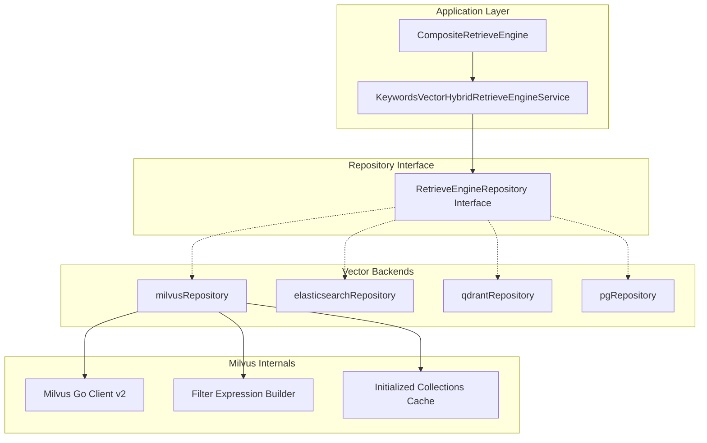
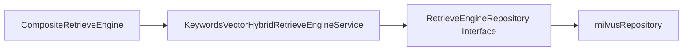

# Milvus Repository Implementation

## 概述

想象一下你有一个巨大的图书馆，里面藏着数百万本书的"语义指纹"——每本书都被转换成了一串数字向量。当用户问一个问题时，你需要在毫秒级时间内找到语义上最相似的那些书。`milvus_repository_implementation` 模块就是这个图书馆的**索引管理员**，专门负责与 Milvus 向量数据库打交道，完成向量的存储、检索和过滤。

这个模块存在的核心原因是：**向量检索不是简单的键值查询，而是高维空间中的相似度搜索**。一个 naive 的解决方案可能是把所有向量存在关系型数据库里然后暴力计算余弦相似度，但这在数据量达到百万级时会完全不可用。Milvus 作为专门的向量数据库，使用 HNSW、IVF 等索引结构将检索复杂度从 O(n) 降到 O(log n)，而这个模块就是系统在 Milvus 上的"方言翻译器"——它把系统内部的统一检索请求翻译成 Milvus 能理解的查询语言，同时处理集合管理、维度缓存、过滤条件转换等底层细节。

## 架构定位



### 数据流 walkthrough

当系统需要执行一次向量检索时，数据流经以下路径：

1. **上层调用**：[`CompositeRetrieveEngine`](internal.application.service.retriever.composite.CompositeRetrieveEngine.md) 或 [`KeywordsVectorHybridRetrieveEngineService`](internal.application.service.retriever.keywords_vector_hybrid_indexer.KeywordsVectorHybridRetrieveEngineService.md) 调用 `Retrieve()` 方法
2. **接口分发**：通过 [`RetrieveEngineRepository`](internal.types.interfaces.retriever.RetrieveEngineRepository.md) 接口路由到具体的后端实现
3. **Milvus 转换**：`milvusRepository` 将统一的 `RetrieveParams` 转换为 Milvus 的查询语法，包括：
   - 根据向量维度选择对应的 collection（`collectionBaseName + dimension`）
   - 使用 `initializedCollections` 缓存避免重复初始化检查
   - 通过嵌入的 `filter` 将通用过滤条件转换为 Milvus 的表达式语言
4. **执行与返回**：调用 Milvus Go Client 执行搜索，将结果从 `MilvusVectorEmbeddingWithScore` 转换回统一的 `RetrieveResult` 格式

## 核心组件深度解析

### milvusRepository

**设计意图**：这是模块的核心结构体，封装了与 Milvus 交互的所有底层细节。它的设计遵循了 **Repository 模式**——对外提供统一的持久化接口，对内屏蔽特定数据库的实现差异。

```go
type milvusRepository struct {
    filter
    client             *client.Client
    collectionBaseName string
    initializedCollections sync.Map
}
```

**关键字段解析**：

- **`filter`（嵌入）**：这是一个组合模式的运用。`filter` 类型（见下文）包含了过滤条件转换的逻辑，通过嵌入而非继承，`milvusRepository` 可以直接调用 `filter` 的方法，保持代码扁平。这种设计比单独创建一个 filter 实例更简洁，调用时直接 `r.convertFilter(...)` 而非 `r.filter.convertFilter(...)`。

- **`client *client.Client`**：Milvus 官方 Go SDK v2 的客户端实例。注意这里使用的是 v2 版本，相比 v1 有 API  breaking changes，包括连接管理、集合操作和搜索语法的差异。这个依赖是**紧耦合**的——如果 Milvus 升级 v3，这个字段类型和所有调用它的代码都需要修改。

- **`collectionBaseName string`**：集合命名策略的基础部分。系统采用 `baseName + dimension` 的方式为不同维度的向量创建独立集合（例如 `chunks_768`、`chunks_1536`）。这样设计的原因是：
  1. Milvus 的集合 schema 在创建时就必须确定向量维度，无法动态修改
  2. 不同嵌入模型产生的向量维度不同（如 bge-m3 是 1024，text-embedding-3-large 是 3072）
  3. 按维度分集合可以避免在查询时做维度校验，提升性能

- **`initializedCollections sync.Map`**：这是一个**线程安全的缓存**，记录哪些维度的集合已经初始化完成。`sync.Map` 的选择很关键——在并发场景下（多个请求同时到达），它避免了使用 `sync.Mutex` 保护普通 `map` 时的锁竞争。键是维度（int），值是 `true`（存在即表示已初始化）。这是一个典型的**懒加载 + 缓存**模式：第一次使用某个维度时检查并初始化集合，之后直接从缓存命中。

**核心方法行为**（基于接口推断）：

| 方法 | 职责 | 副作用 |
|------|------|--------|
| `Save()` | 将单个向量嵌入写入 Milvus | 如果集合不存在则自动创建 |
| `BatchSave()` | 批量插入向量（性能优化） | 同上 |
| `Retrieve()` | 执行向量相似度搜索 | 无 |
| `DeleteByChunkIDList()` | 按分块 ID 批量删除 | 无 |
| `CopyIndices()` | 复制索引数据（用于知识库克隆） | 在目标集合创建新记录 |
| `BatchUpdateChunkEnabledStatus()` | 批量更新启用状态 | 修改元数据字段 |

### MilvusVectorEmbedding

**设计意图**：这是存储在 Milvus 中的**数据模型**，定义了向量及其元数据的 schema。与 Elasticsearch 和 Qdrant 的版本对比可以看出设计演进：

```go
type MilvusVectorEmbedding struct {
    ID              string    `json:"id"`              // Milvus 特有：主键 ID
    Content         string    `json:"content"`         // 原始文本内容
    SourceID        string    `json:"source_id"`       // 来源文档 ID
    SourceType      int       `json:"source_type"`     // 来源类型枚举
    ChunkID         string    `json:"chunk_id"`        // 分块 ID（用于去重和更新）
    KnowledgeID     string    `json:"knowledge_id"`    // 知识项 ID
    KnowledgeBaseID string    `json:"knowledge_base_id"` // 知识库 ID
    TagID           string    `json:"tag_id"`          // Milvus/Qdrant 特有：标签 ID
    Embedding       []float32 `json:"embedding"`       // 向量数据
    IsEnabled       bool      `json:"is_enabled"`      // 软删除/启用标记
}
```

**与 PostgreSQL 版本的差异**：
- PostgreSQL 的 [`pgVector`](internal.application.repository.retriever.postgres.structs.pgVector.md) 包含 `CreatedAt`、`UpdatedAt`、`Dimension` 等字段，因为关系型数据库需要这些元数据做管理和索引
- Milvus 版本更精简，因为向量数据库的强项是相似度搜索而非事务管理，时间戳等元数据通常由上层业务逻辑维护

**`TagID` 字段的设计考量**：
这个字段在 Elasticsearch 版本中不存在，但在 Milvus 和 Qdrant 版本中都有。这是因为：
1. 标签过滤是高频操作（用户经常按标签筛选检索范围）
2. Milvus 的标量字段过滤性能优秀，将 `TagID` 作为独立字段可以利用 Milvus 的倒排索引加速
3. 如果放在 `Content` 里用全文检索过滤，性能会差一个数量级

### MilvusVectorEmbeddingWithScore

**设计意图**：这是一个**视图模型**，在检索结果返回时使用。它通过结构体嵌入继承了 `MilvusVectorEmbedding` 的所有字段，并添加了 `Score float64` 表示相似度分数。

```go
type MilvusVectorEmbeddingWithScore struct {
    MilvusVectorEmbedding
    Score float64
}
```

这种设计模式（嵌入 + 扩展）在 Go 中很常见，优点是：
1. 类型安全：可以明确区分"存储模型"和"查询结果模型"
2. 代码复用：不需要重复定义所有字段
3. 语义清晰：看到 `WithScore` 就知道这是带分数的查询结果

**分数含义**：Milvus 返回的分数通常是**距离**而非相似度（取决于索引类型），可能是：
- L2 距离：越小越相似
- IP（内积）：越大越相似
- COSINE：范围 [-1, 1]，越大越相似

上层服务需要知道当前集合使用的度量类型才能正确解释分数。

### universalFilterCondition

**设计意图**：这是一个**通用过滤条件 DSL（领域特定语言）**，允许上层用统一的方式表达过滤逻辑，然后由 `filter` 类型转换为 Milvus 的表达式语法。

```go
type universalFilterCondition struct {
    Field    string `json:"field,omitempty"`     // 要过滤的元数据字段
    Operator string `json:"operator"`            // 操作符：eq, ne, gt, gte, lt, lte, in, not in, like, etc.
    Value    any    `json:"value,omitempty"`     // 比较值或子条件数组（对于 and/or）
}
```

**为什么需要这一层抽象**？

想象一下如果直接把 Milvus 的过滤语法暴露给上层服务：
```go
// 糟糕的设计：上层需要知道 Milvus 的语法
filter := "tag_id == 'abc' && is_enabled == true && knowledge_base_id in ['kb1', 'kb2']"
```

问题：
1. **耦合**：如果从 Milvus 切换到 Qdrant，过滤语法完全不同（Qdrant 用 JSON 条件）
2. **易错**：字符串拼接容易出错，且无法在编译期检查
3. **难以测试**：无法对过滤逻辑做单元测试

使用 `universalFilterCondition` 后：
```go
// 更好的设计：结构化表达
filter := universalFilterCondition{
    Operator: "and",
    Value: []universalFilterCondition{
        {Field: "tag_id", Operator: "eq", Value: "abc"},
        {Field: "is_enabled", Operator: "eq", Value: true},
        {Field: "knowledge_base_id", Operator: "in", Value: []string{"kb1", "kb2"}},
    },
}
```

**操作符枚举分析**：
- 比较操作符：`eq`, `ne`, `gt`, `gte`, `lt`, `lte` —— 覆盖数值和字符串比较
- 集合操作符：`in`, `not in` —— 用于多值匹配（如多个知识库 ID）
- 模糊匹配：`like`, `not like` —— 用于前缀/后缀匹配（Milvus 支持有限）
- 范围操作符：`between` —— 用于数值范围（如分数区间）
- 逻辑操作符：`and`, `or` —— 通过嵌套 `Value` 实现复杂条件树

### convertResult

**设计意图**：这是过滤条件转换的**中间结果**，包含 Milvus 表达式字符串和参数映射。

```go
type convertResult struct {
    exprStr string
    params  map[string]any
}
```

**为什么需要参数映射**？

这是为了防止**注入攻击**和优化性能。考虑这个场景：
```go
// 直接拼接（危险）
expr := fmt.Sprintf("tag_id == '%s'", userInput) // 如果 userInput 包含引号会出错

// 使用参数（安全）
expr := "tag_id == @tag_id"
params := map[string]any{"tag_id": userInput}
```

Milvus 的表达式语言支持参数化查询，`convertResult` 就是为这种模式设计的。`exprStr` 是带占位符的表达式，`params` 是实际值。这种设计类似于 SQL 的预编译语句。

## 依赖关系分析

### 被谁调用（Upstream）



1. **[`KeywordsVectorHybridRetrieveEngineService`](internal.application.service.retriever.keywords_vector_hybrid_indexer.KeywordsVectorHybridRetrieveEngineService.md)**：这是最直接的调用者。它实现了关键词 + 向量的混合检索，需要调用 `milvusRepository` 执行向量部分的搜索。

2. **[`CompositeRetrieveEngine`](internal.application.service.retriever.composite.CompositeRetrieveEngine.md)**：更上层的编排器，可以组合多个检索引擎（如同时用 Milvus 和 Elasticsearch），然后合并结果。它通过 `RetrieveEngineRepository` 接口间接调用。

3. **[`RetrieveEngineRepository`](internal.types.interfaces.retriever.RetrieveEngineRepository.md)**：这是核心接口，定义了所有向量仓库必须实现的方法。`milvusRepository` 实现这个接口，使得上层可以无感知地切换后端。

### 调用谁（Downstream）

1. **Milvus Go Client v2**：这是唯一的**外部依赖**。所有与 Milvus 服务器的通信都通过这个客户端。关键操作包括：
   - `client.CreateCollection()`：初始化集合
   - `client.Insert()`：插入向量
   - `client.Search()`：执行相似度搜索
   - `client.Delete()`：删除记录
   - `client.GetCollectionStats()`：检查集合状态

2. **`filter` 类型**：内部依赖，负责过滤条件转换。

### 数据契约

**输入契约**（`RetrieveParams` → Milvus 查询）：
```go
// 上层传入
types.RetrieveParams{
    Query:      "用户问题",
    TopK:       10,
    Dimension:  768,
    Filters:    []FilterCondition{...},
    KnowledgeBaseIDs: []string{"kb1", "kb2"},
}

// 转换为 Milvus 查询
client.Search(ctx, milvusclient.NewSearchOption(collectionName, 10, vector).
    WithFilter("knowledge_base_id in ['kb1', 'kb2'] && is_enabled == true").
    WithOutputFields("content", "source_id", "chunk_id"))
```

**输出契约**（Milvus 结果 → `RetrieveResult`）：
```go
// Milvus 返回
[]MilvusVectorEmbeddingWithScore{
    {Content: "...", Score: 0.92, ...},
    {Content: "...", Score: 0.87, ...},
}

// 转换为统一格式
[]*types.RetrieveResult{
    {Content: "...", Score: 0.92, Metadata: {...}},
    {Content: "...", Score: 0.87, Metadata: {...}},
}
```

## 设计决策与权衡

### 1. 为什么用 `sync.Map` 而不是 `map + Mutex`？

**权衡**：读写比例

- `sync.Map` 针对**读多写少**的场景优化，内部使用只读 map + 可写 map 的双层结构，读操作通常不需要加锁
- `map + Mutex` 在写多读少时性能更好，但每次读都需要获取读锁

**决策理由**：集合初始化是**一次性**的（每个维度只在第一次使用时初始化），之后所有请求都是读缓存。这是一个典型的"写一次，读无数次"场景，`sync.Map` 是更优选择。

**潜在问题**：如果系统频繁动态创建新维度的集合（如支持用户自定义嵌入模型），`sync.Map` 的性能优势会减弱。但在当前设计中，维度是预定义的（768、1024、1536 等），这个假设成立。

### 2. 为什么按维度分集合而不是用一个集合？

**替代方案对比**：

| 方案 | 优点 | 缺点 |
|------|------|------|
| 单集合 + 维度字段 | 管理简单，跨维度查询容易 | Milvus 不允许同一集合有不同维度的向量 |
| 按维度分集合（当前） | 符合 Milvus schema 约束，查询高效 | 需要管理多个集合，跨维度查询复杂 |

**决策理由**：Milvus 的集合 schema 在创建时就固定了向量维度，这是**硬性约束**而非设计选择。即使想用一个集合也做不到。

**延伸影响**：这导致 `CopyIndices()` 方法在复制数据时必须知道目标维度，以便选择正确的目标集合。如果源和目标的嵌入模型维度不同，复制会失败（需要在业务层处理）。

### 3. 为什么 `TagID` 是独立字段而不是元数据 JSON？

**权衡**：查询性能 vs. 灵活性

- **独立字段**：Milvus 可以为 `TagID` 创建倒排索引，过滤速度 O(log n)，但 schema 固定
- **JSON 元数据**：灵活，可以动态添加字段，但过滤时需要全表扫描或性能较差的 JSON 提取

**决策理由**：标签过滤是**高频操作**（用户经常按标签筛选），性能优先级高于灵活性。且标签系统本身有独立的 [`KnowledgeTag`](internal.types.tag.KnowledgeTag.md) 模型，`TagID` 是外键引用，不需要动态扩展。

### 4. 为什么嵌入 `filter` 而不是组合？

**Go 语言的设计哲学**：

- **嵌入（Embedding）**：`type A struct { B }`，`A` 可以直接调用 `B` 的方法，代码更简洁
- **组合（Composition）**：`type A struct { b B }`，需要通过 `a.b.Method()` 调用

**决策理由**：`filter` 是 `milvusRepository` 的**内部实现细节**，不应该暴露给外部。嵌入使得 `filter` 的方法成为 `milvusRepository` 的方法，外部调用者看不到 `filter` 的存在，符合**信息隐藏**原则。

**潜在风险**：如果 `filter` 有公开字段，这些字段也会成为 `milvusRepository` 的公开字段，可能意外暴露内部状态。需要确保 `filter` 的字段都是私有的。

## 使用指南

### 初始化示例

```go
import (
    client "github.com/milvus-io/milvus/client/v2/milvusclient"
    "internal/application/repository/retriever/milvus"
)

// 创建 Milvus 客户端
milvusClient, err := client.New(context.Background(), &client.Config{
    Address: "localhost:19530",
    // 认证配置...
})

// 创建仓库实例
repo := &milvusRepository{
    client:             milvusClient,
    collectionBaseName: "chunks",
    initializedCollections: sync.Map{},
}

// 现在 repo 实现了 RetrieveEngineRepository 接口
var engine interfaces.RetrieveEngineRepository = repo
```

### 执行检索

```go
// 准备检索参数
params := types.RetrieveParams{
    Query:     "如何重置密码？",
    TopK:      5,
    Dimension: 768,
    Filters: []types.FilterCondition{
        {Field: "knowledge_base_id", Operator: "eq", Value: "kb_123"},
        {Field: "is_enabled", Operator: "eq", Value: true},
    },
}

// 执行检索
results, err := engine.Retrieve(context.Background(), params)
if err != nil {
    // 处理错误
}

// 处理结果
for _, result := range results {
    fmt.Printf("内容：%s, 分数：%f\n", result.Content, result.Score)
}
```

### 批量插入

```go
// 准备向量数据
indexInfos := []*types.IndexInfo{
    {
        ChunkID:     "chunk_1",
        Content:     "密码重置步骤...",
        Embedding:   []float32{0.1, 0.2, ...}, // 768 维
        KnowledgeBaseID: "kb_123",
        IsEnabled:   true,
    },
    // ... 更多向量
}

// 批量保存
err := engine.BatchSave(context.Background(), indexInfos, map[string]any{
    "dimension": 768,
})
```

## 边界情况与陷阱

### 1. 集合初始化竞态条件

**问题**：在高并发场景下，多个 goroutine 可能同时发现某个维度的集合未初始化，然后尝试重复创建。

**当前缓解**：`initializedCollections` 缓存使用 `sync.Map.LoadOrStore()` 可以部分缓解，但如果 Milvus 端的 `CreateCollection` 不是幂等的，仍可能报错。

**建议**：在调用 `CreateCollection` 前先 `HasCollection()` 检查，或捕获"集合已存在"错误并忽略。

### 2. 维度不匹配

**问题**：如果传入的向量维度与集合 schema 不匹配，Milvus 会返回错误。

**示例**：
```go
// 集合是 768 维
// 但传入了 1024 维的向量
err := repo.Save(ctx, &IndexInfo{
    Embedding: make([]float32, 1024), // 错误！
})
// err: "dimension mismatch: expected 768, got 1024"
```

**防御措施**：在 `Save()` 方法内部校验维度，提前返回错误而非让 Milvus 报错。

### 3. 过滤表达式注入

**问题**：虽然 `convertResult` 设计了参数化查询，但如果 `filter` 转换逻辑有 bug，仍可能产生注入漏洞。

**示例**（假设的 bug）：
```go
// 错误的实现：直接拼接字符串
expr := fmt.Sprintf("%s == '%s'", field, value) // 危险！

// 正确的实现：使用参数
expr := fmt.Sprintf("%s == @%s", field, paramName)
params[paramName] = value
```

**建议**：对 `filter.convertFilter()` 方法进行严格的单元测试，覆盖所有操作符和边界情况（如包含引号的字符串、SQL 注入 payload 等）。

### 4. Milvus 连接管理

**问题**：`client.Client` 是重量级对象，内部维护连接池。如果每个请求都创建新客户端，会导致连接泄漏。

**当前设计**：`milvusRepository` 在初始化时创建一次 `client`，之后复用。这是正确的做法。

**注意事项**：
- 确保在应用关闭时调用 `client.Close()`
- 如果 Milvus 服务器重启，客户端可能需要重连（检查 SDK 是否有自动重连机制）
- 监控连接池状态，避免连接耗尽

### 5. 分数解释陷阱

**问题**：Milvus 返回的分数含义取决于索引的度量类型（Metric Type），但 `MilvusVectorEmbeddingWithScore` 没有携带这个信息。

**示例**：
- L2 距离：分数 0.5 比 0.8 更相似（越小越好）
- COSINE：分数 0.8 比 0.5 更相似（越大越好）

**风险**：如果上层服务假设分数越大越相似，但底层用的是 L2，排序会完全颠倒。

**建议**：
1. 在集合元数据中记录度量类型
2. 在 `RetrieveResult` 中添加 `ScoreType` 字段
3. 或在文档中明确约定统一使用 COSINE

## 相关模块

- **[RetrieveEngineRepository Interface](internal.types.interfaces.retriever.RetrieveEngineRepository.md)**：本模块实现的接口定义
- **[Elasticsearch Repository](internal.application.repository.retriever.elasticsearch.v7.repository.elasticsearchRepository.md)**：另一种向量后端实现，可对比设计差异
- **[Qdrant Repository](internal.application.repository.retriever.qdrant.structs.qdrantRepository.md)**：另一种向量后端实现，结构最相似
- **[PostgreSQL Repository](internal.application.repository.retriever.postgres.repository.pgRepository.md)**：基于 pgvector 的实现，适合小规模场景
- **[Composite Retrieve Engine](internal.application.service.retriever.composite.CompositeRetrieveEngine.md)**：上层编排器，组合多个检索引擎
- **[KnowledgeTag](internal.types.tag.KnowledgeTag.md)**：标签系统，与 `TagID` 字段关联

## 运维考虑

### 监控指标

建议监控以下指标：
- **集合数量**：`len(initializedCollections)`，异常增长可能表示维度配置问题
- **检索延迟**：Milvus Search 的 P95/P99 延迟
- **插入吞吐量**：BatchSave 的 QPS
- **连接池状态**：Milvus Client 的活跃连接数

### 备份与恢复

Milvus 数据备份策略：
1. 使用 Milvus 的 `BackupRestore` 工具（如果部署了）
2. 或定期导出集合数据到对象存储
3. 元数据（如 `KnowledgeID` 映射）需要与关系型数据库备份协调

### 迁移注意事项

从其他向量数据库迁移到 Milvus：
1. 确保向量维度一致
2. 重新构建索引（Milvus 的索引格式与其他数据库不兼容）
3. 测试过滤表达式语法差异
4. 验证分数范围和排序方向
