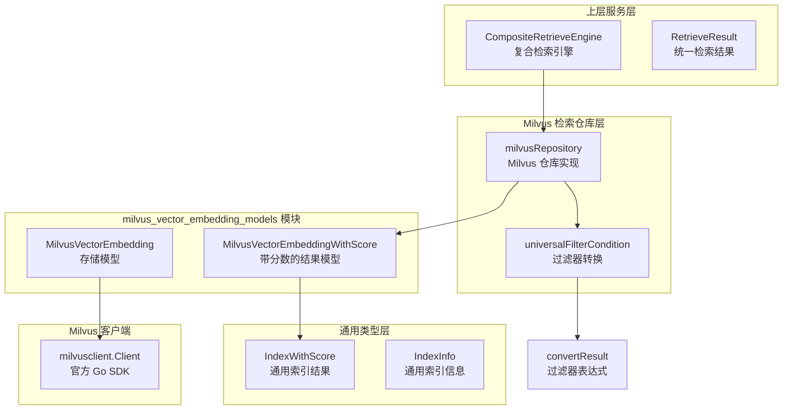

# Milvus Vector Embedding Models

## 概述

想象一下你正在构建一个多语言翻译系统 —— 你需要一种通用的"中间语言"来表示所有源语言和目标语言。`milvus_vector_embedding_models` 模块扮演的正是这样的角色：它是 Milvus 向量数据库与系统通用检索接口之间的**翻译层**。

这个模块存在的根本原因是：系统支持多种向量存储后端（Milvus、Elasticsearch、PostgreSQL、Qdrant），但上层的检索服务需要一个统一的接口。如果让每个后端直接暴露自己的数据结构，上层代码将不得不处理四种不同的数据格式，导致代码重复和脆弱性。这个模块通过定义 Milvus 专用的数据模型，实现了**存储细节的封装**和**接口的一致性**。

核心设计洞察是：**向量检索的本质是"带元数据的相似度搜索"**。无论底层使用什么数据库，每次检索都返回一组"向量 + 元数据 + 相似度分数"的结果。这个模块捕获了这一抽象，同时保留了 Milvus 特有的字段和类型约束。

## 架构与数据流



### 数据流 walkthrough

当用户发起一次知识检索请求时，数据在这个模块中的流动路径如下：

1. **请求进入**：`CompositeRetrieveEngine` 根据租户配置选择合适的检索引擎（可能是 Milvus）
2. **仓库调用**：Milvus 仓库实现（`milvusRepository`）接收检索参数，包括查询向量、过滤条件、top-k 值
3. **过滤器转换**：`universalFilterCondition` 将通用的过滤语法转换为 Milvus 的表达式格式（通过 `convertResult`）
4. **执行查询**：使用 Milvus Go SDK 客户端执行向量相似度搜索
5. **结果封装**：原始结果被封装为 `MilvusVectorEmbeddingWithScore` 对象
6. **模型转换**：在返回给上层之前，转换为通用的 `IndexWithScore` 格式

这个设计的关键在于**双向适配**：向下适配 Milvus 的 API 和数据结构，向上适配系统的统一检索接口。

## 核心组件深度解析

### MilvusVectorEmbedding

**设计目的**：这是 Milvus 集合（Collection）中每条记录的**内存表示**。它定义了存储在 Milvus 中的所有字段，是仓库层与 Milvus 客户端之间的数据契约。

**为什么需要这个结构而不是直接用 map 或 interface{}？**

想象一下如果你用 `map[string]interface{}` 来存储向量数据 —— 每次访问字段都需要类型断言，拼写错误要到运行时才能发现，而且 IDE 无法提供自动补全。`MilvusVectorEmbedding` 通过静态类型定义解决了这些问题，同时明确了"哪些字段是必需的，哪些是可选的"。

**字段语义分析**：

| 字段 | 类型 | 设计意图 |
|------|------|----------|
| `ID` | `string` | 主键，用于精确查找和去重 |
| `Content` | `string` | 原始文本内容，检索后直接返回给用户 |
| `SourceID` | `string` | 溯源字段，指向原始文档（如 PDF、Word 文件） |
| `SourceType` | `int` | 枚举类型，区分知识来源（手动录入/FAQ/自动提取） |
| `ChunkID` | `string` | 文本分片的唯一标识，用于关联 chunk 表 |
| `KnowledgeID` | `string` | 知识项 ID，支持细粒度权限控制 |
| `KnowledgeBaseID` | `string` | 知识库 ID，用于多租户隔离 |
| `TagID` | `string` | 标签 ID，支持基于标签的过滤和优先级排序 |
| `Embedding` | `[]float32` | 向量本身，float32 是 Milvus 的标准精度 |
| `IsEnabled` | `bool` | 软删除标记，避免物理删除导致的历史记录断裂 |

**内部机制**：这个结构本身是无状态的 POJO（Plain Old Go Object），但它的字段设计反映了几个关键约束：

1. **所有 ID 都是字符串**：即使底层数据库使用整数主键，这里统一用字符串，避免不同后端之间的类型差异
2. **Embedding 是 float32 而非 float64**：向量检索中 float32 的精度已经足够，且内存占用减半
3. **没有 CreatedAt/UpdatedAt**：时间戳由 Milvus 内部管理，不在应用层暴露

**副作用**：无。这是一个纯数据承载对象。

### MilvusVectorEmbeddingWithScore

**设计目的**：这是检索操作的**结果模型**。它通过嵌入（embedding，这里是 Go 的结构体嵌入，不是向量嵌入）`MilvusVectorEmbedding` 并添加 `Score` 字段，实现了"原始数据 + 检索元信息"的组合。

**为什么不用单独的结果结构而是嵌入？**

这是 Go 中常见的组合模式。想象一下如果你有一个快递包裹 —— 包裹本身（`MilvusVectorEmbedding`）加上物流信息（`Score`）才构成完整的配送单元。通过嵌入，你可以直接访问所有基础字段（`result.Content` 而不是 `result.Embedding.Content`），同时保持类型层次清晰。

**Score 字段的语义**：

```go
Score float64
```

这个分数是**相似度分数**，但需要注意：
- Milvus 返回的可能是距离（distance）或相似度（similarity），取决于索引类型
- IP（内积）距离下，值越大越相似
- L2（欧氏距离）下，值越小越相似
- 上层服务在合并多个后端结果时，需要统一分数语义

**使用模式**：

```go
// 典型的使用场景
results := []*MilvusVectorEmbeddingWithScore{...}

// 按分数排序
sort.Slice(results, func(i, j int) bool {
    return results[i].Score > results[j].Score
})

// 转换为通用格式
for _, r := range results {
    index := &types.IndexWithScore{
        ID:              r.ID,
        Content:         r.Content,
        Score:           r.Score,
        // ... 其他字段映射
    }
}
```

### milvusRepository（上下文参考）

虽然这个结构在代码中与数据模型同文件，但它属于仓库实现层。这里简要说明它与数据模型的关系：

```go
type milvusRepository struct {
    filter
    client             *client.Client
    collectionBaseName string
    initializedCollections sync.Map  // 维度 -> 已初始化标记
}
```

**关键设计点**：

1. **`initializedCollections sync.Map`**：这是一个并发安全的缓存，记录哪些向量维度已经创建了对应的集合。Milvus 中不同维度的向量需要不同的集合，这个缓存避免了每次插入都检查集合是否存在。

2. **`collectionBaseName`**：支持多租户场景，不同租户的集合名称会有前缀隔离。

3. **嵌入 `filter`**：组合了过滤器转换逻辑，体现了"组合优于继承"的原则。

## 依赖关系分析

### 上游依赖（谁调用这个模块）

| 调用方 | 依赖关系 | 期望契约 |
|--------|----------|----------|
| `milvusRepository` | 直接使用 | 需要结构与 Milvus SDK 的字段映射兼容 |
| `CompositeRetrieveEngine` | 间接使用 | 期望结果能转换为 `IndexWithScore` |
| `KnowledgeSearchTool` | 通过服务层 | 期望 `Content` 字段包含可读文本 |

### 下游依赖（这个模块调用谁）

| 被调用方 | 依赖关系 | 使用原因 |
|----------|----------|----------|
| `milvusclient.Client` | 直接依赖 | Milvus 官方 Go SDK，执行实际查询 |
| `universalFilterCondition` | 同包依赖 | 将通用过滤语法转换为 Milvus 表达式 |

### 数据契约

**输入契约**（从上层到本模块）：
```go
types.RetrieveParams{
    Query:      "用户问题",
    Vector:     []float32{...},  // 查询向量
    TopK:       10,
    Filters:    []FilterCondition{...},
    KnowledgeBaseID: "kb-123",
}
```

**输出契约**（从本模块到上层）：
```go
[]*types.IndexWithScore{
    {
        ID: "vec-456",
        Content: "答案内容",
        Score: 0.95,
        KnowledgeBaseID: "kb-123",
        // ...
    },
}
```

**关键约束**：
1. `Embedding` 字段必须是 `[]float32`，与 Milvus 的 `FloatVector` 类型匹配
2. 所有 ID 字段不能为空（空字符串会导致 Milvus 插入失败）
3. `IsEnabled` 默认为 `true`，新插入的记录默认参与检索

## 设计决策与权衡

### 1. 为什么 MilvusVectorEmbedding 和 IndexWithScore 字段不完全一致？

**观察**：`MilvusVectorEmbedding` 有 `Embedding []float32` 字段，但 `IndexWithScore` 没有。

**原因**：检索结果通常不需要返回向量本身。向量可能很大（768 维 float32 约 3KB），返回给上层会浪费带宽和内存。只有在需要"查询扩展"或"二次检索"场景才会用到向量，这些场景由专门的方法处理。

**权衡**：这增加了模型转换的复杂度，但节省了 90%+ 场景下的资源消耗。

### 2. 为什么使用 sync.Map 而不是普通 map + mutex？

**观察**：`initializedCollections` 使用 `sync.Map`。

**原因**：这个缓存是"写少读多"的典型场景 —— 集合初始化只在第一次插入时发生，之后每次插入都只需要读取。`sync.Map` 针对这种场景做了优化，避免了全局锁竞争。

**权衡**：`sync.Map` 在频繁写入场景下性能不如 `map + mutex`，但这里的设计假设是正确的。

### 3. 为什么 Score 是 float64 而 Embedding 是 float32？

**观察**：精度不一致。

**原因**：
- `Embedding` 用 float32：向量本身很大，float32 足够表示语义信息
- `Score` 用 float64：相似度分数需要高精度排序，尤其是当多个结果分数接近时

**权衡**：类型转换有微小开销，但保证了排序的稳定性。

### 4. 为什么没有使用泛型？

**观察**：如果有泛型，可以定义 `VectorEmbedding[T float32|float64]`。

**原因**：Go 泛型在数据库/ORM 场景下的生态还不成熟，Milvus SDK 本身使用具体类型。保持与 SDK 一致减少了转换层。

**权衡**：牺牲了一定的通用性，换取了与官方 SDK 的兼容性。

## 使用指南

### 基本使用模式

```go
// 1. 创建嵌入对象
embedding := &MilvusVectorEmbedding{
    ID:              uuid.New().String(),
    Content:         "知识内容",
    SourceID:        "doc-123",
    SourceType:      1,  // 手动录入
    ChunkID:         "chunk-456",
    KnowledgeID:     "know-789",
    KnowledgeBaseID: "kb-001",
    TagID:           "tag-002",
    Embedding:       vector,  // []float32
    IsEnabled:       true,
}

// 2. 插入到 Milvus（通过仓库层）
err := repo.Insert(ctx, embedding)

// 3. 执行检索
results, err := repo.Search(ctx, SearchParams{
    Vector: queryVector,
    TopK:   10,
    Filter: Filter{
        Field:    "knowledge_base_id",
        Operator: "eq",
        Value:    "kb-001",
    },
})

// 4. 处理结果
for _, result := range results {
    fmt.Printf("ID: %s, Score: %.4f, Content: %s\n", 
        result.ID, result.Score, result.Content)
}
```

### 过滤器使用

```go
// 单条件过滤
filter := &universalFilterCondition{
    Field:    "is_enabled",
    Operator: "eq",
    Value:    true,
}

// 多条件组合（AND）
filter := &universalFilterCondition{
    Operator: "and",
    Value: []any{
        &universalFilterCondition{
            Field:    "knowledge_base_id",
            Operator: "eq",
            Value:    "kb-001",
        },
        &universalFilterCondition{
            Field:    "source_type",
            Operator: "in",
            Value:    []int{1, 2},  // 手动录入或 FAQ
        },
    },
}
```

### 配置选项

Milvus 仓库的配置通常在初始化时传入：

```go
repo := NewMilvusRepository(MilvusConfig{
    Endpoint:         "localhost:19530",
    CollectionPrefix: "tenant-123_",
    DefaultDimension: 768,
})
```

## 边界情况与陷阱

### 1. 向量维度不匹配

**问题**：尝试将 768 维向量插入到为 384 维创建的集合中。

**表现**：Milvus 返回错误 `"vector dimension mismatch"`。

**解决方案**：使用 `initializedCollections` 缓存确保同一知识库使用固定维度。在插入前检查：

```go
if _, ok := r.initializedCollections.Load(dimension); !ok {
    // 创建新集合
    r.createCollection(ctx, dimension)
    r.initializedCollections.Store(dimension, true)
}
```

### 2. 分数语义混淆

**问题**：不同索引类型返回的分数含义不同（IP vs L2）。

**表现**：合并多个检索结果时排序错误。

**解决方案**：在 `CompositeRetrieveEngine` 层统一分数语义，确保所有结果都是"越大越好"。

### 3. 过滤器注入风险

**问题**：用户控制的过滤值可能包含特殊字符。

**表现**：Milvus 表达式解析失败或意外行为。

**解决方案**：`convertResult` 使用参数化查询：

```go
type convertResult struct {
    exprStr string
    params  map[string]any  // 参数绑定，避免拼接字符串
}
```

### 4. 并发插入竞争

**问题**：多个 goroutine 同时插入同一维度的向量。

**表现**：重复创建集合或集合创建失败。

**解决方案**：`sync.Map` 确保读取无锁，集合创建使用 `sync.Once` 或分布式锁。

### 5. 软删除与硬删除的混淆

**问题**：`IsEnabled = false` 的记录仍然占用存储空间。

**表现**：Milvus 集合无限增长，查询性能下降。

**解决方案**：定期运行清理任务，物理删除长期禁用的记录：

```go
// 伪代码
func CleanupDisabledRecords(ctx context.Context, threshold time.Duration) {
    cutoff := time.Now().Add(-threshold)
    ids := repo.FindDisabledBefore(ctx, cutoff)
    repo.HardDelete(ctx, ids)
}
```

## 扩展点

### 添加新的过滤操作符

在 `universalFilterCondition.Operator` 中添加新的枚举值，并在 `convertResult` 的转换逻辑中处理：

```go
// 在 filter/convert.go 中
case "contains":
    expr = fmt.Sprintf("array_contains(%s, ?)", field)
    params = []any{value}
```

### 支持新的向量类型

Milvus 支持 `BinaryVector` 和 `Float16Vector`。如需支持：

```go
type MilvusVectorEmbedding struct {
    // ... 现有字段
    EmbeddingType string    // "float32" | "binary" | "float16"
    Embedding     []byte    // 统一用 byte 数组，根据类型解释
}
```

### 添加元数据字段

直接在结构体中添加字段，确保 Milvus 集合 schema 同步更新：

```go
type MilvusVectorEmbedding struct {
    // ... 现有字段
    Metadata    map[string]string  // JSON 字段，存储扩展元数据
}
```

## 相关模块

- [milvus_filter_and_result_mapping](milvus_filter_and_result_mapping.md) — 过滤器转换和结果映射逻辑
- [milvus_repository_implementation](milvus_repository_implementation.md) — Milvus 仓库的完整实现
- [elasticsearch_vector_embedding_models](elasticsearch_vector_embedding_models.md) — Elasticsearch 后端的对应模型
- [postgres_vector_embedding_models](postgres_vector_embedding_models.md) — PostgreSQL 后端的对应模型
- [RetrieveEngine](core_domain_types_and_interfaces.md) — 通用检索引擎接口定义
