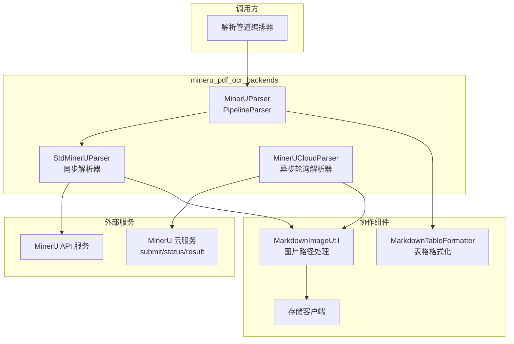

# MinerU PDF OCR Backends 模块深度解析

## 模块概述

想象一下，你面前有一堆扫描版的 PDF 文件 —— 它们本质上是图片的集合，传统的文本提取方法对它们束手无策。`mineru_pdf_ocr_backends` 模块就是为了解决这个"文档数字化最后一公里"问题而存在的。它封装了 MinerU 文档解析服务，将扫描版 PDF、图片文档等复杂格式转换为结构化的 Markdown 文本，同时智能提取其中的表格、公式和内嵌图片。

这个模块的核心洞察在于：**文档解析不是单一操作，而是一个多阶段的流水线**。MinerU 本身提供了强大的 OCR 和布局分析能力，但原始输出需要经过表格格式化、图片上传、路径替换等后处理才能真正被下游系统使用。因此，本模块采用了**解析器管道（Parser Pipeline）**模式，将原始解析、表格格式化、图片处理等关注点分离，每个阶段只负责一件事，但组合起来能处理复杂的真实场景。

模块位于 `docreader/parser/mineru_parser.py`，是 [`docreader_pipeline`](docreader_pipeline.md) 中处理 PDF 和 OCR 驱动解析的核心组件之一，与 [`pdf_parser`](docreader_pipeline.md)、[`image_parser`](docreader_pipeline.md) 共同构成文档解析的"重武器"。

## 架构设计



### 组件角色与数据流

**MinerUParser** 是模块的对外入口，它继承自 [`PipelineParser`](docreader_pipeline.md)，内部组合了两个解析器：
1. `StdMinerUParser`：负责调用 MinerU API 进行原始文档解析
2. `MarkdownTableFormatter`：负责标准化 Markdown 表格格式

这种设计的关键在于**关注点分离**：`StdMinerUParser` 专注于与 MinerU 服务通信并提取原始内容，而 `MarkdownTableFormatter` 专注于文本后处理。两者通过 `PipelineParser` 的管道机制串联，前者的输出自动成为后者的输入。

**数据流**如下：
```
原始 PDF 字节流
    ↓
StdMinerUParser.parse_into_text()
    ├─→ 调用 MinerU API (/file_parse)
    ├─→ 获取 Markdown 内容 + Base64 图片
    ├─→ 上传图片到对象存储
    └─→ 返回 Document(content, images)
    ↓
MarkdownTableFormatter.parse_into_text()
    ├─→ 解析 Markdown 表格语法
    └─→ 标准化表格格式（对齐、间距）
    ↓
最终 Document 对象
```

**MinerUCloudParser** 是 `StdMinerUParser` 的变体，针对**远程/云部署**场景设计。它采用异步任务模式（提交 → 轮询 → 获取结果），适合处理大文件或高延迟网络环境。这种设计权衡了**响应时间**与**可靠性**：同步模式简单直接但可能超时，异步模式复杂但能处理长时间运行的任务。

## 核心组件深度解析

### StdMinerUParser：同步解析器

**设计意图**：作为 MinerU 服务的直接适配器，将 HTTP API 的响应转换为系统内部的 `Document` 模型。

**关键方法**：

#### `__init__(enable_markdownify, mineru_endpoint, **kwargs)`

构造函数接收两个关键参数：
- `enable_markdownify`：是否将 HTML 表格转换为 Markdown 格式。MinerU 返回的表格可能是 HTML 格式，这个选项控制是否使用 `markdownify` 库进行转换。
- `mineru_endpoint`：MinerU 服务的 API 地址。支持通过参数覆盖全局配置（`CONFIG.mineru_endpoint`），这在多租户或测试场景下非常有用。

初始化时会执行 `ping()` 方法探测 API 可用性，如果探测失败，解析器会静默禁用（`self.enable = False`），避免后续调用时反复失败。这是一种**快速失败（Fail-Fast）**策略的变体 —— 在初始化时发现问题，而不是在运行时。

#### `parse_into_text(content: bytes) -> Document`

这是解析器的核心方法，执行流程如下：

1. **API 调用**：向 `/file_parse` 端点发送 POST 请求，携带详细的解析配置：
   ```python
   {
       "return_md": True,           # 返回 Markdown 内容
       "return_images": True,       # 返回提取的图片
       "lang_list": ["ch", "en"],   # 支持中英文
       "table_enable": True,        # 启用表格识别
       "formula_enable": True,      # 启用公式识别
       "parse_method": "auto",      # 自动选择解析方法
       "backend": "pipeline",       # 使用流水线后端
       ...
   }
   ```
   这些配置体现了模块的**默认最佳实践**：同时支持中英文、启用所有高级特性、使用最稳健的解析后端。

2. **图片处理**：MinerU 返回的图片是 Base64 编码的，需要：
   - 解析 Base64 数据，提取图片格式（png/jpg 等）
   - 解码为二进制数据
   - 上传到对象存储（COS/MinIO/本地）
   - 建立本地路径到存储 URL 的映射

   这里有一个关键优化：**只处理 Markdown 中实际引用的图片**。MinerU 返回的 `images_b64` 可能包含表格中嵌入的图片（这些图片在 Markdown 中不可见），模块通过检查 `images/{ipath}` 是否在 `md_content` 中来过滤掉这些"孤儿图片"。

3. **路径替换**：使用 `MarkdownImageUtil.replace_path()` 将 Markdown 中的临时路径（如 `images/0.png`）替换为实际的存储 URL。这一步确保了返回的 `Document` 中的图片引用是持久化的。

**返回值**：`Document` 对象，包含：
- `content`：处理后的 Markdown 文本
- `images`：字典，键为存储 URL，值为 Base64 数据（用于后续 OCR 或 Caption 生成）

**副作用**：
- 上传图片到对象存储
- 记录日志（解析成功/失败、图片数量等）

### MinerUCloudParser：异步轮询解析器

**设计意图**：解决同步模式在处理大文件时的超时问题。云部署的 MinerU 服务可能需要数分钟才能完成解析，HTTP 请求的超时限制（通常 30-60 秒）无法满足需求。

**核心机制**：采用经典的**提交 - 轮询 - 获取**（Submit-Poll-Result）模式：

```python
# 1. 提交任务
POST /submit → { "task_id": "xxx" }

# 2. 轮询状态
GET /status/{task_id} → { "status": "processing" | "done" | "failed" }

# 3. 获取结果
GET /result/{task_id} → { "md_content": "...", "images": {...} }
```

**关键参数**：
- `SUBMIT_TIMEOUT = 30`：提交请求的超时时间（秒）
- `POLL_INTERVAL = 2`：轮询间隔（秒）
- `MAX_WAIT_TIME = 600`：最大等待时间（10 分钟）

这些参数体现了**保守的超时策略**：提交阶段快速失败（30 秒），但轮询阶段给予充足时间（10 分钟）。轮询间隔 2 秒是在**响应速度**和**服务器压力**之间的权衡 —— 太短会增加服务器负担，太长会延迟结果获取。

**健壮性设计**：
1. **任务 ID 提取的容错**：
   ```python
   task_id = resp_data.get("task_id") or resp_data.get("data", {}).get("task_id")
   ```
   兼容两种可能的响应格式，避免因 API 版本差异导致解析失败。

2. **状态检查的网络容错**：
   ```python
   except requests.RequestException as e:
       logger.warning(f"Status check failed for {task_id}: {e}. Retrying...")
       time.sleep(self.POLL_INTERVAL)
       continue
   ```
   单次网络错误不会导致任务失败，而是继续轮询。这假设网络问题是暂时的，符合**最终一致性**的思想。

3. **状态字段的容错**：
   ```python
   state = status_data.get("status") or status_data.get("state")
   ```
   兼容不同的状态字段命名。

**代码复用**：`MinerUCloudParser` 继承了 `StdMinerUParser` 的图片和表格处理逻辑，只重写了 `parse_into_text()` 的核心流程。这体现了**模板方法模式**的变体：父类提供通用的后处理逻辑，子类定制核心的解析流程。

### MinerUParser：管道编排器

**设计意图**：将 `StdMinerUParser` 和 `MarkdownTableFormatter` 组合成一个统一的解析器，对外提供单一接口。

**实现机制**：
```python
class MinerUParser(PipelineParser):
    _parser_cls = (StdMinerUParser, MarkdownTableFormatter)
```

这行代码定义了管道中的解析器序列。`PipelineParser` 的 `parse_into_text()` 方法会依次调用每个解析器，并将前一个的输出作为后一个的输入：

```python
# PipelineParser.parse_into_text() 的简化逻辑
document = Document()
for p in self._parsers:  # [StdMinerUParser(), MarkdownTableFormatter()]
    document = p.parse_into_text(content)
    content = endecode.encode_bytes(document.content)  # 转为字节传给下一个
    images.update(document.images)  # 累积图片
document.images.update(images)
return document
```

**设计权衡**：
- **优点**：关注点分离，每个解析器只负责一个转换步骤；易于扩展（添加新的解析器到管道）；易于测试（可以单独测试每个解析器）。
- **缺点**：每次转换都需要序列化/反序列化（`content` 转 `bytes` 再转回 `str`）；图片需要累积合并，增加了内存开销。

对于大多数场景，这种开销是可接受的，因为解析操作本身（调用 MinerU API）是主要瓶颈。

## 依赖关系分析

### 上游依赖（被谁调用）

`mineru_pdf_ocr_backends` 模块主要被 [`docreader_pipeline`](docreader_pipeline.md) 中的解析器调度逻辑调用。典型的调用链：

```
internal.application.service.extract.ChunkExtractService
    ↓
docreader.parser.parser.Parser (工厂类)
    ↓
MinerUParser (根据文件类型和配置选择)
    ↓
parse_into_text() / parse()
```

调用方期望的行为：
1. 输入原始文件字节流，输出 `Document` 对象
2. 解析失败时返回空的 `Document`（而不是抛出异常）
3. 图片 URL 是持久化的（可长期访问）

### 下游依赖（调用谁）

| 依赖组件 | 用途 | 耦合程度 |
|---------|------|---------|
| `requests` | HTTP 客户端，调用 MinerU API | 紧耦合（直接导入） |
| `markdownify` | HTML 表格转 Markdown | 松耦合（可配置启用/禁用） |
| `docreader.config.CONFIG` | 读取 `mineru_endpoint` 等配置 | 紧耦合（全局单例） |
| `docreader.parser.storage` | 上传图片到对象存储 | 紧耦合（通过 `self.storage`） |
| `docreader.parser.markdown_parser.MarkdownImageUtil` | 图片路径替换 | 紧耦合（类方法调用） |
| `docreader.parser.markdown_parser.MarkdownTableFormatter` | 表格格式化（管道内） | 紧耦合（管道组合） |

**数据契约**：
- 与 MinerU API 的契约：请求/响应格式由 MinerU 服务定义，模块假设 API 遵循特定格式（如 `results.files.md_content`）。如果 API 变更，需要适配响应解析逻辑。
- 与存储服务的契约：`storage.upload_bytes()` 返回可公开访问的 URL。如果存储服务变更（如从 COS 切换到 S3），需要确保 URL 格式兼容。

## 设计决策与权衡

### 1. 同步 vs 异步：为什么有两种解析器？

**问题**：处理 PDF 解析时，同步 HTTP 请求简单但可能超时，异步轮询可靠但复杂。

**选择**：同时提供 `StdMinerUParser`（同步）和 `MinerUCloudParser`（异步）。

**权衡分析**：
- **同步模式**适合：
  - 本地部署的 MinerU 服务（低延迟）
  - 小文件（< 10MB）
  - 对响应时间敏感的场景

- **异步模式**适合：
  - 云部署的 MinerU 服务（高延迟）
  - 大文件（> 50MB）
  - 批量处理任务（可后台运行）

这种设计体现了**场景分离**的原则：不试图用一种方案解决所有问题，而是针对不同场景提供最优解。调用方可以根据部署环境选择合适的解析器。

**潜在改进**：可以引入自适应策略 —— 先尝试同步模式，如果超时则自动切换到异步模式。但这会增加复杂性，当前设计保持了简单性。

### 2. 图片处理：为什么先上传再替换路径？

**问题**：MinerU 返回的图片是 Base64 数据，如何持久化？

**选择**：立即上传到对象存储，然后用存储 URL 替换 Markdown 中的临时路径。

**权衡分析**：
- **优点**：
  - 图片与文档解耦：文档只存储 URL，不存储二进制数据
  - 支持 CDN 加速：对象存储通常有 CDN 集成
  - 统一访问控制：通过存储服务的权限管理控制图片访问

- **缺点**：
  - 增加了一次网络调用（上传）
  - 依赖存储服务的可用性
  - 如果上传失败，图片会丢失（当前实现会跳过失败的图片）

**替代方案**：
1. 将 Base64 数据直接嵌入 Markdown：会导致文档体积膨胀，不适合大图片。
2. 延迟上传（在需要时再上传）：增加了访问图片时的延迟，且需要维护状态。

当前选择是在**文档轻量化**和**处理复杂度**之间的平衡。

### 3. 错误处理：为什么解析失败返回空 Document 而不是抛异常？

**问题**：MinerU API 调用失败时，应该抛异常还是返回空结果？

**选择**：返回空的 `Document()`，记录错误日志。

**权衡分析**：
- **优点**：
  - 调用方不需要处理异常，简化了上层逻辑
  - 支持"尽力而为"的解析策略：即使 MinerU 失败，仍可尝试其他解析器
  - 符合 [`BaseParser`](docreader_pipeline.md) 的设计契约

- **缺点**：
  - 调用方需要检查 `document.is_valid()` 判断是否成功
  - 错误信息可能被忽略（如果调用方不检查日志）

这种设计体现了**防御性编程**的思想：解析器是"可失败的组件"，失败不应导致整个流程崩溃。调用方可以根据业务需求决定如何处理空结果（如降级到其他解析器、提示用户上传失败等）。

### 4. 管道模式：为什么不用单一解析器完成所有工作？

**问题**：为什么不把表格格式化逻辑直接写在 `StdMinerUParser` 里？

**选择**：使用 `PipelineParser` 组合多个解析器。

**权衡分析**：
- **优点**：
  - 单一职责：每个解析器只关注一个转换
  - 可复用：`MarkdownTableFormatter` 可以被其他解析器使用
  - 可测试：可以单独测试表格格式化逻辑
  - 可扩展：轻松添加新的后处理步骤（如公式标准化）

- **缺点**：
  - 增加了代码复杂度（需要理解管道机制）
  - 性能开销（多次序列化/反序列化）

对于文档解析这种**多阶段转换**场景，管道模式是经典选择。性能开销相对于 API 调用时间可以忽略不计。

## 使用指南

### 基本用法

```python
from docreader.parser.mineru_parser import MinerUParser

# 使用默认配置（从环境变量读取 MINERU_ENDPOINT）
parser = MinerUParser()

# 或自定义 endpoint
parser = MinerUParser(mineru_endpoint="http://localhost:9987")

# 解析 PDF 文件
with open("document.pdf", "rb") as f:
    content = f.read()
    document = parser.parse_into_text(content)

# 检查结果
if document.is_valid():
    print(f"解析成功：{len(document.content)} 字符，{len(document.images)} 张图片")
    print(document.content)
else:
    print("解析失败，检查日志")
```

### 使用异步解析器

```python
from docreader.parser.mineru_parser import MinerUCloudParser

# 云部署场景
parser = MinerUCloudParser(mineru_endpoint="https://mineru.example.com")

with open("large_document.pdf", "rb") as f:
    document = parser.parse_into_text(f.read())
    # 自动处理提交 - 轮询 - 获取流程
```

### 配置选项

通过环境变量配置：

```bash
# MinerU 服务地址（必需）
export DOCREADER_MINERU_ENDPOINT=http://localhost:9987

# 存储配置（图片上传）
export DOCREADER_STORAGE_TYPE=minio
export DOCREADER_MINIO_ENDPOINT=minio.example.com
export DOCREADER_MINIO_ACCESS_KEY_ID=xxx
export DOCREADER_MINIO_SECRET_ACCESS_KEY=xxx
export DOCREADER_MINIO_BUCKET_NAME=WeKnora

# 可选：禁用表格转换
# 在代码中设置 enable_markdownify=False
```

### 与 ChunkExtractService 集成

```python
# internal.application.service.extract.ChunkExtractService 中的典型用法
from docreader.parser.mineru_parser import MinerUParser

def extract_chunks(file_bytes: bytes, file_type: str) -> List[Chunk]:
    parser = MinerUParser(
        chunking_config=self.config,
        enable_multimodal=True,
    )
    document = parser.parse(file_bytes)  # 注意是 parse() 不是 parse_into_text()
    return document.chunks
```

注意：`parse()` 方法会额外执行分块（chunking）和图片处理（如果启用多模态），而 `parse_into_text()` 只返回原始文本和图片。

## 边界情况与注意事项

### 1. MinerU API 不可用

**现象**：解析器初始化时 `ping()` 失败，`self.enable = False`。

**行为**：`parse_into_text()` 直接返回空 `Document()`，不执行任何 API 调用。

**处理建议**：
- 检查日志中的 "MinerU API is not enabled" 消息
- 确认 `MINERU_ENDPOINT` 配置正确
- 确认 MinerU 服务正在运行

### 2. 图片上传失败

**现象**：`storage.upload_bytes()` 抛出异常或返回 `None`。

**行为**：当前实现会跳过该图片，继续处理其他图片。Markdown 中的图片路径不会被替换，导致图片引用失效。

**处理建议**：
- 检查存储服务配置（COS/MinIO 凭证、桶名称等）
- 检查网络连接（存储服务是否可达）
- 考虑在调用方检查 `document.images` 是否为空

### 3. 大文件超时

**现象**：同步模式下，`requests.post()` 超时（默认 1000 秒）。

**行为**：捕获异常，返回空 `Document()`。

**处理建议**：
- 对于 > 50MB 的文件，使用 `MinerUCloudParser` 异步模式
- 调整 `MAX_WAIT_TIME` 参数（当前 600 秒）
- 考虑在调用方实现重试逻辑

### 4. 表格格式化异常

**现象**：`markdownify.markdownify()` 处理特殊 HTML 表格时失败。

**行为**：异常会向上传播，导致整个解析失败。

**处理建议**：
- 设置 `enable_markdownify=False` 禁用表格转换
- 在 `MarkdownTableFormatter` 中添加异常处理（当前实现没有）

### 5. Base64 图片解码失败

**现象**：Base64 数据格式不正确，`endecode.encode_image()` 返回 `None`。

**行为**：跳过该图片，记录错误日志。

**处理建议**：
- 检查 MinerU 服务返回的图片数据格式
- 确认 `endecode.encode_image()` 实现正确

### 6. 并发图片处理限制

**现象**：处理包含大量图片的文档时，内存占用高。

**行为**：`BaseParser` 中的 `max_concurrent_tasks` 限制并发数（默认 5）。

**处理建议**：
- 调整 `max_concurrent_tasks` 参数
- 考虑流式处理图片（当前实现是一次性加载所有图片）

## 性能考虑

### 主要瓶颈

1. **MinerU API 调用**：通常是主要耗时操作，取决于：
   - 文件大小（页数）
   - 服务器负载
   - 网络延迟

2. **图片上传**：每个图片都需要一次上传操作，总耗时 = 图片数量 × 单张图片上传时间。

3. **表格格式化**：`markdownify` 处理大型 HTML 表格时可能较慢。

### 优化建议

1. **批量处理**：对于多个文件，考虑并行调用解析器（注意 MinerU 服务的并发限制）。

2. **图片缓存**：如果同一张图片出现在多个文档中，可以考虑缓存上传结果（当前实现每次都会上传）。

3. **异步解析器调优**：
   - 增加 `POLL_INTERVAL` 减少服务器压力（如 5 秒）
   - 减少 `MAX_WAIT_TIME` 避免长时间等待（如 300 秒）

## 测试与调试

### 本地测试

```python
if __name__ == "__main__":
    import os
    import logging

    logging.basicConfig(level=logging.DEBUG)

    # 配置测试参数
    test_endpoint = "http://localhost:9987"
    os.environ["MINERU_ENDPOINT"] = test_endpoint

    parser = MinerUParser(mineru_endpoint=test_endpoint)

    with open("/path/to/test.pdf", "rb") as f:
        document = parser.parse_into_text(f.read())
        print(document.content)
```

### 调试技巧

1. **启用调试日志**：
   ```python
   logging.basicConfig(level=logging.DEBUG)
   ```
   可以看到详细的 API 调用、图片处理过程。

2. **检查 API 可用性**：
   ```python
   parser = MinerUParser()
   print(f"MinerU API enabled: {parser.enable}")
   ```

3. **验证图片上传**：
   检查 `document.images` 字典，确认 URL 格式正确且可访问。

## 相关模块

- [`docreader_pipeline`](docreader_pipeline.md)：解析器管道的整体架构
- [`pdf_parser`](docreader_pipeline.md)：另一种 PDF 解析方案（基于 PyMuPDF）
- [`image_parser`](docreader_pipeline.md)：纯图片解析方案
- [`markdown_parser`](docreader_pipeline.md)：Markdown 解析和工具类（`MarkdownImageUtil`、`MarkdownTableFormatter`）
- [`application_services_and_orchestration`](application_services_and_orchestration.md)：上层的 `ChunkExtractService` 和 `knowledgeService`

## 总结

`mineru_pdf_ocr_backends` 模块是文档解析流水线中的"重型武器"，专门处理扫描版 PDF 等复杂文档。它的核心设计思想是：

1. **管道模式**：将解析、格式化、图片处理分离为独立阶段
2. **双模式支持**：同步模式简单快速，异步模式可靠稳健
3. **防御性编程**：解析失败返回空结果，不中断整体流程
4. **关注点分离**：解析器只负责解析，存储由专门的存储服务处理

理解这个模块的关键在于把握**多阶段转换**的本质：原始 PDF → MinerU 解析 → Markdown + Base64 图片 → 图片上传 → 路径替换 → 表格格式化 → 最终 Document。每个阶段都有明确的输入输出契约，组合起来形成完整的解析能力。
