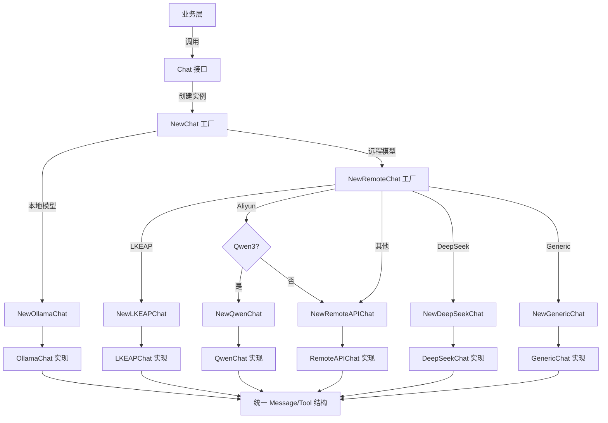

# chat_core_message_and_tool_contracts 模块深度解析

## 1. 模块概述

### 1.1 问题空间

在构建多模型支持的 AI 聊天系统时，我们面临一个核心挑战：不同的 LLM 提供商（OpenAI、DeepSeek、Qwen、Ollama 等）虽然都提供了聊天补全和工具调用功能，但它们的 API 合同存在微妙但关键的差异。如果直接在业务逻辑中处理这些差异，会导致代码重复、可维护性差，并且难以扩展新的模型提供商。

想象一下：每次添加一个新的 LLM 提供商，你都要在 10 个不同的地方修改代码来处理消息格式、工具调用参数、响应结构的差异。这不仅容易出错，还会让业务逻辑变得混乱。

### 1.2 解决方案

`chat_core_message_and_tool_contracts` 模块通过定义一组统一的抽象合同，解耦了业务逻辑与具体的 LLM 提供商实现。它就像一个适配器层的"协议标准"，让所有提供商的实现都遵循同一套接口，同时又能容纳各自的特殊性。

**核心设计思想**：
- 定义统一的数据结构（`Message`、`Tool`、`ToolCall` 等）作为所有交互的"共同语言"
- 通过 `Chat` 接口抽象出聊天交互的核心能力
- 用工厂模式（`NewChat`、`NewRemoteChat`）根据配置选择合适的实现

## 2. 核心抽象与数据模型

### 2.1 工具与函数定义

```go
// Tool 表示一个工具/函数定义
type Tool struct {
    Type     string      `json:"type"` // "function"
    Function FunctionDef `json:"function"`
}

// FunctionDef 表示函数定义
type FunctionDef struct {
    Name        string          `json:"name"`
    Description string          `json:"description"`
    Parameters  json.RawMessage `json:"parameters"`
}
```

**设计意图**：
- `Tool` 采用了 OpenAI 风格的嵌套结构，这是因为 OpenAI 的格式已经成为行业事实标准
- `Parameters` 使用 `json.RawMessage` 而不是具体的结构体，这是一个关键的设计决策：它允许我们传递任意格式的参数 schema（JSON Schema、OpenAPI 等），而不需要在核心层定义所有可能的格式

### 2.2 消息模型

```go
// Message 表示聊天消息
type Message struct {
    Role       string     `json:"role"`                   // 角色：system, user, assistant, tool
    Content    string     `json:"content"`                // 消息内容
    Name       string     `json:"name,omitempty"`         // Function/tool name (for tool role)
    ToolCallID string     `json:"tool_call_id,omitempty"` // Tool call ID (for tool role)
    ToolCalls  []ToolCall `json:"tool_calls,omitempty"`   // Tool calls (for assistant role)
}
```

**设计意图**：
- 这个结构是多角色的：它既可以表示用户消息、系统提示，也可以表示助手的工具调用请求和工具的执行结果
- `ToolCalls` 字段支持并行工具调用（这是现代 LLM 的重要特性）
- 所有字段都使用 `omitempty`，这使得序列化时可以灵活地适应不同提供商的要求

### 2.3 工具调用模型

```go
// ToolCall 表示消息中的工具调用
type ToolCall struct {
    ID       string       `json:"id"`
    Type     string       `json:"type"` // "function"
    Function FunctionCall `json:"function"`
}

// FunctionCall 表示函数调用
type FunctionCall struct {
    Name      string `json:"name"`
    Arguments string `json:"arguments"` // JSON string
}
```

**设计意图**：
- `Arguments` 是字符串而不是结构化数据，这是因为不同提供商可能返回不同格式的参数（有些是 JSON 字符串，有些是结构化对象），保持字符串形式可以最大程度地兼容

### 2.4 聊天选项

```go
// ChatOptions 聊天选项
type ChatOptions struct {
    Temperature         float64         `json:"temperature"`
    TopP                float64         `json:"top_p"`
    Seed                int             `json:"seed"`
    MaxTokens           int             `json:"max_tokens"`
    MaxCompletionTokens int             `json:"max_completion_tokens"`
    FrequencyPenalty    float64         `json:"frequency_penalty"`
    PresencePenalty     float64         `json:"presence_penalty"`
    Thinking            *bool           `json:"thinking"`
    Tools               []Tool          `json:"tools,omitempty"`
    ToolChoice          string          `json:"tool_choice,omitempty"`
    Format              json.RawMessage `json:"format,omitempty"`
}
```

**设计意图**：
- 涵盖了主流 LLM 的所有常用参数，但都是可选的
- `Thinking` 使用指针类型 `*bool`，这样可以区分"未设置"和"设置为 false"两种状态（这对于某些提供商的特殊处理很重要）
- `Format` 同样使用 `json.RawMessage` 来支持不同的响应格式要求（JSON mode、结构化输出等）

## 3. 核心接口与工厂模式

### 3.1 Chat 接口

```go
// Chat 定义了聊天接口
type Chat interface {
    // Chat 进行非流式聊天
    Chat(ctx context.Context, messages []Message, opts *ChatOptions) (*types.ChatResponse, error)

    // ChatStream 进行流式聊天
    ChatStream(ctx context.Context, messages []Message, opts *ChatOptions) (<-chan types.StreamResponse, error)

    // GetModelName 获取模型名称
    GetModelName() string

    // GetModelID 获取模型ID
    GetModelID() string
}
```

**设计意图**：
- 这是整个模块的核心抽象，它定义了任何聊天实现都必须提供的能力
- 明确区分了非流式（`Chat`）和流式（`ChatStream`）两种交互模式
- 流式返回使用 Go 的 channel，这是处理异步流的自然方式

### 3.2 工厂模式与提供商选择

```go
// NewChat 创建聊天实例
func NewChat(config *ChatConfig, ollamaService *ollama.OllamaService) (Chat, error) {
    switch strings.ToLower(string(config.Source)) {
    case string(types.ModelSourceLocal):
        return NewOllamaChat(config, ollamaService)
    case string(types.ModelSourceRemote):
        return NewRemoteChat(config)
    default:
        return nil, fmt.Errorf("unsupported chat model source: %s", config.Source)
    }
}

// NewRemoteChat 根据 provider 创建远程聊天实例
func NewRemoteChat(config *ChatConfig) (Chat, error) {
    providerName := provider.ProviderName(config.Provider)
    if providerName == "" {
        providerName = provider.DetectProvider(config.BaseURL)
    }

    switch providerName {
    case provider.ProviderLKEAP:
        return NewLKEAPChat(config)
    case provider.ProviderAliyun:
        if provider.IsQwen3Model(config.ModelName) {
            return NewQwenChat(config)
        }
        return NewRemoteAPIChat(config)
    case provider.ProviderDeepSeek:
        return NewDeepSeekChat(config)
    case provider.ProviderGeneric:
        return NewGenericChat(config)
    default:
        return NewRemoteAPIChat(config)
    }
}
```

**设计意图**：
- 采用两级工厂模式：首先按模型来源（本地/远程）分流，然后按具体提供商进一步选择
- 支持自动检测提供商（`provider.DetectProvider`），这使得配置更加灵活
- 针对特殊提供商的特殊处理（如 Qwen3 模型、DeepSeek 的 tool_choice 限制）被封装在工厂函数中，而不是散落在业务逻辑里

## 4. 架构与数据流向



### 4.1 数据流向说明

1. **初始化阶段**：业务层通过 `NewChat` 工厂创建 `Chat` 实例，工厂根据配置选择合适的实现
2. **请求阶段**：业务层构造统一格式的 `Message` 数组和 `ChatOptions`，调用 `Chat` 或 `ChatStream` 方法
3. **适配阶段**：具体的 `Chat` 实现将统一格式转换为对应提供商的 API 格式
4. **响应阶段**：提供商的响应被转换回统一的 `types.ChatResponse` 或 `types.StreamResponse` 格式

## 5. 设计决策与权衡

### 5.1 为什么使用 json.RawMessage？

**选择**：`Parameters` 和 `Format` 字段使用 `json.RawMessage` 而不是具体的结构体

**原因**：
- **灵活性**：不同提供商可能使用不同的参数 schema 格式（JSON Schema、OpenAPI 3.0、自定义格式等）
- **避免过拟合**：如果在核心层定义具体的 schema 结构，那么每次有新的格式出现都要修改核心代码
- **延迟解析**：将解析的责任交给具体的提供商实现，这样核心层不需要了解所有可能的格式细节

**权衡**：
- 失去了编译时类型检查
- 需要在具体实现中做更多的错误处理

### 5.2 为什么 Thinking 是 *bool 而不是 bool？

**选择**：`Thinking` 字段使用指针类型 `*bool`

**原因**：
- 区分"未设置"和"设置为 false"：某些提供商只有在明确设置时才需要处理这个参数
- 符合 Go 的惯用法：对于可选的布尔值，使用指针是常见的模式

**权衡**：
- 引入了 nil 检查的复杂性
- 需要在使用时小心处理 nil 情况

### 5.3 为什么使用工厂模式而不是依赖注入？

**选择**：通过 `NewChat` 和 `NewRemoteChat` 工厂函数创建实例

**原因**：
- **配置驱动**：实例的创建完全由 `ChatConfig` 决定，这使得配置文件可以直接控制使用哪个实现
- **封装复杂性**：提供商选择的逻辑（自动检测、特殊模型处理）被封装在工厂内部
- **简化调用方**：调用方只需要提供配置，不需要了解具体的实现类

**权衡**：
- 工厂函数变得相当复杂（尤其是 `NewRemoteChat`）
- 测试时需要 mock 整个工厂，而不是单个依赖

## 6. 边缘情况与注意事项

### 6.1 ToolChoice 的兼容性

**注意**：不是所有提供商都支持所有 `tool_choice` 值。例如，DeepSeek 不支持 `tool_choice` 参数。

**处理方式**：这种特殊性被封装在对应的实现中（如 `NewDeepSeekChat` 创建的实现），调用方不需要担心。

### 6.2 流式响应的错误处理

**注意**：`ChatStream` 返回的 channel 可能在任何时候关闭，包括在发生错误时。

**建议**：调用方应该监听 channel 的关闭，并准备好处理可能的错误（通常通过最后一个 `StreamResponse` 传递）。

### 6.3 Message 的 Role 字段

**注意**：虽然 `Role` 字段是字符串，但只有特定的值（"system"、"user"、"assistant"、"tool"）是被广泛支持的。

**建议**：使用常量而不是直接写字符串，虽然这个模块本身没有定义这些常量（它们可能在 `types` 包中）。

### 6.4 Arguments 字段的解析

**注意**：`FunctionCall.Arguments` 是 JSON 字符串，解析时可能会失败。

**建议**：总是使用 `json.Unmarshal` 并处理可能的错误，不要假设它总是有效的 JSON。

## 7. 与其他模块的关系

### 7.1 依赖的模块

- [provider_catalog_and_configuration_contracts](../model-providers-and-ai-backends-provider-catalog-and-configuration-contracts.md)：提供提供商检测和分类功能
- [core_domain_types_and_interfaces](../core-domain-types-and-interfaces.md)：定义了 `types.ChatResponse` 和 `types.StreamResponse`

### 7.2 被依赖的模块

- [chat_completion_backends_and_streaming](../model-providers-and-ai-backends-chat-completion-backends-and-streaming.md)：包含具体的 `Chat` 接口实现
- [agent_runtime_and_tools](../agent-runtime-and-tools.md)：使用这个模块进行 LLM 交互
- [application_services_and_orchestration](../application-services-and-orchestration.md)：在聊天管道中使用这个模块

## 8. 使用示例

### 8.1 创建 Chat 实例

```go
config := &chat.ChatConfig{
    Source:    types.ModelSourceRemote,
    BaseURL:   "https://api.openai.com/v1",
    ModelName: "gpt-4",
    APIKey:    "your-api-key",
    Provider:  "openai",
}

chatInstance, err := chat.NewChat(config, nil)
if err != nil {
    log.Fatal(err)
}
```

### 8.2 非流式聊天

```go
messages := []chat.Message{
    {
        Role:    "system",
        Content: "You are a helpful assistant.",
    },
    {
        Role:    "user",
        Content: "Hello, how are you?",
    },
}

opts := &chat.ChatOptions{
    Temperature: 0.7,
    MaxTokens:   1000,
}

response, err := chatInstance.Chat(ctx, messages, opts)
if err != nil {
    log.Fatal(err)
}

fmt.Println(response.Content)
```

### 8.3 使用工具调用

```go
tools := []chat.Tool{
    {
        Type: "function",
        Function: chat.FunctionDef{
            Name:        "get_weather",
            Description: "Get the current weather in a given location",
            Parameters:  json.RawMessage(`{"type":"object","properties":{"location":{"type":"string"}},"required":["location"]}`),
        },
    },
}

opts := &chat.ChatOptions{
    Tools:      tools,
    ToolChoice: "auto",
}

response, err := chatInstance.Chat(ctx, messages, opts)
if err != nil {
    log.Fatal(err)
}

// 处理工具调用
if len(response.ToolCalls) > 0 {
    // 执行工具并将结果返回给模型
}
```

## 9. 总结

`chat_core_message_and_tool_contracts` 模块是整个聊天系统的"通用语言"定义者。它通过精心设计的数据结构和接口，实现了业务逻辑与具体 LLM 提供商的解耦，使得系统可以灵活地支持多种模型，同时保持代码的简洁性和可维护性。

这个模块的设计体现了几个重要的软件工程原则：
- **抽象与封装**：通过 `Chat` 接口抽象核心能力，通过工厂函数封装实例创建的复杂性
- **灵活性与兼容性**：使用 `json.RawMessage` 和指针类型来适应不同提供商的差异
- **关注点分离**：将提供商特定的逻辑放在具体实现中，而不是核心合同中

对于新加入团队的开发者来说，理解这个模块的设计思想和权衡是理解整个聊天系统架构的关键。
