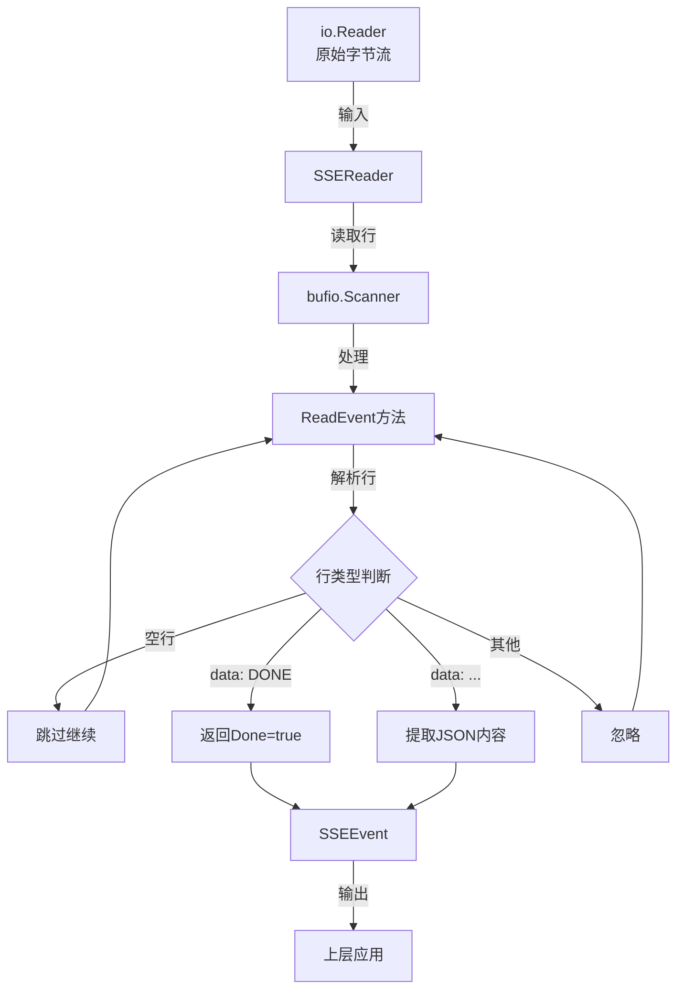

# sse_event_contracts 模块技术深度解析

## 1. 什么是这个模块，为什么需要它？

在构建与远程 API 交互的聊天系统时，我们经常需要处理 Server-Sent Events (SSE) 格式的流式响应。SSE 允许服务器向客户端推送实时数据，这对于聊天应用中的流式生成功能特别有用。

### 问题背景
直接处理 SSE 流会面临几个挑战：
- 原始 SSE 格式是基于文本的，需要解析才能获取有意义的数据
- 流式响应可能包含超长的行（特别是思维链内容）
- 需要处理流的结束标记和其他特殊情况
- 每次都手动实现 SSE 解析会导致代码重复和潜在的一致性问题

`sse_event_contracts` 模块通过提供一个统一、健壮的 SSE 流解析抽象来解决这些问题，使上层代码能够专注于业务逻辑而不是底层协议细节。

## 2. 核心抽象与心智模型

该模块引入了两个核心抽象，可以通过以下心智模型来理解：

### SSEEvent - 事件数据包
将 SSE 流想象成一个由事件组成的序列。每个事件要么是一个数据包（包含实际内容），要么是一个结束信号。`SSEEvent` 结构体正是这种概念的直接映射：
- `Data []byte`：事件的有效载荷，通常是 JSON 格式的聊天数据
- `Done bool`：标志流是否结束

### SSEReader - 事件提取器
可以把 `SSEReader` 想象成一个 "事件分拣器"。它从原始字节流中读取数据，识别 SSE 格式的边界，过滤掉协议噪音（如空行和其他字段），并将有用的部分打包成 `SSEEvent` 供消费。

## 3. 架构与数据流

以下是该模块的架构和数据流示意：



### 组件说明

#### 3.1 SSEEvent 结构体
这是模块的主要输出，封装了单个 SSE 事件的内容。它设计得非常简洁，只包含两个字段，因为 SSE 协议本身就很简单。这种极简设计确保了模块的灵活性，可以适应不同格式的数据负载。

#### 3.2 SSEReader 结构体
这是模块的核心，负责将原始的 SSE 格式流转换为结构化的 `SSEEvent` 对象。它内部使用 `bufio.Scanner` 来逐行读取输入，但配置了特殊的缓冲区设置以处理可能非常长的行。

#### 3.3 ReadEvent 方法
这是与外部交互的主要接口。它循环读取行，识别 SSE 格式的不同部分，并根据需要返回事件或继续处理。

## 4. 核心组件详解

### 4.1 SSEEvent 结构体

```go
type SSEEvent struct {
    Data []byte
    Done bool
}
```

**设计意图**：
- 极简设计，只包含必要信息
- `Data` 作为字节数组保留，不做额外解析，保持灵活性
- `Done` 作为布尔值，提供清晰的流结束信号

**使用场景**：
- 当 `Done` 为 `true` 时，表示流已结束，应该停止读取
- 当 `Done` 为 `false` 且 `Data` 非空时，包含一个有效的数据事件

### 4.2 SSEReader 结构体与 NewSSEReader 函数

```go
type SSEReader struct {
    scanner *bufio.Scanner
}

func NewSSEReader(reader io.Reader) *SSEReader {
    scanner := bufio.NewScanner(reader)
    // 设置更大的缓冲区以处理长行（思维链内容可能很长）
    buf := make([]byte, 1024*1024)
    scanner.Buffer(buf, 1024*1024)
    return &SSEReader{scanner: scanner}
}
```

**设计亮点**：
- 封装了 `bufio.Scanner`，但隐藏了其复杂性
- 特别设置了 1MB 的缓冲区，这是为了处理可能非常长的思维链内容
- 遵循 Go 的构造函数模式，返回指向结构体的指针

**关键决策**：
选择 1MB 缓冲区大小是一个值得注意的设计决策。默认情况下，`bufio.Scanner` 使用 64KB 的缓冲区，但对于 LLM 应用，思维链（Chain-of-Thought）内容可能会非常长，超过这个限制。将缓冲区设置为 1MB 提供了足够的空间来处理大多数实际场景，同时不会造成过大的内存开销。

### 4.3 ReadEvent 方法

```go
func (r *SSEReader) ReadEvent() (*SSEEvent, error) {
    for r.scanner.Scan() {
        line := r.scanner.Text()

        // 空行，跳过
        if line == "" {
            continue
        }

        // 检查是否为结束标记
        if line == "data: [DONE]" {
            return &SSEEvent{Done: true}, nil
        }

        // 解析 data 行
        if strings.HasPrefix(line, "data: ") {
            jsonStr := line[6:]
            return &SSEEvent{Data: []byte(jsonStr)}, nil
        }

        // 其他行（如 event:, id: 等）跳过
    }

    if err := r.scanner.Err(); err != nil {
        return nil, err
    }

    return nil, errors.New("EOF")
}
```

**工作流程**：
1. 循环扫描输入流中的每一行
2. 跳过空行
3. 检查是否是特殊的结束标记 "data: [DONE]"
4. 处理以 "data: " 开头的行，提取 JSON 内容
5. 忽略其他类型的 SSE 字段（如 event, id, retry 等）
6. 处理扫描错误或正常结束

**设计意图**：
- 只处理最常用的 SSE 特性，保持实现简单
- 明确支持 OpenAI 风格的 "[DONE]" 结束标记
- 忽略不常用的 SSE 字段，简化了上层应用的处理逻辑

## 5. 依赖关系分析

### 5.1 模块依赖

该模块保持了非常简洁的依赖关系：
- **输入依赖**：仅依赖标准库中的 `io.Reader` 接口，这使得它非常灵活，可以与任何实现了该接口的源一起工作
- **内部依赖**：使用了标准库中的 `bufio`、`errors`、`io` 和 `strings` 包
- **无外部依赖**：没有引入任何第三方库，保持了模块的轻量和稳定性

### 5.2 被依赖关系

从模块树可以看出，`sse_event_contracts` 是 `remote_api_streaming_transport_and_sse_parsing` 模块的子模块，而后者又属于 `chat_completion_backends_and_streaming`。这表明：

- 该模块是远程 API 流式传输实现的基础组件
- 它为聊天完成后端提供 SSE 解析功能
- 主要被用于与兼容 SSE 的远程 LLM API 交互

## 6. 设计权衡与决策

### 6.1 简洁性 vs 完整性

**决策**：选择了实现 SSE 协议的一个子集，而不是完整协议。

**原因**：
- 对于大多数 LLM API 用例，只需要处理 "data" 字段和流结束标记
- 完整的 SSE 协议包含 event、id、retry 等字段，支持更多功能但增加了复杂性
- 通过简化实现，降低了出错概率并提高了可维护性

**权衡**：
- 优点：代码更简单、更可靠，性能更好
- 缺点：不支持需要完整 SSE 特性的场景

### 6.2 缓冲区大小

**决策**：将扫描缓冲区设置为 1MB，远大于默认的 64KB。

**原因**：
- 特别是在处理思维链（Chain-of-Thought）内容时，单个数据块可能非常大
- 默认缓冲区大小在实际使用中可能导致扫描失败或数据截断

**权衡**：
- 优点：能够处理大多数实际场景中的长行
- 缺点：每个 `SSEReader` 实例会占用更多内存（1MB）

### 6.3 错误处理策略

**决策**：在流结束时返回一个简单的 "EOF" 错误，而不是更具体的错误类型。

**原因**：
- 对于上层应用，通常只需要知道流是否结束，而不需要区分不同类型的结束原因
- 简化了错误处理逻辑

**权衡**：
- 优点：简化了 API，使上层代码更简洁
- 缺点：丢失了一些可能对调试有用的上下文信息

## 7. 使用指南与最佳实践

### 7.1 基本使用

```go
// 创建一个读取器（reader 可以是任何 io.Reader，如 HTTP 响应体）
sseReader := NewSSEReader(reader)

// 循环读取事件
for {
    event, err := sseReader.ReadEvent()
    if err != nil {
        // 处理错误或流结束
        break
    }
    
    if event.Done {
        // 流正常结束
        break
    }
    
    // 处理数据
    var data SomeDataType
    if err := json.Unmarshal(event.Data, &data); err != nil {
        // 处理解析错误
        continue
    }
    
    // 使用解析后的数据...
}
```

### 7.2 最佳实践

1. **错误处理**：始终检查 `ReadEvent` 返回的错误，它可能表示网络问题或其他异常情况
2. **Done 检查**：在处理数据前先检查 `event.Done`，避免处理结束标记
3. **JSON 解析**：该模块不负责 JSON 解析，将 `Data` 作为字节数组返回，让调用者决定如何处理
4. **资源管理**：确保在使用完毕后关闭底层的 `io.Reader`（如 HTTP 响应体）
5. **并发安全**：`SSEReader` 不是并发安全的，不应在多个 goroutine 中同时使用

### 7.3 扩展点

虽然当前实现比较简单，但可以考虑以下扩展方向：

- 支持更多 SSE 字段（如 event、id）
- 添加可配置的缓冲区大小
- 支持自定义结束标记
- 添加事件缓冲和预读取功能

## 8. 常见陷阱与注意事项

### 8.1 内存使用

每个 `SSEReader` 实例都会分配 1MB 的缓冲区。在高并发场景下创建大量实例可能会导致内存压力。解决方案：
- 限制并发连接数
- 考虑重用 `SSEReader` 实例（如果可行）
- 根据实际需求调整缓冲区大小

### 8.2 格式假设

该模块对 SSE 格式做了一些假设：
- 只处理 "data: " 前缀的行
- 期望 "data: [DONE]" 作为流结束标记
- 假设每个事件占一行

如果与使用不同 SSE 格式变体的 API 交互，可能需要调整实现。

### 8.3 行结束处理

`bufio.Scanner` 默认只处理 LF (`\n`) 作为行结束符。如果数据源使用 CRLF (`\r\n`)，仍然可以正常工作，因为 `scanner.Text()` 会自动去除末尾的换行符。

## 9. 总结

`sse_event_contracts` 模块是一个专注、简洁但功能强大的组件，它解决了从 SSE 流中提取数据的常见问题。通过精心设计的抽象和明智的权衡，它提供了一个易于使用且健壮的解决方案，特别适合处理 LLM API 的流式响应。

该模块的价值不在于技术复杂度，而在于它将一个常见的底层协议细节封装成了一个简单、可靠的接口，使上层应用能够专注于业务逻辑而非协议处理。
