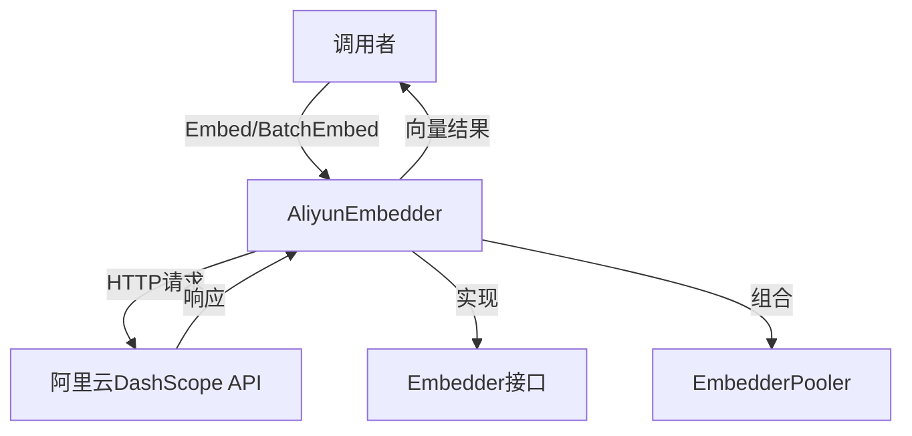

# aliyun_embedding_backend 模块技术深度解析

## 1. 模块概述

**aliyun_embedding_backend** 模块是系统中专门负责与阿里云 DashScope 多模态嵌入 API 进行交互的适配器。它的核心职责是将文本转换为向量表示，并确保与阿里云 API 的可靠通信。这个模块在知识检索、语义搜索和向量存储等功能中扮演着关键角色。

## 2. 问题背景与解决方案

### 问题空间
在构建知识库和语义搜索系统时，我们需要将文本转换为数学向量表示（嵌入），以便进行相似度计算和语义检索。阿里云提供了强大的嵌入 API，但直接使用它存在几个挑战：
- API 调用需要处理重试、超时和错误
- 响应解析和结果映射需要特殊处理
- 需要与系统的嵌入提供者接口保持一致
- 多模态 API 的端点配置需要特殊处理

### 设计洞察
该模块采用了适配器模式，将阿里云的特定 API 转换为系统通用的嵌入接口。它封装了所有与阿里云 API 交互的复杂性，包括重试逻辑、错误处理、请求/响应映射等，同时保持了与系统其他嵌入后端（如 OpenAI、Jina 等）的一致性。

## 3. 架构设计与数据流程

### 核心组件关系图


### 数据流程解析
1. **请求构建阶段**：`BatchEmbed` 方法接收文本数组，构建 `AliyunEmbedRequest` 请求对象
2. **HTTP通信阶段**：`doRequestWithRetry` 处理请求发送，实现指数退避重试策略
3. **响应处理阶段**：解析阿里云 API 响应，将嵌入向量按 `text_index` 重新排序
4. **结果返回阶段**：返回与输入文本顺序一致的向量数组

## 4. 核心组件深度解析

### AliyunEmbedder 结构体
这是模块的核心类，负责所有与阿里云嵌入 API 的交互。

```go
type AliyunEmbedder struct {
    apiKey               string
    baseURL              string
    modelName            string
    truncatePromptTokens int
    dimensions           int
    modelID              string
    httpClient           *http.Client
    timeout              time.Duration
    maxRetries           int
    EmbedderPooler
}
```

**设计意图**：
- 组合模式：嵌入了 `EmbedderPooler` 接口，提供池化功能
- 配置灵活性：所有关键参数都可通过构造函数配置
- 超时与重试：内置了 HTTP 超时控制和重试机制

### AliyunEmbedRequest / AliyunEmbedResponse 结构体
这些结构体定义了与阿里云 API 通信的数据格式。

**设计亮点**：
- `AliyunEmbedResponse` 中的 `TextIndex` 字段允许 API 返回乱序的嵌入结果，我们需要手动重新排序
- 错误响应结构 `AliyunErrorResponse` 与成功响应分开定义，便于解析

### 关键方法解析

#### NewAliyunEmbedder 构造函数
```go
func NewAliyunEmbedder(apiKey, baseURL, modelName string, ...) (*AliyunEmbedder, error)
```

**特殊处理**：
- 自动处理 baseURL 中的 `/compatible-mode/v1` 后缀，这是为了兼容阿里云 API 的不同模式
- 设置默认的截断 token 数为 511
- 配置 HTTP 客户端超时为 60 秒

#### Embed 方法
```go
func (e *AliyunEmbedder) Embed(ctx context.Context, text string) ([]float32, error)
```

**设计决策**：
- 实际上是对 `BatchEmbed` 的封装，单次文本嵌入也通过批量接口实现
- 内置了 3 次重试逻辑，增强了可靠性

#### BatchEmbed 方法
这是模块的核心工作方法，处理批量文本嵌入。

**关键流程**：
1. 构建请求内容数组
2. 序列化为 JSON
3. 调用 `doRequestWithRetry` 发送请求
4. 解析响应并按 `text_index` 重新排序嵌入向量

**重要设计**：
- 保留输入顺序：通过 `text_index` 字段确保返回的向量与输入文本顺序一致
- 完整的错误处理：包括请求构建、发送、响应解析等各个环节

#### doRequestWithRetry 方法
实现了指数退避重试策略。

**重试逻辑**：
- 最大重试次数：3 次
- 退避时间：`2^(i-1)` 秒，上限 10 秒
- 支持上下文取消

## 5. 设计决策与权衡

### 1. 单次嵌入通过批量接口实现
**决策**：`Embed` 方法内部调用 `BatchEmbed`，而不是单独实现
**理由**：
- 减少代码重复
- 统一错误处理和重试逻辑
- 阿里云 API 本身支持批量请求，效率更高

### 2. 手动重新排序嵌入向量
**决策**：在 `BatchEmbed` 中根据 `text_index` 重新排序
**理由**：
- 阿里云 API 不保证返回顺序与输入一致
- 系统上层期望输入输出顺序一致
- 这种设计增加了灵活性，适应 API 可能的变化

### 3. 特殊的 baseURL 处理
**决策**：自动去除 `/compatible-mode/v1` 后缀
**理由**：
- 阿里云 DashScope 有兼容模式和标准模式两种 API
- 多模态嵌入 API 使用标准模式端点
- 这种设计允许配置灵活切换而不影响功能

### 4. 内置重试机制
**决策**：在 HTTP 请求层实现指数退避重试
**理由**：
- 网络请求容易失败，重试是必要的可靠性保障
- 指数退避可以避免在服务端压力大时加重负担
- 在嵌入层实现重试，而不是在上层，简化了调用者代码

## 6. 依赖关系与接口契约

### 依赖模块
- **embedding_core_contracts_and_batch_orchestration**：提供 `EmbedderPooler` 接口和核心契约
- **logger**：用于日志记录
- 标准库：`context`, `encoding/json`, `net/http` 等

### 被依赖模块
这个模块主要被需要嵌入功能的服务使用，如：
- **vector_retrieval_backend_repositories**：向量检索后端
- **knowledge_ingestion_extraction_and_graph_services**：知识摄入服务

### 接口契约
实现了系统的嵌入提供者接口，主要方法包括：
- `Embed(ctx context.Context, text string) ([]float32, error)`
- `BatchEmbed(ctx context.Context, texts []string) ([][]float32, error)`
- `GetModelName() string`
- `GetDimensions() int`
- `GetModelID() string`

## 7. 使用指南与常见问题

### 配置选项
- `apiKey`：阿里云 API 密钥（必需）
- `baseURL`：API 基础 URL，默认 `https://dashscope.aliyuncs.com`
- `modelName`：模型名称（必需）
- `truncatePromptTokens`：截断 token 数，默认 511
- `dimensions`：向量维度
- `modelID`：模型 ID
- `pooler`：嵌入池化器

### 常见陷阱
1. **baseURL 配置问题**：如果使用兼容模式 URL，模块会自动处理，但需要确保这是预期行为
2. **text_index 映射**：返回的向量顺序依赖于 `text_index`，如果 API 改变此行为，需要相应调整
3. **重试逻辑**：`Embed` 方法有自己的重试，与 `doRequestWithRetry` 的重试叠加，需要注意总重试次数

### 扩展点
- 可以通过替换 `httpClient` 来定制 HTTP 行为
- 可以通过实现 `EmbedderPooler` 接口来定制池化策略
- 可以继承 `AliyunEmbedder` 来添加额外功能，如缓存

## 8. 总结

**aliyun_embedding_backend** 模块是一个设计良好的适配器，它成功地将阿里云 DashScope 多模态嵌入 API 集成到系统中。它的主要价值在于：
- 封装了 API 通信的复杂性
- 提供了可靠的重试和错误处理
- 保持了与系统其他嵌入后端的一致性
- 处理了 API 的特殊细节，如端点配置和结果排序

这个模块展示了如何在保持接口一致性的同时，处理第三方 API 的特殊性，是一个典型的适配器模式应用案例。
