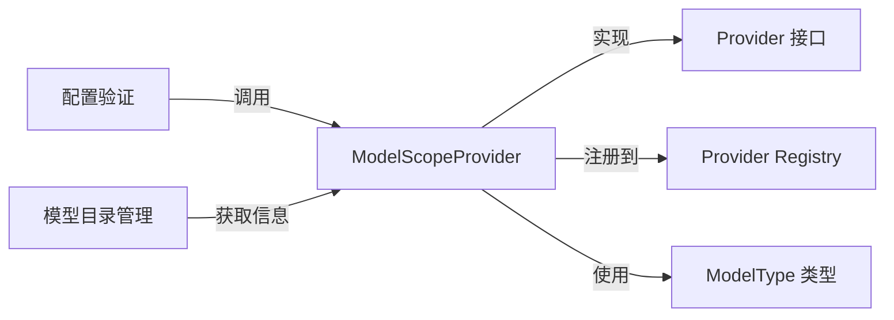

# ModelScope Provider Integration 技术深度文档

## 1. 模块概述

### 1.1 问题空间

在构建多模型平台时，一个核心挑战是如何以统一的方式集成不同的模型提供商。每个提供商都有自己的 API 格式、认证机制和模型类型支持。如果不进行抽象，每次添加新的模型提供商都需要修改大量代码，导致系统耦合度高、维护成本大。

对于 ModelScope（魔搭）这样的平台，它提供了丰富的开源模型（如 Qwen 系列），但需要一个适配层来将其集成到我们的系统中，同时保持与其他提供商（如 OpenAI、阿里云等）的一致性。

### 1.2 解决方案

`modelscope_provider_integration` 模块通过实现 `Provider` 接口，提供了一个轻量级的适配器，将 ModelScope 的 OpenAI 兼容 API 无缝集成到我们的模型提供商生态系统中。

## 2. 架构与设计

### 2.1 核心组件

本模块的核心是 `ModelScopeProvider` 结构体，它实现了 `Provider` 接口的两个主要方法：

- `Info()`: 提供 ModelScope 的元数据信息
- `ValidateConfig()`: 验证 ModelScope 的配置

### 2.2 架构关系图



## 3. 核心组件详解

### 3.1 ModelScopeProvider 结构体

`ModelScopeProvider` 是一个空结构体，它的主要作用是作为方法的接收器，实现 `Provider` 接口。这种设计体现了 Go 语言中"组合优于继承"的思想，通过空结构体来组织相关方法，而不需要维护任何状态。

### 3.2 Info() 方法

`Info()` 方法返回 `ProviderInfo` 结构体，包含了 ModelScope 的关键信息：

- **名称与显示名**: 用于在 UI 和日志中标识
- **描述**: 简要说明支持的模型类型
- **默认 URL**: 为不同模型类型提供默认的 API 端点
- **模型类型**: 声明支持的模型类型（知识问答、嵌入、VLLM）
- **认证要求**: 指示是否需要 API 密钥

值得注意的是，所有模型类型都使用相同的基础 URL `https://api-inference.modelscope.cn/v1`，这是因为 ModelScope 提供了 OpenAI 兼容的 API 格式。

### 3.3 ValidateConfig() 方法

`ValidateConfig()` 方法确保配置的完整性，检查三个关键字段：
- BaseURL: API 基础地址
- APIKey: 认证密钥
- ModelName: 模型名称

这种验证是防御性编程的体现，确保在使用配置前就捕获错误，而不是在实际调用 API 时才发现问题。

## 4. 依赖分析

### 4.1 内部依赖

- **provider 包**: 实现了 `Provider` 接口和 `Register()` 函数
- **types 包**: 定义了 `ModelType` 枚举类型

### 4.2 交互流程

1. 在初始化阶段，通过 `init()` 函数自动注册 `ModelScopeProvider`
2. 当需要使用 ModelScope 模型时，系统从注册表中获取该 provider
3. 调用 `Info()` 方法获取元数据，用于 UI 展示和配置
4. 调用 `ValidateConfig()` 方法验证用户提供的配置
5. 验证通过后，使用配置进行实际的 API 调用

## 5. 设计决策与权衡

### 5.1 无状态设计

**决策**: `ModelScopeProvider` 是一个空结构体，不维护任何状态。

**原因**: 
- 简化实现，避免并发安全问题
- 配置验证和元数据获取都是纯函数，不需要状态
- 符合 Go 语言的简洁设计哲学

**权衡**: 
- 如果将来需要缓存某些信息，可能需要添加状态
- 但目前的需求下，无状态设计是最佳选择

### 5.2 OpenAI 兼容模式

**决策**: 利用 ModelScope 的 OpenAI 兼容 API，而不是实现自定义协议。

**原因**:
- 减少代码重复，可以复用现有的 OpenAI 兼容客户端代码
- 降低维护成本，ModelScope 会保持与 OpenAI API 的兼容性
- 加快开发速度，不需要从头实现协议适配

**权衡**:
- 受限于 OpenAI API 的功能集，可能无法使用 ModelScope 的一些独特特性
- 如果 ModelScope 改变其兼容层实现，可能需要调整代码

### 5.3 统一基础 URL

**决策**: 所有模型类型使用相同的基础 URL。

**原因**:
- ModelScope 的 API 设计就是统一的，不同模型类型通过路径区分
- 简化配置，用户只需要设置一个 URL
- 减少出错可能性

**权衡**:
- 如果将来 ModelScope 为不同模型类型提供不同的端点，需要修改设计
- 但目前的 API 设计下，这是最合理的选择

## 6. 使用指南

### 6.1 配置示例

```go
config := &provider.Config{
    BaseURL:   "https://api-inference.modelscope.cn/v1",
    APIKey:    "your-api-key-here",
    ModelName: "Qwen/Qwen3-8B",
}
```

### 6.2 支持的模型类型

- `ModelTypeKnowledgeQA`: 知识问答模型
- `ModelTypeEmbedding`: 嵌入模型
- `ModelTypeVLLM`: VLLM 模型

## 7. 注意事项与常见问题

### 7.1 配置验证失败

如果 `ValidateConfig()` 返回错误，检查以下几点：
- 确保 BaseURL 不为空
- 确保 APIKey 已正确设置
- 确保 ModelName 是有效的 ModelScope 模型标识符

### 7.2 API 调用失败

即使配置验证通过，API 调用仍可能失败，原因可能是：
- APIKey 无效或过期
- ModelName 不正确或当前不可用
- 网络连接问题
- ModelScope 服务暂时不可用

### 7.3 扩展注意事项

如果需要扩展 `ModelScopeProvider` 的功能，注意：
- 保持无状态设计，除非绝对必要
- 遵循 `Provider` 接口的契约
- 添加新功能时，确保不破坏现有功能

## 8. 总结

`modelscope_provider_integration` 模块是一个简洁而优雅的适配器实现，它展示了如何通过接口抽象和组合来集成第三方服务。该模块的设计体现了几个重要的软件设计原则：

- **接口隔离**: 只依赖需要的接口
- **开闭原则**: 对扩展开放，对修改关闭
- **简单性**: 保持代码简洁，避免过度设计

通过这个模块，我们的系统可以无缝地使用 ModelScope 提供的丰富模型，同时保持与其他模型提供商的一致性。
