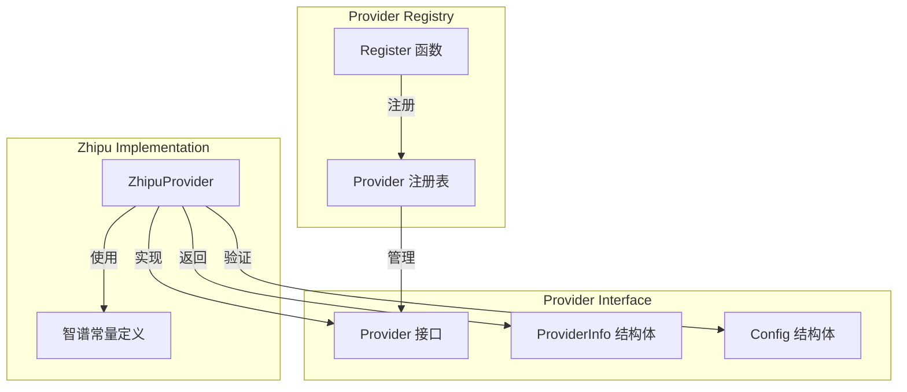

# 独立基础模型平台提供商模块技术文档

## 1. 模块概述

### 1.1 什么是独立基础模型平台提供商模块？

**independent_foundation_model_platform_providers** 模块是整个系统中负责集成独立第三方基础模型服务的专门组件。它作为系统与外部AI模型服务（如智谱AI的GLM系列模型）之间的桥梁，提供了统一的接口来管理不同平台的模型调用、配置验证和元数据管理。

### 1.2 解决的核心问题

在构建一个支持多模型平台的AI系统时，我们面临几个关键挑战：

1. **平台多样性**：不同的模型提供商有不同的API端点、认证方式和参数格式
2. **配置复杂性**：每个平台需要特定的配置项，如API密钥、模型名称、基础URL等
3. **可扩展性**：系统需要能够轻松添加新的模型平台而不修改核心逻辑
4. **统一接口**：上层应用需要一个一致的方式来调用不同平台的模型服务

这个模块通过采用**提供者模式（Provider Pattern）**，将每个模型平台的特定逻辑封装在独立的提供者实现中，同时通过统一的接口对外暴露功能，完美解决了上述问题。

## 2. 架构设计

### 2.1 核心组件关系



### 2.2 模块在系统中的位置

这个模块位于 `model_providers_and_ai_backends` 分层架构的最外层，是系统与外部模型服务交互的直接接口。它依赖于：

- **provider_base_interfaces_and_config_contracts**：定义了提供者接口和配置契约
- **types**：提供了系统级别的类型定义（如 ModelType）

同时，它被上层的模型调用和管理模块所使用，为整个系统提供模型服务能力。

## 3. 核心组件深度解析

### 3.1 ZhipuProvider 结构体

#### 设计意图

`ZhipuProvider` 是专门为智谱AI（Zhipu AI）模型平台设计的提供者实现。它的核心职责是：

1. 提供智谱AI平台的元数据信息
2. 验证智谱AI服务的配置参数
3. 注册自身到全局提供者注册表中

#### 实现细节

```go
// ZhipuProvider 实现智谱 AI 的 Provider 接口
type ZhipuProvider struct{}
```

这个结构体本身是空的，这是一个有意的设计选择。因为智谱AI的提供者实现不需要维护任何状态，所有必要的信息都通过常量和方法返回值来提供。这种无状态设计使得提供者实例可以安全地在多个goroutine中共享使用。

#### 初始化与注册

```go
func init() {
    Register(&ZhipuProvider{})
}
```

在包初始化时，`ZhipuProvider` 会自动注册到全局提供者注册表中。这种**自注册模式**是一个关键设计决策：

- **优点**：添加新的提供者只需创建实现类并在init中注册，无需修改其他代码
- **实现**：通过Go的init函数机制，确保在包被导入时自动完成注册

### 3.2 常量定义

#### 设计意图

模块定义了三个关键常量，分别对应智谱AI不同服务类型的默认基础URL：

```go
const (
    // ZhipuChatBaseURL 智谱 AI Chat 的默认 BaseURL
    ZhipuChatBaseURL = "https://open.bigmodel.cn/api/paas/v4"
    // ZhipuEmbeddingBaseURL 智谱 AI Embedding 的默认 BaseURL
    ZhipuEmbeddingBaseURL = "https://open.bigmodel.cn/api/paas/v4"
    // ZhipuRerankBaseURL 智谱 AI Rerank 的默认 BaseURL
    ZhipuRerankBaseURL = "https://open.bigmodel.cn/api/paas/v4/rerank"
)
```

#### 设计考量

1. **分离关注点**：将不同服务类型的URL分开定义，即使目前它们大部分相同，为未来可能的变化做好准备
2. **默认值策略**：提供合理的默认值，简化常见场景的配置，同时允许用户通过配置覆盖
3. **自文档化**：通过常量名称和注释清晰表达每个URL的用途

### 3.3 Info() 方法

#### 方法签名

```go
func (p *ZhipuProvider) Info() ProviderInfo
```

#### 设计意图

这个方法返回智谱AI提供者的完整元数据信息，是系统了解这个提供者能力的主要途径。

#### 返回值解析

返回的 `ProviderInfo` 结构体包含以下关键信息：

1. **标识信息**：
   - `Name`: 内部使用的唯一标识符（ProviderZhipu）
   - `DisplayName`: 用户界面显示的友好名称（"智谱 BigModel"）
   - `Description`: 简短描述，说明支持的模型类型

2. **默认配置**：
   - `DefaultURLs`: 不同模型类型对应的默认基础URL映射
   - 这里将 KnowledgeQA、Embedding、Rerank 和 VLLM 类型都映射到了相应的智谱AI端点

3. **能力声明**：
   - `ModelTypes`: 明确声明支持的模型类型列表
   - `RequiresAuth`: 指示是否需要认证（智谱AI需要API密钥）

#### 设计考量

这种元数据驱动的设计有几个重要优势：

1. **动态发现**：系统可以在运行时发现所有可用的提供者及其能力
2. **配置简化**：通过提供默认URL，用户只需提供API密钥和模型名称即可
3. **类型安全**：使用 `types.ModelType` 枚举确保模型类型的一致性

### 3.4 ValidateConfig() 方法

#### 方法签名

```go
func (p *ZhipuProvider) ValidateConfig(config *Config) error
```

#### 设计意图

这个方法负责验证智谱AI服务的配置是否完整和有效，是确保系统稳定性的重要防线。

#### 验证逻辑

1. **API密钥验证**：检查 `config.APIKey` 是否为空，因为智谱AI的所有API都需要认证
2. **模型名称验证**：检查 `config.ModelName` 是否为空，因为需要明确指定使用哪个模型

#### 设计考量

1. **防御性编程**：在早期验证配置，避免在实际调用API时才发现问题
2. **清晰的错误信息**：返回描述性的错误消息，帮助用户快速定位配置问题
3. **最小验证**：只验证智谱AI特定的必需配置项，不做过度验证

## 4. 依赖关系分析

### 4.1 输入依赖

这个模块依赖于以下关键组件：

1. **provider 基础接口**：定义了 `Provider` 接口、`ProviderInfo` 结构体和 `Config` 结构体
2. **types 包**：提供了 `ModelType` 枚举类型，用于标识不同的模型服务类型
3. **Register 函数**：全局提供者注册机制，来自 provider 基础接口模块

### 4.2 输出依赖

上层模块通过以下方式使用这个模块：

1. **提供者注册表**：通过全局注册表查找和获取 `ZhipuProvider` 实例
2. **Info() 方法**：获取智谱AI的元数据信息，用于UI展示和默认配置
3. **ValidateConfig() 方法**：在用户配置智谱AI模型时验证配置的有效性

### 4.3 数据契约

模块与外部交互的核心数据契约包括：

1. **ProviderInfo**：提供者元数据契约
2. **Config**：配置数据契约
3. **ModelType**：模型类型枚举契约

这些契约确保了模块与系统其他部分的解耦，只要契约保持不变，内部实现可以自由演进。

## 5. 设计决策与权衡

### 5.1 无状态提供者设计

**决策**：`ZhipuProvider` 结构体不包含任何状态字段。

**权衡**：
- ✅ **优点**：实例可以安全共享，无需担心并发问题；内存占用小
- ❌ **缺点**：如果未来需要缓存某些状态（如认证令牌），需要额外的机制

**适用性**：对于智谱AI这种无状态的API服务，无状态设计是最佳选择。

### 5.2 自注册模式

**决策**：在 `init()` 函数中自动注册提供者。

**权衡**：
- ✅ **优点**：添加新提供者无需修改注册表代码，符合开闭原则
- ❌ **缺点**：隐式注册可能导致"幽灵"依赖，难以追踪哪些提供者被注册

**适用性**：在模型提供者这种插件式架构中，自注册的便利性超过了其缺点。

### 5.3 元数据驱动配置

**决策**：通过 `Info()` 方法返回默认URL和支持的模型类型。

**权衡**：
- ✅ **优点**：配置信息集中管理，易于维护和发现；支持动态UI生成
- ❌ **缺点**：增加了接口的复杂性，需要维护额外的元数据结构

**适用性**：对于多模型平台系统，元数据驱动的配置管理是必要的。

### 5.4 分离的服务端点常量

**决策**：为Chat、Embedding和Rerank服务分别定义常量，即使它们目前基本相同。

**权衡**：
- ✅ **优点**：为未来变化做好准备，提高代码可读性
- ❌ **缺点**：当前看起来有些冗余，可能给人"过度设计"的印象

**适用性**：考虑到不同服务可能在未来使用不同的端点，这种前瞻性设计是合理的。

## 6. 使用指南与最佳实践

### 6.1 添加新的独立模型平台提供者

如果你需要添加一个新的独立模型平台提供者，按照以下步骤：

1. 创建新的提供者结构体（类似 `ZhipuProvider`）
2. 实现 `Provider` 接口的所有方法
3. 在 `init()` 函数中注册你的提供者
4. 定义必要的常量（如默认URL）

### 6.2 配置智谱AI模型

使用智谱AI模型时，需要提供以下配置：

```go
config := &Config{
    APIKey:    "your-zhipu-api-key",  // 必需
    ModelName: "glm-4.7",              // 必需
    BaseURL:   "https://open.bigmodel.cn/api/paas/v4",  // 可选，默认已提供
}
```

### 6.3 最佳实践

1. **错误处理**：始终检查 `ValidateConfig()` 的返回值，不要假设配置总是有效
2. **默认值使用**：优先使用 `Info()` 返回的默认URL，除非有特殊需求
3. **提供者选择**：通过提供者注册表动态获取提供者，而不是直接实例化
4. **并发安全**：由于提供者是无状态的，可以在多个goroutine中安全使用

## 7. 边缘情况与注意事项

### 7.1 配置验证的局限性

当前的 `ValidateConfig()` 方法只检查了必需字段的存在性，没有验证：
- API密钥的格式是否正确
- 模型名称是否是智谱AI支持的有效模型
- BaseURL的格式是否合法

在生产环境中，你可能需要添加更严格的验证，或者依赖实际API调用时的错误来发现这些问题。

### 7.2 版本兼容性

智谱AI的API版本可能会更新，当前的默认URL是针对v4版本的。如果未来智谱AI发布新版本，需要：
1. 更新常量定义
2. 考虑是否需要同时支持多个版本
3. 在 `ProviderInfo` 中添加版本信息

### 7.3 错误信息的国际化

当前的错误消息是硬编码的英文，在多语言环境中可能需要：
1. 将错误消息提取到资源文件中
2. 根据用户的语言偏好返回相应的错误消息

## 8. 扩展与演进路径

### 8.1 可能的增强方向

1. **高级配置验证**：添加API密钥格式验证、模型名称有效性检查等
2. **端点自动发现**：支持从智谱AI的服务发现端点获取最新的API地址
3. **配额与限流信息**：在 `ProviderInfo` 中添加智谱AI的配额和限流信息
4. **模型列表动态获取**：支持从智谱AIAPI动态获取可用模型列表

### 8.2 与其他模块的集成

这个模块可以与以下模块更紧密地集成：

1. **模型目录管理**：提供更丰富的模型元数据
2. **计费与监控**：集成智谱AI的使用统计和计费信息
3. **故障转移**：支持多个智谱AI端点或备用提供者

## 9. 总结

`independent_foundation_model_platform_providers` 模块通过优雅的提供者模式设计，成功解决了系统与独立第三方模型平台集成的复杂性问题。以 `ZhipuProvider` 为代表的实现展示了如何通过无状态设计、自注册模式和元数据驱动的配置管理，构建一个可扩展、易维护的模型平台集成层。

这个模块的设计体现了几个关键的软件工程原则：
- **开闭原则**：对扩展开放，对修改关闭
- **接口隔离**：定义最小化的提供者接口
- **依赖倒置**：上层依赖抽象，而非具体实现

理解这个模块的设计思想，不仅有助于正确使用现有的模型提供者，也为未来添加新的模型平台集成提供了清晰的指导。
