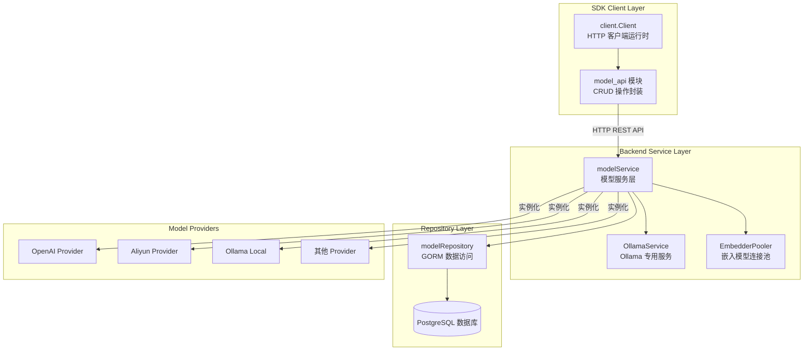

# model_api

## 模块概述

想象一下，你的系统需要支持十几种不同的 AI 模型提供商 —— OpenAI、阿里云、智谱、Ollama 本地部署……每个提供商的 API 不同、参数不同、认证方式也不同。如果让每个调用方都直接处理这些差异，代码会迅速变成一团乱麻。

`model_api` 模块正是为了解决这个问题而存在的。它是 **WeKnora 系统的模型管理网关**，提供了一套统一的 CRUD 接口来注册、查询和管理系统中可用的 AI 模型。这个模块的核心设计洞察是：**模型应该被视为一种可配置的系统资源，而不是硬编码的依赖**。通过这种抽象，系统可以在运行时动态切换模型提供商、调整参数、甚至添加新的模型类型，而无需修改业务代码。

从架构角色来看，`model_api` 是 SDK 客户端库的一部分，位于整个模型管理栈的最外层。它不直接处理模型推理逻辑，而是负责与后端的 [`modelService`](internal.application.service.model.modelService) 通信，将模型的配置信息持久化到 [`modelRepository`](internal.application.repository.model.modelRepository)。这种分层设计使得客户端可以专注于 API 契约的稳定性，而将复杂的模型实例化、连接池管理、提供商适配等逻辑留给后端服务处理。

## 架构与数据流



### 数据流 walkthrough

让我们追踪一个典型操作的数据流 —— 当调用方需要获取一个嵌入模型时：

1. **SDK 层**：调用方使用 `model_api` 的 `GetModel(ctx, modelID)` 方法，该方法构造 HTTP GET 请求到 `/api/v1/models/{id}`
2. **HTTP 路由层**：请求到达后端的 `ModelHandler`（位于 [`http_handlers_and_routing`](http_handlers_and_routing.md) 模块），解析路径参数并调用 `modelService.GetModelByID()`
3. **服务层**：`modelService` 从 `modelRepository` 获取模型的元数据（包括 `base_url`、`api_key`、`provider` 等配置），然后根据 `provider` 字段选择对应的 Provider 适配器（如 [`OpenAIProvider`](internal.models.provider.openai.OpenAIProvider)、[`AliyunProvider`](internal.models.provider.aliyun.AliyunProvider)）
4. **实例化层**：服务层使用 `EmbedderPooler` 创建或复用模型实例，返回给调用方
5. **响应层**：SDK 解析 JSON 响应，将 `ModelResponse` 转换为 `Model` 结构体返回

这个流程的关键在于：**SDK 只负责传输配置，不负责实例化**。这种设计避免了在客户端暴露 API Key 等敏感信息，同时也让后端可以集中管理连接池、重试策略、限流等横切关注点。

## 核心组件详解

### Model 结构体

```go
type Model struct {
    ID          string          `json:"id"`
    TenantID    uint            `json:"tenant_id"`
    Name        string          `json:"name"`
    Type        ModelType       `json:"type"`
    Source      ModelSource     `json:"source"`
    Description string          `json:"description"`
    Parameters  ModelParameters `json:"parameters"`
    IsDefault   bool            `json:"is_default"`
    CreatedAt   string          `json:"created_at"`
    UpdatedAt   string          `json:"updated_at"`
}
```

`Model` 是模块的核心数据模型，它的设计反映了几个关键决策：

**多租户隔离**：`TenantID` 字段表明模型配置是按租户隔离的。这意味着不同租户可以使用不同的模型提供商，甚至同一个模型 ID 在不同租户下可能指向完全不同的后端服务。这种设计支持 SaaS 场景下的灵活配置，但也带来了数据隔离的复杂性 —— 所有查询都必须携带租户上下文。

**类型驱动的路由**：`ModelType` 是一个枚举类型，定义了四种模型用途：
- `embedding`：文本向量化，用于语义检索
- `chat`：对话生成，用于 Agent 推理
- `rerank`：重排序，用于检索结果优化
- `summary`：文本摘要，用于长文档压缩

这个分类不是随意的，它直接对应后端 [`ModelService`](internal.types.interfaces.model.ModelService) 接口中的四个专用方法：`GetEmbeddingModel()`、`GetChatModel()`、`GetRerankModel()`、`GetSummaryModel()`。这种类型安全的设计让调用方在编译期就能确保使用正确的模型类型。

**灵活的参数系统**：`ModelParameters` 被定义为 `map[string]interface{}`，这是一个有意为之的"逃生舱"设计。后端的实际参数结构（[`internal.types.model.ModelParameters`](internal.types.model.ModelParameters)）包含 `BaseURL`、`APIKey`、`Provider` 等字段，但 SDK 层使用动态类型来保持向前兼容。当后端添加新的配置字段时，SDK 无需重新编译即可传递这些参数。这种设计的代价是失去了类型检查 —— 调用方必须确保参数名称和类型与后端期望的一致。

**默认模型机制**：`IsDefault` 字段允许每个租户为每种模型类型设置一个默认值。当调用方只指定模型类型而不指定具体 ID 时，系统会自动选择默认模型。这个设计简化了常见场景的配置，但引入了一个隐式状态 —— 修改一个模型的 `IsDefault` 标志可能会影响其他依赖默认模型的代码路径。

### CreateModelRequest 与 UpdateModelRequest

```go
type CreateModelRequest struct {
    Name        string          `json:"name"`
    Type        ModelType       `json:"type"`
    Source      ModelSource     `json:"source"`
    Description string          `json:"description"`
    Parameters  ModelParameters `json:"parameters"`
    IsDefault   bool            `json:"is_default"`
}

type UpdateModelRequest struct {
    Name        string          `json:"name"`
    Description string          `json:"description"`
    Parameters  ModelParameters `json:"parameters"`
    IsDefault   bool            `json:"is_default"`
}
```

注意 `UpdateModelRequest` 缺少 `Type` 和 `Source` 字段。这是一个**有意限制**：模型类型和来源在创建后不可变。这个设计决策基于以下考虑：

1. **语义稳定性**：如果一个模型被注册为 `embedding` 类型，系统可能在多个地方缓存了它的实例。允许类型变更会导致缓存失效和潜在的运行时错误。
2. **审计追踪**：模型来源（`internal` vs `external`）影响权限检查和计费逻辑。禁止变更可以简化审计日志的设计。
3. **简化实现**：后端不需要处理类型转换的边界情况（例如，一个 `chat` 模型变成 `embedding` 模型后，原有的对话历史如何处理？）。

但这种设计也带来了限制：如果确实需要更换模型类型，调用方必须先删除再创建，这会导致模型 ID 变更，进而需要更新所有引用该 ID 的配置。

### Client 方法族

`model_api` 提供了五个核心方法，对应 CRUD 操作：

| 方法 | HTTP 方法 | 路径 | 用途 |
|------|----------|------|------|
| `CreateModel()` | POST | `/api/v1/models` | 注册新模型 |
| `GetModel()` | GET | `/api/v1/models/{id}` | 获取模型详情 |
| `ListModels()` | GET | `/api/v1/models` | 列出所有模型 |
| `UpdateModel()` | PUT | `/api/v1/models/{id}` | 更新模型配置 |
| `DeleteModel()` | DELETE | `/api/v1/models/{id}` | 删除模型 |

这些方法的设计遵循 RESTful 惯例，但有几个细节值得注意：

**`ListModels()` 缺少过滤参数**：当前的实现不支持按类型、来源或其他条件过滤。这意味着调用方必须获取全部模型后在客户端过滤。对于模型数量较多的场景，这会造成不必要的网络传输和内存占用。这是一个已知的简化设计，未来可能需要扩展为 `ListModels(ctx, filters ...ListOption)` 的形式。

**`DeleteModel()` 的响应处理**：与其他方法不同，`DeleteModel()` 不返回 `Model` 对象，而是解析一个匿名的 `{success, message}` 结构。这种设计反映了删除操作的语义 —— 成功后没有数据需要返回。但这也意味着调用方无法获取删除前的模型快照，如果需要审计删除操作，必须在删除前先调用 `GetModel()`。

**错误处理的一致性**：所有方法都使用相同的错误处理模式：先检查 `doRequest()` 的网络错误，再检查 `parseResponse()` 的解析错误。这种设计简化了调用方的错误处理逻辑，但也隐藏了 HTTP 状态码的细节 —— 调用方无法区分 404（模型不存在）和 500（服务器错误），除非解析错误消息内容。

## 依赖关系分析

### 上游依赖：谁调用 model_api

`model_api` 作为 SDK 客户端库，主要被以下场景调用：

1. **管理界面**：前端应用通过 SDK 配置模型目录，允许管理员添加、修改、删除模型配置
2. **初始化流程**：系统启动时，初始化服务会调用 `ListModels()` 预加载模型配置
3. **测试工具**：开发和测试脚本使用 SDK 动态创建临时模型配置

值得注意的是，**业务运行时代码不直接调用 `model_api`**。这是因为 SDK 是 HTTP 客户端，而业务代码运行在服务端，直接调用 [`ModelService`](internal.types.interfaces.model.ModelService) 接口更高效。这种分离确保了 SDK 专注于外部 API 契约的稳定性，而内部服务可以自由演化。

### 下游依赖：model_api 调用谁

`model_api` 的唯一直接依赖是 [`client.Client`](client.client.Client) —— 一个封装了 HTTP 客户端、基础 URL、认证 Token 的运行时结构。这个依赖非常轻量，使得 `model_api` 可以独立测试和演进。

但间接依赖要复杂得多。当调用 `CreateModel()` 时，后端会：

1. 验证参数完整性（需要 [`ModelParameters`](internal.types.model.ModelParameters) 中定义的必填字段）
2. 测试连接（调用对应 Provider 的 Health Check 接口）
3. 持久化配置（通过 [`ModelRepository`](internal.application.repository.model.modelRepository) 写入数据库）

这意味着 SDK 调用方需要理解这些隐式验证规则。例如，如果 `Parameters` 中缺少 `api_key`，创建请求会失败；如果 `base_url` 指向不可达的服务，连接测试会超时。

### 数据契约

SDK 与后端之间的数据契约通过 JSON Schema 隐式定义。关键契约包括：

**ModelType 枚举**：
```
"embedding" | "chat" | "rerank" | "summary"
```
任何未知类型都会导致后端拒绝请求。这是一个**刚性边界** —— 添加新类型需要同时更新 SDK 和后端。

**ModelSource 枚举**：
```
"internal" | "external"
```
这个字段影响权限检查。`internal` 模型通常由系统管理员管理，而 `external` 模型可能由租户自行配置。

**Parameters 结构**：
虽然 SDK 使用 `map[string]interface{}`，但后端期望的结构是：
```go
{
    "base_url": "https://api.openai.com/v1",
    "api_key": "sk-...",
    "interface_type": "openai",
    "provider": "openai",
    "embedding_parameters": {
        "dimension": 1536,
        "truncate_prompt_tokens": 8191
    },
    "extra_config": {...}
}
```
这个契约是**脆弱的** —— 字段名称或类型的变更会破坏现有客户端。建议调用方参考 [`ModelParameters`](internal.types.model.ModelParameters) 的定义来构造参数。

## 设计决策与权衡

### 为什么使用 map[string]interface{} 而不是结构化类型？

这是一个典型的**灵活性 vs 类型安全**的权衡。

**选择动态类型的原因**：
1. **向后兼容**：当后端添加新的配置字段（如 `timeout`、`retry_count`）时，旧版 SDK 无需更新即可传递这些参数
2. **Provider 多样性**：不同 Provider 可能需要不同的配置字段。使用动态类型避免了为每个 Provider 定义单独的结构体
3. **实验性配置**：某些配置可能是临时的、实验性的，不值得固化到类型定义中

**代价**：
1. **编译期检查缺失**：拼写错误（如 `base_urll`）只能在运行时发现
2. **文档依赖**：调用方必须查阅文档才能知道需要哪些字段
3. **IDE 支持弱**：自动补全和类型提示不可用

这个权衡在 `model_api` 中是合理的，因为模型配置是**低频操作**（通常在部署或管理时进行），而不是高频运行时调用。对于高频路径，后端服务使用结构化的 [`ModelParameters`](internal.types.model.ModelParameters) 类型来获得类型安全。

### 为什么 ListModels() 不支持分页？

这是一个**简化设计**，基于以下假设：

1. **模型数量有限**：典型部署中，模型数量在 10-50 个之间，远小于知识库条目或消息历史
2. **管理场景**：`ListModels()` 主要用于管理界面，用户通常希望看到完整列表
3. **实现复杂度**：添加分页需要定义分页参数、游标、总数等额外字段，增加 API 表面积

但这个设计在以下场景会成为瓶颈：
- 多租户 SaaS 平台，每个租户有独立模型配置
- 模型目录作为共享资源，累积大量历史配置

如果未来需要扩展，建议采用**游标分页**（cursor-based pagination）而非偏移分页（offset pagination），因为模型列表可能频繁变更，偏移分页会导致重复或遗漏。

### 为什么 DeleteModel() 不返回被删除的模型？

这是一个**幂等性 vs 信息量**的权衡。

**不返回模型的原因**：
1. **简化实现**：删除后查询数据库会引入额外的 IO
2. **并发安全**：如果两个请求同时删除同一个模型，第二个请求可能找不到数据
3. **语义清晰**：删除操作的语义是"确保不存在"，而不是"删除并返回"

**代价**：
- 调用方无法获取删除前的快照
- 审计日志需要在服务端单独实现

这个设计假设调用方在删除前已经知道模型信息（通常是因为刚调用过 `GetModel()` 或 `ListModels()`）。如果需要删除并返回，建议调用方先查询再删除。

## 使用指南

### 基本用法

```go
// 初始化客户端
client := client.NewClient("https://api.weknora.com", "your-token")
ctx := context.Background()

// 创建模型
model, err := client.CreateModel(ctx, &client.CreateModelRequest{
    Name:        "my-embedding-model",
    Type:        client.ModelTypeEmbedding,
    Source:      client.ModelSourceExternal,
    Description: "OpenAI text-embedding-3-small",
    Parameters: client.ModelParameters{
        "base_url":   "https://api.openai.com/v1",
        "api_key":    "sk-...",
        "provider":   "openai",
        "interface_type": "openai",
        "embedding_parameters": map[string]interface{}{
            "dimension": 1536,
        },
    },
    IsDefault: true,
})
if err != nil {
    log.Fatalf("创建模型失败：%v", err)
}

// 获取模型
model, err = client.GetModel(ctx, model.ID)
if err != nil {
    log.Fatalf("获取模型失败：%v", err)
}

// 更新模型
_, err = client.UpdateModel(ctx, model.ID, &client.UpdateModelRequest{
    Description: "Updated description",
    IsDefault:   false,
})

// 列出所有模型
models, err := client.ListModels(ctx)
if err != nil {
    log.Fatalf("列出模型失败：%v", err)
}

// 删除模型
err = client.DeleteModel(ctx, model.ID)
if err != nil {
    log.Fatalf("删除模型失败：%v", err)
}
```

### 配置最佳实践

**设置默认模型**：
为每种模型类型设置一个默认值，简化业务代码：
```go
// 创建时设置 IsDefault = true
// 注意：设置新的默认模型会自动清除同类型的其他默认标志
```

**参数验证**：
在调用 `CreateModel()` 前，建议在客户端进行基本验证：
```go
func validateModelParams(params client.ModelParameters) error {
    if _, ok := params["base_url"]; !ok {
        return errors.New("缺少 base_url")
    }
    if _, ok := params["api_key"]; !ok {
        return errors.New("缺少 api_key")
    }
    if _, ok := params["provider"]; !ok {
        return errors.New("缺少 provider")
    }
    return nil
}
```

**错误处理**：
区分网络错误和业务错误：
```go
model, err := client.CreateModel(ctx, req)
if err != nil {
    if strings.Contains(err.Error(), "connection refused") {
        // 网络问题，可重试
    } else if strings.Contains(err.Error(), "invalid parameters") {
        // 业务错误，需要修复请求
    }
}
```

## 边界情况与陷阱

### 陷阱 1：IsDefault 的隐式副作用

当你设置一个模型的 `IsDefault = true` 时，后端会调用 `ClearDefaultByType()` 清除同类型其他模型的默认标志。这意味着：

```go
// 假设已有 modelA (embedding, is_default=true)
// 创建 modelB (embedding, is_default=true)
// 结果：modelA.is_default 变为 false，modelB.is_default 为 true

// 但如果更新 modelA (embedding, is_default=true)
// 结果：modelA.is_default 保持 true，其他模型保持原状
```

这个行为在创建和更新时不一致，可能导致意外。建议在设置 `IsDefault` 前，先查询当前默认模型。

### 陷阱 2：Parameters 的序列化陷阱

由于 `ModelParameters` 是 `map[string]interface{}`，JSON 序列化时可能出现类型变化：

```go
// Go 中的 int 会被序列化为 JSON number
params := client.ModelParameters{
    "dimension": 1536,  // int
}

// 但反序列化后可能变成 float64（JSON 默认数字类型）
dim := model.Parameters["dimension"].(int)  // 可能 panic!

// 安全做法：
dim := int(model.Parameters["dimension"].(float64))
```

### 陷阱 3：租户上下文缺失

SDK 方法不直接接受 `tenantID` 参数，而是通过认证 Token 隐式传递租户上下文。这意味着：

- 同一个 Token 只能访问所属租户的模型
- 跨租户共享模型需要通过 [`KBShareService`](internal.types.interfaces.organization.KBShareService) 显式授权
- 管理员需要切换 Token 才能管理不同租户的模型

### 陷阱 4：删除模型的级联影响

删除模型不会自动更新引用该模型的配置。例如：

- 租户的 [`ConversationConfig`](internal.types.tenant.ConversationConfig) 可能引用被删除的模型 ID
- Agent 的 [`SessionAgentConfig`](internal.types.agent.SessionAgentConfig) 可能使用被删除的模型

这会导致运行时错误。建议在删除前检查引用：

```go
// 伪代码：检查模型是否被引用
refs, err := checkModelReferences(ctx, modelID)
if len(refs) > 0 {
    return fmt.Errorf("模型被 %d 个配置引用，无法删除", len(refs))
}
```

### 已知限制

1. **无批量操作**：不支持批量创建、更新、删除模型
2. **无版本控制**：模型配置变更没有版本历史，无法回滚
3. **无变更通知**：模型配置变更后，依赖方不会收到通知，可能使用缓存的旧配置
4. **无连接测试**：`CreateModel()` 会测试连接，但 `UpdateModel()` 不会，可能更新为不可用的配置

## 相关模块

- [`model_providers_and_ai_backends`](model_providers_and_ai_backends.md)：各种模型 Provider 的实现（OpenAI、Aliyun、Ollama 等）
- [`application_services_and_orchestration`](application_services_and_orchestration.md)：后端的 `modelService` 实现
- [`data_access_repositories`](data_access_repositories.md)：`modelRepository` 的数据持久化逻辑
- [`core_domain_types_and_interfaces`](core_domain_types_and_interfaces.md)：`ModelService` 和 `ModelRepository` 的接口定义
- [`http_handlers_and_routing`](http_handlers_and_routing.md)：`ModelHandler` 的 HTTP 路由实现
