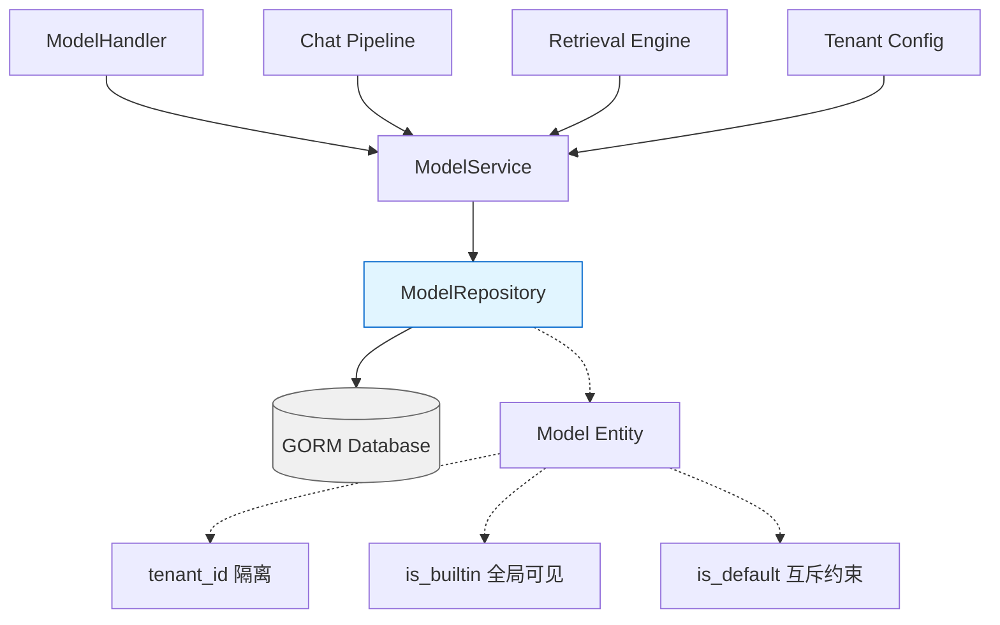
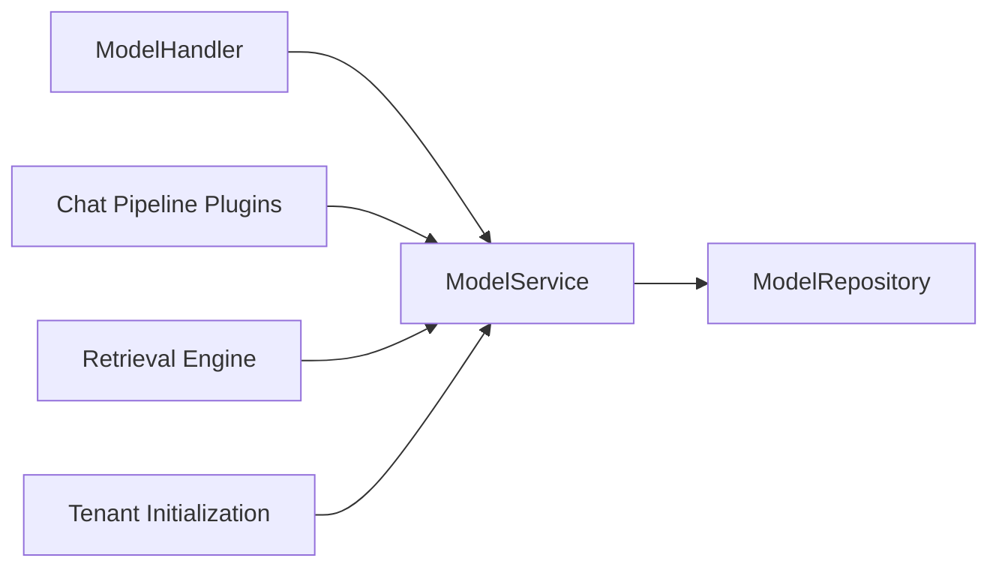

# Model Catalog Repository 模块深度解析

## 概述：为什么需要这个模块？

想象一下，你的系统需要支持数十种不同的 AI 模型 —— 来自 OpenAI、阿里云、智谱、Ollama 本地部署……每个租户可能配置自己偏好的模型，但系统也需要提供一套"开箱即用"的内置模型。如何存储这些配置？如何确保租户只能看到自己的模型和系统内置模型？如何原子性地切换"默认模型"而不产生竞态条件？

`model_catalog_repository` 模块正是为了解决这些问题而生。它是模型元数据的**持久化网关**，负责将 [`Model`](#model-领域模型) 实体安全地存储到数据库中，并提供多租户隔离的查询能力。这个模块的核心设计洞察是：**模型配置是系统的核心基础设施，必须以事务安全、租户隔离的方式管理，同时支持"内置模型全局可见"的特殊语义**。

与 naive 方案（简单的 CRUD 封装）不同，这个模块在三个关键场景做了专门设计：
1. **多租户 + 内置模型混合查询** —— 租户能看到自己的模型和系统内置模型，但不能看到其他租户的私有模型
2. **零值字段更新** —— 当用户将 `is_default` 从 `true` 改为 `false` 时，必须确保这个变更被持久化
3. **原子性默认模型切换** —— 设置新默认模型前，需要批量清除同类型其他模型的默认标志，这必须是原子操作

---

## 架构与数据流



### 架构角色解析

`modelRepository` 在整个系统中扮演**数据访问层（DAL）**的角色，位于典型的 Repository Pattern 架构中：

| 层级 | 组件 | 职责 |
|------|------|------|
| HTTP 层 | `ModelHandler` | 解析 HTTP 请求，调用 Service |
| 业务层 | [`ModelService`](#依赖分析：谁调用它，它调用谁) | 业务逻辑、模型实例化、嵌入/重排序模型获取 |
| **持久化层** | **`modelRepository`** | **SQL 生成、多租户过滤、事务边界** |
| 存储层 | GORM + Database | 实际数据存储 |

### 数据流向：以"获取租户模型列表"为例

```
HTTP GET /models?type=chat&source=openai
    ↓
ModelHandler.ListModels(tenantID=123, type="chat", source="openai")
    ↓
ModelService.ListModels(ctx) 
    ↓
ModelRepository.List(ctx, tenantID=123, modelType="chat", source="openai")
    ↓
GORM Query: SELECT * FROM models 
    WHERE (tenant_id = 123 OR is_builtin = true) 
    AND type = 'chat' 
    AND source = 'openai'
    ↓
[]*Model (租户私有模型 + 内置模型)
```

关键点在于 `WHERE (tenant_id = 123 OR is_builtin = true)` 这个条件 —— 它实现了**租户隔离 + 内置模型共享**的混合可见性语义。这是本模块最核心的设计决策之一。

---

## 组件深度解析

### `modelRepository` 结构体

```go
type modelRepository struct {
    db *gorm.DB
}
```

这是典型的 Repository Pattern 实现，只依赖一个 `*gorm.DB` 实例。这种极简设计带来两个好处：
1. **依赖清晰** —— 除了数据库，没有其他外部依赖，便于单元测试（可以用 `sqlmock` 模拟）
2. **无状态** —— 每个方法都是纯函数式的，不维护内部状态，线程安全

#### 构造函数：`NewModelRepository`

```go
func NewModelRepository(db *gorm.DB) interfaces.ModelRepository
```

返回接口类型而非具体结构体，这是 Go 中依赖注入的标准做法。调用方（通常是 DI 容器或 `wire`）只依赖 `interfaces.ModelRepository` 接口，便于测试时替换为 mock 实现。

---

### 核心方法详解

#### `Create(ctx, model)` —— 创建模型记录

**设计意图**：将新的模型配置持久化到数据库。

**内部机制**：
```go
r.db.WithContext(ctx).Create(m).Error
```

直接使用 GORM 的 `Create` 方法。注意这里没有额外的业务校验 —— 校验逻辑应该在 Service 层完成，Repository 只负责数据持久化。这是**单一职责原则**的体现。

**副作用**：
- 在 `models` 表中插入一行
- `CreatedAt`、`UpdatedAt` 由 GORM 自动填充（通过 GORM 钩子）
- `DeletedAt` 初始为 `NULL`（软删除标记）

---

#### `GetByID(ctx, tenantID, id)` —— 按 ID 获取模型

**设计意图**：根据模型 ID 获取模型配置，同时遵守多租户可见性规则。

**内部机制**：
```go
r.db.WithContext(ctx).Where("id = ?", id).Where(
    "tenant_id = ? OR is_builtin = true", tenantID,
).First(&m).Error
```

这里的 `WHERE` 子句是本模块的**核心安全边界**：
- `tenant_id = ?` —— 租户只能看到自己创建的模型
- `OR is_builtin = true` —— 但所有租户都能看到系统内置模型
- 两者结合 —— 租户看不到其他租户的私有模型

**返回值约定**：
- 找到记录 → 返回 `*Model`, `nil`
- 记录不存在 → 返回 `nil, nil`（注意：不是 error！）
- 数据库错误 → 返回 `nil, error`

这个设计值得注意：**记录不存在不视为错误**。调用方需要检查 `if model == nil` 来判断是否存在。这种模式在 Go 中常见，但需要调用方明确处理。

---

#### `List(ctx, tenantID, modelType, source)` —— 列表查询

**设计意图**：支持按类型和来源过滤的模型列表查询，同样遵守多租户可见性规则。

**内部机制**：
```go
query := r.db.WithContext(ctx).Where("tenant_id = ? OR is_builtin = true", tenantID)

if modelType != "" {
    query = query.Where("type = ?", modelType)
}

if source != "" {
    query = query.Where("source = ?", source)
}
```

**动态查询构建** —— 只有当过滤条件非空时才添加 `WHERE` 子句。这种设计支持灵活查询：
- `List(ctx, 123, "", "")` → 获取租户 123 的所有模型 + 所有内置模型
- `List(ctx, 123, "chat", "")` → 只获取 chat 类型
- `List(ctx, 123, "chat", "openai")` → 只获取 OpenAI 来源的 chat 模型

**返回值约定**：
- 成功（即使为空列表）→ `[]*Model, nil`
- 数据库错误 → `nil, error`

---

#### `Update(ctx, model)` —— 更新模型

**设计意图**：更新模型配置，**包括零值字段**（如将 `is_default` 从 `true` 改为 `false`）。

**内部机制**：
```go
r.db.WithContext(ctx).Debug().Model(&types.Model{}).Where(
    "id = ? AND tenant_id = ?", m.ID, m.TenantID,
).Select("*").Updates(m).Error
```

这里有三个关键设计点：

1. **`Select("*")` 的必要性** —— GORM 的 `Updates` 默认会**忽略零值**（`false`、`""`、`0`）。如果不加 `Select("*")`，当用户将 `IsDefault` 从 `true` 改为 `false` 时，这个变更会被忽略！`Select("*")` 强制更新所有字段。

2. **`Where` 中的租户校验** —— 确保只能更新自己租户的模型，不能越权修改其他租户或内置模型。

3. **`.Debug()` 的使用** —— 这行代码看起来像是调试遗留。在生产环境中，应该通过配置控制 SQL 日志，而不是硬编码 `.Debug()`。这是一个潜在的改进点。

**副作用**：
- 更新匹配记录的 `UpdatedAt` 字段（GORM 自动处理）
- 如果 `Where` 条件不匹配任何记录，`Updates` 不会报错，但 `RowsAffected` 为 0（本方法未检查）

---

#### `Delete(ctx, tenantID, id)` —— 删除模型

**设计意图**：软删除模型记录。

**内部机制**：
```go
r.db.WithContext(ctx).Where("id = ? AND tenant_id = ?", id, tenantID).Delete(&types.Model{}).Error
```

GORM 会识别 `Model` 结构体中的 `DeletedAt gorm.DeletedAt` 字段，自动执行**软删除**（设置 `DeletedAt` 为当前时间，而非真正删除行）。这意味着：
- 后续查询会自动过滤掉已删除记录（GORM 自动添加 `WHERE deleted_at IS NULL`）
- 可以通过 `Unscoped()` 查询已删除记录（本模块未提供此功能）

**安全边界**：`WHERE` 条件中包含 `tenant_id`，防止越权删除。

---

#### `ClearDefaultByType(ctx, tenantID, modelType, excludeID)` —— 批量清除默认标志

**设计意图**：在设置新默认模型前，原子性地清除同类型其他模型的 `is_default` 标志。

**为什么需要这个方法？**

假设租户有两个 chat 模型 A 和 B。用户想将 B 设为默认模型。业务逻辑是：
1. 清除所有 chat 模型的 `is_default = false`
2. 设置 B 的 `is_default = true`

如果这两步不是原子的，或者第一步没有正确排除 B，会导致：
- 竞态条件：两个请求同时设置默认模型，最终可能有两个 `is_default = true` 的模型
- 逻辑错误：先清除再设置，但清除时把 B 也清除了，最终 B 的 `is_default` 被设为 `false`

**内部机制**：
```go
query := r.db.WithContext(ctx).Model(&types.Model{}).Where(
    "tenant_id = ? AND type = ? AND is_default = ?", tenantID, modelType, true,
)

if excludeID != "" {
    query = query.Where("id != ?", excludeID)
}

return query.Update("is_default", false).Error
```

**关键设计点**：
1. **只更新已经是 `true` 的记录** —— `WHERE is_default = true` 减少不必要的写操作
2. **支持排除特定 ID** —— 调用方传入即将成为默认模型的 ID，避免先清除再设置的逻辑错误
3. **单条 SQL 原子更新** —— 整个操作是一条 `UPDATE` 语句，不存在中间状态

**使用示例**：
```go
// 设置 modelB 为默认 chat 模型
repo.ClearDefaultByType(ctx, tenantID, "chat", modelB.ID)  // 清除其他模型的默认标志
modelB.IsDefault = true
repo.Update(ctx, modelB)  // 设置 modelB 为默认
```

---

## 依赖分析：谁调用它，它调用谁

### 上游调用者



| 调用方 | 调用场景 | 期望行为 |
|--------|----------|----------|
| [`ModelHandler`](../../http_handlers_and_routing/#model_catalog_management_handlers) | HTTP 请求处理 | 返回 JSON 响应，处理 404/403 |
| [`ModelService`](#依赖分析：谁调用它，它调用谁) | 业务逻辑编排 | 获取模型配置，实例化 Chat/Embedding/Rerank 客户端 |
| Chat Pipeline | 对话时获取模型实例 | 根据模型 ID 获取可执行的 Chat 接口 |
| Retrieval Engine | 向量检索时获取 Embedding 模型 | 根据模型 ID 获取 Embedder 实例 |

### 下游依赖

| 被调用方 | 用途 | 耦合程度 |
|----------|------|----------|
| `*gorm.DB` | SQL 生成与执行 | **强耦合** —— 更换 ORM 需要重写整个 Repository |
| [`types.Model`](#model-领域模型) | 数据实体 | **强耦合** —— 表结构变更会直接影响 Repository |
| `context.Context` | 超时控制、链路追踪 | **弱耦合** —— 标准 Go 约定 |

### 数据契约：`Model` 实体

```go
type Model struct {
    ID          string         // 主键，UUID 格式
    TenantID    uint64         // 租户 ID，多租户隔离关键字段
    Name        string         // 人类可读名称
    Type        ModelType      // 枚举：chat, embedding, rerank
    Source      ModelSource    // 枚举：openai, aliyun, zhipu, ollama, ...
    Description string         // 描述
    Parameters  ModelParameters // JSON 字段，存储 API Key、BaseURL 等敏感配置
    IsDefault   bool           // 是否为默认模型（同类型互斥）
    IsBuiltin   bool           // 是否为内置模型（全局可见）
    Status      ModelStatus    // 状态：active, downloading, download_failed
    CreatedAt   time.Time      // 创建时间
    UpdatedAt   time.Time      // 更新时间
    DeletedAt   gorm.DeletedAt // 软删除标记
}
```

**关键字段说明**：

- **`Parameters` 字段** —— 存储为 JSON 类型，包含 `APIKey`、`BaseURL`、`Provider` 等。这意味着：
  - 数据库需要支持 JSON 类型（MySQL 5.7+、PostgreSQL 9.2+）
  - 敏感信息（如 API Key）以明文存储，**需要配合加密中间件或应用层加密**
  
- **`IsDefault` 字段** —— 业务上要求同类型模型只能有一个默认值，但数据库层面没有唯一约束，**依赖应用层逻辑保证**（通过 `ClearDefaultByType` 方法）

- **`IsBuiltin` 字段** —— 内置模型的 `TenantID` 可以是任意值（通常是 0），查询时通过 `OR is_builtin = true` 实现全局可见

---

## 设计决策与权衡

### 1. Repository Pattern vs Active Record

**选择**：Repository Pattern（数据访问逻辑与实体分离）

**权衡**：
- ✅ **优点**：便于单元测试（可以 mock `ModelRepository` 接口），业务逻辑与 SQL 解耦
- ❌ **缺点**：需要额外维护接口定义，代码量略多

**为什么这样选**：系统中有复杂的业务逻辑（如模型实例化、嵌入池管理），将 CRUD 与业务逻辑分离更清晰。

---

### 2. 软删除 vs 硬删除

**选择**：软删除（`DeletedAt` 字段）

**权衡**：
- ✅ **优点**：支持数据恢复、审计追踪，避免外键约束问题
- ❌ **缺点**：需要定期清理历史数据，查询性能略受影响（GORM 自动处理）

**为什么这样选**：模型配置是核心基础设施，误删除可能导致服务中断，软删除提供安全网。

---

### 3. 多租户隔离策略

**选择**：`WHERE tenant_id = ? OR is_builtin = true`

**权衡**：
- ✅ **优点**：简单直观，单表存储，查询效率高
- ❌ **缺点**：每个查询都需要添加租户过滤条件，容易遗漏导致数据泄露

**替代方案**：
- **独立数据库 per 租户** —— 隔离性最强，但运维成本高
- **独立表 per 租户** —— 折中方案，但表数量爆炸

**为什么这样选**：系统租户数量可能很大，单表 + 租户 ID 过滤是最经济的方案。

---

### 4. `Update` 方法使用 `Select("*")`

**选择**：显式更新所有字段，包括零值

**权衡**：
- ✅ **优点**：语义明确，零值变更不会被忽略
- ❌ **缺点**：每次更新所有字段，可能覆盖并发修改（需要配合乐观锁）

**替代方案**：
- **只更新变更字段** —— 需要调用方指定哪些字段变更，接口复杂
- **乐观锁** —— 添加 `version` 字段，检测并发冲突

**为什么这样选**：模型配置变更频率低，并发冲突概率小，简单优先。

---

### 5. `GetByID` 返回 `nil, nil` 而非 `nil, error`

**选择**：记录不存在不视为错误

**权衡**：
- ✅ **优点**：调用方可以用 `if model == nil` 简洁判断，符合 Go 惯例
- ❌ **缺点**：调用方可能忘记检查 `nil`，导致后续空指针

**为什么这样选**：Go 标准库（如 `map` 查询）也采用类似约定，调用方需要明确处理不存在的情况。

---

## 使用指南与示例

### 基本 CRUD 操作

```go
// 初始化 Repository
repo := repository.NewModelRepository(db)

// 创建模型
model := &types.Model{
    ID:        "uuid-123",
    TenantID:  123,
    Name:      "My GPT-4",
    Type:      "chat",
    Source:    "openai",
    IsDefault: false,
    IsBuiltin: false,
    Parameters: types.ModelParameters{
        BaseURL:  "https://api.openai.com/v1",
        APIKey:   "sk-xxx",
        Provider: "openai",
    },
}
err := repo.Create(ctx, model)

// 获取模型
model, err := repo.GetByID(ctx, 123, "uuid-123")
if model == nil {
    // 处理不存在的情况
}

// 列表查询
models, err := repo.List(ctx, 123, "chat", "")

// 更新模型
model.Name = "Updated Name"
err = repo.Update(ctx, model)

// 删除模型
err = repo.Delete(ctx, 123, "uuid-123")
```

### 设置默认模型（正确姿势）

```go
// 错误做法：直接更新 is_default
model.IsDefault = true
repo.Update(ctx, model)  // 可能导致多个模型 is_default = true

// 正确做法：先清除同类型其他模型的默认标志
err := repo.ClearDefaultByType(ctx, tenantID, model.Type, model.ID)
if err != nil {
    return err
}
model.IsDefault = true
err = repo.Update(ctx, model)
```

### 事务场景

```go
// 需要在事务中操作时
err := db.Transaction(func(tx *gorm.DB) error {
    repo := repository.NewModelRepository(tx)  // 使用事务中的 DB
    
    err := repo.ClearDefaultByType(ctx, tenantID, "chat", newDefaultID)
    if err != nil {
        return err
    }
    
    // ... 其他操作
    
    return nil
})
```

---

## 边界情况与陷阱

### 1. 越权访问风险

**问题**：如果调用方传入错误的 `tenantID`，可能访问其他租户的数据。

**示例**：
```go
// 恶意调用：传入其他租户 ID
repo.GetByID(ctx, otherTenantID, modelID)  // 如果 model 是内置模型，仍能访问
```

**防护**：
- Repository 层的 `WHERE` 条件已经防止了直接越权（`tenant_id = ? OR is_builtin = true`）
- 但调用方仍应验证 `tenantID` 的合法性（在 Handler 或 Service 层）

---

### 2. `Update` 方法的 `.Debug()` 硬编码

**问题**：生产环境中会输出大量 SQL 日志，影响性能。

**建议**：
```go
// 移除硬编码的 .Debug()
return r.db.WithContext(ctx).Model(&types.Model{}).Where(
    "id = ? AND tenant_id = ?", m.ID, m.TenantID,
).Select("*").Updates(m).Error
```

通过 GORM 配置或日志级别控制 SQL 输出。

---

### 3. `ClearDefaultByType` 的并发安全

**问题**：虽然单条 SQL 是原子的，但 `ClearDefaultByType + Update` 两步操作不是原子的。

**场景**：
```
请求 A: ClearDefaultByType(..., excludeID="A")
请求 B: ClearDefaultByType(..., excludeID="B")
请求 A: Update(A, is_default=true)
请求 B: Update(B, is_default=true)
// 结果：A 和 B 都是 is_default=true
```

**解决方案**：
- **数据库唯一约束**：添加 `UNIQUE INDEX idx_type_tenant_default (type, tenant_id, is_default)`，但需要 `is_default` 为 `true` 时才生效，MySQL 不支持部分索引
- **应用层分布式锁**：在 Service 层加锁，确保同一租户同一类型的默认模型设置是串行的
- **乐观锁**：添加 `version` 字段，检测并发冲突

---

### 4. 敏感信息存储

**问题**：`Parameters.APIKey` 以明文存储在数据库中。

**风险**：数据库泄露会导致 API Key 泄露。

**建议**：
- 应用层加密：在 `Create`/`Update` 前加密 `APIKey`，`Get` 后解密
- 使用密钥管理服务（如 AWS KMS、HashiCorp Vault）
- 数据库透明加密（TDE）

---

### 5. `List` 方法返回空列表 vs `nil`

**问题**：GORM 的 `Find` 在空结果时返回空切片 `[]*Model{}` 而非 `nil`，但调用方可能依赖 `nil` 判断。

**建议**：调用方应使用 `len(models) == 0` 而非 `models == nil` 判断空列表。

---

## 扩展点

### 添加新的查询方法

如果需要添加按名称模糊查询：

```go
func (r *modelRepository) SearchByName(
    ctx context.Context,
    tenantID uint64,
    namePattern string,
) ([]*types.Model, error) {
    var models []*types.Model
    err := r.db.WithContext(ctx).Where(
        "tenant_id = ? OR is_builtin = true", tenantID,
    ).Where("name LIKE ?", "%"+namePattern+"%").Find(&models).Error
    return models, err
}
```

记得同时在 `interfaces.ModelRepository` 接口中添加方法签名。

---

### 添加乐观锁支持

```go
type Model struct {
    // ... 现有字段
    Version int `gorm:"type:int;default:0"`
}

func (r *modelRepository) UpdateWithOptimisticLock(
    ctx context.Context,
    m *types.Model,
    expectedVersion int,
) error {
    result := r.db.WithContext(ctx).Model(&types.Model{}).Where(
        "id = ? AND tenant_id = ? AND version = ?",
        m.ID, m.TenantID, expectedVersion,
    ).Update("version", gorm.Expr("version + 1")).Updates(m)
    
    if result.RowsAffected == 0 {
        return errors.New("optimistic lock failed")
    }
    return result.Error
}
```

---

## 相关模块参考

- [`ModelService`](application_services_and_orchestration.md#model_catalog_configuration_services) —— 业务逻辑层，负责模型实例化
- [`ModelHandler`](http_handlers_and_routing.md#model_catalog_management_handlers) —— HTTP 接口层
- [`Model` 实体](core_domain_types_and_interfaces.md#model_catalog_and_parameter_contracts) —— 领域模型定义
- [`ModelRepository` 接口](core_domain_types_and_interfaces.md#model_catalog_service_and_repository_interfaces) —— 接口契约

---

## 总结

`model_catalog_repository` 是一个设计简洁但考虑周全的数据访问层模块。它的核心价值在于：

1. **多租户隔离** —— 通过 `WHERE` 条件确保数据隔离
2. **内置模型共享** —— `is_builtin` 字段支持全局可见的内置模型
3. **默认模型原子切换** —— `ClearDefaultByType` 方法避免竞态条件
4. **零值更新支持** —— `Select("*")` 确保布尔字段变更不被忽略

对于新贡献者，最需要关注的是：
- **永远不要跳过租户 ID 校验** —— 这是安全边界
- **设置默认模型必须用 `ClearDefaultByType`** —— 直接 `Update` 会导致数据不一致
- **敏感字段需要加密** —— `APIKey` 等不应明文存储

这个模块是典型的"简单但不简陋"设计 —— 代码量少，但每个设计决策都有明确的意图和权衡。
