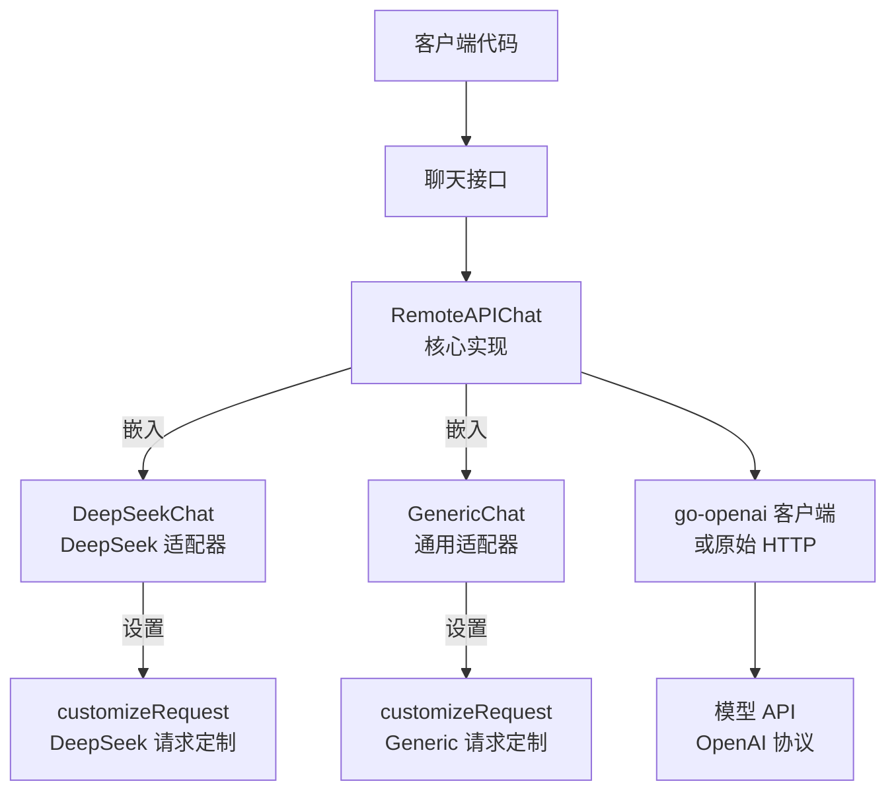

# Generic 和 DeepSeek 提供商适配器技术深度解析

## 1. 模块概述

`generic_and_deepseek_provider_adapters` 模块是系统模型提供商适配层的重要组成部分，专门处理两类 OpenAI 协议兼容但有特殊行为的模型服务：
- **DeepSeek**：官方 OpenAI 兼容接口，但不支持 `tool_choice` 参数
- **Generic**：通用 OpenAI 兼容接口（如 vLLM），支持通过 `ChatTemplateKwargs` 传递特殊参数（如 `thinking`）

这个模块的核心价值在于：在保持与 [RemoteAPIChat](model_providers_and_ai_backends-chat_completion_backends_and_streaming.md) 通用实现兼容的前提下，通过**请求定制器（Request Customizer）**模式解决了不同提供商 API 实现的微妙差异问题。

## 2. 架构设计

### 2.1 核心设计模式

本模块采用了**组合 + 模板方法**的设计模式：
1. **继承（Embedding）**：`DeepSeekChat` 和 `GenericChat` 都嵌入了 `*RemoteAPIChat`，复用其所有核心功能
2. **请求定制器**：通过 `SetRequestCustomizer` 注入自定义逻辑，在请求发送前进行修改
3. **开闭原则**：对扩展开放（可以添加新的定制器），对修改关闭（不需要修改 `RemoteAPIChat` 的核心代码）

### 2.2 组件关系图



## 3. 核心组件详解

### 3.1 DeepSeekChat 结构体

**职责**：专门适配 DeepSeek 模型服务，解决其不支持 `tool_choice` 参数的问题。

```go
// DeepSeekChat DeepSeek 模型聊天实现
// DeepSeek 模型不支持 tool_choice 参数
type DeepSeekChat struct {
    *RemoteAPIChat
}
```

**设计要点**：
- 嵌入 `*RemoteAPIChat` 而非继承，这是 Go 语言中实现代码复用的惯用方式
- 注释明确说明了 DeepSeek 的限制：不支持 `tool_choice` 参数

### 3.2 NewDeepSeekChat 工厂函数

**职责**：创建并配置 DeepSeekChat 实例。

```go
func NewDeepSeekChat(config *ChatConfig) (*DeepSeekChat, error) {
    config.Provider = string(provider.ProviderDeepSeek)

    remoteChat, err := NewRemoteAPIChat(config)
    if err != nil {
        return nil, err
    }

    chat := &DeepSeekChat{
        RemoteAPIChat: remoteChat,
    }

    // 设置请求自定义器
    remoteChat.SetRequestCustomizer(chat.customizeRequest)

    return chat, nil
}
```

**流程解析**：
1. 首先设置 provider 标识为 `provider.ProviderDeepSeek`
2. 创建基础的 `RemoteAPIChat` 实例
3. 将 `RemoteAPIChat` 嵌入到 `DeepSeekChat` 中
4. **关键步骤**：调用 `SetRequestCustomizer` 注入 DeepSeek 特定的请求定制逻辑
5. 返回配置好的实例

### 3.3 DeepSeekChat.customizeRequest 方法

**职责**：在发送请求前修改 OpenAI 请求，移除 DeepSeek 不支持的参数。

```go
func (c *DeepSeekChat) customizeRequest(req *openai.ChatCompletionRequest, opts *ChatOptions, isStream bool) (any, bool) {
    // DeepSeek 模型不支持 tool_choice，需要清除
    if opts != nil && opts.ToolChoice != "" {
        logger.Infof(context.Background(), "deepseek model, skip tool_choice")
        req.ToolChoice = nil
    }
    return nil, false
}
```

**工作原理**：
- 接收三个参数：原始 OpenAI 请求、聊天选项、是否为流式请求
- 检查是否设置了 `ToolChoice`，如果是，则将 `req.ToolChoice` 设置为 `nil`
- 返回 `(nil, false)` 表示：
  - 不使用自定义请求体（继续使用修改后的标准请求）
  - 不使用原始 HTTP 请求（继续使用 go-openai 客户端）

**设计意图**：
- 这是一个**防御性编程**的例子：不是假设用户不会设置不支持的参数，而是主动处理这种情况
- 记录日志以便调试和用户理解
- 选择静默处理而不是报错，提高了系统的容错性

### 3.4 GenericChat 结构体

**职责**：适配通用 OpenAI 兼容接口（如 vLLM），支持通过 `ChatTemplateKwargs` 传递特殊参数。

```go
// GenericChat 通用 OpenAI 兼容实现（如 vLLM）
// 支持 ChatTemplateKwargs 参数
type GenericChat struct {
    *RemoteAPIChat
}
```

**设计要点**：
- 同样嵌入 `*RemoteAPIChat` 复用核心功能
- 注释说明了其用途：支持 `ChatTemplateKwargs` 参数，适用于 vLLM 等部署

### 3.5 NewGenericChat 工厂函数

**职责**：创建并配置 GenericChat 实例。

```go
func NewGenericChat(config *ChatConfig) (*GenericChat, error) {
    config.Provider = string(provider.ProviderGeneric)

    remoteChat, err := NewRemoteAPIChat(config)
    if err != nil {
        return nil, err
    }

    chat := &GenericChat{
        RemoteAPIChat: remoteChat,
    }

    // 设置请求自定义器
    remoteChat.SetRequestCustomizer(chat.customizeRequest)

    return chat, nil
}
```

**流程解析**：
- 与 `NewDeepSeekChat` 类似，但是设置 provider 为 `provider.ProviderGeneric`
- 注入的是 `GenericChat` 自己的 `customizeRequest` 方法

### 3.6 GenericChat.customizeRequest 方法

**职责**：在发送请求前设置 `ChatTemplateKwargs`，用于传递如 `thinking` 等特殊参数。

```go
func (c *GenericChat) customizeRequest(req *openai.ChatCompletionRequest, opts *ChatOptions, isStream bool) (any, bool) {
    // Generic provider（如 vLLM）使用 ChatTemplateKwargs 传递 thinking 参数
    thinking := false
    if opts != nil && opts.Thinking != nil {
        thinking = *opts.Thinking
    }
    req.ChatTemplateKwargs = map[string]interface{}{
        "enable_thinking": thinking,
    }
    return nil, false // 使用标准请求（已修改）
}
```

**工作原理**：
- 从 `opts` 中提取 `Thinking` 参数（这是一个布尔指针，可能为 nil）
- 设置 `req.ChatTemplateKwargs` 为一个包含 `enable_thinking` 键的 map
- 同样返回 `(nil, false)` 表示继续使用修改后的标准请求

**设计意图**：
- 这是一个**扩展点**的例子：通过 `ChatTemplateKwargs` 可以传递任意自定义参数给底层模型
- 专门处理 `thinking` 参数，这是很多推理模型（如 DeepSeek Reasoner、Qwen 等）支持的功能
- 使用 map 而非强类型，提供了最大的灵活性

## 4. 数据流程分析

### 4.1 典型调用流程（以 DeepSeek 为例）

```
1. 上层应用调用 Chat() 或 ChatStream()
   ↓
2. DeepSeekChat.Chat()（实际上是 RemoteAPIChat.Chat()）
   ↓
3. BuildChatCompletionRequest() 构建标准请求
   ↓
4. 检查 requestCustomizer 是否存在（存在）
   ↓
5. 调用 DeepSeekChat.customizeRequest()
   - 检查 opts.ToolChoice
   - 如果设置了，将 req.ToolChoice 设为 nil
   - 记录日志
   ↓
6. 使用修改后的 req 调用 OpenAI 客户端
   ↓
7. 处理响应并返回
```

### 4.2 请求定制器的调用时机

从 `RemoteAPIChat` 的代码可以看到，请求定制器在两个关键位置被调用：
1. **非流式聊天**：在 `Chat()` 方法中，构建完请求后、发送请求前
2. **流式聊天**：在 `ChatStream()` 方法中，构建完请求后、发送请求前

这种设计确保了无论是流式还是非流式请求，都能应用相同的定制逻辑。

## 5. 设计决策与权衡

### 5.1 为什么使用嵌入而不是继承？

**选择**：使用 Go 的结构体嵌入（embedding）而非传统的面向对象继承。

**原因**：
1. **Go 语言的惯用方式**：Go 没有类继承，只有组合和接口
2. **更灵活**：嵌入可以看作是"自动委托"，但我们仍然可以覆盖方法
3. **避免继承的脆弱性**：基类的变化不会意外影响子类

**权衡**：
- ✅ 优点：代码更清晰，符合 Go 语言哲学
- ⚠️ 缺点：如果需要多态，需要额外定义接口

### 5.2 为什么使用请求定制器模式？

**选择**：通过 `SetRequestCustomizer` 注入函数，而不是让子类重写某个方法。

**原因**：
1. **解耦**：定制逻辑与核心逻辑分离
2. **灵活性**：可以在运行时动态更改定制器（虽然当前代码中没有这样做）
3. **单一职责**：`RemoteAPIChat` 负责核心流程，定制器负责特定修改

**权衡**：
- ✅ 优点：符合开闭原则，易于扩展
- ⚠️ 缺点：增加了一层间接性，代码稍微复杂一些

### 5.3 为什么 DeepSeek 选择静默移除 tool_choice 而不是报错？

**选择**：当检测到 `tool_choice` 时，静默移除并记录日志，而不是返回错误。

**原因**：
1. **容错性**：上层应用可能不知道 DeepSeek 不支持这个参数
2. **降级体验**：即使不能精确控制 tool choice，仍然可以进行基本的对话
3. **可观察性**：通过日志记录，问题仍然可以被追踪

**权衡**：
- ✅ 优点：系统更健壮，用户体验更好
- ⚠️ 缺点：可能隐藏配置问题，用户可能期望 tool_choice 生效

### 5.4 为什么 GenericChat 使用 ChatTemplateKwargs？

**选择**：通过 `ChatTemplateKwargs` 传递参数，而不是添加新的字段到请求结构。

**原因**：
1. **前瞻性**：不同的模型可能有不同的特殊参数，无法提前预知
2. **灵活性**：map 可以容纳任意键值对
3. **兼容性**：这是 OpenAI 社区中一些部署（如 vLLM）采用的方式

**权衡**：
- ✅ 优点：最大的灵活性，可以适应各种自定义参数
- ⚠️ 缺点：类型不安全，容易出错，需要文档说明支持哪些键

## 6. 使用指南与最佳实践

### 6.1 如何使用 DeepSeekChat？

```go
config := &chat.ChatConfig{
    BaseURL:    "https://api.deepseek.com/v1",
    APIKey:     "your-api-key",
    ModelName:  "deepseek-chat",
}

deepseekChat, err := chat.NewDeepSeekChat(config)
if err != nil {
    // 处理错误
}

// 使用方式与普通 Chat 实例相同
response, err := deepseekChat.Chat(ctx, messages, opts)
```

### 6.2 如何使用 GenericChat？

```go
config := &chat.ChatConfig{
    BaseURL:    "http://your-vllm-endpoint/v1",
    ModelName:  "your-model-name",
}

genericChat, err := chat.NewGenericChat(config)
if err != nil {
    // 处理错误
}

// 启用 thinking 模式
thinking := true
opts := &chat.ChatOptions{
    Thinking: &thinking,
}

response, err := genericChat.Chat(ctx, messages, opts)
```

### 6.3 最佳实践

1. **DeepSeek 使用注意**：
   - 不要依赖 `tool_choice` 参数，它会被忽略
   - 如果需要强制使用工具，可以通过系统提示词来引导模型

2. **Generic 使用注意**：
   - 确保你的后端确实支持 `ChatTemplateKwargs` 和 `enable_thinking` 参数
   - 不同的部署可能支持不同的参数，需要查看对应文档
   - `Thinking` 参数是一个指针，注意 nil 检查

3. **扩展新的适配器**：
   - 遵循相同的模式：嵌入 `RemoteAPIChat`，设置 requestCustomizer
   - 在定制器中，只修改你需要修改的部分
   - 记录足够的日志以便调试

## 7. 常见问题与陷阱

### 7.1 DeepSeek 仍然报错说不支持 tool_choice？

**可能原因**：虽然我们移除了 `req.ToolChoice`，但如果 `opts.Tools` 不为空，DeepSeek 可能仍然不支持。

**解决方案**：
- 检查是否真的需要传递 tools 给 DeepSeek
- 如果不需要，确保 `opts.Tools` 为空

### 7.2 GenericChat 的 thinking 参数不生效？

**可能原因**：
- 你的后端不支持 `ChatTemplateKwargs`
- 你的后端使用的键名不是 `enable_thinking`
- 你的模型本身不支持 thinking 模式

**解决方案**：
- 查看后端文档，确认支持的参数
- 可能需要修改 `GenericChat.customizeRequest` 来适配你的后端

### 7.3 如何添加对其他特殊参数的支持？

**方案一**：修改 `GenericChat.customizeRequest`
- 优点：快速实现
- 缺点：需要修改代码，不够灵活

**方案二**：创建新的适配器
- 优点：不影响现有代码，符合开闭原则
- 缺点：需要创建新的结构体和工厂函数

## 8. 总结

`generic_and_deepseek_provider_adapters` 模块展示了如何通过巧妙的设计模式解决不同 API 提供商之间的微妙差异问题。它的核心思想是：

1. **复用**：通过嵌入 `RemoteAPIChat` 复用核心功能
2. **扩展**：通过请求定制器模式添加特定逻辑
3. **兼容**：保持与标准 OpenAI 协议的兼容性

这种设计使得系统可以轻松支持新的 OpenAI 兼容提供商，只需添加一个类似的适配器即可，而无需修改核心代码。
