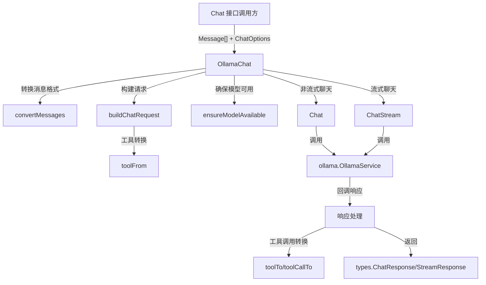

# Ollama 提供程序适配器深度解析

## 1. 模块概览

**ollama_provider_adapter** 是一个专门为集成 Ollama 本地大模型推理服务而设计的适配器层。它解决了将系统内部标准化的聊天接口与 Ollama 特定的 API 格式和行为进行适配的问题，使得系统可以无缝地使用本地部署的 Ollama 模型，同时保持与其他模型提供程序一致的接口契约。

想象一下，这个适配器就像是一个"翻译官"：它理解系统内部的通用聊天语言，也精通 Ollama 的特定方言，负责在两者之间进行准确、高效的双向翻译，同时处理各种细节差异和特殊情况。

## 2. 核心架构



### 架构角色说明

1. **OllamaChat**：核心适配器类，实现了系统的聊天接口，负责协调所有转换和调用逻辑
2. **消息转换器**：`convertMessages` 负责将系统内部的 `Message` 数组转换为 Ollama API 所需的格式
3. **请求构建器**：`buildChatRequest` 负责组装完整的 Ollama 聊天请求，包括参数映射
4. **工具转换器**：`toolFrom`/`toolTo`/`toolCallFrom`/`toolCallTo` 处理工具定义和工具调用的双向转换
5. **模型保障器**：`ensureModelAvailable` 确保所需模型在 Ollama 服务中可用
6. **聊天执行器**：`Chat` 和 `ChatStream` 分别处理非流式和流式聊天请求

## 3. 核心组件深度解析

### 3.1 OllamaChat 结构体

**设计意图**：作为适配器的核心，`OllamaChat` 封装了与 Ollama 服务交互所需的所有状态和逻辑，同时实现了系统内部的聊天接口。

**内部状态**：
- `modelName`：Ollama 模型名称（如 "llama2"）
- `modelID`：系统内部的模型标识符
- `ollamaService`：指向 Ollama 服务客户端的引用

**为什么这样设计**：
- 将模型配置与服务调用分离，使得同一个适配器可以服务于不同的模型配置
- 通过依赖注入 `ollamaService`，提高了可测试性和灵活性

### 3.2 消息转换：convertMessages

**功能**：将系统内部的 `Message` 数组转换为 Ollama API 的 `ollamaapi.Message` 格式。

**关键处理**：
- 基本的角色（Role）和内容（Content）映射
- 工具调用（ToolCalls）的转换
- 特别处理了工具响应消息的 `ToolName` 字段

**设计亮点**：
- 预分配切片容量以优化性能：`make([]ollamaapi.Message, 0, len(messages))`
- 针对工具角色消息的特殊处理，确保 Ollama 能正确识别工具响应

### 3.3 请求构建：buildChatRequest

**功能**：组装完整的 Ollama 聊天请求，包括参数映射。

**参数映射策略**：
| 系统参数 | Ollama 参数 | 说明 |
|---------|------------|------|
| Temperature | options.temperature | 控制生成的随机性 |
| TopP | options.top_p | 核采样参数 |
| MaxTokens | options.num_predict | 最大生成token数 |
| Thinking | Think | 推理模型的思考模式 |
| Format | Format | 输出格式（如json） |
| Tools | Tools | 可用工具定义 |

**设计决策**：
- 只在参数有意义时才设置（如 `Temperature > 0`），避免覆盖 Ollama 的默认值
- 将 `MaxTokens` 映射到 `num_predict`，这是 Ollama 特有的参数名
- 特别支持 `Thinking` 参数，用于推理模型的思考模式

### 3.4 非流式聊天：Chat

**功能**：执行单次非流式聊天请求，返回完整的响应。

**处理流程**：
1. 确保模型可用
2. 构建请求
3. 通过 `ollamaService` 发送请求
4. 处理响应回调
5. 构建并返回 `types.ChatResponse`

**关键实现细节**：
- **内容兜底策略**：当 `Content` 为空但 `Thinking` 有内容时，使用 `Thinking` 作为内容，确保推理模型的兼容性
- **Token 计算**：从 Ollama 响应中提取 `EvalCount` 和 `PromptEvalCount`，计算出 `PromptTokens` 和 `CompletionTokens`
- **错误包装**：使用 `fmt.Errorf("聊天请求失败: %w", err)` 包装错误，保留原始错误信息

### 3.5 流式聊天：ChatStream

**功能**：执行流式聊天请求，通过通道返回响应片段。

**处理流程**：
1. 确保模型可用
2. 构建请求
3. 创建响应通道
4. 启动 goroutine 处理流式响应
5. 返回响应通道

**关键实现细节**：
- **思考内容处理**：首先发送 `ResponseTypeThinking` 类型的响应，当思考结束后发送思考完成事件
- **内容流式输出**：将收到的内容片段作为 `ResponseTypeAnswer` 发送
- **工具调用流式输出**：将工具调用作为 `ResponseTypeToolCall` 发送
- **完成标记**：当收到 `resp.Done` 时，发送最终的完成事件
- **错误处理**：捕获错误并通过通道发送 `ResponseTypeError` 类型的响应

**并发设计**：
- 使用 goroutine 异步处理流式响应，避免阻塞调用方
- 通过 `defer close(streamChan)` 确保通道正确关闭
- 使用 context 支持请求取消

### 3.6 工具转换系列函数

**功能**：处理工具定义和工具调用的双向转换，这是适配器中最复杂的部分之一，因为它需要处理两种 API 格式之间的微妙差异。

**包含的函数**：
- `toolFrom`：将系统的 `Tool` 转换为 Ollama 的 `Tool`
- `toolTo`：将 Ollama 的 `Tool` 转换为系统的 `Tool`
- `toolCallFrom`：将系统的 `ToolCall` 转换为 Ollama 的 `ToolCall`
- `toolCallTo`：将 Ollama 的 `ToolCall` 转换为系统的 `types.LLMToolCall`

**关键处理**：

1. **参数序列化与反序列化**：
   - 系统内部使用 JSON 字节数组存储工具参数
   - Ollama 使用 `map[string]interface{}` 格式
   - 适配器在两者之间进行无缝转换

2. **ID 类型不匹配处理**：
   - Ollama 使用整数索引作为工具调用 ID (`tc.Function.Index`)
   - 系统使用字符串 ID (`tc.ID`)
   - 通过 `tooli2s` (int→string) 和 `tools2i` (string→int) 进行转换
   - 这种设计反映了 Ollama API 与 OpenAI 兼容 API 之间的一个重要差异

3. **错误处理策略**：
   - 在 JSON 转换时使用 `_ = json.Unmarshal(...)` 显式忽略错误
   - 采用"尽力而为"的策略，确保即使部分数据转换失败，整个请求仍能继续

**设计权衡**：
- **鲁棒性 vs 完整性**：忽略 JSON 转换错误可以提高系统鲁棒性，但可能导致工具调用信息丢失。这是在生产环境中常见的权衡，优先保证系统可用性。
- **兼容性 vs 自然性**：使用数字索引作为工具 ID 是 Ollama 的特定要求，适配器必须处理这种不匹配，这增加了代码复杂性但确保了兼容性。

**实现细节**：
- `toolFrom` 中的 `json.Unmarshal(tool.Function.Parameters, &function.Parameters)` 处理参数转换
- `toolTo` 中的 `json.Marshal(tool.Function.Parameters)` 将参数转回 JSON 格式
- `toolCallFrom` 中类似地处理工具调用参数
- `toolCallTo` 最终生成 `types.LLMToolCall`，这是系统内部的标准工具调用格式

## 4. 数据流分析

### 4.1 非流式聊天数据流

```
调用方
  │
  ├─ messages []Message
  ├─ opts *ChatOptions
  ▼
OllamaChat.Chat()
  │
  ├─ [1] ensureModelAvailable()
  │    │
  │    └─ ollamaService.EnsureModelAvailable()
  │
  ├─ [2] buildChatRequest()
  │    │
  │    ├─ convertMessages()
  │    │   └─ toolCallFrom()
  │    │
  │    └─ toolFrom() (如果有工具)
  │
  ├─ [3] ollamaService.Chat()
  │    │
  │    └─ 回调函数处理响应
  │        │
  │        ├─ 提取 Content (或 Thinking 作为兜底)
  │        ├─ toolCallTo() 转换工具调用
  │        └─ 计算 token 使用量
  │
  └─ [4] 返回 types.ChatResponse
```

### 4.2 流式聊天数据流

```
调用方
  │
  ├─ messages []Message
  ├─ opts *ChatOptions
  ▼
OllamaChat.ChatStream()
  │
  ├─ [1] ensureModelAvailable()
  │
  ├─ [2] buildChatRequest()
  │
  ├─ [3] 创建 streamChan
  │
  ├─ [4] 启动 goroutine
  │    │
  │    └─ ollamaService.Chat()
  │        │
  │        └─ 回调函数处理每个响应片段
  │            │
  │            ├─ Thinking 内容 → ResponseTypeThinking
  │            ├─ Content → ResponseTypeAnswer
  │            ├─ ToolCalls → ResponseTypeToolCall
  │            └─ Done → 最终完成事件
  │
  └─ [5] 返回 streamChan
         │
         ▼
      调用方从通道读取响应
```

## 5. 依赖关系分析

### 5.1 内部依赖

| 依赖模块 | 用途 | 耦合度 |
|---------|------|--------|
| `ollama.OllamaService` | 与 Ollama 服务通信的核心客户端 | 高 |
| `types` | 系统通用的响应类型定义 | 中 |
| `logger` | 日志记录 | 低 |
| `ollamaapi` | Ollama 官方 API 类型定义 | 高 |

### 5.2 被依赖情况

这个适配器通常被上层的聊天服务或模型提供者工厂所依赖，它实现了系统内部定义的聊天接口，使得调用方可以用统一的方式与不同的模型提供程序交互。

### 5.3 数据契约

**输入契约**：
- `Message`：包含 `Role`、`Content`、`ToolCalls` 等字段
- `ChatOptions`：包含温度、TopP、最大token数、工具定义等配置
- `Context`：用于请求取消、超时控制和日志传递

**输出契约**：
- 非流式：`types.ChatResponse`，包含内容、工具调用和token使用量
- 流式：`<-chan types.StreamResponse`，包含不同类型的响应片段

## 6. 设计决策与权衡

### 6.1 适配器模式 vs 直接使用 Ollama API

**决策**：采用适配器模式

**原因**：
- 隔离 Ollama API 的变化对系统其他部分的影响
- 保持与其他模型提供程序一致的接口
- 便于在不同模型提供程序之间切换

**权衡**：
- ✅ 优点：降低耦合，提高灵活性
- ❌ 缺点：增加了一层间接性，可能有微小的性能开销

**深层设计思考**：
这个适配器本质上是一个"防腐层"（Anticorruption Layer），它保护系统核心领域模型不受外部系统（Ollama）设计的影响。通过这种方式，系统可以保持自己的领域模型纯净，同时仍然能够利用外部系统的功能。

### 6.2 尽力而为的错误处理策略

**决策**：在工具转换等非关键路径上忽略错误

**原因**：
- 提高系统的鲁棒性，避免因小问题导致整个请求失败
- 大多数情况下，JSON 转换错误是由于边缘情况引起的，不应该影响主要功能

**权衡**：
- ✅ 优点：提高可用性
- ❌ 缺点：可能导致工具调用信息丢失，问题不易被发现

**实现细节**：
在代码中可以看到多处这样的模式：
```go
_ = json.Unmarshal(tool.Function.Parameters, &function.Parameters)
```
这里显式忽略了 JSON 解析错误，这是一种经过深思熟虑的设计选择，而不是疏忽。

### 6.3 内容兜底策略

**决策**：当 Content 为空但 Thinking 有内容时，使用 Thinking 作为内容

**原因**：
- 支持推理模型（如 Qwen3、DeepSeek）的特殊行为
- 这些模型在未正确配置 thinking 参数时，可能只返回 Thinking 内容

**权衡**：
- ✅ 优点：提高了对不同模型的兼容性
- ❌ 缺点：可能掩盖模型配置问题

**代码中的体现**：
在 `Chat` 方法中：
```go
// 当 Content 为空但 Thinking 有内容时（如推理模型未正确配置 thinking 参数），使用 Thinking 作为兜底
if responseContent == "" && resp.Message.Thinking != "" {
    responseContent = resp.Message.Thinking
}
```

### 6.4 流式响应的并发设计

**决策**：使用 goroutine 异步处理流式响应

**原因**：
- 避免阻塞调用方，允许调用方继续处理其他任务
- 符合 Go 语言的并发设计哲学

**权衡**：
- ✅ 优点：提高响应性，充分利用并发
- ❌ 缺点：增加了复杂性，需要正确处理通道关闭和错误传播

**关键并发模式**：
1. 使用 `make(chan types.StreamResponse)` 创建无缓冲通道
2. 在 goroutine 中处理响应，通过 `defer close(streamChan)` 确保通道关闭
3. 调用方通过 `for resp := range streamChan` 模式消费响应

### 6.5 模型可用性保障设计

**决策**：在每次请求前调用 `ensureModelAvailable`

**原因**：
- 提供"无缝"体验，自动处理模型拉取
- 避免因模型缺失导致的突发错误

**权衡**：
- ✅ 优点：提高了用户体验，减少了手动配置需求
- ❌ 缺点：增加了请求延迟，首次使用大模型时可能需要较长时间下载

**实现方式**：
```go
func (c *OllamaChat) ensureModelAvailable(ctx context.Context) error {
    logger.GetLogger(ctx).Infof("确保模型 %s 可用", c.modelName)
    return c.ollamaService.EnsureModelAvailable(ctx, c.modelName)
}
```
这个方法简单地将调用委托给 `ollamaService`，体现了单一职责原则。

## 7. 使用指南与示例

### 7.1 创建 OllamaChat 实例

```go
// 创建 Ollama 服务客户端
ollamaService := ollama.NewOllamaService(ollamaConfig)

// 创建聊天配置
chatConfig := &ChatConfig{
    ModelName: "llama2",
    ModelID:   "ollama-llama2",
}

// 创建 OllamaChat 实例
ollamaChat, err := NewOllamaChat(chatConfig, ollamaService)
if err != nil {
    // 处理错误
}
```

### 7.2 非流式聊天示例

```go
// 准备消息
messages := []Message{
    {
        Role:    "user",
        Content: "你好，请介绍一下自己",
    },
}

// 准备选项
opts := &ChatOptions{
    Temperature: 0.7,
    MaxTokens:   500,
}

// 发送请求
response, err := ollamaChat.Chat(ctx, messages, opts)
if err != nil {
    // 处理错误
}

// 使用响应
fmt.Println("响应内容:", response.Content)
fmt.Println("Token 使用量:", response.Usage.TotalTokens)
```

### 7.3 流式聊天示例

```go
// 准备消息和选项（同非流式）

// 发送流式请求
streamChan, err := ollamaChat.ChatStream(ctx, messages, opts)
if err != nil {
    // 处理错误
}

// 读取流式响应
for resp := range streamChan {
    switch resp.ResponseType {
    case types.ResponseTypeThinking:
        if resp.Done {
            fmt.Println("\n思考结束")
        } else {
            fmt.Print(resp.Content)
        }
    case types.ResponseTypeAnswer:
        if resp.Done {
            fmt.Println("\n回答结束")
        } else {
            fmt.Print(resp.Content)
        }
    case types.ResponseTypeToolCall:
        fmt.Println("工具调用:", resp.ToolCalls)
    case types.ResponseTypeError:
        fmt.Println("错误:", resp.Content)
    }
}
```

## 8. 边缘情况与注意事项

### 8.1 模型可用性

**问题**：如果 Ollama 服务中没有所需模型，请求会失败。

**解决方案**：适配器会在每次请求前调用 `ensureModelAvailable`，但这需要 Ollama 服务支持自动拉取模型，否则仍会失败。

**建议**：在生产环境中，预先确保所需模型已在 Ollama 服务中可用。

### 8.2 工具调用 ID 不匹配

**问题**：Ollama 使用数字索引作为工具调用 ID，而系统使用字符串，这可能导致 ID 不匹配的问题。

**注意事项**：
- 适配器通过 `tooli2s` 和 `tools2i` 进行转换，但这只适用于 ID 本身就是数字的情况
- 如果系统使用非数字 ID，转换时会丢失信息（`tools2i` 会返回 0）

**建议**：在使用 Ollama 适配器时，确保工具调用 ID 是数字字符串。

### 8.3 推理模型的特殊行为

**问题**：推理模型（如 Qwen3、DeepSeek）可能有特殊的行为，需要特别处理。

**注意事项**：
- 适配器已经实现了内容兜底策略，但这可能掩盖模型配置问题
- 思考内容的流式输出需要前端特别处理

**建议**：在使用推理模型时，确保正确配置了 `Thinking` 参数，并测试前端对思考内容的显示。

### 8.4 流式响应的错误处理

**问题**：流式响应中的错误是通过通道发送的，调用方需要正确处理。

**注意事项**：
- 调用方必须监听 `ResponseTypeError` 类型的响应
- 错误发生后，通道会被关闭，调用方应该停止读取

**建议**：在处理流式响应时，始终检查错误类型的响应。

## 9. 扩展与维护

### 9.1 添加新的参数映射

如果需要支持新的 Ollama 参数，可以在 `buildChatRequest` 方法中添加映射：

```go
if opts.NewParam != "" {
    chatReq.Options["new_param"] = opts.NewParam
}
```

### 9.2 支持新的响应类型

如果 Ollama API 添加了新的响应类型，可以在 `ChatStream` 的回调函数中添加处理逻辑：

```go
if resp.NewField != "" {
    streamChan <- types.StreamResponse{
        ResponseType: types.ResponseTypeNewType,
        NewField:     resp.NewField,
        Done:         false,
    }
}
```

### 9.3 测试建议

- 测试各种消息格式，包括工具调用和工具响应
- 测试推理模型的思考模式
- 测试流式响应的错误处理
- 测试模型不可用的情况

## 10. 设计模式与原则应用

### 10.1 适配器模式 (Adapter Pattern)

这是本模块最核心的设计模式。`OllamaChat` 结构体充当了适配器，将系统内部的聊天接口转换为 Ollama API 能够理解的格式。

**如何应用**：
- 目标接口 (Target)：系统内部的聊天接口
- 适配器 (Adapter)：`OllamaChat` 结构体
- 被适配者 (Adaptee)：`ollama.OllamaService` 和 Ollama API

### 10.2 单一职责原则 (Single Responsibility Principle)

每个方法都有明确的单一职责：
- `convertMessages` 只负责消息格式转换
- `buildChatRequest` 只负责请求构建
- `toolFrom`/`toolTo` 等只负责工具相关转换
- `Chat` 和 `ChatStream` 分别专注于非流式和流式聊天

### 10.3 依赖倒置原则 (Dependency Inversion Principle)

- `OllamaChat` 依赖于抽象的 `ollama.OllamaService` 接口，而不是具体实现
- 通过构造函数注入 `ollamaService`，提高了可测试性和灵活性

### 10.4 防腐层 (Anticorruption Layer)

如前所述，这个适配器本质上是一个防腐层，它：
- 保护系统核心模型不受 Ollama API 设计的影响
- 在两个不同的模型之间进行翻译
- 隔离外部系统变化对内部的影响

## 11. 代码组织与可读性

### 11.1 方法命名与组织

代码遵循清晰的命名约定：
- 转换方法使用 `convertX`、`xFrom`、`xTo` 等命名
- 主要功能方法使用简洁的动词命名：`Chat`、`ChatStream`
- 辅助方法使用小写字母开头，作为未导出的内部方法

### 11.2 内部状态管理

`OllamaChat` 结构体的内部状态最小化：
- 只存储必要的配置信息（`modelName`、`modelID`）
- 依赖外部服务（`ollamaService`）而不是维护复杂的内部状态

### 11.3 注释与文档

代码中包含了有用的注释：
- 对特殊处理逻辑的解释（如内容兜底策略）
- 对参数映射的说明
- 对设计意图的简单阐述

## 12. 相关模块

- [Ollama 服务](model_providers_and_ai_backends-ollama_model_metadata_and_service_utils.md)：提供与 Ollama 服务通信的底层功能
- [聊天核心契约](model_providers_and_ai_backends-chat_completion_backends_and_streaming-chat_core_message_and_tool_contracts.md)：定义了聊天接口的核心类型
- [通用提供程序适配器](model_providers_and_ai_backends-chat_completion_backends_and_streaming-provider_adapters_for_generic_qwen_ollama_and_deepseek-generic_and_deepseek_provider_adapters.md)：可参考的其他适配器实现
