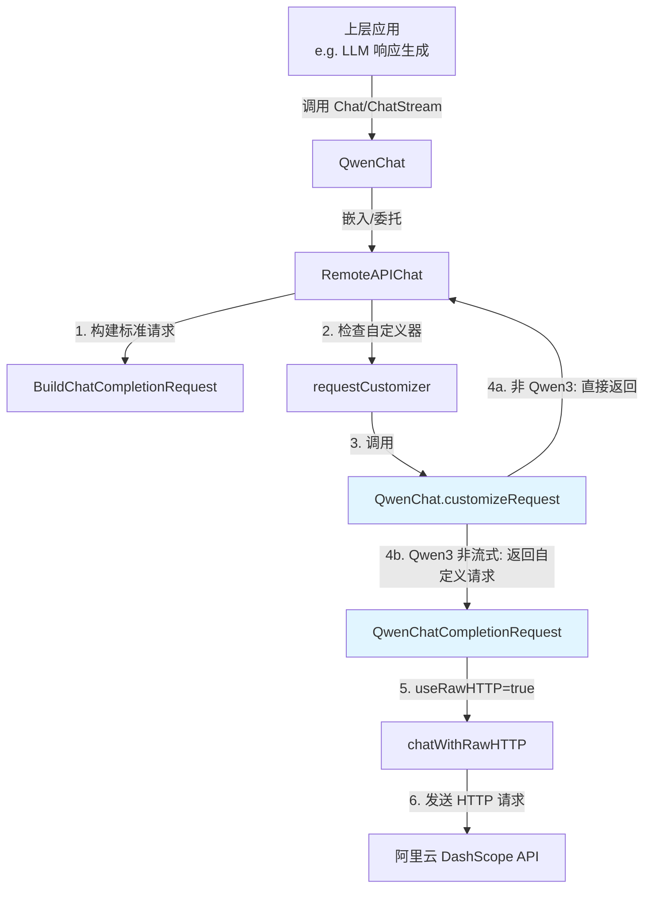

# Qwen 模型适配器与请求契约深度解析

## 1. 模块概述

**qwen_provider_adapter_and_request_contract** 模块是一个针对阿里云 Qwen 大语言模型的特定适配器，它解决了 Qwen3 系列模型需要特殊处理 `enable_thinking` 参数的问题。这个模块的核心价值在于：通过一个轻量级的扩展层，在保持与通用 OpenAI 兼容 API 适配器架构一致性的同时，平滑地处理了 Qwen3 模型的独特行为。

## 2. 问题空间与设计意图

### 2.1 为什么需要这个模块？

在理解这个模块之前，我们需要明确一个背景：Qwen3 系列模型（如 `qwen3-max`）引入了一个名为 "思考模式" 的特性。这种模式下，模型会先生成思考过程，然后再给出最终答案。然而，这个特性在某些场景下（特别是非流式请求）可能不是我们想要的行为，因为它会增加 token 消耗并延迟响应时间。

一个朴素的解决方案可能是在通用的 `RemoteAPIChat` 中添加针对 Qwen3 模型的特殊逻辑，但这样做会导致以下问题：
- **违反单一职责原则**：通用适配器不应该关心特定提供商的细节
- **可维护性下降**：随着更多模型提供商加入，条件判断会越来越复杂
- **耦合度增加**：通用代码与特定模型的特性绑定在一起

### 2.2 设计洞察

这个模块采用了**组合优于继承**和**策略模式**的设计思想：
1. 通过嵌入 `RemoteAPIChat` 来复用通用功能
2. 使用请求自定义器（request customizer）作为扩展点，允许特定模型对请求进行定制
3. 保持接口一致性，使得 Qwen 模型的使用方式与其他模型完全一致

## 3. 核心组件解析

### 3.1 QwenChat 结构体

```go
type QwenChat struct {
    *RemoteAPIChat
}
```

这个结构体是整个模块的门面，它通过嵌入 `*RemoteAPIChat` 来获得所有通用聊天功能。这种设计类似于"装饰器模式"，但更简洁——我们不需要重写所有方法，只需要在需要的地方进行扩展。

### 3.2 QwenChatCompletionRequest 结构体

```go
type QwenChatCompletionRequest struct {
    openai.ChatCompletionRequest
    EnableThinking *bool `json:"enable_thinking,omitempty"`
}
```

这是一个扩展的请求结构体，它在标准 OpenAI 请求的基础上添加了 `EnableThinking` 字段。注意这里使用了指针类型 `*bool`，这样可以区分"未设置"和"设置为 false"两种状态——这在 JSON 序列化时非常重要，因为我们只想在真正需要时才发送这个字段。

### 3.3 NewQwenChat 工厂函数

```go
func NewQwenChat(config *ChatConfig) (*QwenChat, error) {
    config.Provider = string(provider.ProviderAliyun)
    
    remoteChat, err := NewRemoteAPIChat(config)
    if err != nil {
        return nil, err
    }
    
    chat := &QwenChat{
        RemoteAPIChat: remoteChat,
    }
    
    // 设置请求自定义器
    remoteChat.SetRequestCustomizer(chat.customizeRequest)
    
    return chat, nil
}
```

这个函数是创建 QwenChat 实例的工厂方法，它做了三件关键的事情：
1. **强制设置提供商**：确保使用阿里云提供商
2. **创建基础实例**：通过 `NewRemoteAPIChat` 创建通用实例
3. **注入自定义逻辑**：通过 `SetRequestCustomizer` 注册请求自定义器

这里的关键点是**依赖注入**——我们没有修改 `RemoteAPIChat` 的代码，而是通过设置自定义器的方式来扩展它的行为。

### 3.4 isQwen3Model 辅助方法

```go
func (c *QwenChat) isQwen3Model() bool {
    return provider.IsQwen3Model(c.GetModelName())
}
```

这个方法封装了对 Qwen3 模型的检测逻辑，它实际上是对 `provider.IsQwen3Model` 的委托。这种封装有两个好处：
1. 提供了语义上更清晰的接口
2. 隔离了对 provider 包的直接依赖，便于未来的变化

### 3.5 customizeRequest 核心方法

```go
func (c *QwenChat) customizeRequest(req *openai.ChatCompletionRequest, opts *ChatOptions, isStream bool) (any, bool) {
    // 仅 Qwen3 模型需要特殊处理
    if !c.isQwen3Model() {
        return nil, false
    }
    
    // 非流式请求需要显式禁用 thinking
    if !isStream {
        qwenReq := QwenChatCompletionRequest{
            ChatCompletionRequest: *req,
        }
        enableThinking := false
        qwenReq.EnableThinking = &enableThinking
        return qwenReq, true
    }
    
    return nil, false
}
```

这是整个模块的核心逻辑，它实现了请求自定义策略：

**输入参数**：
- `req`：标准的 OpenAI 聊天请求
- `opts`：聊天选项（包含温度、top_p 等参数）
- `isStream`：是否为流式请求

**返回值**：
- `any`：自定义的请求体（如果为 nil 则使用标准请求）
- `bool`：是否需要使用原始 HTTP 请求

**逻辑流程**：
1. 首先检查是否为 Qwen3 模型，如果不是则直接返回（不进行任何自定义）
2. 如果是 Qwen3 模型且是非流式请求，则创建扩展请求并显式禁用 thinking
3. 对于流式请求，保持默认行为（不进行自定义）

这里的设计决策很有意思：**只在必要时才进行自定义**。对于 Qwen3 的流式请求，我们没有进行特殊处理，这是因为在流式场景下，思考过程可以通过 `ResponseTypeThinking` 事件单独处理，不会干扰最终答案的呈现。

## 4. 数据流程与架构角色

### 4.1 在系统中的位置

这个模块位于 **model_providers_and_ai_backends** 层次结构中，具体路径是：
```
model_providers_and_ai_backends
└── chat_completion_backends_and_streaming
    └── provider_adapters_for_generic_qwen_ollama_and_deepseek
        └── qwen_provider_adapter_and_request_contract
```

### 4.2 数据流向

让我们追踪一个非流式 Qwen3 模型请求的完整流程：

1. **初始化阶段**：
   - 上层代码调用 `NewQwenChat(config)` 创建 QwenChat 实例
   - QwenChat 内部创建 RemoteAPIChat 并注册自定义器

2. **请求阶段**：
   - 上层代码调用 `Chat(ctx, messages, opts)`
   - RemoteAPIChat.Chat 构建标准 OpenAI 请求
   - RemoteAPIChat 检查是否有自定义器，发现有则调用
   - QwenChat.customizeRequest 被调用，检测到是 Qwen3 非流式请求
   - 构建 QwenChatCompletionRequest 并设置 EnableThinking=false
   - 返回自定义请求和 useRawHTTP=true
   - RemoteAPIChat 检测到 useRawHTTP=true，调用 chatWithRawHTTP
   - 发送自定义请求到阿里云 API

3. **响应阶段**：
   - 接收响应并解析（使用与标准响应相同的解析逻辑）
   - 注意：即使设置了 EnableThinking=false，RemoteAPIChat 中仍有 removeThinkingContent 作为兜底策略

### 4.3 架构交互图



## 5. 设计决策与权衡

### 5.1 为什么只对非流式请求禁用 thinking？

**决策**：只在非流式请求时显式设置 `EnableThinking=false`，对流式请求保持默认行为。

**原因分析**：
- 在非流式场景下，思考过程会直接包含在最终响应中，用户看不到中间过程，只会得到一个包含思考内容的完整响应，这通常不是我们想要的
- 在流式场景下，系统可以区分思考内容和最终答案——思考内容通过 `ResponseTypeThinking` 事件发送，最终答案通过 `ResponseTypeAnswer` 事件发送，这样用户界面可以选择是否显示思考过程
- 流式场景下，保持 thinking 开启可能有好处——用户可以看到模型的推理过程，增加透明度

### 5.2 为什么使用指针类型的 EnableThinking？

**决策**：`EnableThinking` 字段声明为 `*bool` 而不是 `bool`。

**原因分析**：
- 在 Go 的 JSON 序列化中，`bool` 类型的零值是 `false`，如果我们使用 `bool` 类型，那么即使我们不想设置这个字段，它也会被序列化为 `"enable_thinking": false`
- 使用 `*bool` 类型可以区分三种状态：
  - `nil`：不发送这个字段（使用 API 默认值）
  - `&false`：显式发送 `"enable_thinking": false`
  - `&true`：显式发送 `"enable_thinking": true`
- 这是 Go 中处理可选布尔字段的惯用模式

### 5.3 为什么通过 SetRequestCustomizer 注入自定义逻辑？

**决策**：不是通过继承 RemoteAPIChat 并重写方法，而是通过设置自定义器的方式。

**原因分析**：
- **组合优于继承**：继承会带来强耦合，而组合更灵活
- **开闭原则**：RemoteAPIChat 对扩展开放（通过自定义器），对修改关闭（不需要修改其代码）
- **单一职责**：RemoteAPIChat 负责通用流程，QwenChat 负责 Qwen 特定逻辑
- **可测试性**：可以独立测试自定义器逻辑，不需要完整的 RemoteAPIChat 实例

### 5.4 双重保险：为什么还有 removeThinkingContent？

**观察**：即使我们设置了 `EnableThinking=false`，在 RemoteAPIChat 的 parseCompletionResponse 中仍然有 `removeThinkingContent` 函数作为兜底。

**原因分析**：
- 这是一种**防御性编程**的实践
- 可能存在以下情况导致即使设置了该参数，模型仍返回思考内容：
  - 某些 Qwen3 模型版本可能不完全尊重该参数
  - API 行为可能发生变化
  - 可能存在其他模型（如注释中提到的 Miniax-M2.1）也有类似行为
- 这种设计提供了**纵深防御**，确保无论 API 行为如何变化，用户体验都能保持一致

## 6. 使用指南与注意事项

### 6.1 基本使用

使用 QwenChat 非常简单，和使用其他聊天模型一样：

```go
config := &chat.ChatConfig{
    ModelName: "qwen3-max",
    BaseURL:   "https://dashscope.aliyuncs.com/compatible-mode/v1",
    APIKey:    "your-api-key",
}

qwenChat, err := chat.NewQwenChat(config)
if err != nil {
    // 处理错误
}

// 非流式请求（会自动禁用 thinking）
response, err := qwenChat.Chat(ctx, messages, opts)

// 流式请求（保持默认行为）
streamChan, err := qwenChat.ChatStream(ctx, messages, opts)
```

### 6.2 扩展点与自定义

如果你需要进一步自定义 Qwen 模型的行为，可以：
1. 创建一个新的结构体嵌入 QwenChat
2. 重写 customizeRequest 方法（但要注意调用父类的实现）
3. 或者直接在创建 QwenChat 后再次调用 SetRequestCustomizer 来覆盖原有行为

不过，通常情况下，现有的实现应该已经满足需求了。

### 6.3 常见陷阱与注意事项

1. **模型名称必须正确**：`IsQwen3Model` 函数通过检查模型名称是否以 "qwen3-" 开头来判断，所以确保你的模型名称符合这个规范。

2. **不要重复设置 Provider**：`NewQwenChat` 会自动设置 Provider 为 "aliyun"，所以你不需要在 ChatConfig 中预先设置（设置了也会被覆盖）。

3. **流式请求的思考处理**：在流式场景下，Qwen3 模型可能仍会返回思考内容，确保你的前端代码能够正确处理 `ResponseTypeThinking` 类型的事件。

4. **兜底策略的存在**：即使设置了 `EnableThinking=false`，仍可能有思考内容返回，因为有 `removeThinkingContent` 作为兜底——这是正常的，不用担心。

## 7. 依赖关系与模块交互

### 7.1 依赖的模块

- **provider_adapters_for_generic_qwen_ollama_and_deepseek** 的兄弟模块：
  - [generic_and_deepseek_provider_adapters](model_providers_and_ai_backends-chat_completion_backends_and_streaming-provider_adapters_for_generic_qwen_ollama_and_deepseek-generic_and_deepseek_provider_adapters.md)
  - [ollama_provider_adapter](model_providers_and_ai_backends-chat_completion_backends_and_streaming-provider_adapters_for_generic_qwen_ollama_and_deepseek-ollama_provider_adapter.md)

- 直接依赖的内部模块：
  - [provider](model_providers_and_ai_backends-provider_catalog_and_configuration_contracts.md)：提供模型检测和提供商元数据
  - [RemoteAPIChat](model_providers_and_ai_backends-chat_completion_backends_and_streaming-remote_api_streaming_transport_and_sse_parsing.md)：提供通用的远程 API 聊天功能

- 外部依赖：
  - `github.com/sashabaranov/go-openai`：OpenAI API 的 Go SDK

### 7.2 被哪些模块依赖

这个模块主要被上层的 **llm_response_generation** 相关模块使用，用于生成 LLM 响应。

## 8. 总结

`qwen_provider_adapter_and_request_contract` 模块是一个优秀的示例，展示了如何在不修改核心代码的情况下，通过组合和策略模式来处理特定模型的特殊需求。它的设计体现了以下软件工程原则：

1. **单一职责**：每个组件只做一件事
2. **开闭原则**：对扩展开放，对修改关闭
3. **组合优于继承**：通过嵌入而不是继承来复用功能
4. **防御性编程**：提供多重保障确保行为一致
5. **依赖注入**：通过设置自定义器来注入特定逻辑

对于新加入团队的开发者来说，理解这个模块的设计思想比理解代码本身更重要——因为同样的模式可能会在其他模型适配器中反复出现。
