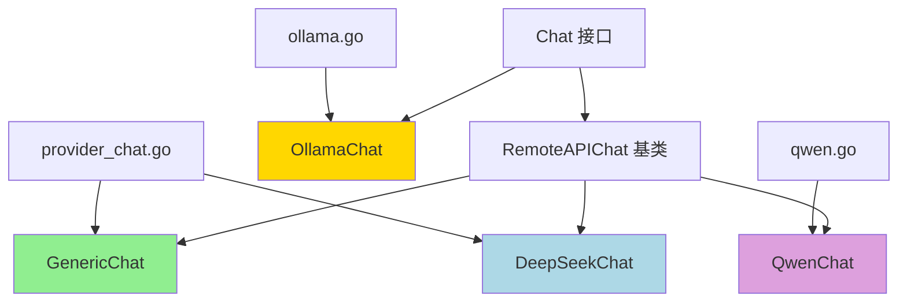

# Provider Adapters for Generic, Qwen, Ollama and DeepSeek

## 模块概述

这个模块是一个**多模型提供商适配层**，它解决了一个核心问题：如何用统一的接口与不同的 LLM 服务（OpenAI 兼容协议、Qwen、Ollama、DeepSeek）交互，同时优雅地处理各提供商的特性差异。

想象一下，你要写一个能同时使用 OpenAI、阿里云通义千问、本地 Ollama 模型和 DeepSeek 的聊天应用。如果每个模型都有完全不同的 API、参数和行为，你的代码会变成一团乱麻。这个模块就像一个**通用电源适配器**——它提供了统一的插座接口（聊天 API），但内部知道如何把电转换成每个设备需要的电压和电流。

## 架构设计



这个模块采用了**组合继承模式**来处理不同模型提供商的适配：

1. **OpenAI 兼容协议分支**：GenericChat、DeepSeekChat、QwenChat 都继承自 RemoteAPIChat，基于 OpenAI 协议实现，通过请求自定义器处理各提供商的特性差异
2. **Ollama 独立分支**：OllamaChat 直接实现完整的聊天接口，因为 Ollama 有自己独特的 API 协议

核心设计思想是：**相同的部分复用基类实现，不同的部分通过请求自定义器注入**。

## 核心组件详解

### GenericChat - 通用 OpenAI 兼容适配器

GenericChat 是为那些遵循 OpenAI 协议但又有一些特殊需求的模型设计的（比如 vLLM）。它的核心特性是支持 `ChatTemplateKwargs` 参数，用于传递 `enable_thinking` 等高级参数。

**关键设计点**：
- 不改变 OpenAI 请求的基本结构，只是在 `ChatTemplateKwargs` 中添加额外参数
- `enable_thinking` 参数用于控制推理模型是否显示思考过程
- 返回 `false` 表示使用修改后的标准 OpenAI 请求

### DeepSeekChat - DeepSeek 模型适配器

DeepSeekChat 专门解决 DeepSeek 模型的一个限制：**不支持 tool_choice 参数**。

**工作原理**：
- 检测到 `ToolChoice` 参数时，会记录日志并将其从请求中清除
- 这样可以避免发送 DeepSeek 不支持的参数导致请求失败
- 其他所有行为都遵循标准 OpenAI 协议

### QwenChat - 阿里云 Qwen 模型适配器

QwenChat 主要处理 Qwen3 模型的特殊需求：**非流式请求需要显式禁用 thinking**。

**关键实现**：
- 定义了 `QwenChatCompletionRequest` 结构体，扩展了标准 OpenAI 请求
- 通过 `isQwen3Model()` 检查模型版本，只对 Qwen3 应用特殊处理
- 非流式请求时，显式设置 `EnableThinking = false`
- 返回 `true` 表示使用完全自定义的请求结构体

### OllamaChat - Ollama 本地模型适配器

OllamaChat 是最特殊的一个适配器，因为 Ollama 有自己完全独立的 API 协议，与 OpenAI 不兼容。

**核心功能**：
- 实现了完整的消息格式转换（本模块消息 ↔ Ollama 消息）
- 支持工具调用的双向转换
- 处理流式和非流式两种响应模式
- 集成了模型可用性检查（`ensureModelAvailable`）
- 特殊处理了思考内容（Thinking）的传递和显示

**设计亮点**：
- 当 Content 为空但 Thinking 有内容时，使用 Thinking 作为兜底
- 流式响应中区分思考内容和答案内容，发送不同类型的事件
- 自动处理工具调用 ID 的类型转换（字符串 ↔ 整数）

## 数据流向

### 非流式聊天请求流程

```
应用层调用 Chat()
    ↓
检查模型可用性（Ollama 特有）
    ↓
构建请求参数
    ↓
消息格式转换（Ollama）/ 请求自定义（OpenAI 兼容）
    ↓
发送请求到模型提供商
    ↓
接收响应
    ↓
响应格式转换
    ↓
返回 ChatResponse
```

### 流式聊天请求流程

```
应用层调用 ChatStream()
    ↓
检查模型可用性（Ollama 特有）
    ↓
构建流式请求参数
    ↓
创建响应通道
    ↓
启动后台 goroutine
    ↓
发送请求并监听流式响应
    ↓
逐个发送 StreamResponse 到通道
    ↓
关闭通道
```

## 设计决策与权衡

### 1. 组合继承 vs 纯接口实现

**选择**：OpenAI 兼容模型使用组合继承，Ollama 使用纯接口实现

**原因**：
- OpenAI 兼容模型之间有大量共享逻辑，继承可以避免代码重复
- Ollama 协议差异太大，继承基类反而会增加复杂性

**权衡**：
- ✅ 优点：代码复用率高，OpenAI 兼容模型的改动可以集中在基类
- ❌ 缺点：继承关系增加了理解成本，基类的改动可能影响所有子类

### 2. 请求自定义器模式

**选择**：通过 `SetRequestCustomizer` 注入请求修改逻辑

**原因**：
- 保持基类代码干净，不被各提供商的特殊逻辑污染
- 每个适配器只关注自己需要修改的部分
- 易于测试，可以独立测试每个自定义器

**权衡**：
- ✅ 优点：符合开闭原则，对扩展开放，对修改关闭
- ❌ 缺点：自定义器的返回值（是否使用自定义请求）需要仔细理解

### 3. Ollama 模型可用性检查

**选择**：每次聊天前都调用 `ensureModelAvailable`

**原因**：
- Ollama 是本地服务，模型可能未下载或未启动
- 提前检查可以给出更清晰的错误信息
- 避免发送请求后才发现模型不可用

**权衡**：
- ✅ 优点：用户体验更好，错误信息更明确
- ❌ 缺点：增加了一次额外的 API 调用，可能增加延迟

### 4. 思考内容的兜底处理

**选择**：当 Content 为空但 Thinking 有内容时，使用 Thinking 作为响应

**原因**：
- 某些推理模型可能未正确配置 thinking 参数
- 提供兜底逻辑可以确保即使配置不正确，用户也能看到响应
- 提高了模块的健壮性

**权衡**：
- ✅ 优点：更健壮，容错性更强
- ❌ 缺点：可能掩盖配置问题，让用户误以为一切正常

## 新贡献者指南

### 常见陷阱

1. **ToolChoice 参数的处理**
   - DeepSeek 不支持 tool_choice，设置了也会被清除
   - 如果你在使用 DeepSeek 时需要强制工具调用，需要寻找其他方式

2. **Qwen3 的 EnableThinking 参数**
   - 只在非流式请求时需要设置
   - 流式请求时不需要特殊处理
   - 只有 Qwen3 模型需要，其他 Qwen 模型不需要

3. **Ollama 的 Tool ID 类型**
   - Ollama 使用整数作为 Tool ID，而本模块使用字符串
   - 转换时使用 `tooli2s` 和 `tools2i` 函数
   - 如果 ID 不是纯数字，转换会失败（返回 0）

4. **GenericChat 的 ChatTemplateKwargs**
   - 这个参数不是标准 OpenAI 协议的一部分
   - 只有某些特定的后端（如 vLLM）才支持
   - 不要假设所有 OpenAI 兼容模型都支持这个参数

### 扩展新的模型提供商

如果你需要添加一个新的模型提供商适配器，可以参考以下步骤：

1. **如果是 OpenAI 兼容协议**：
   - 创建一个新的结构体，嵌入 `*RemoteAPIChat`
   - 实现 `customizeRequest` 方法处理特殊需求
   - 在构造函数中设置 provider 并调用 `SetRequestCustomizer`

2. **如果是非 OpenAI 兼容协议**：
   - 参考 OllamaChat 的实现，直接实现完整的聊天接口
   - 实现消息格式转换、工具调用转换等功能
   - 处理流式和非流式两种响应模式

### 测试建议

1. 测试每个适配器的请求自定义逻辑
2. 测试工具调用的转换（特别是 Ollama）
3. 测试流式响应的各种情况（思考内容、答案内容、工具调用）
4. 测试边界情况（空响应、错误响应、模型不可用）

## 子模块

这个模块包含以下子模块，每个子模块都有详细的文档：

- [generic_and_deepseek_provider_adapters](model_providers_and_ai_backends-chat_completion_backends_and_streaming-provider_adapters_for_generic_qwen_ollama_and_deepseek-generic_and_deepseek_provider_adapters.md)
- [qwen_provider_adapter_and_request_contract](model_providers_and_ai_backends-chat_completion_backends_and_streaming-provider_adapters_for_generic_qwen_ollama_and_deepseek-qwen_provider_adapter_and_request_contract.md)
- [ollama_provider_adapter](model_providers_and_ai_backends-chat_completion_backends_and_streaming-provider_adapters_for_generic_qwen_ollama_and_deepseek-ollama_provider_adapter.md)

## 与其他模块的关系

这个模块是 `chat_completion_backends_and_streaming` 模块的一部分，它依赖于：

- [chat_core_message_and_tool_contracts](model_providers_and_ai_backends-chat_completion_backends_and_streaming-chat_core_message_and_tool_contracts.md) - 核心消息和工具契约
- [remote_api_streaming_transport_and_sse_parsing](model_providers_and_ai_backends-chat_completion_backends_and_streaming-remote_api_streaming_transport_and_sse_parsing.md) - 远程 API 流式传输

它被上层的应用服务调用，用于实际的 LLM 交互。
