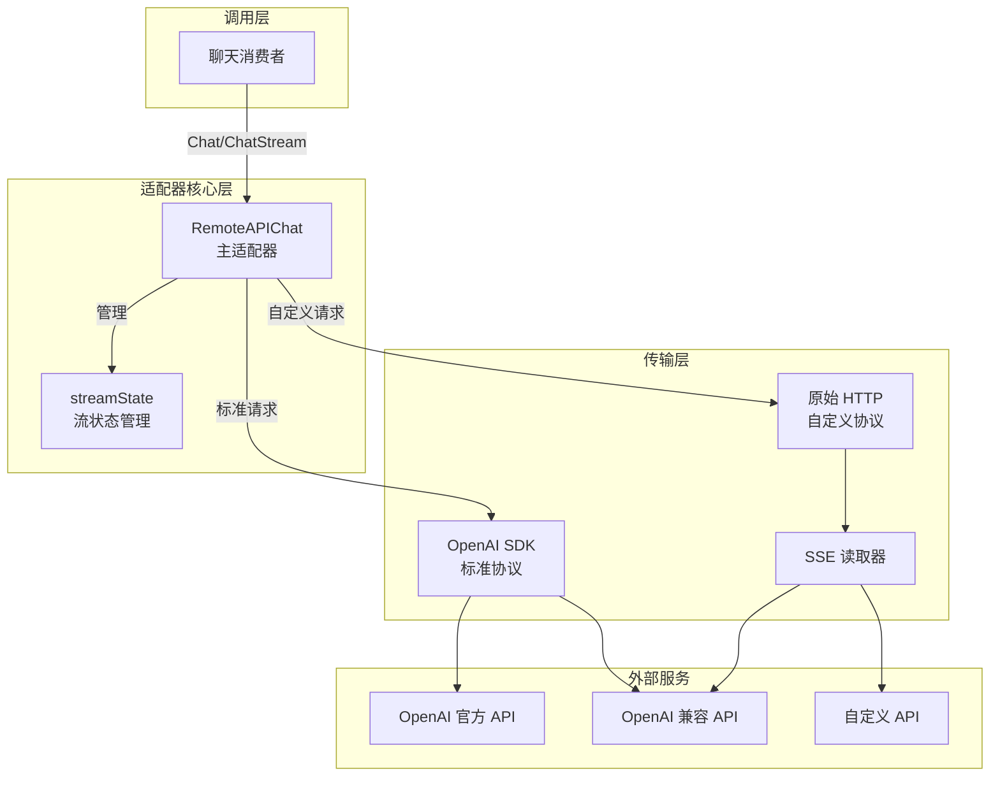

# Remote API 聊天适配器与流状态管理

## 概述

这个模块是系统与各类 OpenAI 兼容大语言模型 API 进行通信的核心适配器。它解决了一个关键问题：如何用统一的接口与不同实现的 OpenAI 兼容 API 交互，同时处理流式响应、工具调用、思考过程等高级特性。

想象它是一个**万能翻译器**：一端连接系统内部的聊天抽象，另一端连接各种形态的 OpenAI 兼容 API。它不仅处理标准协议，还能通过自定义机制适应非标准实现，同时优雅地管理流式响应中的状态变化。

## 架构设计



这个架构体现了清晰的分层设计：

1. **适配器核心层**：`RemoteAPIChat` 作为主适配器，封装了所有与 OpenAI 兼容 API 交互的逻辑；`streamState` 专门负责流式响应的状态管理
2. **传输层**：提供两种传输方式 - 标准 OpenAI SDK 和原始 HTTP，适应不同的 API 实现
3. **外部服务**：支持多种 OpenAI 兼容的 API 服务

## 核心组件详解

### RemoteAPIChat 结构体

`RemoteAPIChat` 是整个模块的核心，它实现了基于 OpenAI 兼容 API 的聊天功能。这是一个通用实现，不包含任何 provider 特定的逻辑，通过组合和扩展点来适应不同的提供商。

#### 设计意图

这个结构体的设计体现了**开闭原则**：对扩展开放，对修改关闭。核心逻辑保持不变，但通过 `requestCustomizer` 钩子允许子类或外部代码自定义请求行为。

#### 关键字段解析

- `modelName`、`modelID`：模型标识信息
- `client`：OpenAI SDK 客户端，用于标准协议通信
- `baseURL`、`apiKey`：API 连接配置
- `provider`：提供商标识，用于日志和特殊处理
- `requestCustomizer`：请求自定义钩子，这是扩展的关键

### 关键方法解析

#### NewRemoteAPIChat

这是构造函数，它初始化一个新的远程 API 聊天实例。注意这里的设计：它会自动检测提供商（如果未提供），并配置 OpenAI 客户端。

#### ConvertMessages

这个方法将内部消息格式转换为 OpenAI 格式。它处理了普通消息、工具调用消息和工具响应消息的转换。这是一个**适配器模式**的典型应用。

#### BuildChatCompletionRequest

构建标准聊天请求参数。这个方法集中处理了所有请求参数的构建逻辑，包括模型选择、消息转换、参数配置和工具设置。它的设计使得请求构建逻辑集中且可重用。

#### Chat - 非流式聊天

这是执行非流式聊天的主要方法。它的流程是：
1. 构建标准请求
2. 检查是否需要自定义请求
3. 记录请求日志
4. 执行请求
5. 解析响应

注意这里的自定义请求机制：如果 `requestCustomizer` 返回 `useRawHTTP=true`，它会使用 `chatWithRawHTTP` 方法而不是标准 SDK。

#### ChatStream - 流式聊天

流式聊天的实现更复杂一些。它创建一个通道，启动一个 goroutine 来处理流式响应，并将结果发送到通道。这种设计使得调用者可以通过 range 循环方便地消费流式响应。

#### processStream 和 processRawHTTPStream

这两个方法分别处理 OpenAI SDK 流式响应和原始 HTTP 流式响应。它们都使用 `streamState` 来管理流式状态，并通过 `processStreamDelta` 处理每个增量更新。

### streamState 结构体

`streamState` 是一个专门用于管理流式响应状态的结构体。它的设计体现了**状态管理模式**，将复杂的流式状态变化封装在一个专门的结构体中。

#### 设计意图

流式响应的特点是数据分块到达，特别是工具调用可能会分片传输。`streamState` 的作用是作为一个**临时存储器**，收集这些分片数据，直到它们完整可用。

#### 关键字段解析

- `toolCallMap`：按索引存储工具调用，处理分片到达的工具调用
- `lastFunctionName`：记录每个工具的上一个函数名，用于检测函数名何时完整
- `nameNotified`：记录是否已发送工具名称通知
- `hasThinking`：标记是否有思考内容，用于协调思考内容和回答内容的发送

#### 关键方法

- `buildOrderedToolCalls`：按索引顺序构建工具调用列表，确保工具调用的顺序正确

### 辅助方法

#### processStreamDelta

处理流式响应的单个 delta。这是流式处理的核心逻辑，它处理工具调用、思考内容和回答内容的分发。

注意这里的设计：它会在思考内容结束后、回答内容开始前发送一个思考完成事件，这使得前端可以正确区分思考过程和实际回答。

#### processToolCallsDelta

处理工具调用的增量更新。这个方法处理了工具调用分片到达的复杂情况：
1. 按索引存储工具调用
2. 累积函数名和参数
3. 在合适的时机发送工具调用通知

#### removeThinkingContent

移除思考模型输出中的思考过程。这是一个**兼容性处理**，为那些不支持关闭思考过程的模型提供兜底策略。

## 数据流向

### 非流式聊天流程

1. **请求构建**：`Chat` 调用 `BuildChatCompletionRequest` 构建标准请求
2. **自定义检查**：检查 `requestCustomizer` 是否需要自定义请求
3. **请求发送**：
   - 标准情况：使用 OpenAI SDK 的 `CreateChatCompletion`
   - 自定义情况：使用 `chatWithRawHTTP` 发送原始 HTTP 请求
4. **响应解析**：调用 `parseCompletionResponse` 解析响应
5. **思考内容处理**：使用 `removeThinkingContent` 移除可能的思考过程
6. **结果返回**：返回统一格式的 `types.ChatResponse`

### 流式聊天流程

1. **请求构建**：与非流式相同，但设置 `Stream=true`
2. **通道创建**：创建 `streamChan` 用于传递流式响应
3. **流初始化**：
   - 标准情况：使用 OpenAI SDK 的 `CreateChatCompletionStream`
   - 自定义情况：使用 `chatStreamWithRawHTTP` 建立原始 HTTP 流
4. **流式处理**：
   - 启动 goroutine 处理流式响应
   - 使用 `streamState` 管理流式状态
   - 每个 delta 通过 `processStreamDelta` 处理
5. **事件分发**：
   - 思考内容：发送 `ResponseTypeThinking` 事件
   - 回答内容：发送 `ResponseTypeAnswer` 事件
   - 工具调用：发送 `ResponseTypeToolCall` 事件
6. **流结束**：发送 `Done=true` 的事件，关闭通道

## 设计决策与权衡

### 1. 双传输路径设计

**决策**：同时支持 OpenAI SDK 和原始 HTTP 两种传输方式

**原因**：
- OpenAI SDK 提供了标准、稳定的通信方式
- 但某些 API 提供商有非标准的实现，需要完全控制请求格式

**权衡**：
- 优点：灵活性高，适应各种 API 实现
- 缺点：代码复杂度增加，需要维护两套逻辑

### 2. 扩展点设计：requestCustomizer

**决策**：通过 `requestCustomizer` 钩子允许自定义请求

**原因**：
- 保持核心逻辑稳定
- 允许在不修改核心代码的情况下适应特殊需求
- 符合开闭原则

**权衡**：
- 优点：扩展性强，核心逻辑稳定
- 缺点：增加了理解成本，自定义逻辑可能分散

### 3. 流式状态封装

**决策**：将流式状态封装在 `streamState` 结构体中

**原因**：
- 流式响应的状态管理复杂，需要专门的结构
- 将状态管理与主逻辑分离，提高代码可读性
- 便于测试和维护

**权衡**：
- 优点：职责清晰，便于测试
- 缺点：增加了一个抽象层级

### 4. 思考内容处理

**决策**：提供多种思考内容处理机制

**原因**：
- 不同模型处理思考内容的方式不同
- 有些模型支持关闭思考，有些不支持
- 有些模型在流式响应中提供专门的思考字段

**权衡**：
- 优点：兼容性好，适应各种模型
- 缺点：处理逻辑复杂，需要考虑多种情况

## 使用指南与示例

### 基本使用

```go
// 创建配置
config := &chat.ChatConfig{
    ModelName: "gpt-4",
    BaseURL:   "https://api.openai.com/v1",
    APIKey:    "your-api-key",
}

// 创建适配器
adapter, err := chat.NewRemoteAPIChat(config)
if err != nil {
    // 处理错误
}

// 非流式聊天
messages := []chat.Message{
    {Role: "user", Content: "Hello!"},
}
response, err := adapter.Chat(ctx, messages, nil)

// 流式聊天
streamChan, err := adapter.ChatStream(ctx, messages, nil)
for resp := range streamChan {
    // 处理流式响应
}
```

### 自定义请求

```go
adapter.SetRequestCustomizer(func(req *openai.ChatCompletionRequest, opts *chat.ChatOptions, isStream bool) (any, bool) {
    // 创建自定义请求
    customReq := map[string]any{
        "model":       req.Model,
        "messages":    req.Messages,
        "stream":      isStream,
        "custom_param": "special-value", // 添加自定义参数
    }
    return customReq, true // 使用原始 HTTP
})
```

## 注意事项与常见陷阱

### 1. 工具调用的分片处理

**陷阱**：工具调用可能会分片到达，不能假设一次就能收到完整的工具调用。

**解决方案**：使用 `streamState` 来累积工具调用的各个部分，直到完整可用。

### 2. 思考内容的多种格式

**陷阱**：不同模型处理思考内容的方式不同，有些在 `ReasoningContent` 字段，有些在内容中用 `<think>` 标签。

**解决方案**：模块已经处理了这些情况，但在添加新模型时要注意测试。

### 3. 自定义请求的响应格式

**陷阱**：使用自定义请求时，响应格式必须仍然是 OpenAI 兼容的，否则解析会失败。

**解决方案**：如果响应格式不兼容，需要进一步自定义解析逻辑，或者在自定义请求中确保响应格式兼容。

### 4. 流式响应的通道关闭

**陷阱**：忘记关闭流式响应的通道，或者在错误情况下没有正确关闭。

**解决方案**：模块内部使用 `defer close(streamChan)` 确保通道总是被关闭，但在自定义代码中要注意这一点。

## 依赖关系

- **被依赖**：这个模块被其他提供商适配器使用，如 [Qwen 提供商适配器](model_providers_and_ai_backends-chat_completion_backends_and_streaming-provider_adapters_for_generic_qwen_ollama_and_deepseek-qwen_provider_adapter_and_request_contract.md)
- **依赖**：
  - `github.com/sashabaranov/go-openai`：OpenAI SDK
  - 内部的 `types`、`provider`、`logger` 等包
  - SSE 读取器：[sse_stream_reader_engine](model_providers_and_ai_backends-chat_completion_backends_and_streaming-remote_api_streaming_transport_and_sse_parsing-sse_stream_reader_engine.md)

## 总结

`remote_api_chat_adapter_and_stream_state` 模块是一个设计精良的适配器，它通过清晰的分层、灵活的扩展点和专门的状态管理，解决了与各种 OpenAI 兼容 API 交互的复杂问题。它的设计体现了许多优秀的软件设计原则，是学习如何设计适配器和处理流式数据的好例子。
