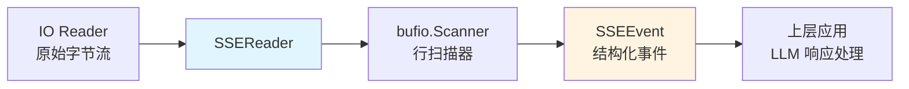

# sse_stream_reader_engine 模块技术深度解析

## 1. 模块概览

`sse_stream_reader_engine` 是一个专门用于处理 Server-Sent Events (SSE) 协议的轻量级解析引擎。在现代 AI 应用中，当需要从远程 LLM 服务接收流式响应时，SSE 是最常用的传输协议之一。本模块的核心职责是从原始字节流中提取结构化的 SSE 事件，为上层的流式响应处理提供干净的数据抽象。

### 解决的核心问题

想象一下，你正在通过 HTTP 接收 LLM 的流式响应——数据不是一次性到达，而是以小块的形式持续推送。每个块可能包含完整的事件，也可能只是事件的一部分，甚至可能包含协议级别的元数据（如事件类型、ID等）。如果没有专门的解析器，上层业务逻辑就需要直接处理这些底层细节：
- 区分数据行和控制行
- 处理缓冲区边界问题
- 识别流的结束标记
- 处理异常情况和网络中断

这正是 `sse_stream_reader_engine` 要解决的问题——它将复杂的 SSE 协议细节封装起来，提供一个简单的事件读取接口。

## 2. 核心架构与数据流

### 架构组件



### 数据流分析

数据流非常简洁但经过精心设计：

1. **输入层**：接收实现了 `io.Reader` 接口的原始数据源（通常是 HTTP 响应体）
2. **缓冲层**：使用 `bufio.Scanner` 按行扫描输入，这是 SSE 协议的天然分割单位
3. **解析层**：过滤和解析每一行，提取有意义的数据
4. **输出层**：将解析结果封装为 `SSEEvent` 对象，包含数据或结束标记

这种分层设计使得每个组件都专注于单一职责，既易于理解也便于测试。

## 3. 核心组件深度解析

### SSEReader 结构体

`SSEReader` 是整个模块的核心，它封装了 SSE 流的读取状态和逻辑。

```go
type SSEReader struct {
    scanner *bufio.Scanner
}
```

**设计意图**：这个结构体非常简洁，只持有一个 `bufio.Scanner`。这种设计体现了"组合优于继承"的原则——`SSEReader` 不是扩展 `bufio.Scanner`，而是通过组合来使用它，从而保持了接口的简洁性。

### NewSSEReader 构造函数

```go
func NewSSEReader(reader io.Reader) *SSEReader {
    scanner := bufio.NewScanner(reader)
    // 设置更大的缓冲区以处理长行（思维链内容可能很长）
    buf := make([]byte, 1024*1024)
    scanner.Buffer(buf, 1024*1024)
    return &SSEReader{scanner: scanner}
}
```

**关键设计点**：

1. **缓冲区大小配置**：这里显式设置了 1MB 的缓冲区，这是一个非常重要的设计决策。默认的 `bufio.Scanner` 缓冲区只有 64KB，对于 LLM 的响应（特别是包含思维链的长响应）来说是不够的。如果行长度超过缓冲区大小，`Scan()` 会返回错误，导致整个流读取失败。

2. **为什么是 1MB**：这是一个在内存使用和实用性之间的权衡。1MB 足够处理大多数 LLM 响应场景，同时又不会消耗过多内存。

### ReadEvent 方法

```go
func (r *SSEReader) ReadEvent() (*SSEEvent, error) {
    for r.scanner.Scan() {
        line := r.scanner.Text()

        // 空行，跳过
        if line == "" {
            continue
        }

        // 检查是否为结束标记
        if line == "data: [DONE]" {
            return &SSEEvent{Done: true}, nil
        }

        // 解析 data 行
        if strings.HasPrefix(line, "data: ") {
            jsonStr := line[6:]
            return &SSEEvent{Data: []byte(jsonStr)}, nil
        }

        // 其他行（如 event:, id: 等）跳过
    }

    if err := r.scanner.Err(); err != nil {
        return nil, err
    }

    return nil, errors.New("EOF")
}
```

**设计解析**：

这个方法是整个模块的"大脑"，它实现了 SSE 协议的核心解析逻辑。让我们逐部分分析：

1. **循环读取**：使用 `for` 循环持续扫描，直到找到一个有效的事件或遇到错误。这意味着它会自动跳过无效行，直到找到有意义的数据。

2. **空行处理**：SSE 协议使用空行作为事件分隔符，但这里我们选择跳过空行。这是因为我们的使用场景中，每次只读取一个事件，不需要关心事件之间的分隔。

3. **结束标记识别**：特别检查 `"data: [DONE]"` 这一行，这是 OpenAI 兼容 API 常用的流结束标记。当遇到这个标记时，返回 `Done: true` 的事件，让调用者知道流已经正常结束。

4. **数据行提取**：只处理以 `"data: "` 开头的行，提取 JSON 字符串部分。这是一种务实的设计——在实际的 LLM API 调用中，我们几乎只关心数据行，其他协议级别的行（如 `event:`, `id:` 等）对我们没有用处，所以直接跳过。

5. **错误处理**：检查 `scanner.Err()` 来处理扫描过程中可能发生的错误（如缓冲区溢出、IO 错误等）。

### SSEEvent 结构体

```go
type SSEEvent struct {
    Data []byte
    Done bool
}
```

**设计意图**：这个结构体非常简洁，但包含了调用者需要的所有信息：
- `Data`：原始的 JSON 数据字节，让调用者决定如何解析
- `Done`：布尔标记，指示流是否正常结束

这种设计保持了灵活性——`SSEReader` 不关心数据的具体格式，只是将其传递给上层。

## 4. 依赖关系分析

### 依赖的模块

`sse_stream_reader_engine` 是一个非常底层的模块，它的依赖非常少：

1. **标准库依赖**：
   - `bufio`：提供行扫描功能
   - `io`：提供 Reader 接口
   - `strings`：提供字符串处理
   - `errors`：提供错误处理

2. **无外部模块依赖**：这个模块不依赖项目中的任何其他模块，是一个完全独立的工具组件。

### 被依赖的模块

根据模块树结构，`sse_stream_reader_engine` 被以下模块依赖：
- [remote_api_streaming_transport_and_sse_parsing](model_providers_and_ai_backends-chat_completion_backends_and_streaming-remote_api_streaming_transport_and_sse_parsing.md)：这是直接使用 `SSEReader` 的上层模块，负责将 SSE 事件转换为 LLM 响应对象。

### 数据契约

`SSEReader` 与调用者之间的契约非常简单：
- **输入**：任何实现了 `io.Reader` 接口的对象
- **输出**：
  - 成功时返回 `*SSEEvent`
  - 错误时返回 `error`
  - 正常结束时返回 `Done: true` 的 `SSEEvent`

这种松耦合的设计使得 `SSEReader` 可以在多种场景下复用，只要数据源符合 SSE 协议格式。

## 5. 设计决策与权衡

### 1. 缓冲区大小：1MB vs 默认 64KB

**决策**：显式设置 1MB 的缓冲区大小。

**权衡分析**：
- ✅ **优点**：可以处理包含长思维链的 LLM 响应，避免缓冲区溢出错误
- ❌ **缺点**：每个 `SSEReader` 实例会占用 1MB 内存，即使处理的是小响应
- **为什么这个选择是正确的**：在现代服务器环境中，1MB 内存是微不足道的，但因缓冲区溢出导致的流中断却是严重的用户体验问题。特别是在处理 LLM 响应时，长文本是常见场景。

### 2. 只处理 data: 行，忽略其他协议字段

**决策**：只解析以 `data: ` 开头的行，跳过 `event: `、`id: ` 等其他 SSE 协议字段。

**权衡分析**：
- ✅ **优点**：简化了实现，提高了性能，减少了不必要的处理
- ❌ **缺点**：如果未来需要使用其他 SSE 特性（如事件类型、重连 ID 等），这个实现就不够用了
- **为什么这个选择是正确的**：YAGNI（You Aren't Gonna Need It）原则。在当前的使用场景中，我们只需要数据行，其他字段对我们没有价值。过度设计会增加复杂度而没有实际收益。

### 3. 使用 bufio.Scanner 而不是手动缓冲

**决策**：使用标准库的 `bufio.Scanner` 来处理行扫描。

**权衡分析**：
- ✅ **优点**：利用经过充分测试的标准库，减少了自己实现缓冲区管理的风险
- ❌ **缺点**：`bufio.Scanner` 的 API 有一定限制（如需要预先设置缓冲区大小）
- **为什么这个选择是正确的**：标准库的实现已经考虑了各种边界情况，比自己手写的缓冲区管理更可靠。

### 4. 返回原始字节而不是解析后的 JSON

**决策**：`SSEEvent.Data` 是 `[]byte` 类型，而不是预先解析好的 `interface{}` 或特定结构体。

**权衡分析**：
- ✅ **优点**：保持了灵活性，调用者可以根据自己的需求选择如何解析 JSON
- ❌ **缺点**：每个调用者都需要重复 JSON 解析的代码
- **为什么这个选择是正确的**：不同的上层模块可能需要解析为不同的结构体，将解析权交给调用者是更合理的设计。

## 6. 使用指南与常见模式

### 基本使用

```go
// 创建 SSE 读取器
reader := NewSSEReader(httpResponseBody)

// 循环读取事件
for {
    event, err := reader.ReadEvent()
    if err != nil {
        if err.Error() == "EOF" {
            // 正常结束
            break
        }
        // 处理错误
        log.Printf("Error reading SSE: %v", err)
        break
    }
    
    if event.Done {
        // 流结束标记
        break
    }
    
    // 处理数据
    var response ChatCompletionResponse
    if err := json.Unmarshal(event.Data, &response); err != nil {
        log.Printf("Error unmarshaling response: %v", err)
        continue
    }
    
    // 使用响应数据
    processResponse(response)
}
```

### 配置与扩展

目前 `SSEReader` 没有提供配置选项，但如果需要扩展，可以考虑：

1. **自定义缓冲区大小**：添加一个选项让调用者指定缓冲区大小
2. **支持更多 SSE 字段**：添加选项来启用对 `event:`、`id:` 等字段的解析
3. **自定义结束标记**：允许调用者指定自定义的流结束标记

### 常见陷阱

1. **忘记处理 Done 事件**：有些 API 使用 `"data: [DONE]"` 标记结束，有些只是关闭连接。需要同时处理两种情况。

2. **缓冲区溢出**：如果修改代码，不要随意减小缓冲区大小，否则可能在处理长响应时出错。

3. **错误处理**：注意区分正常的 EOF 和真正的错误。`ReadEvent()` 在正常结束时返回 `errors.New("EOF")`，这不是错误，而是流正常结束的信号。

## 7. 边缘情况与已知限制

### 边缘情况

1. **超长行**：虽然设置了 1MB 缓冲区，但如果单行超过 1MB，仍然会失败。这种情况在实际中很少见，但理论上可能发生。

2. **不标准的 SSE 格式**：如果服务器发送的 SSE 格式不标准（如没有正确的行结束符、格式错误等），解析可能会失败。

3. **网络中断**：如果网络在读取过程中断开，`scanner.Err()` 会返回相应的 IO 错误。

### 已知限制

1. **不支持多行数据事件**：标准 SSE 协议允许一个事件包含多个 `data:` 行，它们应该被拼接在一起。当前实现只处理单行数据事件。

2. **不支持注释行**：SSE 协议允许以 `:` 开头的注释行，当前实现会忽略这些行（这其实是正确的行为）。

3. **没有重连机制**：SSE 协议通常包含重连逻辑，但这不属于 `SSEReader` 的职责范围，应该由上层模块处理。

## 8. 总结

`sse_stream_reader_engine` 是一个小巧但功能完善的 SSE 解析模块，它体现了几个重要的设计原则：

1. **单一职责**：只做一件事，并且做好它——读取 SSE 事件
2. **务实设计**：针对实际使用场景进行优化，而不是追求理论上的完美
3. **简洁接口**：提供简单易用的 API，隐藏复杂的实现细节
4. **标准库优先**：充分利用经过验证的标准库组件

这个模块虽然代码量不大，但它是整个 LLM 流式响应处理链路中的基础环节，它的稳定性和可靠性直接影响到用户体验。通过仔细的设计和权衡，它成功地在简单性和实用性之间找到了平衡。

## 9. 相关模块

- [remote_api_streaming_transport_and_sse_parsing](model_providers_and_ai_backends-chat_completion_backends_and_streaming-remote_api_streaming_transport_and_sse_parsing.md)：上层模块，使用 `SSEReader` 来处理 LLM 流式响应
- [sse_event_contracts](model_providers_and_ai_backends-chat_completion_backends_and_streaming-remote_api_streaming_transport_and_sse_parsing-sse_event_contracts.md)：SSE 事件相关的数据契约
