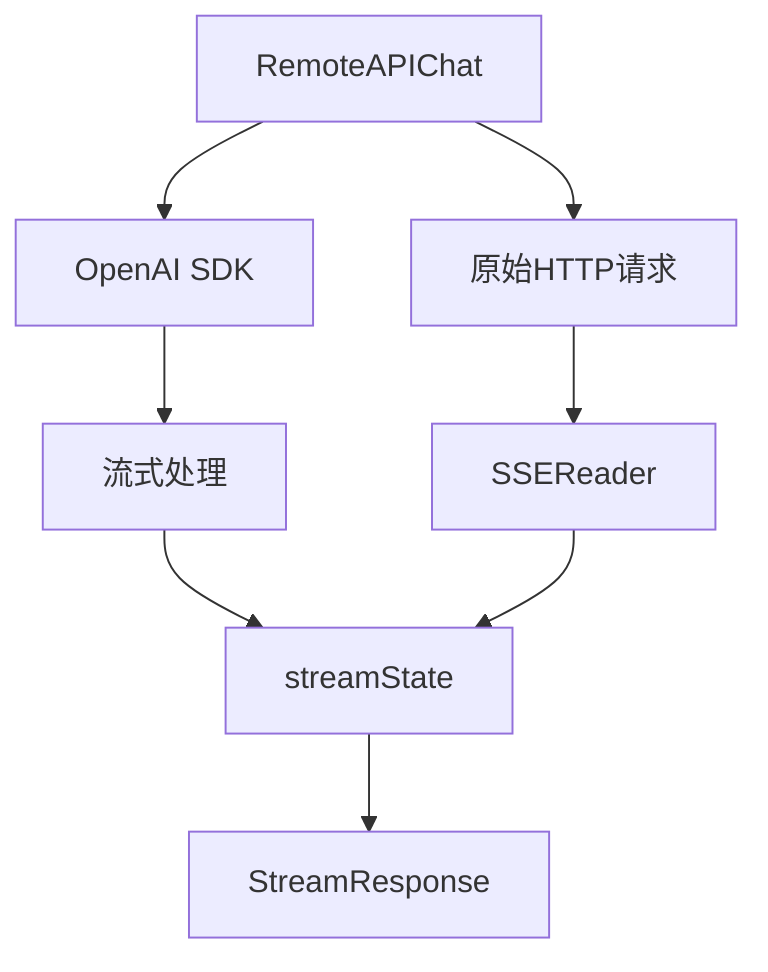

# 远程 API 流式传输与 SSE 解析模块

## 为什么这个模块存在

想象一下，你正在构建一个与多个 LLM 提供商（OpenAI、DeepSeek、Qwen 等）对话的系统。每个提供商都有自己的 API，有些可能不完全兼容 OpenAI 协议，有些可能有特殊的流式传输行为，有些可能返回思考模型的特殊内容（如 `<think>` 标签）。直接为每个提供商编写完整的适配器会导致大量重复代码，而且难以维护。

这就是 `remote_api_streaming_transport_and_sse_parsing` 模块的用武之地。它提供了一个通用的、可扩展的 OpenAI 兼容 API 实现，处理了以下问题：

1. **统一流式与非流式接口**：提供一致的 API，无论底层是使用 OpenAI SDK 还是原始 HTTP 请求
2. **SSE 协议解析**：正确处理 Server-Sent Events 格式，包括处理长行和结束标记
3. **流式状态管理**：跟踪流式过程中收到的工具调用片段，并在结束时正确重组
4. **思考模型支持**：处理模型返回的思考内容（如 `<think>` 标签或 `ReasoningContent` 字段）
5. **扩展点设计**：允许子类通过 `requestCustomizer` 自定义请求，而无需重写整个逻辑

## 核心概念与架构

这个模块的核心是"分层传输"的思想：
- 底层处理原始 HTTP/SSE 通信
- 中间层管理流式状态和事件解析
- 上层提供统一的聊天接口



### 主要组件角色

1. **RemoteAPIChat**：主协调器，处理非流式和流式聊天请求，是外部调用的入口点
2. **SSEReader**：专门负责解析 SSE 协议，处理长行和特殊结束标记
3. **streamState**：流式处理的状态机，跟踪工具调用片段并最终重组
4. **SSEEvent**：表示一个 SSE 事件的数据结构

## 数据流向

### 非流式请求流程
1. 调用者传入消息和选项
2. `BuildChatCompletionRequest` 构建标准 OpenAI 请求
3. 检查是否有自定义请求器，如有则使用原始 HTTP
4. 发送请求并获取响应
5. `parseCompletionResponse` 解析响应，处理 `<think>` 标签等特殊情况
6. 返回统一格式的 `ChatResponse`

### 流式请求流程
1. 调用者传入消息和选项
2. `BuildChatCompletionRequest` 构建流式 OpenAI 请求
3. 检查是否有自定义请求器，如有则使用原始 HTTP + SSEReader
4. 创建流式通道，启动后台处理协程
5. 根据传输方式（SDK 或原始 HTTP）选择处理方式
6. `processStreamDelta` 处理每个 delta，更新 streamState
7. 流式发送 `StreamResponse`，包括思考内容、回答内容和工具调用

## 设计决策与权衡

### 1. 同时支持 OpenAI SDK 和原始 HTTP
**决策**：既使用 OpenAI SDK 处理标准情况，又保留原始 HTTP 能力
**原因**：OpenAI SDK 提供了良好的抽象，但有些提供商可能有非标准行为，需要直接控制 HTTP 请求
**权衡**：增加了代码复杂度，但获得了最大的灵活性

### 2. streamState 作为独立的状态机
**决策**：将流式状态管理提取为独立的 struct
**原因**：流式处理涉及多个异步事件，需要一个集中的地方来跟踪工具调用的片段
**权衡**：增加了一个抽象层，但使状态管理更清晰，便于测试

### 3. SSEReader 的 1MB 缓冲区
**决策**：为 SSE 扫描器设置 1MB 的缓冲区
**原因**：思考模型的输出可能非常长，超过默认的扫描器缓冲区
**权衡**：占用更多内存，但避免了长行截断的问题

### 4. requestCustomizer 扩展点
**决策**：提供函数式的扩展点，而不是继承
**原因**：Go 语言不支持传统的继承，函数式扩展更灵活
**权衡**：需要调用者理解如何使用这个扩展点，但保持了核心代码的简洁

## 关键实现细节

### streamState 的工具调用重组
工具调用是分片到达的，每个片段可能包含 ID 片段、名称片段或参数片段。`streamState` 通过索引来跟踪每个工具调用的不同部分：

```go
// 工具调用可能这样到达：
// 1. 第一个片段：{"index":0,"id":"call_123","function":{"name":"sear"}}
// 2. 第二个片段：{"index":0,"function":{"name":"ch","arguments":"{"}}
// 3. 第三个片段：{"index":0,"function":{"arguments":"\"query\":\"hello\"}"}}

// streamState 会将它们重组为完整的工具调用
```

### 思考内容的处理
模块支持两种思考模型输出格式：
1. **`<think>` 标签**：在非流式响应中移除
2. **`ReasoningContent` 字段**：在流式响应中作为单独的 `ResponseTypeThinking` 事件发送

这种设计确保了无论是哪种格式，用户都能得到清晰的思考过程和最终答案的分离。

## 使用与扩展指南

### 基本使用
```go
chatConfig := &ChatConfig{
    ModelName: "gpt-4",
    BaseURL:   "https://api.openai.com/v1",
    APIKey:    "your-api-key",
}
chat, err := NewRemoteAPIChat(chatConfig)
// 非流式
resp, err := chat.Chat(ctx, messages, opts)
// 流式
streamChan, err := chat.ChatStream(ctx, messages, opts)
```

### 自定义请求
如果需要支持非标准的 API，可以使用 `SetRequestCustomizer`：
```go
chat.SetRequestCustomizer(func(req *openai.ChatCompletionRequest, opts *ChatOptions, isStream bool) (any, bool) {
    // 修改请求或创建完全自定义的请求
    customReq := map[string]any{
        "model": req.Model,
        "messages": req.Messages,
        "custom_field": "value",
    }
    return customReq, true // 返回自定义请求并指示使用原始 HTTP
})
```

## 注意事项与陷阱

1. **SSE 缓冲区大小**：当前设置为 1MB，对于特别长的思考链可能仍然不够
2. **工具调用索引**：确保工具调用的 `index` 字段正确，否则重组可能出错
3. **`<think>` 标签处理**：仅当内容以 `<think>` 开头时才处理，嵌套情况使用最后一个 `</think>`
4. **原始 HTTP 模式**：使用自定义请求时，需要自己处理所有 HTTP 细节，包括错误处理
5. **流式通道关闭**：确保在所有情况下都正确关闭流式通道，避免资源泄漏

## 子模块

这个模块包含以下子模块：
- [远程 API 聊天适配器与流状态](model_providers_and_ai_backends-chat_completion_backends_and_streaming-remote_api_streaming_transport_and_sse_parsing-remote_api_chat_adapter_and_stream_state.md)
- [SSE 流读取器引擎](model_providers_and_ai_backends-chat_completion_backends_and_streaming-remote_api_streaming_transport_and_sse_parsing-sse_stream_reader_engine.md)
- [SSE 事件契约](model_providers_and_ai_backends-chat_completion_backends_and_streaming-remote_api_streaming_transport_and_sse_parsing-sse_event_contracts.md)

## 与其他模块的关系

这个模块是 [chat_completion_backends_and_streaming](model_providers_and_ai_backends-chat_completion_backends_and_streaming.md) 的一部分，它依赖于：
- [provider](model_providers_and_ai_backends-provider_catalog_and_configuration_contracts.md) 模块进行提供商检测
- [types](core_domain_types_and_interfaces.md) 模块定义的响应契约
- OpenAI SDK 作为基础通信库

它被各种特定提供商的适配器使用，如 DeepSeek、Qwen 等，这些适配器通过 `requestCustomizer` 来处理各自的特殊需求。
