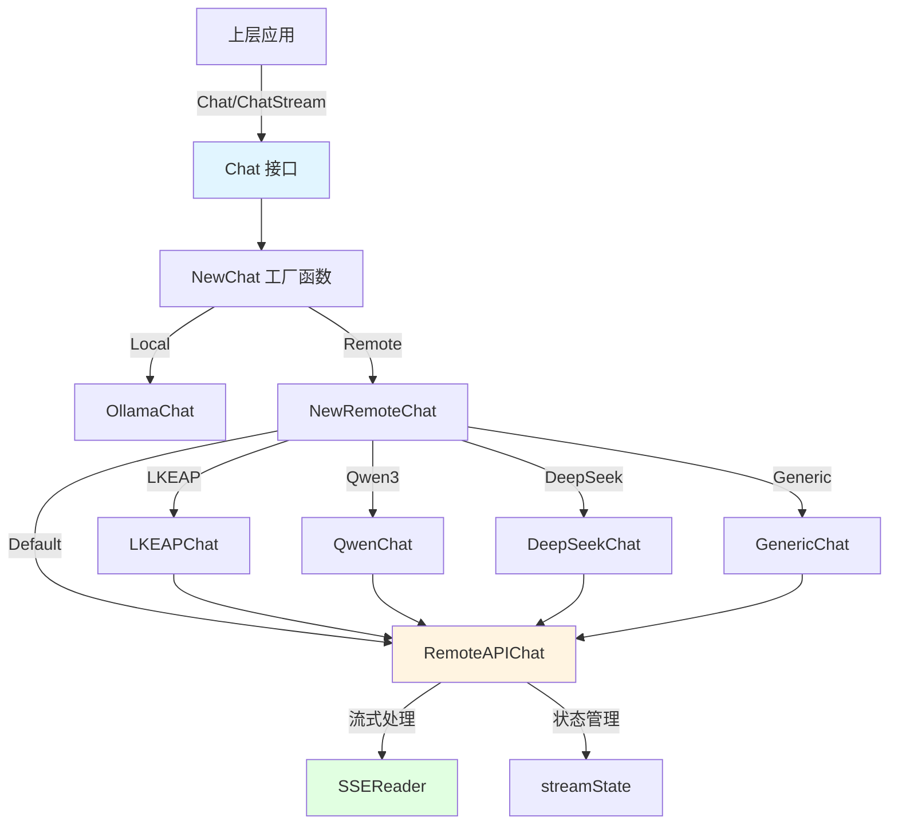
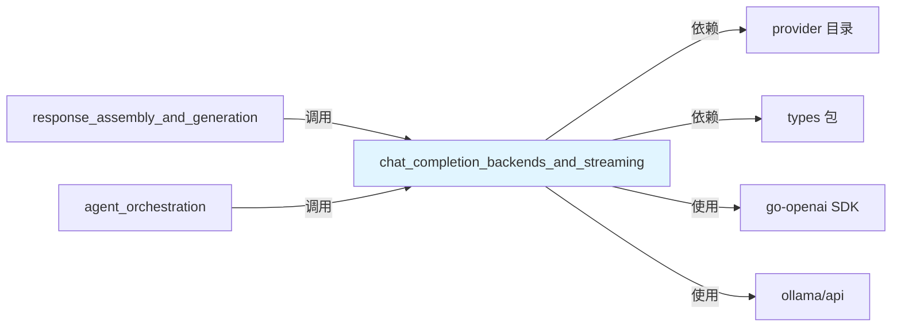

# 聊天完成后端与流式传输模块

## 模块概述

想象一下，你需要构建一个能够同时连接多个不同 LLM 提供商的系统——腾讯云 LKEAP、阿里云 Qwen、DeepSeek、Ollama 本地模型，以及各种 OpenAI 兼容的 API。每个提供商都有自己独特的 API 格式、特殊参数（比如思维链控制）和流式传输方式。这个模块的使命就是将这些异构的后端统一成一个简单、一致的接口，让上层应用可以像使用单个模型那样使用所有这些后端。

本模块解决的核心问题是：
1. **模型提供商碎片化**——不同 LLM 提供商的 API 格式和特性差异巨大
2. **流式传输协议不统一**——各提供商的 SSE 流式响应格式和思考内容传输方式各不相同
3. **工具调用格式差异**——Tool/Function 调用的 API 在不同模型间有细微但重要的区别
4. **思维链配置特殊化**——DeepSeek R1/V3、Qwen3 等模型需要特殊参数来控制思考过程

## 架构总览



### 架构解析

这个模块采用了**策略模式 + 模板方法**的组合设计：

1. **统一接口层**：`Chat` 接口定义了核心契约——`Chat()`（非流式）、`ChatStream()`（流式）、`GetModelName()` 和 `GetModelID()`。所有后端实现都必须遵守这个契约。

2. **工厂创建层**：`NewChat()` 和 `NewRemoteChat()` 两个工厂函数根据配置（`ChatConfig`）智能选择合适的实现类。这是一个经典的"创建型模式"应用。

3. **通用实现层**：`RemoteAPIChat` 是所有 OpenAI 兼容 API 的通用实现，它处理了 80% 的常见场景——消息格式转换、请求构建、响应解析、流式传输处理。

4. **特殊适配层**：`LKEAPChat`、`QwenChat`、`DeepSeekChat`、`GenericChat` 通过**组合而非继承**的方式扩展 `RemoteAPIChat`，利用 `requestCustomizer` 钩子来处理各自的特殊需求。

5. **本地实现层**：`OllamaChat` 是完全独立的实现，专门处理本地模型的生命周期管理和通信。

## 核心设计决策

### 1. 组合优于继承：请求自定义器模式

**设计选择**：不是为每个提供商创建 `RemoteAPIChat` 的子类，而是通过 `SetRequestCustomizer()` 注入一个自定义函数。

**为什么这样设计**：
- 避免了继承层次爆炸——如果有 20 个提供商，你不会想要 20 个子类
- 保持了 `RemoteAPIChat` 的简洁性和可测试性
- 允许运行时动态调整请求行为，而不需要重新编译
- 符合"开闭原则"——对扩展开放，对修改关闭

**权衡**：自定义器函数的签名比较复杂，需要理解 `openai.ChatCompletionRequest` 的内部结构。

### 2. 双轨流式传输：SDK + 原始 HTTP

**设计选择**：同时支持两种流式传输方式：
- 通过 `go-openai` SDK 的 `CreateChatCompletionStream()`
- 通过原始 HTTP + `SSEReader` 的自定义实现

**为什么这样设计**：
- SDK 方式简洁可靠，适合标准 OpenAI API
- 原始 HTTP 方式提供了完全的控制权，可以处理非标准格式（如 LKEAP 的 `thinking` 参数）
- 在 `requestCustomizer` 返回 `useRawHTTP=true` 时自动切换到原始 HTTP

**权衡**：代码路径翻倍，需要维护两套逻辑，但这是为了灵活性付出的合理代价。

### 3. 思维链内容的统一抽象

**设计选择**：在 `types.StreamResponse` 中引入 `ResponseTypeThinking`，统一处理不同模型的思考内容：
- Ollama：`resp.Message.Thinking`
- OpenAI 兼容：`delta.ReasoningContent`
- 部分模型：`<think>...</think>` 标签包裹的内容

**为什么这样设计**：
- 上层应用不需要知道思考内容来自哪里
- 即使模型不支持显式的思考参数，也能通过字符串处理提取思考内容
- 在非流式响应中，`removeThinkingContent()` 会自动剥离 `<think>` 标签

### 4. 工具调用的增量状态管理

**设计选择**：使用 `streamState` 结构体在流式传输过程中累积工具调用的增量数据，最后在流结束时构建完整的工具调用列表。

**为什么这样设计**：
- OpenAI 的流式 API 会将工具调用分多次发送（先 ID，再 Name，再分块的 Arguments）
- 需要按索引（`Index` 字段）正确归并多个并行工具调用
- 某些上层应用需要在工具调用名称确定后立即收到通知（通过 `ResponseTypeToolCall`）

## 子模块概览

### [聊天核心消息与工具契约](model_providers_and_ai_backends-chat_completion_backends_and_streaming-chat_core_message_and_tool_contracts.md)
定义了整个模块的基础数据结构和契约——`Message`、`Tool`、`ChatOptions`、`ChatConfig` 等。这是模块的"通用语言"，所有组件都通过这些类型进行通信。

### [提供商适配器：Generic、Qwen、Ollama 和 DeepSeek](model_providers_and_ai_backends-chat_completion_backends_and_streaming-provider_adapters_for_generic_qwen_ollama_and_deepseek.md)
四个特定提供商的适配器实现，每个都处理一个独特的场景：
- `DeepSeekChat`：移除不支持的 `tool_choice` 参数
- `QwenChat`：为 Qwen3 模型添加 `enable_thinking` 参数
- `GenericChat`：通过 `ChatTemplateKwargs` 传递思考参数
- `OllamaChat`：完整的本地模型生命周期管理

### [LKEAP 聊天后端与思维契约](model_providers_and_ai_backends-chat_completion_backends_and_streaming-lkeap_chat_backend_and_thinking_contracts.md)
腾讯云知识引擎原子能力（LKEAP）的专门实现，支持 DeepSeek-R1/V3 系列模型的思维链能力。重点是理解 `thinking` 参数的特殊格式和模型系列差异。

### [远程 API 流式传输与 SSE 解析](model_providers_and_ai_backends-chat_completion_backends_and_streaming-remote_api_streaming_transport_and_sse_parsing.md)
模块的"重型机械"——`RemoteAPIChat` 通用实现、`SSEReader` SSE 流解析器和 `streamState` 流式状态管理。这里处理了最复杂的流式传输、状态累积和错误处理逻辑。

## 与其他模块的依赖关系



### 关键依赖解析

1. **`provider` 包**：提供商标识和检测逻辑——`ProviderName`、`DetectProvider()`、`IsQwen3Model()` 等。
2. **`types` 包**：定义了 `ChatResponse`、`StreamResponse`、`LLMToolCall` 等上层应用使用的响应类型。
3. **`go-openai`**：OpenAI API 的官方 Go SDK，是所有远程 API 实现的基础。
4. **`ollama/api`**：Ollama 本地模型服务的 API 客户端。

### 被依赖关系

- **`response_assembly_and_generation`**（在 `application_services_and_orchestration` 中）：使用本模块生成 LLM 响应
- **`agent_orchestration`**：在代理编排流程中调用聊天完成功能

## 新贡献者指南

### 最容易踩的坑

1. **不要忘记 `useRawHTTP`**：如果你在 `requestCustomizer` 中修改了请求结构体但没有设置 `useRawHTTP=true`，修改不会生效——SDK 会使用原始的 `openai.ChatCompletionRequest`。

2. **思维内容的双重处理**：某些模型（如 MiniMax-M2.1）即使设置了 `Thinking=false` 仍会返回 `<think>` 标签，`removeThinkingContent()` 提供了兜底，但要注意它只处理以 `<think>` 开头的内容。

3. **流式响应的 `Done` 事件**：`ChatStream()` 返回的通道必须在收到 `Done=true` 的事件后才算完成，即使你已经收到了所有内容。某些逻辑（如完整工具调用列表）只在 `Done` 时发送。

4. **Ollama 模型的可用性**：`OllamaChat` 会在每次请求前调用 `ensureModelAvailable()`，确保模型已下载。这在生产环境中可能需要调整。

### 扩展点：添加新的提供商

添加新的提供商适配器通常遵循这个模式：

```go
type MyProviderChat struct {
    *RemoteAPIChat
}

func NewMyProviderChat(config *ChatConfig) (*MyProviderChat, error) {
    config.Provider = string(provider.ProviderMyProvider)
    remoteChat, err := NewRemoteAPIChat(config)
    if err != nil {
        return nil, err
    }
    chat := &MyProviderChat{RemoteAPIChat: remoteChat}
    remoteChat.SetRequestCustomizer(chat.customizeRequest)
    return chat, nil
}

func (c *MyProviderChat) customizeRequest(
    req *openai.ChatCompletionRequest, 
    opts *ChatOptions, 
    isStream bool,
) (any, bool) {
    // 修改 req 或创建自定义结构体
    // 返回 (customReq, useRawHTTP)
    return nil, false
}
```

然后在 `NewRemoteChat()` 中添加你的 case。

### 测试建议

- 测试流式响应时，务必验证：
  - 思考内容（如果有）先到达并正确标记 `Done`
  - 工具调用增量正确累积
  - 最后的 `Done` 事件包含完整的工具调用列表
- 对于非流式响应，测试 `<think>` 标签的剥离逻辑
- 使用 `requestCustomizer` 测试标准路径和原始 HTTP 路径
