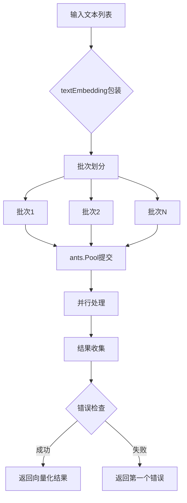

# batch_embedding_orchestration_and_result_models 模块技术深度解析

## 1. 问题背景与模块价值

在大规模知识图谱和向量检索系统中，文本向量化是一个核心且资源密集的操作。当处理大量文档或知识库时，我们经常需要同时向量化成百上千个文本片段。如果采用简单的串行处理方式，会导致：
- 处理时间随文本数量线性增长，用户体验差
- 无法充分利用现代硬件的并行能力
- 缺少对错误处理的统一管理

这个模块的出现就是为了解决这些问题，它提供了一个**批量向量化的协调层**，通过合理的并发控制和批量策略，既保证了向量化的效率，又确保了错误处理的健壮性。

## 2. 核心心智模型

可以把这个模块想象成一个**文本向量化的生产线管理器**：
- **textEmbedding** 就像是生产线上的工件，包含原始文本和最终的向量化结果
- **batchEmbedder** 是生产线的调度员，它负责把大量工件分成小批次
- **ants.Pool** 是并行工作的工人团队，每个工人处理一个小批次
- **BatchEmbedWithPool** 是整个生产流程的总指挥，协调批次分配、错误处理和结果收集

这种设计的核心思想是：**将大问题分解为小问题，通过并行处理提高效率，同时保持对整个过程的集中控制**。

## 3. 架构与数据流程

让我们通过一个数据流程图来理解这个模块的工作原理：



### 核心组件解析

#### 3.1 textEmbedding 结构体

```go
type textEmbedding struct {
    text    string
    results []float32
}
```

这是一个简单的数据容器，它的设计体现了**命令与结果绑定**的思想。每个 textEmbedding 实例既包含待处理的原始文本，也预留了存储结果的空间。这种设计确保了在并发环境下，输入和输出能够正确对应，避免了竞态条件。

#### 3.2 batchEmbedder 结构体

```go
type batchEmbedder struct {
    pool *ants.Pool
}
```

这是模块的核心协调器，它通过依赖注入的方式接收一个 ants.Pool 实例。这种设计有几个重要优势：
- **关注点分离**：batchEmbedder 专注于批次协调逻辑，而并发池的管理由外部负责
- **灵活性**：可以根据不同场景使用不同配置的 ants.Pool
- **可测试性**：在单元测试中可以注入模拟的 pool

#### 3.3 BatchEmbedWithPool 方法

这是模块的核心方法，它实现了完整的批量向量化协调逻辑。让我们深入分析它的工作流程：

1. **环境配置读取**：首先从环境变量读取 BATCH_EMBED_SIZE，如果未设置则使用默认值 5。这允许在不修改代码的情况下调整批次大小。

2. **数据准备**：使用 utils.MapSlice 将输入的字符串切片转换为 textEmbedding 切片，为每个文本创建一个容器。

3. **任务定义**：定义 processChunk 函数，它接收一个 textEmbedding 切片并返回一个闭包。这个闭包是实际执行向量化的工作单元。

4. **批次提交**：使用 utils.ChunkSlice 将 textEmbedding 切片分成小批次，然后将每个批次作为任务提交到 ants.Pool。

5. **等待与检查**：使用 WaitGroup 等待所有任务完成，然后检查是否有错误发生。

6. **结果收集**：将 textEmbedding 切片中的结果提取出来，返回给调用者。

## 4. 依赖关系分析

### 4.1 外部依赖

- **ants.Pool**：这是一个高性能的 goroutine 池，用于限制并发数。选择 ants 而不是原生的 goroutine 是因为：
  - 它提供了更精细的并发控制
  - 避免了 goroutine 泄漏的风险
  - 具有更好的性能表现

- **utils.MapSlice 和 utils.ChunkSlice**：这两个工具函数提供了切片的映射和分块功能，简化了代码逻辑。

### 4.2 接口依赖

模块依赖于两个关键接口：
- **EmbedderPooler**：这是 batchEmbedder 实现的接口，定义了 BatchEmbedWithPool 方法
- **Embedder**：这是实际执行向量化的接口，定义了 BatchEmbed 方法

这种接口设计确保了模块的**依赖倒置**，batchEmbedder 不依赖于具体的向量化实现，而是依赖于抽象接口。

## 5. 设计决策与权衡

### 5.1 错误处理策略：快速失败 vs 容错继续

**设计选择**：实现了快速失败机制，一旦有任务出错，立即停止处理新任务，并返回第一个错误。

**权衡分析**：
- **优点**：避免了在已知失败的情况下浪费资源，提供了清晰的错误反馈
- **缺点**：即使部分任务成功，整个操作也会失败，没有重试机制

**适用场景**：这种设计适合于向量化结果需要完整性的场景，例如知识库索引构建，如果部分文本向量化失败，整个索引可能就不完整。

### 5.2 批次大小配置：环境变量 vs 方法参数

**设计选择**：通过环境变量 BATCH_EMBED_SIZE 配置批次大小，而不是作为方法参数。

**权衡分析**：
- **优点**：
  - 配置与代码分离，便于在不同环境下调整
  - 不需要修改调用代码即可调整性能参数
- **缺点**：
  - 方法的行为受外部环境影响，降低了方法的纯粹性
  - 测试时需要设置环境变量，增加了测试复杂度

### 5.3 同步机制：Mutex vs Channel

**设计选择**：使用 sync.Mutex 保护共享状态（firstErr 和 textEmbedding.results）。

**权衡分析**：
- **优点**：Mutex 的使用简单直观，适合这种简单的共享状态保护
- **考虑过的替代方案**：使用 Channel 来收集错误和结果，但对于这种场景来说，Mutex 更轻量且足够

### 5.4 内存使用策略：预分配 vs 动态扩展

**设计选择**：预先创建 textEmbedding 切片，然后在原地更新结果。

**权衡分析**：
- **优点**：
  - 内存使用效率高，避免了额外的内存分配
  - 结果的收集简单直接
- **缺点**：
  - textEmbedding 切片在整个处理过程中都存在，占用内存
  - 需要注意对 results 字段的并发访问保护

## 6. 使用指南与最佳实践

### 6.1 基本使用

```go
// 创建 ants 池
pool, _ := ants.NewPool(10)
defer pool.Release()

// 创建 batchEmbedder
embedder := NewBatchEmbedder(pool)

// 准备文本
texts := []string{"文本1", "文本2", "文本3"}

// 执行批量向量化
results, err := embedder.BatchEmbedWithPool(ctx, model, texts)
```

### 6.2 批次大小选择建议

- **小批次（1-5）**：适合文本较长或向量化模型较敏感的场景
- **中等批次（5-20）**：大多数场景的平衡选择
- **大批次（20+）**：适合文本较短且向量化模型能高效处理批量输入的场景

### 6.3 配置 ants 池的最佳实践

```go
// 根据硬件和需求配置 ants 池
pool, err := ants.NewPool(
    10, // 协程池大小
    ants.WithPreAlloc(true), // 预分配空间
    ants.WithPanicHandler(func(p interface{}) {
        // 自定义 panic 处理
    }),
)
```

## 7. 注意事项与常见陷阱

### 7.1 上下文传递

确保传递的 context.Context 在整个向量化过程中保持有效。如果 context 被取消或超时，所有正在进行的向量化操作可能会失败。

### 7.2 线程安全的 Embedder 实现

虽然 batchEmbedder 本身是线程安全的，但传递给它的 Embedder 实现也必须是线程安全的，因为它会被多个 goroutine 同时调用。

### 7.3 资源泄漏风险

确保正确释放 ants.Pool，否则可能导致 goroutine 泄漏。建议使用 defer pool.Release()。

### 7.4 批次大小与并发数的关系

批次大小和 ants.Pool 的大小是两个不同的概念：
- **批次大小**：控制每次调用 Embedder.BatchEmbed 时处理的文本数量
- **Pool 大小**：控制同时执行的 BatchEmbed 调用数量

需要根据实际情况调整这两个参数，以获得最佳性能。

## 8. 扩展点与未来改进方向

### 8.1 可能的扩展点

1. **重试机制**：为失败的任务添加重试逻辑
2. **进度报告**：添加进度回调，允许调用者了解处理进度
3. **结果验证**：添加对向量化结果的验证逻辑
4. **更灵活的批次策略**：支持动态调整批次大小

### 8.2 设计上的可扩展性

模块的接口设计为未来的扩展留下了空间：
- EmbedderPooler 接口可以有不同的实现
- 通过依赖注入的 ants.Pool 可以替换为其他的并发控制机制
- textEmbedding 的设计可以在不改变外部接口的情况下扩展功能

## 总结

batch_embedding_orchestration_and_result_models 模块是一个精心设计的批量向量化协调层，它通过合理的并发控制和批次策略，解决了大规模文本向量化的效率和可靠性问题。它的设计体现了几个重要的软件工程原则：
- **关注点分离**：协调逻辑与具体的向量化实现分离
- **依赖倒置**：依赖于抽象接口而不是具体实现
- **容错设计**：实现了快速失败机制，提供清晰的错误反馈

这个模块是构建高效、可靠的向量检索系统的重要基石。
