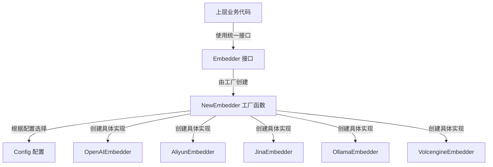

# embedding_provider_contracts 模块技术深度文档

## 1. 什么问题？

想象一下：你需要将文本转换为向量（embedding），但市场上有数十种不同的提供商和API格式——OpenAI、阿里云通义千问、火山引擎、Jina AI、Ollama 等等。每个提供商都有自己的请求格式、认证方式、响应结构，甚至向量维度、截断策略也各不相同。如果你直接在业务代码中处理所有这些差异，代码会变得一团糟，而且每次添加新提供商时都要修改核心逻辑。

`embedding_provider_contracts` 模块就是为了解决这个问题而存在的。它定义了一套统一的接口契约，将不同embedding提供商的差异性封装在实现细节中，让上层业务代码只需要与一个干净、一致的API交互，而不需要关心底层是哪个提供商在工作。

## 2. 架构与心理模型

这个模块的核心是**抽象工厂模式**和**策略模式**的结合体。你可以把它想象成一个"通用插座适配器"：
- `Embedder` 接口是统一的插座标准
- 各种具体的 Embedder 实现（OpenAI、Aliyun、Jina 等）是不同国家/地区的插头
- `NewEmbedder` 工厂函数是插座转换面板，根据配置自动选择合适的适配器



## 3. 核心组件详解

### 3.1 Embedder 接口
```go
type Embedder interface {
    // Embed 将单个文本转换为向量
    Embed(ctx context.Context, text string) ([]float32, error)
    
    // BatchEmbed 将多个文本批量转换为向量
    BatchEmbed(ctx context.Context, texts []string) ([][]float32, error)
    
    // GetModelName 返回模型名称
    GetModelName() string
    
    // GetDimensions 返回向量维度
    GetDimensions() int
    
    // GetModelID 返回模型ID
    GetModelID() string
    
    EmbedderPooler
}
```

**设计意图**：
- **最小化接口**：只定义最核心的功能，避免接口膨胀
- **单一职责**：每个方法都有明确的单一目的
- **组合优于继承**：通过嵌入 `EmbedderPooler` 接口实现功能扩展

### 3.2 Config 配置结构
```go
type Config struct {
    Source               types.ModelSource `json:"source"`
    BaseURL              string            `json:"base_url"`
    ModelName            string            `json:"model_name"`
    APIKey               string            `json:"api_key"`
    TruncatePromptTokens int               `json:"truncate_prompt_tokens"`
    Dimensions           int               `json:"dimensions"`
    ModelID              string            `json:"model_id"`
    Provider             string            `json:"provider"`
}
```

**设计意图**：
- **完整配置**：包含所有可能需要的配置项
- **灵活路由**：通过 `Source` 和 `Provider` 双重路由机制
- **向后兼容**：保留所有字段通过默认值处理缺失配置

### 3.3 NewEmbedder 工厂函数
这是整个模块的"大脑"，它根据配置智能路由到正确的实现：

1. 首先根据 `Source` 区分本地（Ollama）和远程提供商
2. 对于远程提供商，使用 `Provider` 字段或通过 `DetectProvider` 自动检测
3. 特殊处理阿里云的多模态模型与文本模型的区分
4. 默认回退到 OpenAI 兼容接口

**数据流向**：
```
配置输入 → Source 检查 → Provider 检测 → 具体实现选择 → Embedder 返回
```

## 4. 依赖分析

### 输入依赖：
- `types.ModelSource`：区分本地/远程模型源
- `provider.ProviderName` 和 `provider.DetectProvider`：提供商检测和路由
- `ollama.OllamaService`：本地 Ollama 服务
- `EmbedderPooler`：批量嵌入池化能力

### 输出依赖：
- 各种具体的 Embedder 实现（OpenAIEmbedder、AliyunEmbedder 等）

## 5. 设计决策与权衡

### 5.1 智能路由 vs 显式配置
**选择了混合策略**：既支持显式配置 Provider，又支持自动检测
- **优点**：灵活性高，用户可以灵活选择
- **权衡**：增加了代码复杂度，但提高了用户体验

### 5.2 阿里云多模态模型特殊处理
代码中有一段特别的逻辑来区分阿里云的多模态和文本模型：
- **原因**：阿里云文本模型使用 OpenAI 兼容接口，而多模态模型使用专用 DashScope 接口
- **设计**：通过模型名称中是否包含 "vision" 或 "multimodal" 来判断
- **权衡**：增加了特定提供商的特殊逻辑，但解决了实际问题

### 5.3 接口组合 vs 单一接口
选择了将 `EmbedderPooler` 嵌入到主接口中
- **优点**：保持接口的连贯性
- **权衡**：接口变得稍大，但功能更完整

## 6. 使用示例

### 基本用法：
```go
// 创建配置
config := embedder.Config{
    Source: types.ModelSourceRemote,
    BaseURL: "https://api.openai.com/v1",
    ModelName: "text-embedding-ada-002",
    APIKey: "your-api-key",
    Dimensions: 1536,
}

// 创建 embedder
embedder, err := embedder.NewEmbedder(config, pooler, ollamaService)
if err != nil {
    // 处理错误
}

// 单个文本嵌入
vector, err := embedder.Embed(ctx, "Hello, world!")

// 批量嵌入
vectors, err := embedder.BatchEmbed(ctx, []string{"text1", "text2"})
```

## 7. 注意事项与陷阱

### 7.1 阿里云模型 URL 自动修正
代码会自动修正阿里云模型的 URL，注意：
- 文本模型会自动添加 `/compatible-mode/v1`
- 多模态模型会自动移除兼容模式路径

### 7.2 提供商自动检测
当 Provider 为空时，会根据 BaseURL 自动检测，确保 BaseURL 格式正确

### 7.3 向量维度一致性
确保配置的 Dimensions 需要与实际模型返回的维度一致，否则可能导致问题

### 7.4 截断配置
TruncatePromptTokens 配置会影响文本截断行为，不同提供商可能有不同的实现

## 8. 总结

`embedding_provider_contracts` 模块是一个优秀的抽象层设计示例，它：
- 隔离了不同 embedding 提供商的差异
- 提供了统一的接口
- 智能路由到正确的实现
- 处理了特殊情况（如阿里云多模态模型）

这个模块的设计体现了"开闭原则"——对扩展开放，对修改关闭，让添加新提供商变得简单，同时保持了接口的稳定性。
