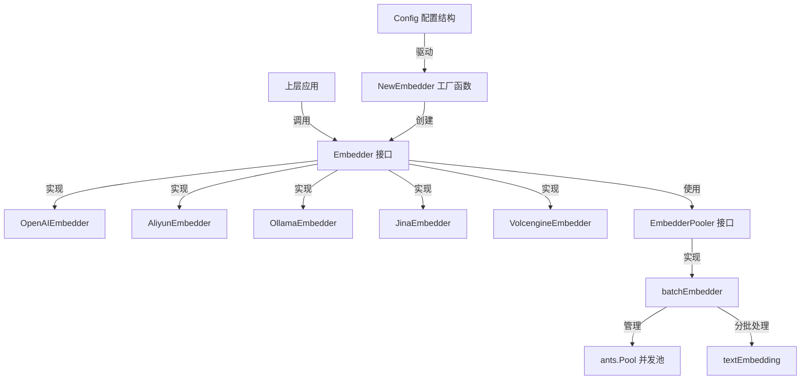

# embedding_core_contracts_and_batch_orchestration 模块技术深度解析

## 1. 模块概述

在 AI 应用系统中，文本嵌入（embedding）是连接自然语言文本与向量检索系统的桥梁。当你需要处理成千上万个文档片段时，逐个向远程服务发送嵌入请求不仅效率低下，还会造成不必要的网络开销。`embedding_core_contracts_and_batch_orchestration` 模块正是为了解决这个问题而设计的——它提供了统一的嵌入模型接口抽象，同时通过智能的批量处理策略，在保证系统吞吐量的同时控制资源消耗。

想象一下，你是一家快递公司的调度员：如果每个包裹都单独派一辆车配送，成本会高得惊人；但如果把目的地相近的包裹打包成批次，用同一辆车配送，效率就会大幅提升。这个模块做的就是类似的事情——它把大量的文本嵌入请求组织成批次，通过并发池高效处理，同时提供了统一的接口来适配不同的嵌入模型提供商。

## 2. 核心架构

### 2.1 架构概览



### 2.2 核心组件解析

#### Embedder 接口：嵌入能力的统一抽象

`Embedder` 接口是整个模块的核心，它定义了所有嵌入模型必须实现的能力契约。这个接口的设计体现了"面向接口编程"的原则——上层应用只需要依赖这个接口，而不需要知道底层具体是哪个提供商的实现。

接口包含了两个关键的嵌入方法：
- `Embed(ctx context.Context, text string) ([]float32, error)`：处理单个文本的嵌入
- `BatchEmbed(ctx context.Context, texts []string) ([][]float32, error)`：处理批量文本的嵌入

同时，它还包含了元数据获取方法，让调用者能够了解模型的基本信息：
- `GetModelName()`：获取模型名称
- `GetDimensions()`：获取向量维度
- `GetModelID()`：获取模型 ID

值得注意的是，`Embedder` 接口嵌入了 `EmbedderPooler` 接口，这意味着每个嵌入实现都具备批量池处理的能力。

#### EmbedderPooler 接口：批量处理的扩展点

`EmbedderPooler` 接口定义了 `BatchEmbedWithPool` 方法，这是一个设计巧妙的扩展点。它允许我们将批量处理的逻辑与具体的嵌入实现解耦，通过组合的方式为不同的嵌入实现添加批量处理能力。

这种设计遵循了"组合优于继承"的原则——不是让每个嵌入实现都重复实现批量逻辑，而是通过注入 `EmbedderPooler` 来获得这种能力。

#### batchEmbedder：批量编排的执行者

`batchEmbedder` 是 `EmbedderPooler` 接口的具体实现，它是整个批量处理逻辑的核心。这个组件的设计体现了生产者-消费者模式：

1. **任务分片**：它将输入的文本列表按照配置的批次大小（通过 `BATCH_EMBED_SIZE` 环境变量控制，默认为 5）切分成多个小批次
2. **并发池管理**：使用 `ants.Pool` 来管理并发 goroutine，控制同时进行的嵌入请求数量
3. **错误处理**：使用互斥锁来保证第一个错误被正确捕获，并且在出错时停止后续处理
4. **结果聚合**：将各个批次的结果重新组装成完整的结果列表返回

这种设计有几个关键的考量：
- **资源控制**：通过并发池限制同时进行的请求数，避免对远程服务造成压力
- **错误快速失败**：一旦某个批次出错，立即停止处理，避免浪费资源
- **可配置性**：通过环境变量允许用户根据实际情况调整批次大小

#### Config：统一的配置模型

`Config` 结构体定义了创建嵌入模型所需的所有配置参数，它是工厂函数 `NewEmbedder` 的输入。这个结构体的设计体现了"配置驱动"的理念：

- `Source`：指定模型来源（本地或远程）
- `BaseURL`：API 基础 URL
- `ModelName`：模型名称
- `APIKey`：API 密钥
- `TruncatePromptTokens`：提示截断的 token 数
- `Dimensions`：向量维度
- `ModelID`：模型 ID
- `Provider`：提供商名称

#### NewEmbedder：工厂函数与路由逻辑

`NewEmbedder` 函数是一个工厂函数，它根据配置创建合适的嵌入实现。这个函数包含了复杂的路由逻辑，体现了策略模式的思想：

1. **本地/远程路由**：首先根据 `Source` 字段决定是使用本地模型（Ollama）还是远程模型
2. **提供商检测**：对于远程模型，它会先尝试使用配置的提供商，如果没有配置则通过 `DetectProvider` 函数自动检测
3. **特殊路由逻辑**：对于阿里云，它有特殊的逻辑来区分多模态模型和纯文本模型，分别使用不同的 API 端点和实现
4. **默认回退**：对于未知的提供商，默认使用 OpenAI 兼容的实现

这里有一个特别值得注意的设计细节：阿里云的纯文本模型使用 `NewOpenAIEmbedder` 而不是 `NewAliyunEmbedder`。这是因为阿里云的纯文本嵌入 API 兼容 OpenAI 格式，而多模态 API 则使用不同的格式。这种设计避免了重复实现兼容 OpenAI 格式的逻辑。

## 3. 数据流程与依赖关系

### 3.1 典型的数据流程

让我们追踪一次典型的批量嵌入请求的数据流程：

1. **上层应用调用**：上层应用（可能是知识导入服务或检索服务）创建一个 `Config` 配置，调用 `NewEmbedder` 创建嵌入器
2. **工厂路由**：`NewEmbedder` 根据配置选择合适的实现（比如 `OpenAIEmbedder`），并注入 `batchEmbedder` 作为池化器
3. **批量请求**：应用调用 `embedder.BatchEmbedWithPool(ctx, embedder, texts)` 进行批量嵌入
4. **任务分片**：`batchEmbedder` 将文本列表切分成批次
5. **并发处理**：每个批次被提交到 `ants.Pool` 中并发处理
6. **远程调用**：每个批次的处理函数调用具体嵌入实现的 `BatchEmbed` 方法，向远程服务发送请求
7. **结果聚合**：所有批次完成后，结果被聚合返回给应用

### 3.2 依赖关系分析

这个模块的依赖关系设计非常清晰：

- **核心接口无依赖**：`Embedder` 和 `EmbedderPooler` 接口只依赖标准库的 `context.Context`
- **工厂函数有外部依赖**：`NewEmbedder` 依赖了 `provider` 包（用于提供商检测）、`ollama` 包（用于本地模型）和 `types` 包（用于模型来源定义）
- **批量实现有性能依赖**：`batchEmbedder` 依赖了 `ants` 包（高性能 goroutine 池）和 `utils` 包（用于切片操作）

这种依赖分层的设计保证了核心接口的稳定性，同时将具体实现的依赖隔离在工厂函数中。

## 4. 关键设计决策与权衡

### 4.1 接口嵌入 vs 独立接口

**决策**：`Embedder` 接口嵌入了 `EmbedderPooler` 接口，而不是将它们作为独立的接口。

**分析**：
- **优点**：简化了使用，调用者不需要同时持有两个接口的引用
- **缺点**：违反了接口隔离原则，有些嵌入实现可能不需要池化能力

**为什么这样设计**：在这个系统的上下文中，几乎所有的嵌入使用场景都需要批量处理能力，所以将两个接口合并是合理的权衡。

### 4.2 环境变量配置批次大小 vs 结构体配置

**决策**：批次大小通过 `BATCH_EMBED_SIZE` 环境变量配置，而不是通过 `Config` 结构体。

**分析**：
- **优点**：部署时可以灵活调整，不需要修改代码
- **缺点**：配置分散，不够直观；不同的嵌入实例无法使用不同的批次大小

**为什么这样设计**：批次大小更多是一个运维配置项，而不是业务配置项。对于大多数场景，统一的批次大小是合理的。

### 4.3 错误快速失败 vs 尽力完成

**决策**：一旦某个批次出错，立即停止处理并返回错误。

**分析**：
- **优点**：避免浪费资源，快速反馈问题
- **缺点**：可能导致部分已经完成的工作被浪费

**为什么这样设计**：在知识导入等场景下，数据的完整性比部分完成更重要。如果某个文档片段嵌入失败，通常需要整个批次重试。

### 4.4 工厂函数中的特殊路由逻辑

**决策**：在 `NewEmbedder` 中对阿里云模型进行特殊处理，区分多模态和纯文本模型。

**分析**：
- **优点**：对调用者透明，自动选择正确的实现
- **缺点**：工厂函数变得复杂，包含了特定提供商的业务逻辑

**为什么这样设计**：这是一个实用性优先的决策。将这种特殊逻辑封装在工厂函数中，比让调用者自己处理要好得多。

## 5. 使用指南与注意事项

### 5.1 基本使用

创建嵌入器的基本模式：

```go
config := embedding.Config{
    Source:    types.ModelSourceRemote,
    BaseURL:   "https://api.openai.com/v1",
    ModelName: "text-embedding-3-small",
    APIKey:    "your-api-key",
    Dimensions: 1536,
}

// 创建并发池
pool, _ := ants.NewPool(10)
defer pool.Release()

// 创建批量池化器
pooler := embedding.NewBatchEmbedder(pool)

// 创建嵌入器
embedder, err := embedding.NewEmbedder(config, pooler, ollamaService)
if err != nil {
    // 处理错误
}

// 批量嵌入
embeddings, err := embedder.BatchEmbedWithPool(ctx, embedder, texts)
```

### 5.2 配置建议

- **批次大小**：对于大多数场景，默认的 5 是合理的。如果你的网络条件好，远程服务响应快，可以适当增大；如果遇到限流错误，应该减小。
- **并发池大小**：并发池大小应该与批次大小和远程服务的限流策略匹配。一般来说，并发池大小可以设置为批次大小的 2-3 倍。
- **阿里云模型**：对于阿里云的纯文本模型，确保使用 `/compatible-mode/` 路径的 URL；对于多模态模型，不要使用这个路径。

### 5.3 常见陷阱

1. **忘记释放并发池**：`ants.Pool` 需要手动调用 `Release()` 释放资源，否则会造成 goroutine 泄漏。
2. **错误处理**：`BatchEmbedWithPool` 只返回第一个错误，如果你需要了解具体哪个批次失败，需要自己添加日志。
3. **上下文传递**：确保传递有超时控制的 context，否则远程服务挂起会导致你的请求也挂起。
4. **配置错误**：对于阿里云模型，如果 URL 配置错误，可能会导致空的 embedding 数组返回，而不是明确的错误。

## 6. 子模块概览

本模块包含以下子模块，它们提供了更具体的实现和契约：

- [embedding_provider_contracts](model_providers_and_ai_backends-embedding_interfaces_batching_and_backends-embedding_core_contracts_and_batch_orchestration-embedding_provider_contracts.md)：定义了各提供商的契约接口
- [embedding_pooling_and_runtime_configuration](model_providers_and_ai_backends-embedding_interfaces_batching_and_backends-embedding_core_contracts_and_batch_orchestration-embedding_pooling_and_runtime_configuration.md)：处理池化和运行时配置
- [batch_embedding_orchestration_and_result_models](model_providers_and_ai_backends-embedding_interfaces_batching_and_backends-embedding_core_contracts_and_batch_orchestration-batch_embedding_orchestration_and_result_models.md)：批量编排和结果模型

## 7. 与其他模块的关系

- **依赖**：本模块依赖 [provider_catalog_and_configuration_contracts](model_providers_and_ai_backends-provider_catalog_and_configuration_contracts.md) 进行提供商检测，依赖 `core_domain_types_and_interfaces` 中的类型定义。
- **被依赖**：本模块被具体的嵌入提供商实现模块依赖，如 [aliyun_embedding_backend](model_providers_and_ai_backends-embedding_interfaces_batching_and_backends-aliyun_embedding_backend.md)、[openai_embedding_backend](model_providers_and_ai_backends-embedding_interfaces_batching_and_backends-openai_embedding_backend.md) 等。
- **上层使用**：本模块被 [application_services_and_orchestration](application_services_and_orchestration.md) 中的知识导入服务和检索服务使用。
