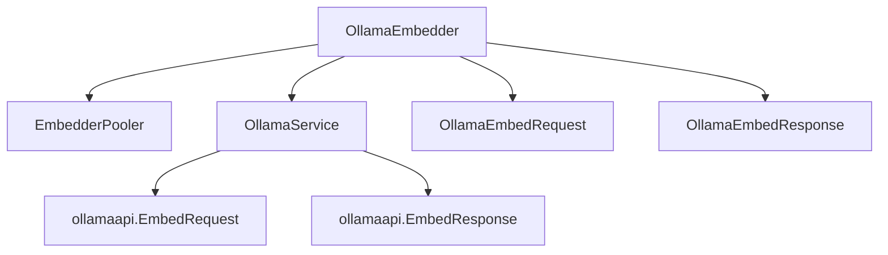

# Ollama 嵌入后端模块技术深度解析

## 1. 模块概述

**ollama_embedding_backend** 模块是整个系统的嵌入服务提供者之一，专门负责将文本数据转换为向量表示，这是现代语义搜索和 RAG（检索增强生成）系统的核心基础设施。

### 问题空间

在构建智能问答和知识检索系统时，我们面临一个核心挑战：如何将非结构化的自然语言文本转换为计算机可以理解和比较的数值表示？传统的关键词匹配无法捕捉语义相似性，而向量嵌入技术正是解决这个问题的关键。

对于自托管和私有化部署场景，使用 Ollama 作为嵌入后端具有特殊意义：
- 它允许在没有外部 API 依赖的环境中运行
- 提供了对数据隐私的完全控制
- 支持多种开源嵌入模型的灵活切换

### 设计洞察

这个模块的核心设计理念是**适配器模式**的优雅实现：它将 Ollama 特定的 API 契约转换为系统内部通用的嵌入服务接口，同时处理模型可用性保证、批处理优化和参数适配等复杂问题。

## 2. 架构与数据流程

### 核心组件关系图



### 数据流程分析

当系统需要将文本转换为向量时，数据流经以下关键步骤：

1. **初始化阶段**：
   - 通过 `NewOllamaEmbedder` 创建嵌入器实例
   - 设置默认模型（nomic-embed-text）和默认截断长度（511 tokens）
   - 注入必要的依赖：OllamaService 和 EmbedderPooler

2. **嵌入请求流程**：
   - 调用 `Embed()` 或 `BatchEmbed()` 方法
   - 首先通过 `ensureModelAvailable()` 确保模型在 Ollama 服务中可用
   - 构造 `ollamaapi.EmbedRequest`，配置截断参数
   - 委托给 `OllamaService.Embeddings()` 执行实际的 API 调用
   - 返回嵌入向量结果

3. **单文本与批处理的关系**：
   值得注意的是，`Embed()` 方法实际上是通过调用 `BatchEmbed()` 并传入单元素数组来实现的，这种设计确保了代码路径的一致性，减少了重复逻辑。

## 3. 核心组件深度解析

### OllamaEmbedder 结构体

这是模块的核心类，实现了系统的嵌入服务接口。让我们分析其字段设计：

```go
type OllamaEmbedder struct {
    modelName            string
    truncatePromptTokens int
    ollamaService        *ollama.OllamaService
    dimensions           int
    modelID              string
    EmbedderPooler
}
```

**设计意图分析**：
- **modelName**: 指定使用的 Ollama 嵌入模型，默认值 "nomic-embed-text" 是一个经过验证的高质量选择
- **truncatePromptTokens**: 控制输入文本的截断长度，防止超出模型的上下文窗口。默认值 511 是一个保守但安全的选择
- **ollamaService**: 依赖注入的 Ollama 服务客户端，实现了与实际 Ollama 实例的通信
- **dimensions**: 预定义的向量维度，这是一个重要的配置，因为不同的嵌入模型输出不同维度的向量
- **modelID**: 系统内部使用的模型标识符，用于跟踪和配置
- **EmbedderPooler**: 嵌入了池化器接口，允许在需要时对向量进行进一步处理

### 关键方法解析

#### NewOllamaEmbedder 工厂函数

```go
func NewOllamaEmbedder(baseURL,
    modelName string,
    truncatePromptTokens int,
    dimensions int,
    modelID string,
    pooler EmbedderPooler,
    ollamaService *ollama.OllamaService,
) (*OllamaEmbedder, error)
```

**设计亮点**：
- **合理的默认值**：当 modelName 为空时使用 "nomic-embed-text"，当 truncatePromptTokens 为 0 时使用 511
- **依赖注入**：ollamaService 和 pooler 作为参数传入，提高了可测试性和灵活性
- **验证逻辑**：虽然当前代码中没有显式的错误返回，但结构设计预留了验证空间

#### ensureModelAvailable 方法

这个方法体现了**防御性编程**的思想：

```go
func (e *OllamaEmbedder) ensureModelAvailable(ctx context.Context) error {
    logger.GetLogger(ctx).Infof("Ensuring model %s is available", e.modelName)
    return e.ollamaService.EnsureModelAvailable(ctx, e.modelName)
}
```

在每次嵌入操作前检查模型可用性，虽然会增加一些开销，但避免了因模型缺失导致的更严重错误。这对于长期运行的服务特别重要，因为 Ollama 实例的状态可能会在服务重启后发生变化。

#### BatchEmbed 方法

这是实际执行工作的核心方法：

```go
func (e *OllamaEmbedder) BatchEmbed(ctx context.Context, texts []string) ([][]float32, error)
```

**关键实现细节**：
1. **参数适配**：将内部的 truncatePromptTokens 映射到 Ollama API 的 num_ctx 选项，并设置 Truncate 标志
2. **性能监控**：记录嵌入操作的耗时，这对于性能调优和问题诊断非常有价值
3. **错误包装**：使用 fmt.Errorf 和 %w 动词包装原始错误，保留错误链同时添加上下文信息

## 4. 依赖关系分析

### 上游依赖

- **OllamaService**：这是与实际 Ollama 实例通信的底层服务，模块通过它发送嵌入请求和接收响应
- **EmbedderPooler**：可选的向量后处理组件，用于在需要时对嵌入向量进行池化操作
- **ollamaapi**：来自 github.com/ollama/ollama/api 的官方 Ollama API 客户端库

### 下游消费者

这个模块被嵌入服务的编排层调用，该层位于 [embedding_core_contracts_and_batch_orchestration](model_providers_and_ai_backends-embedding_interfaces_batching_and_backends-embedding_core_contracts_and_batch_orchestration.md) 模块中。它实现了该模块定义的通用嵌入接口，使得系统可以无缝切换不同的嵌入后端。

### 数据契约

虽然 `OllamaEmbedRequest` 和 `OllamaEmbedResponse` 结构体在代码中定义，但有趣的是，它们实际上并没有被直接使用。实际的通信使用的是 `ollamaapi.EmbedRequest` 和 `ollamaapi.EmbedResponse`。这可能是早期设计的遗留，或者是为未来的扩展预留的契约。

## 5. 设计决策与权衡

### 1. 单文本嵌入复用批处理实现

**决策**：`Embed` 方法通过调用 `BatchEmbed` 并传入单元素数组来实现

**权衡分析**：
- ✅ **优点**：代码复用，确保单条和批量处理的行为一致
- ❌ **缺点**：对于单条请求，有轻微的不必要开销（创建数组、处理数组逻辑）
- **为什么这样选择**：在这种情况下，代码简洁性和一致性的好处超过了微小的性能损失

### 2. 每次请求前检查模型可用性

**决策**：在 `BatchEmbed` 开始时调用 `ensureModelAvailable`

**权衡分析**：
- ✅ **优点**：避免了因模型缺失导致的运行时错误，提高了系统的鲁棒性
- ❌ **缺点**：增加了每次请求的延迟，特别是在高吞吐量场景下
- **为什么这样选择**：这是一个典型的可用性优先于性能的决策。对于大多数企业应用，稳定可靠的运行比几毫秒的延迟更重要

### 3. 依赖注入设计

**决策**：`OllamaService` 和 `EmbedderPooler` 作为构造函数参数传入，而不是在内部创建

**权衡分析**：
- ✅ **优点**：提高了可测试性（可以轻松注入模拟对象），增加了灵活性
- ❌ **缺点**：增加了使用的复杂性，调用者需要提前准备这些依赖
- **为什么这样选择**：这是一个面向可测试性和可维护性的架构决策，符合现代软件工程的最佳实践

### 4. 默认值策略

**决策**：为 `modelName` 和 `truncatePromptTokens` 提供合理的默认值

**权衡分析**：
- ✅ **优点**：降低了使用门槛，大多数情况下使用默认值即可工作
- ❌ **缺点**：可能掩盖配置错误，导致用户在不知情的情况下使用非预期配置
- **为什么这样选择**：这是一个用户友好的设计，尤其对于内部工具，合理的默认值可以显著简化配置过程

## 6. 使用指南与最佳实践

### 基本使用示例

```go
// 创建 Ollama 服务（通常由 DI 容器提供）
ollamaService := ollama.NewOllamaService(baseURL)

// 创建嵌入器
embedder, err := embedding.NewOllamaEmbedder(
    "http://localhost:11434",  // baseURL
    "nomic-embed-text",        // modelName
    511,                        // truncatePromptTokens
    768,                        // dimensions (根据模型调整)
    "ollama-embed-001",         // modelID
    nil,                        // pooler (可选)
    ollamaService,              // ollamaService
)

// 单文本嵌入
vector, err := embedder.Embed(ctx, "这是一段需要嵌入的文本")

// 批量嵌入
vectors, err := embedder.BatchEmbed(ctx, []string{"文本1", "文本2", "文本3"})
```

### 配置建议

1. **模型选择**：
   - 默认的 `nomic-embed-text` 是一个很好的起点，平衡了质量和性能
   - 对于多语言场景，考虑使用专门的多语言嵌入模型
   - 确保 `dimensions` 参数与所选模型的实际输出维度匹配

2. **截断长度设置**：
   - 默认的 511 是一个保守值，大多数模型可以处理更长的输入
   - 根据你的典型文本长度调整此值，但不要超过模型的最大上下文窗口
   - 较长的截断长度会增加内存使用和处理时间

3. **性能优化**：
   - 对于高吞吐量场景，考虑使用 `BatchEmbed` 而不是多次调用 `Embed`
   - 批处理大小应该根据你的文本长度和 Ollama 实例的资源情况进行调整

## 7. 边缘情况与注意事项

### 常见陷阱

1. **未验证的 dimensions 参数**：
   - `dimensions` 字段没有进行验证，也没有从模型自动获取
   - 如果设置不正确，下游的向量存储和检索操作可能会失败
   - **建议**：在创建嵌入器后验证第一个返回的向量维度是否符合预期

2. **空输入处理**：
   - 代码中没有显式处理空字符串输入
   - Ollama API 对空输入的行为可能不确定
   - **建议**：在调用嵌入方法前过滤掉空字符串

3. **错误处理不完整**：
   - 在 `Embed` 方法中，当 `len(embedding) == 0` 时，错误变量 `err` 可能为 nil
   - 这会导致返回的错误信息可能不准确
   - **建议**：为这种情况创建专门的错误类型

### 操作注意事项

1. **Ollama 服务可用性**：
   - 这个模块完全依赖外部的 Ollama 服务
   - 确保 Ollama 实例稳定运行，并考虑实现降级策略或备用嵌入后端

2. **模型加载时间**：
   - 首次使用模型时，Ollama 可能需要下载或加载模型，这可能需要较长时间
   - 考虑在服务启动时预热模型，或者将首次请求的超时设置得更长

3. **并发安全**：
   - 目前的实现看起来是并发安全的，但要确保注入的 `OllamaService` 也是并发安全的

## 8. 扩展与改进方向

### 潜在的增强功能

1. **模型维度自动检测**：
   - 可以在初始化时通过嵌入一个测试文本来自动检测模型的输出维度
   - 这样可以避免手动配置错误

2. **更丰富的错误类型**：
   - 定义专门的错误类型，如 `ModelNotAvailableError`、`DimensionMismatchError` 等
   - 这将使错误处理更加精确和有意义

3. **缓存层**：
   - 对于不变的文本，可以添加一个可选的缓存层，避免重复计算相同的嵌入
   - 这在处理文档库等静态内容时特别有用

4. **异步批处理**：
   - 实现一个可以在后台收集多个单条请求并批量处理的机制
   - 这可以在保持简单 API 的同时获得批处理的性能优势

## 9. 总结

`ollama_embedding_backend` 模块是一个精心设计的适配器，它将 Ollama 的嵌入功能无缝集成到更大的系统中。它的设计体现了几个重要的软件工程原则：依赖注入、防御性编程、代码复用和合理的默认值。

虽然代码相对简单，但它解决的是一个关键问题：如何以可靠和可维护的方式将文本转换为向量。对于构建私有化部署的语义搜索和 RAG 系统，这个模块提供了一个坚实的基础。

通过理解这个模块的设计决策和权衡，新团队成员可以更好地评估何时使用它，如何有效地配置它，以及在需要时如何扩展它。
