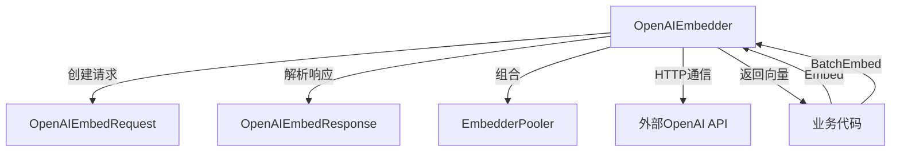

# OpenAI Embedding Backend 技术深度解析

## 1. 模块概述与问题空间

**openai_embedding_backend** 模块是系统中负责使用 OpenAI 兼容 API 进行文本向量化的组件。在知识管理和语义搜索系统中，文本向量（Embedding）是连接自然语言和机器理解的桥梁——它将人类可读的文本转换为计算机可以计算相似度的高维向量空间。

### 问题背景
在构建语义搜索系统时，我们面临几个核心挑战：
- 需要一个统一的方式与不同的嵌入模型提供商交互
- 网络请求可能失败，需要健壮的重试机制
- 文本长度可能超过模型的最大输入限制
- 需要支持批量处理以提高效率

这个模块通过封装 OpenAI 兼容的 API 协议，提供了一个可靠、可配置的文本嵌入解决方案。

## 2. 核心架构与数据流向

### 核心组件关系图



### 主要组件解析

#### OpenAIEmbedder
这是模块的核心控制器，负责协调所有嵌入相关的操作。它封装了 API 密钥、基础 URL、模型配置、HTTP 客户端等关键资源，并实现了嵌入服务的核心逻辑。

#### OpenAIEmbedRequest
这是对 OpenAI 嵌入 API 请求的精确映射，确保我们能够构造符合 API 规范的请求体。

#### OpenAIEmbedResponse
这是对 OpenAI 嵌入 API 响应的精确映射，负责解析返回的嵌入向量数据。

## 3. 核心组件深度解析

### OpenAIEmbedder 结构体

```go
type OpenAIEmbedder struct {
	apiKey               string
	baseURL              string
	modelName            string
	truncatePromptTokens int
	dimensions           int
	modelID              string
	httpClient           *http.Client
	timeout              time.Duration
	maxRetries           int
	EmbedderPooler
}
```

**设计意图与内部机制**：
- `apiKey` 和 `baseURL` 提供了灵活的配置，不仅支持官方 OpenAI 服务，也支持任何兼容的第三方服务
- `truncatePromptTokens` 解决了文本长度限制问题，默认设置为 511 个 token（这是一个安全的边界值）
- `timeout` 设置为 60 秒，平衡了等待时间和用户体验
- `maxRetries` 固定为 3，提供了基本的网络容错能力
- `EmbedderPooler` 嵌入（embedding）表明这是一个组合模式，允许在不修改核心代码的情况下扩展功能

### NewOpenAIEmbedder 工厂函数

**参数解析**：
- `apiKey`: 用于身份验证的 API 密钥
- `baseURL`: API 基础地址，默认使用 "https://api.openai.com/v1"
- `modelName`: 使用的模型名称，这是必填项
- `truncatePromptTokens`: 截断提示词的 token 数，默认为 511
- `dimensions`: 输出向量的维度
- `modelID`: 模型 ID
- `pooler`: 嵌入池器（EmbedderPooler），用于可能的后处理

**设计选择**：
- 工厂函数提供了合理的默认值，但关键参数（如 modelName）必须显式提供，确保配置的明确性
- HTTP 客户端在构造函数中创建，而不是每次请求时创建，这是资源管理的最佳实践

### Embed 和 BatchEmbed 方法

**数据流向**：
1. `Embed` 方法将单个文本转换为向量，它实际上是 `BatchEmbed` 的包装器
2. `BatchEmbed` 方法负责将多个文本批量发送到 API
3. `doRequestWithRetry` 处理实际的 HTTP 请求和重试逻辑

**重试机制设计**：
```go
for i := 0; i <= e.maxRetries; i++ {
    if i > 0 {
        backoffTime := time.Duration(1<<uint(i-1)) * time.Second
        if backoffTime > 10*time.Second {
            backoffTime = 10 * time.Second
        }
        // 等待逻辑...
    }
    // 发送请求...
}
```

这里使用了指数退避算法，但设置了最大退避时间（10秒），避免等待时间过长。同时，每次重试都会重新构建请求，确保请求体是有效的。

## 4. 设计决策与权衡

### 1. 单例 vs 每次创建
**选择**：HTTP 客户端在构造函数中创建一次，所有请求共享。
**理由**：HTTP 客户端的创建和销毁是昂贵的操作，共享可以提高性能。
**权衡**：如果需要为不同请求使用不同的超时或代理设置，这种设计会变得不灵活。

### 2. 重试机制的实现
**选择**：实现了自定义的重试逻辑，而不是使用现成的库。
**理由**：保持代码的轻量级，减少外部依赖。
**权衡**：自定义实现可能不如成熟库功能全面（如缺乏更复杂的重试条件判断）。

### 3. 参数默认值
**选择**：为一些参数提供了默认值（如 baseURL、truncatePromptTokens、timeout）。
**理由**：简化常见场景的配置，降低使用门槛。
**权衡**：过度依赖默认值可能导致配置不明确，特别是在团队环境中。

## 5. 依赖分析

### 入站依赖
- 业务代码（如知识索引、语义搜索组件）通过调用 `Embed` 或 `BatchEmbed` 方法使用这个模块
- 配置系统提供 API 密钥、模型名称等参数

### 出站依赖
- OpenAI 兼容的 HTTP API（通过 `net/http` 包调用）
- 内部日志系统（通过 `logger.GetLogger`）
- 嵌入池器接口（`EmbedderPooler`，未在当前文件中完全展示）

## 6. 使用指南与最佳实践

### 基本用法

```go
// 创建嵌入器
embedder, err := embedding.NewOpenAIEmbedder(
    "your-api-key",
    "https://api.openai.com/v1",
    "text-embedding-ada-002",
    511,
    1536,
    "model-123",
    nil, // 或提供自定义的 EmbedderPooler
)
if err != nil {
    // 处理错误
}

// 嵌入单个文本
vector, err := embedder.Embed(context.Background(), "这是一段测试文本")
if err != nil {
    // 处理错误
}

// 批量嵌入文本
vectors, err := embedder.BatchEmbed(context.Background(), []string{
    "文本1",
    "文本2",
    "文本3",
})
if err != nil {
    // 处理错误
}
```

### 配置建议

1. **API 密钥管理**：不要硬编码 API 密钥，应使用环境变量或安全配置服务
2. **超时设置**：对于批量嵌入，可能需要根据批量大小调整超时时间
3. **截断长度**：根据模型的最大输入长度调整 `truncatePromptTokens`，注意不要设置得过大导致请求失败

## 7. 边缘情况与陷阱

### 1. 文本长度处理
**问题**：即使设置了 `truncatePromptTokens`，某些语言的文本（如中文）在 token 计数上可能与英文有差异。
**建议**：考虑实现真正的 token 计数逻辑，而不是简单依赖 API 的截断功能。

### 2. 错误处理
**问题**：当前实现对所有错误类型都进行重试，包括可能的永久性错误（如无效的 API 密钥）。
**建议**：实现更精细的错误分类，只对临时性错误进行重试。

### 3. 并发安全性
**问题**：`OpenAIEmbedder` 实例是否可以在多个 goroutine 中安全使用？
**答案**：是的，因为 `http.Client` 是并发安全的，且 `OpenAIEmbedder` 的其他字段在初始化后不会被修改。

### 4. 响应验证
**问题**：当前代码只检查 HTTP 状态码，没有验证响应结构的完整性。
**建议**：在解析响应后增加验证逻辑，确保每个输入文本都有对应的嵌入向量。

## 8. 未来扩展方向

1. **更灵活的重试策略**：允许配置不同的重试策略（如恒定间隔、线性退避等）
2. **请求和响应拦截器**：添加钩子机制，允许在请求发送前和响应接收后进行自定义处理
3. **指标收集**：集成性能指标收集（如请求延迟、成功率等）
4. **缓存机制**：为常见文本添加可选的嵌入缓存，避免重复计算

## 相关模块文档

- [embedding_core_contracts_and_batch_orchestration](model_providers_and_ai_backends-embedding_interfaces_batching_and_backends-embedding_core_contracts_and_batch_orchestration.md) - 了解嵌入接口和批量处理的核心契约
- [aliyun_embedding_backend](model_providers_and_ai_backends-embedding_interfaces_batching_and_backends-aliyun_embedding_backend.md) - 阿里云嵌入后端的实现
