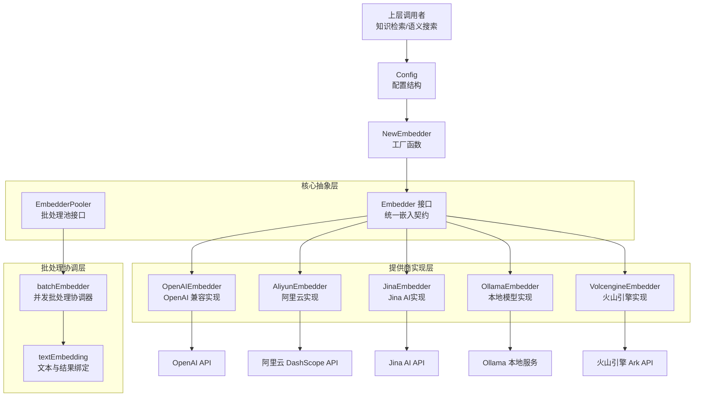

# embedding_interfaces_batching_and_backends 模块深度解析

## 模块概述

想象一下，您需要为成千上万的文档生成向量嵌入，但每个嵌入提供商都有自己独特的 API、批处理限制和错误处理方式。这正是 `embedding_interfaces_batching_and_backends` 模块要解决的问题。

这个模块是一个**统一的嵌入服务抽象层**，它：
1. 为多种嵌入提供商（OpenAI、阿里云、Jina、Ollama、火山引擎）提供一致的接口
2. 实现智能批处理和并发控制，最大化吞吐量的同时尊重提供商限制
3. 提供重试机制和错误处理，确保嵌入生成的可靠性
4. 支持本地和远程模型，满足不同部署场景

在整个系统架构中，这个模块扮演着**向量生成基础设施**的角色——知识检索、语义搜索、相似度计算等上层功能都依赖于它提供的稳定向量表示。

## 核心架构与数据流



### 架构解读

这个模块采用了**分层架构设计**，每层都有明确的职责：

1. **核心抽象层**：定义了 `Embedder` 接口，这是整个模块的"契约"。任何嵌入提供商都必须实现这个接口，确保上层代码不需要知道具体是哪个提供商在工作。

2. **批处理协调层**：`batchEmbedder` 是一个聪明的"调度员"，它将大量文本分成小批次，利用 goroutine 池并发处理，同时通过互斥锁保证线程安全。

3. **提供商实现层**：每个具体的 `*Embedder` 实现都封装了与特定提供商 API 的交互细节，包括请求格式化、错误处理、重试逻辑等。

### 典型数据流：批量生成嵌入

1. **配置阶段**：上层调用者创建 `Config` 结构，指定提供商、模型名、API 密钥等参数
2. **工厂创建**：`NewEmbedder` 根据配置路由到正确的提供商实现
3. **批处理调度**：如果使用 `BatchEmbedWithPool`，文本被分成批次提交到 goroutine 池
4. **API 交互**：每个 `*Embedder` 实现与对应提供商 API 通信
5. **结果聚合**：所有批次的结果被收集、排序并返回给调用者

## 关键设计决策

### 1. 接口驱动设计：统一与灵活的平衡

**决策**：定义了完整的 `Embedder` 接口，所有提供商都实现该接口。

**为什么这样做**：
- 上层代码可以编写一次，支持多种提供商
- 易于添加新的提供商（只需实现接口）
- 便于测试（可以轻松 mock 嵌入服务）

**权衡**：
- ✅ 灵活性：可以在运行时切换提供商
- ✅ 可测试性：Mock 实现容易
- ⚠️ 接口必须足够通用，覆盖所有提供商的能力
- ⚠️ 某些提供商的特殊能力可能需要通过配置而非接口扩展

### 2. 智能批处理策略

**决策**：将批处理逻辑独立出来，由 `batchEmbedder` 专门负责。

**为什么这样做**：
- 不同提供商有不同的批处理限制（例如 OpenAI 限制单次请求的 token 数）
- 并发处理可以显著提升吞吐量
- 集中管理批处理逻辑，避免在每个提供商实现中重复代码

**实现细节**：
```go
// 关键设计点：
// 1. 使用 ants.Pool 控制并发度
// 2. 通过 BATCH_EMBED_SIZE 环境变量配置批次大小
// 3. 使用 WaitGroup + Mutex 保证线程安全
// 4. 快速失败：第一个错误出现时停止处理
```

**权衡**：
- ✅ 吞吐量提升：并发处理多个批次
- ✅ 资源控制：通过池大小限制并发
- ⚠️ 内存开销：需要为每个文本创建中间结构
- ⚠️ 复杂度增加：需要处理并发同步

### 3. 重试与错误处理策略

**决策**：每个提供商实现都包含内置的重试机制，使用指数退避策略。

**为什么这样做**：
- 网络请求是不稳定的，特别是与第三方 API 交互尤其如此
- 嵌入生成通常是批量操作，失败的成本很高
- 不同提供商有不同的失败模式和重试策略

**实现细节**：
```go
// 指数退避重试：
// 1. 初始重试间隔：1秒、2秒、4秒、8秒、最多10秒
// 2. 最多重试3次
// 3. 尊重 context 取消信号
```

**权衡**：
- ✅ 可靠性提升：临时故障自动恢复
- ✅ 用户体验：不需要上层代码处理重试
- ⚠️ 延迟增加：重试会增加总延迟
- ⚠️ 资源占用：重试期间占用连接和内存

### 4. 阿里云多模态模型特殊处理

**决策**：在 `NewEmbedder` 中对阿里云模型进行特殊路由。

**为什么这样做**：
- 阿里云有两种不同的 API：OpenAI 兼容接口和专有接口
- 多模态模型（如 `tongyi-embedding-vision-*`）需要使用专有接口
- 纯文本模型使用 OpenAI 兼容接口更简单

**实现细节**：
```go
// 关键判断逻辑：
isMultimodalModel := strings.Contains(strings.ToLower(config.ModelName), "vision") ||
    strings.Contains(strings.ToLower(config.ModelName), "multimodal")
```

**权衡**：
- ✅ 功能完整：支持多模态模型
- ✅ 向后兼容：纯文本模型继续使用 OpenAI 兼容接口
- ⚠️ 增加了复杂度：需要特殊处理
- ⚠️ 依赖模型命名约定：如果模型命名改变，代码需要调整

### 5. 火山引擎单文本批处理

**决策**：`VolcengineEmbedder` 的 `BatchEmbed` 实际上是逐个处理每个文本。

**为什么这样做**：
- 火山引擎多模态 API 返回的是所有输入的**组合**嵌入，而不是每个文本的独立嵌入
- 为了保持接口一致性，我们需要逐个调用 API

**权衡**：
- ✅ 接口一致性：上层代码不需要知道这个特殊性
- ⚠️ 性能降低：不能利用批处理优化
- ⚠️ 成本增加：更多的 API 调用

## 子模块说明

### embedding_core_contracts_and_batch_orchestration

这是模块的核心，定义了统一的接口契约和批处理协调逻辑。它包含：
- `Embedder` 接口：所有嵌入提供商必须实现的方法
- `EmbedderPooler` 接口：批处理池的抽象
- `batchEmbedder`：批处理协调器实现
- `Config`：配置结构
- `NewEmbedder`：工厂函数

详细文档请参考：[embedding_core_contracts_and_batch_orchestration](model_providers_and_ai_backends-embedding_interfaces_batching_and_backends-embedding_core_contracts_and_batch_orchestration.md)

### 提供商特定子模块

每个提供商都有自己的子模块，封装了与特定 API 的交互：

- **aliyun_embedding_backend**：阿里云 DashScope 嵌入实现
- **openai_embedding_backend**：OpenAI 兼容嵌入实现
- **jina_embedding_backend**：Jina AI 嵌入实现
- **ollama_embedding_backend**：Ollama 本地嵌入实现
- **volcengine_multimodal_embedding_backend**：火山引擎多模态嵌入实现

## 与其他模块的依赖关系

### 依赖的模块

- **provider**：用于检测提供商类型
- **types**：提供模型源类型定义
- **utils/ollama**：Ollama 本地服务封装
- **logger**：日志记录
- **ants**：goroutine 池
- **ollama/api**：Ollama API 客户端

### 被依赖的模块

这个模块通常被以下模块依赖：
- **knowledge_ingestion_extraction_and_graph_services**：知识摄入时生成嵌入
- **retrieval_and_web_search_services**：语义搜索时生成查询嵌入
- **vector_retrieval_backend_repositories**：将向量存储到向量数据库

## 使用指南

### 基本使用

```go
// 1. 创建配置
config := embedding.Config{
    Source:      types.ModelSourceRemote,
    BaseURL:     "https://api.openai.com/v1",
    ModelName:   "text-embedding-3-small",
    APIKey:      "your-api-key",
    Dimensions:  1536,
}

// 2. 创建批处理池
pool, _ := ants.NewPool(10)
batchEmbedder := embedding.NewBatchEmbedder(pool)

// 3. 创建嵌入器
embedder, err := embedding.NewEmbedder(config, batchEmbedder, nil)
if err != nil {
    // 处理错误
}

// 4. 生成嵌入
embedding, err := embedder.Embed(ctx, "Hello, world!")

// 5. 批量生成嵌入
embeddings, err := embedder.BatchEmbed(ctx, []string{"Text 1", "Text 2"})

// 6. 使用批处理池并发生成嵌入
embeddings, err := embedder.BatchEmbedWithPool(ctx, embedder, largeTextSlice)
```

### 配置选项

| 配置项 | 说明 | 默认值 |
|--------|------|--------|
| Source | 模型来源（本地/远程） | 必须指定 |
| BaseURL | API 基础 URL | 提供商默认值 |
| ModelName | 模型名称 | 必须指定 |
| APIKey | API 密钥 | 必须指定 |
| TruncatePromptTokens | 截断提示词长度 | 511 |
| Dimensions | 向量维度 | 模型默认 |
| ModelID | 模型 ID | 空 |
| Provider | 提供商名称 | 自动检测 |

### 环境变量

| 变量名 | 说明 | 默认值 |
|--------|------|--------|
| BATCH_EMBED_SIZE | 批处理大小 | 5 |

## 新贡献者注意事项

### 常见陷阱

1. **忘记处理 Volcengine 的特殊性**：
   - 火山引擎的 `BatchEmbed` 实际上是逐个处理文本，性能较低
   - 如果需要高性能，考虑在调用前评估是否可以接受

2. **阿里云模型选择错误的 API**：
   - 多模态模型必须使用专有 API
   - 纯文本模型必须使用 OpenAI 兼容 API
   - 混用会导致错误

3. **批处理池大小设置不当**：
   - 太小：并发度不足，性能低
   - 太大：可能触发提供商限流

4. **环境变量 `BATCH_EMBED_SIZE` 的影响**：
   - 不同提供商有不同的批处理限制
   - 设置过大可能导致请求失败

### 扩展新提供商

要添加新的嵌入提供商，需要：

1. 创建新的 `*Embedder` 结构体，嵌入 `EmbedderPooler`
2. 实现 `Embedder` 接口的所有方法
3. 在 `NewEmbedder` 中添加路由逻辑
4. 添加相应的请求/响应结构

### 调试技巧

1. **查看日志**：所有提供商实现都有详细的日志记录
2. **检查重试**：注意观察日志中的重试信息
3. **验证 URL 构造**：阿里云和火山引擎都有 URL 清理逻辑，注意检查最终 URL
4. **使用 Mock**：测试时可以 mock 嵌入服务，避免实际 API 调用

## 总结

`embedding_interfaces_batching_and_backends` 模块是一个设计良好的抽象层，它通过统一的接口隐藏了多种嵌入提供商的复杂性，同时提供了智能批处理、重试机制和错误处理。它的设计决策反映了在统一性、灵活性和性能之间的仔细权衡。

对于新贡献者，理解这个模块的关键是：
1. 理解 `Embedder` 接口的设计意图
2. 掌握批处理协调的工作原理
3. 注意各个提供商实现的特殊性
4. 了解配置和环境变量的影响
