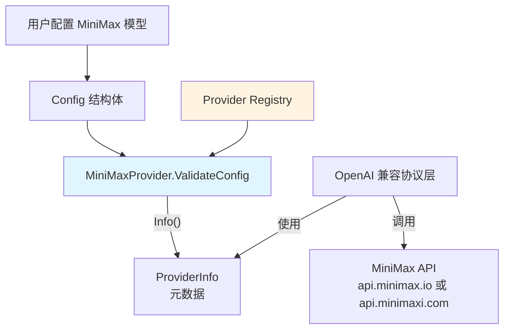

# minimax_openai_compatible_provider_adapter 模块技术深度解析

## 1. 问题空间与模块存在意义

### 为什么需要这个模块？

在构建多模型提供商的 AI 应用时，一个核心挑战是 **异构 API 的统一抽象**。尽管 MiniMax 提供了 OpenAI 兼容的 API 接口，但它仍有自身的特殊性：

1. **双区域部署**：MiniMax 同时运营国际版 (`api.minimax.io`) 和国内版 (`api.minimaxi.com`)，不同用户根据地理位置需要选择合适的接入点
2. **品牌识别需求**：作为一个独立的主流 AI 平台，MiniMax 需要在 UI 和配置中作为单独的选项出现，而不仅仅是 "通用 OpenAI 兼容"
3. **配置约定**：MiniMax 需要强制验证 API Key 和模型名称，这与通用提供者的灵活配置策略不同

如果没有这个模块，用户要么需要手动配置通用 OpenAI 兼容端点（需要记住 MiniMax 的 URL 并手动输入），要么系统无法提供针对 MiniMax 的优化体验。

### 设计洞察

这个模块采用了 **"特定提供者 + 通用协议"** 的设计模式：
- 通过 `MiniMaxProvider` 结构体实现 `Provider` 接口，提供 MiniMax 特定的元数据和验证逻辑
- 复用系统中已有的 OpenAI 协议兼容层来处理实际的 API 调用
- 通过注册表模式在初始化时自动注册，实现零配置集成

## 2. 心智模型与核心抽象

### 心智模型

把整个 provider 系统想象成一个 **"多语言翻译器的电源插座板"**：

- **`Provider` 接口**：是插座的标准形状（两口或三口）
- **`MiniMaxProvider`**：是一个专门为 MiniMax 插头设计的适配器，它知道 MiniMax 设备需要的电压和插座规格
- **注册表**：是插座板上的插孔位置，每个适配器在初始化时自动插入对应的位置
- **通用 OpenAI 兼容层**：是隐藏在插座背后的电线和变压器，负责实际的电力传输（API 调用）

### 核心抽象

#### `MiniMaxProvider` 结构体

这是一个 **零状态结构体**（没有字段），它的存在仅仅是为了实现 `Provider` 接口，提供 MiniMax 特定的行为。这种设计在 Go 中很常见——当你只需要行为而不需要状态时，空结构体是最佳选择，因为它不占用内存。

#### 关键常量

- `MiniMaxBaseURL`：国际版 API 端点
- `MiniMaxCNBaseURL`：国内版 API 端点

注意模块选择了国内版作为默认 URL，这暗示了系统的主要用户群体可能在中国内地。

## 3. 架构与数据流

### 系统架构图



### 数据流程详解

1. **初始化阶段**
   - 程序启动时，`init()` 函数执行，调用 `Register(&MiniMaxProvider{})` 
   - `MiniMaxProvider` 被添加到全局注册表 `registry` 中，键为 `ProviderMiniMax`

2. **配置验证阶段**
   - 用户创建或配置 MiniMax 模型时，系统调用 `ValidateConfig(config *Config)`
   - 检查 `APIKey` 和 `ModelName` 是否为空
   - 如果验证失败，返回描述性错误

3. **元数据查询阶段**
   - UI 或配置系统调用 `Info()` 获取 Provider 元数据
   - 获得名称、显示名称、描述、默认 URL、支持的模型类型等信息
   - 系统使用这些信息渲染 UI 选项和提供智能默认值

4. **API 调用阶段**（此模块不直接参与）
   - 实际的聊天/嵌入调用由 OpenAI 兼容协议层处理
   - 使用 `ProviderInfo` 中提供的 BaseURL 进行请求
   - 但这个层面的逻辑在其他模块中，不在 `minimax.go` 中

## 4. 组件深度解析

### `MiniMaxProvider` 结构体

```go
type MiniMaxProvider struct{}
```

**设计意图**：这是一个 **纯行为提供者**，不包含任何可变状态。这种设计有几个明显的优势：

1. **并发安全**：没有状态意味着多个 goroutine 可以同时使用同一个实例而不需要同步
2. **内存高效**：空结构体在 Go 中占用零字节内存
3. **简单性**：不需要考虑初始化、状态管理和清理逻辑

### `Info() ProviderInfo` 方法

```go
func (p *MiniMaxProvider) Info() ProviderInfo {
    return ProviderInfo{
        Name:        ProviderMiniMax,
        DisplayName: "MiniMax",
        Description: "MiniMax-M2.1, MiniMax-M2.1-lightning, etc.",
        DefaultURLs: map[types.ModelType]string{
            types.ModelTypeKnowledgeQA: MiniMaxCNBaseURL,
        },
        ModelTypes: []types.ModelType{
            types.ModelTypeKnowledgeQA,
        },
        RequiresAuth: true,
    }
}
```

**关键设计决策解析**：

1. **默认 URL 选择**：使用 `MiniMaxCNBaseURL` 作为默认值，这表明产品设计考虑到了主要用户群体的网络环境
2. **模型类型限制**：仅声明支持 `ModelTypeKnowledgeQA`，这是一种**渐进式支持**策略——先确保核心场景工作，后续再扩展
3. **`RequiresAuth: true`**：明确告知系统和用户，MiniMax 始终需要 API Key，这在 UI 上可以表现为必填字段

### `ValidateConfig(config *Config) error` 方法

```go
func (p *MiniMaxProvider) ValidateConfig(config *Config) error {
    if config.APIKey == "" {
        return fmt.Errorf("API key is required for MiniMax provider")
    }
    if config.ModelName == "" {
        return fmt.Errorf("model name is required")
    }
    return nil
}
```

**验证策略解析**：

与 `GenericProvider` 对比，`MiniMaxProvider` 的验证策略更严格：

| 验证项 | GenericProvider | MiniMaxProvider |
|--------|-----------------|-----------------|
| BaseURL | ✅ 必填 | ❌ 不验证（使用默认值） |
| APIKey | ❌ 不验证 | ✅ 必填 |
| ModelName | ✅ 必填 | ✅ 必填 |

这种差异体现了 **"特定提供者可以有更明确的约定"** 的设计思想——对于已知的提供者，我们可以提供更智能的默认值（不需要用户输入 BaseURL），同时也可以强制要求必要的配置项。

### `init()` 函数

```go
func init() {
    Register(&MiniMaxProvider{})
}
```

这是一个 **自注册模式** 的经典应用。通过在包初始化时自动注册，实现了：

1. **零配置集成**：导入包即可使用，无需额外的初始化代码
2. **解耦**：注册中心不需要知道具体的提供者实现
3. **可扩展性**：添加新的提供者只需要创建新文件并实现接口

## 5. 依赖关系分析

### 依赖的模块

1. **`internal/types`**：
   - 使用 `types.ModelType` 来标识支持的模型类型
   - 这是系统的核心类型系统，定义在 `core_domain_types_and_interfaces` 中

2. **`provider` 包内部**：
   - 实现 `Provider` 接口
   - 使用 `ProviderInfo`、`Config` 等结构体
   - 调用 `Register` 函数进行自注册

### 被依赖的方式

这个模块主要被以下几类组件使用：

1. **模型配置 UI**：调用 `Info()` 获取元数据来渲染提供者选项
2. **配置验证层**：调用 `ValidateConfig()` 在保存模型配置前进行验证
3. **提供者注册表**：在 `init()` 时被调用，将自身注册到全局注册表
4. **自动检测逻辑**：`DetectProvider()` 函数可以通过 URL 识别 MiniMax

### 与 OpenAI 兼容层的关系

重要的是要理解：**`MiniMaxProvider` 本身不处理 API 调用**。它只是：

- 告诉系统 "我是 MiniMax"
- 提供默认 URL
- 验证配置
- 声明支持的功能

实际的 API 通信是由系统中其他实现了 OpenAI 协议的组件处理的（很可能在 `chat_completion_backends_and_streaming` 模块中）。这是一个很好的关注点分离设计。

## 6. 设计决策与权衡

### 决策 1：使用空结构体而非单例模式

**选择**：使用 `&MiniMaxProvider{}` 每次都创建一个新实例（实际上是同一个空结构体）

**替代方案**：
```go
var singleton = &MiniMaxProvider{}

func GetMiniMaxProvider() *MiniMaxProvider {
    return singleton
}
```

**权衡分析**：
- ✅ 更简单：不需要维护单例状态
- ✅ 足够好：在 Go 中空结构体指针是不可区分的，实际上行为和单例一样
- ❌ 理论上可能创建多个实例（但实际上没人会这么做）

### 决策 2：默认使用国内版 URL

**选择**：`types.ModelTypeKnowledgeQA: MiniMaxCNBaseURL`

**替代方案**：
- 默认使用国际版
- 不提供默认值，让用户选择

**权衡分析**：
- ✅ 对主要用户群体更友好
- ❌ 可能对国际用户造成困惑（但他们可以手动修改）
- ❌ 隐含了地理位置假设

**思考**：一个更完善的方案可能是根据用户的地理位置或系统配置动态选择默认值，但这会增加复杂度，当前的设计是简单性和实用性的平衡。

### 决策 3：仅支持 KnowledgeQA 模型类型

**选择**：`ModelTypes: []types.ModelType{types.ModelTypeKnowledgeQA}`

**替代方案**：支持更多模型类型（如 Embedding、Rerank 等）

**权衡分析**：
- ✅ 避免过度承诺：确保声明支持的功能都经过测试
- ✅ 渐进式发布：可以在后续版本中添加更多类型
- ❌ 限制了可用性：用户可能想用 MiniMax 的其他功能

### 决策 4：不验证 BaseURL

**选择**：`ValidateConfig` 中不检查 BaseURL

**替代方案**：
- 验证 BaseURL 格式
- 验证 BaseURL 是否是 MiniMax 的域名

**权衡分析**：
- ✅ 灵活性：用户可以使用代理、内网端点或自定义域名
- ✅ 信任用户：假设知道修改 BaseURL 的用户也知道自己在做什么
- ❌ 可能导致配置错误：如果用户输入了无效的 URL，只会在实际调用时才发现

## 7. 使用指南与示例

### 基本使用

由于这是一个 provider 适配器，通常不需要直接使用它，而是通过系统的 provider 注册表间接使用：

```go
// 获取 MiniMax provider
provider, ok := provider.Get(provider.ProviderMiniMax)
if !ok {
    // 处理未找到的情况
}

// 获取元数据
info := provider.Info()
fmt.Printf("使用 %s\n", info.DisplayName)

// 验证配置
config := &provider.Config{
    APIKey:    "your-minimax-api-key",
    ModelName: "MiniMax-M2.1",
}
err := provider.ValidateConfig(config)
if err != nil {
    log.Fatalf("配置无效: %v", err)
}
```

### 配置示例

一个有效的 MiniMax 模型配置可能如下（JSON 表示）：

```json
{
  "provider": "minimax",
  "base_url": "https://api.minimaxi.com/v1",
  "api_key": "mk-xxxxxxxxxxxxxxxxxxxxxxxxxxxxxxxx",
  "model_name": "MiniMax-M2.1",
  "model_id": "minimax-m2.1"
}
```

或者使用国际版：

```json
{
  "provider": "minimax",
  "base_url": "https://api.minimax.io/v1",
  "api_key": "mk-xxxxxxxxxxxxxxxxxxxxxxxxxxxxxxxx",
  "model_name": "MiniMax-M2.1"
}
```

### 通过 URL 自动检测

系统也可以通过 URL 自动识别 MiniMax：

```go
baseURL := "https://api.minimaxi.com/v1"
detected := provider.DetectProvider(baseURL)
fmt.Printf("检测到的提供者: %s\n", detected) // 输出: minimax
```

## 8. 边缘情况与陷阱

### 边缘情况 1：空结构体的 "零值"

**问题**：由于 `MiniMaxProvider` 是空结构体，以下代码在 Go 中是完全合法的：

```go
var p MiniMaxProvider // 没有使用 &
p.Info() // 正常工作
```

**影响**：通常不会造成问题，但要注意 `Register` 需要指针类型：

```go
Register(MiniMaxProvider{}) // 编译错误！
Register(&MiniMaxProvider{}) // 正确
```

### 边缘情况 2：自定义 BaseURL 与自动检测

**问题**：如果用户使用了自定义 BaseURL（如代理），`DetectProvider` 可能无法识别：

```go
baseURL := "https://my-minimax-proxy.internal/v1"
detected := provider.DetectProvider(baseURL)
fmt.Println(detected) // 输出: generic，而不是 minimax
```

**解决方法**：在这种情况下，用户需要显式设置 provider 为 "minimax"。

### 边缘情况 3：模型类型不匹配

**问题**：`Info()` 中只声明了支持 `ModelTypeKnowledgeQA`，但如果用户尝试用于其他模型类型，会发生什么？

**答案**：这取决于系统其他部分的实现。`MiniMaxProvider` 本身不会阻止这种使用，它只是声明了支持的类型。

### 陷阱：忘记导入包

**问题**：如果代码中没有导入 `github.com/Tencent/WeKnora/internal/models/provider`（即使没有直接使用其中的标识符），`init()` 函数不会执行，`MiniMaxProvider` 也不会被注册。

**解决方法**：使用空导入：

```go
import (
    _ "github.com/Tencent/WeKnora/internal/models/provider"
)
```

## 9. 总结与回顾

`minimax_openai_compatible_provider_adapter` 模块是一个看似简单但设计精良的组件，它展示了如何在保持简单性的同时提供强大的抽象：

1. **小而专注**：只做一件事（提供 MiniMax 适配器）并做好
2. **符合 Go 哲学**：使用空结构体、接口、自注册等 Go 惯用法
3. **渐进式设计**：先支持核心场景，预留扩展空间
4. **实用主义**：在完美和可用之间选择了后者

对于新加入团队的开发者，理解这个模块的关键是：不要只看它做了什么，更要看它**没做什么**。它不处理 API 调用，不管理连接池，不处理认证令牌——它只是告诉系统 "MiniMax 是什么，怎么配置它"，然后让更通用的组件去处理实际的通信。这正是好的抽象应该做的：分离关注点，让每个组件只负责自己最擅长的部分。

## 参考链接

- [provider 基础接口](model_providers_and_ai_backends-provider_catalog_and_configuration_contracts-provider_base_interfaces_and_config_contracts.md)
- [generic OpenAI 兼容提供者](model_providers_and_ai_backends-provider_catalog_and_configuration_contracts-openai_compatible_provider_catalog-openai_protocol_foundation_providers-openai_protocol_generic_baseline_provider.md)
- [Moonshot 提供者](moonshot_openai_compatible_provider_adapter.md)
- [DeepSeek 提供者](model_providers_and_ai_backends-provider_catalog_and_configuration_contracts-openai_compatible_provider_catalog-mainstream_openai_compatible_model_platforms-deepseek_openai_compatible_provider_adapter.md)
