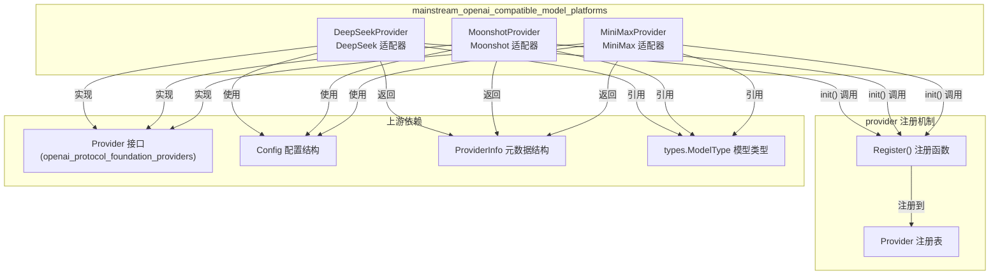

# mainstream_openai_compatible_model_platforms 模块技术文档

## 1. 模块概览

**为什么这个模块存在？**

在构建企业级 AI 应用时，我们需要接入多种主流的 AI 模型服务平台。虽然许多现代平台都声称 "OpenAI 兼容"，但实际上每个平台都有自己的细微差异：不同的默认 API 端点、配置验证规则、支持的模型类型等。如果每次添加新平台都要编写重复的适配器代码，不仅增加维护成本，还会导致代码库的不一致性。

`mainstream_openai_compatible_model_platforms` 模块的核心使命就是：**为那些本质上兼容 OpenAI 协议但又有自身特色的主流 AI 平台提供统一、轻量级的适配器层**。它让系统能够以一致的方式使用 DeepSeek、Moonshot（月之暗面）、MiniMax 等平台，同时尊重每个平台的独特配置需求。

想象一下这个模块就像是一个"万能插座转换器"：虽然不同国家的插座形状不同（DeepSeek、Moonshot、MiniMax），但通过转换器，你可以用同一个插头（我们的系统）连接到任何插座上。

## 2. 架构与核心组件

### 2.1 架构图



### 2.2 核心组件详解

本模块包含三个核心 Provider 实现，每个都针对特定的主流 AI 平台：

#### DeepSeekProvider
**职责**：为 DeepSeek 平台提供适配器。DeepSeek 是一个专注于推理能力的 AI 模型平台，以其 `deepseek-reasoner` 模型著称。

**核心特性**：
- 默认使用 DeepSeek 官方 API 端点 `https://api.deepseek.com/v1`
- 支持知识问答类型的模型
- 强制要求 API Key 和模型名称配置

#### MoonshotProvider
**职责**：为 Moonshot AI（月之暗面）平台提供适配器。Moonshot 以其 Kimi 系列模型闻名，特别支持长上下文和视觉理解。

**核心特性**：
- 默认使用 Moonshot 官方 API 端点 `https://api.moonshot.ai/v1`
- 同时支持知识问答和视觉语言模型（VLLM）
- 与其他 Provider 不同，它显式要求配置 BaseURL
- 支持 `kimi-k2-turbo-preview`、`moonshot-v1-8k-vision-preview` 等模型

#### MiniMaxProvider
**职责**：为 MiniMax 平台提供适配器。MiniMax 提供了国际版和国内版两个 API 端点，以适应不同地区的用户。

**核心特性**：
- 默认使用国内版 API 端点 `https://api.minimaxi.com/v1`
- 同时提供国际版端点 `https://api.minimax.io/v1` 供选择
- 支持知识问答类型的模型
- 支持 `MiniMax-M2.1`、`MiniMax-M2.1-lightning` 等模型

### 2.3 数据流向

当系统需要使用某个主流 OpenAI 兼容平台时，数据流向如下：

1. **初始化阶段**：各个 Provider 的 `init()` 函数自动调用 `Register()` 将自己注册到全局 Provider 注册表中
2. **配置阶段**：系统从用户输入或配置文件中读取 `Config` 结构
3. **验证阶段**：调用对应 Provider 的 `ValidateConfig()` 方法验证配置的完整性和正确性
4. **元数据获取**：通过 `Info()` 方法获取 Provider 的元数据（名称、支持的模型类型、默认 URL 等）
5. **实际调用**：基于验证后的配置，使用通用的 OpenAI 协议客户端进行 API 调用（这部分由上层的 `openai_protocol_foundation_providers` 模块处理）

## 3. 设计决策与权衡

### 3.1 选择轻量级适配器模式而非完整重写

**决策**：每个 Provider 只实现元数据提供和配置验证，而不重写完整的 API 调用逻辑。

**为什么这样选择？**
- **复用性**：这些平台本质上都兼容 OpenAI 协议，完整重写会导致大量重复代码
- **维护性**：OpenAI 协议的变更只需在基础层修改一次，所有适配器自动受益
- **关注点分离**：适配器只关心平台特定的配置和元数据，不关心底层通信细节

**权衡**：
- ✅ 优点：代码简洁、维护成本低、一致性高
- ❌ 缺点：对于协议兼容性较差的平台，可能需要在上层做更多适配

### 3.2 自动注册机制

**决策**：使用 `init()` 函数自动注册 Provider，而不是要求用户手动注册。

**为什么这样选择？**
- **易用性**：导入包即可使用，无需额外的注册步骤
- **避免遗漏**：不会因为忘记注册而导致 Provider 不可用
- **符合 Go 惯用法**：这是 Go 语言中常见的插件式设计模式

**权衡**：
- ✅ 优点：使用简单、不易出错
- ❌ 缺点：隐式注册可能让初学者感到困惑，不仔细看代码可能不知道注册发生在哪里

### 3.3 配置验证的差异化设计

**决策**：不同的 Provider 有不同的配置验证规则（例如 Moonshot 要求 BaseURL，而其他 Provider 不需要）。

**为什么这样选择？**
- **尊重平台差异**：每个平台确实有不同的配置要求
- **提前失败**：在配置阶段就捕获错误，而不是等到实际调用时才发现
- **灵活性**：不强制所有平台遵循相同的配置模式

**权衡**：
- ✅ 优点：配置更准确、错误更早发现
- ❌ 缺点：用户需要了解不同平台的配置要求，增加了学习成本

## 4. 子模块详解

本模块包含三个子模块，每个子模块对应一个具体的平台适配器：

### 4.1 deepseek_openai_compatible_provider_adapter
DeepSeek 平台的专用适配器，专注于支持其推理型模型。

[查看详细文档](model_providers_and_ai_backends-provider_catalog_and_configuration_contracts-openai_compatible_provider_catalog-mainstream_openai_compatible_model_platforms-deepseek_openai_compatible_provider_adapter.md)

### 4.2 moonshot_openai_compatible_provider_adapter
Moonshot AI（月之暗面）平台的专用适配器，特别支持其长上下文和视觉模型。

[查看详细文档](model_providers_and_ai_backends-provider_catalog_and_configuration_contracts-openai_compatible_provider_catalog-mainstream_openai_compatible_model_platforms-moonshot_openai_compatible_provider_adapter.md)

### 4.3 minimax_openai_compatible_provider_adapter
MiniMax 平台的专用适配器，支持国内和国际双端点配置。

[查看详细文档](model_providers_and_ai_backends-provider_catalog_and_configuration_contracts-openai_compatible_provider_catalog-mainstream_openai_compatible_model_platforms-minimax_openai_compatible_provider_adapter.md)

## 5. 跨模块依赖关系

### 5.1 上游依赖

本模块依赖于以下关键模块：

- **openai_protocol_foundation_providers**：提供了 Provider 接口的定义和基础实现，本模块的所有 Provider 都实现了该接口。
- **types**：提供了 `ModelType` 等核心类型定义，用于标识模型的用途类型。

### 5.2 下游依赖

以下模块依赖于本模块：

- **openai_compatible_provider_catalog**：作为父模块，它协调本模块与其他 OpenAI 兼容 Provider 模块的工作。
- **provider_catalog_and_configuration_contracts**：提供整体的 Provider 目录管理功能。

## 6. 使用指南与最佳实践

### 6.1 基本使用流程

1. **导入包**：确保导入了 `internal/models/provider` 包
2. **创建配置**：构建 `Config` 结构，设置必要的 API Key、模型名称等
3. **获取 Provider**：通过 Provider 名称从注册表中获取对应的 Provider 实例
4. **验证配置**：调用 `ValidateConfig()` 验证配置是否正确
5. **使用 Provider**：通过 `Info()` 获取元数据，然后进行实际的 API 调用

### 6.2 常见配置示例

#### DeepSeek 配置
```go
config := &provider.Config{
    APIKey:    "your-deepseek-api-key",
    ModelName: "deepseek-chat",
    // BaseURL 可选，不填则使用默认值
}
```

#### Moonshot 配置
```go
config := &provider.Config{
    BaseURL:   "https://api.moonshot.ai/v1", // 必填
    APIKey:    "your-moonshot-api-key",
    ModelName: "kimi-k2-turbo-preview",
}
```

#### MiniMax 配置
```go
config := &provider.Config{
    APIKey:    "your-minimax-api-key",
    ModelName: "MiniMax-M2.1",
    // 如需使用国际版，显式设置 BaseURL
    // BaseURL: "https://api.minimax.io/v1",
}
```

### 6.3 注意事项与陷阱

1. **Moonshot 的 BaseURL 要求**：与其他 Provider 不同，MoonshotProvider 显式要求配置 BaseURL，即使使用默认值也需要设置。这是一个设计选择，目的是让用户明确知道他们正在使用哪个端点。

2. **MiniMax 的双端点**：MiniMax 有国内和国际两个端点，默认使用国内版。如果你的部署环境在国外，记得显式设置国际版端点以获得更好的性能。

3. **模型名称的正确性**：虽然这些平台兼容 OpenAI 协议，但模型名称是平台特定的。确保使用每个平台支持的正确模型名称。

4. **错误处理**：配置验证会返回明确的错误信息，始终检查并妥善处理这些错误，不要忽略它们。

5. **扩展新 Provider**：如果你需要添加新的主流 OpenAI 兼容平台，只需遵循现有 Provider 的模式：创建一个实现了 Provider 接口的结构体，在 `init()` 中注册它，实现 `Info()` 和 `ValidateConfig()` 方法即可。
