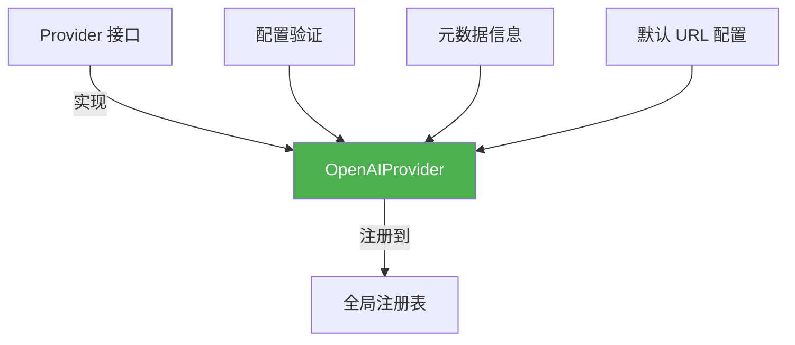

# openai_official_platform_provider 模块深度解析

## 1. 问题与解决方案

### 问题背景
在构建多厂商 AI 模型适配层时，OpenAI 官方平台是一个关键的基础设施提供商。系统需要统一的接口来与不同的 AI 服务提供商交互，但 OpenAI 作为事实上的行业标准，其 API 协议被广泛模仿，这就需要一个专门的实现来处理官方 OpenAI 平台的特性和要求。

### 解决方案
`openai_official_platform_provider` 模块通过实现 `Provider` 接口，为 OpenAI 官方平台提供了专门的适配层。这个模块不仅仅是简单的配置包装，它还定义了 OpenAI 作为行业基准的特性集，包括：
- 标准的 API 端点配置
- 支持多种模型类型（聊天、嵌入、重排序、视觉语言模型）
- 统一的配置验证机制
- 与 OpenAI 协议兼容的其他提供商的参考实现

## 2. 架构与 mental model

### 核心架构
这个模块位于 `provider` 包的 OpenAI 兼容提供商子目录中，其架构可以用以下 Mermaid 图表示：



### 设计模式与 mental model

将这个模块想象成一个**模型服务提供商的"名片和验证器"**：
- **名片功能**：通过 `Info()` 方法提供提供商的身份信息、支持的模型类型和默认端点
- **验证器功能**：通过 `ValidateConfig()` 方法确保配置符合 OpenAI 平台的要求
- **自注册机制**：在 `init()` 函数中自动将自己注册到全局注册表，实现插件式架构

## 3. 核心组件详解

### OpenAIProvider 结构体

**设计意图**：这是一个无状态的结构体，实现了 `Provider` 接口，专门用于 OpenAI 官方平台。选择无状态设计是因为：
1. 所有配置都通过参数传入，不需要实例级别的状态
2. 多个 goroutine 可以安全地共享同一个实例
3. 简化了生命周期管理

```go
type OpenAIProvider struct{}
```

### Info() 方法

**功能**：返回 OpenAI 提供商的元数据信息。

**设计细节**：
- 使用 `ProviderOpenAI` 作为唯一标识符
- 为所有支持的模型类型设置相同的默认 URL，因为 OpenAI 在同一个端点提供多种服务
- 标记 `RequiresAuth: true`，因为 OpenAI API 始终需要 API 密钥

**返回值**：
```go
ProviderInfo{
    Name:        ProviderOpenAI,
    DisplayName: "OpenAI",
    Description: "gpt-5.2, gpt-5-mini, etc.",
    DefaultURLs: map[types.ModelType]string{
        types.ModelTypeKnowledgeQA: OpenAIBaseURL,
        types.ModelTypeEmbedding:   OpenAIBaseURL,
        types.ModelTypeRerank:      OpenAIBaseURL,
        types.ModelTypeVLLM:        OpenAIBaseURL,
    },
    ModelTypes: []types.ModelType{
        types.ModelTypeKnowledgeQA,
        types.ModelTypeEmbedding,
        types.ModelTypeRerank,
        types.ModelTypeVLLM,
    },
    RequiresAuth: true,
}
```

### ValidateConfig() 方法

**功能**：验证 OpenAI 提供商的配置是否有效。

**验证规则**：
1. API 密钥必须非空（这是 OpenAI API 的强制要求）
2. 模型名称必须非空（需要明确指定要使用的模型）

**设计考量**：
- 不验证 BaseURL，因为用户可能使用代理或兼容 OpenAI 协议的其他端点
- 不验证 API 密钥的格式，因为 OpenAI 可能会更改密钥格式，而且我们无法在不调用 API 的情况下验证其有效性

**错误消息**：
- "API key is required for OpenAI provider"
- "model name is required"

### 初始化与自注册

```go
func init() {
    Register(&OpenAIProvider{})
}
```

**设计模式**：这是一个典型的 Go 语言自注册模式，确保在包被导入时自动注册提供商。这种设计的优势是：
- 模块化：添加新提供商只需导入相应包
- 去中心化：不需要在中心位置维护提供商列表
- 自动发现：系统可以动态发现所有可用的提供商

## 4. 数据流程

### 注册流程
1. 包导入时，`init()` 函数被调用
2. 创建 `OpenAIProvider` 实例
3. 调用 `Register()` 函数将实例添加到全局注册表
4. 注册表以 `ProviderName` 为键存储提供商实例

### 配置验证流程
```
调用方
  ↓
Get(ProviderOpenAI) 获取提供商实例
  ↓
provider.ValidateConfig(config)
  ↓
检查 APIKey 是否为空 → 错误返回
  ↓
检查 ModelName 是否为空 → 错误返回
  ↓
返回 nil（验证通过）
```

### 信息查询流程
1. 调用方通过 `Get(ProviderOpenAI)` 获取提供商实例
2. 调用 `Info()` 方法获取元数据
3. 使用 `ProviderInfo` 中的信息进行后续操作（如显示 UI、构建请求等）

## 5. 依赖关系

### 依赖的模块
- **provider 包**：提供基础接口、注册表和数据结构
- **types 包**：定义 `ModelType` 等核心类型

### 被依赖的模块
- **openai_protocol_generic_baseline_provider**：可能参考此实现
- **openrouter_openai_compatible_provider**：OpenRouter 作为 OpenAI 兼容提供商
- 其他 OpenAI 兼容提供商适配器

### 关键契约
1. **Provider 接口**：必须实现 `Info()` 和 `ValidateConfig()` 方法
2. **Config 结构体**：配置的标准格式
3. **ProviderInfo 结构体**：元数据的标准格式

## 6. 设计决策与权衡

### 1. 无状态设计 vs 有状态设计
**决策**：选择无状态设计
**理由**：
- 简化并发访问，无需锁
- 配置通过参数传递，更灵活
- 符合 Go 语言的惯用法

**权衡**：
- 优点：线程安全、内存占用小、易于测试
- 缺点：无法缓存状态（如果将来需要）

### 2. 严格验证 vs 宽松验证
**决策**：只验证必填字段，其他字段宽松处理
**理由**：
- API 密钥和模型名称是 OpenAI API 的最低要求
- BaseURL 可能被用户自定义（如使用代理）
- 避免过度限制用户的使用场景

**权衡**：
- 优点：灵活性高，支持各种使用场景
- 缺点：可能在后续阶段才发现配置错误

### 3. 集中注册 vs 分散注册
**决策**：使用自注册模式，在 `init()` 中注册
**理由**：
- 降低模块耦合度
- 添加新提供商只需导入包
- 符合插件架构的设计理念

**权衡**：
- 优点：模块化好，易于扩展
- 缺点：初始化顺序可能影响行为（虽然在这个模块中不是问题）

## 7. 使用指南与示例

### 基本使用

```go
// 获取 OpenAI 提供商
provider, ok := provider.Get(provider.ProviderOpenAI)
if !ok {
    // 处理错误
}

// 验证配置
config := &provider.Config{
    APIKey:    "sk-...",
    ModelName: "gpt-4",
}
if err := provider.ValidateConfig(config); err != nil {
    // 处理验证错误
}

// 获取提供商信息
info := provider.Info()
fmt.Println("提供商:", info.DisplayName)
fmt.Println("支持的模型类型:", info.ModelTypes)
```

### 从 Model 创建配置

```go
// 假设我们有一个 types.Model 实例
model := &types.Model{
    Name: "gpt-4",
    ID:   "model-123",
    Parameters: types.ModelParameters{
        Provider: string(provider.ProviderOpenAI),
        BaseURL:  "https://api.openai.com/v1",
        APIKey:   "sk-...",
    },
}

// 创建配置
config, err := provider.NewConfigFromModel(model)
if err != nil {
    // 处理错误
}

// 使用配置
```

## 8. 注意事项与边缘情况

### 常见陷阱
1. **忘记导入包**：由于使用自注册模式，如果不导入 `openai` 包，提供商将不会注册到注册表中
2. **API 密钥格式**：虽然不验证 API 密钥格式，但无效的密钥会导致 API 调用失败
3. **模型名称拼写**：模型名称必须精确匹配 OpenAI 的模型名称，否则会导致错误

### 扩展与自定义
- 如果需要支持 OpenAI 的额外配置字段，可以在 `ExtraFields` 中添加
- 对于自定义 OpenAI 兼容端点，考虑使用 `generic` 提供商而不是修改此实现
- 此模块作为 OpenAI 官方平台的参考实现，保持其简洁性很重要

### 测试提示
- 由于此模块无状态，测试非常简单
- 可以创建测试配置，验证 `ValidateConfig()` 的行为
- 不需要模拟外部服务，因为此模块不直接调用 API

## 9. 参考与相关模块

- [provider 基础模块](model_providers_and_ai_backends-provider_catalog_and_configuration_contracts.md)
- [openai_protocol_generic_baseline_provider](model_providers_and_ai_backends-provider_catalog_and_configuration_contracts-openai_compatible_provider_catalog-openai_protocol_foundation_providers-openai_protocol_generic_baseline_provider.md)
- [openrouter_openai_compatible_provider](model_providers_and_ai_backends-provider_catalog_and_configuration_contracts-openai_compatible_provider_catalog-openai_protocol_foundation_providers-openrouter_openai_compatible_provider.md)
