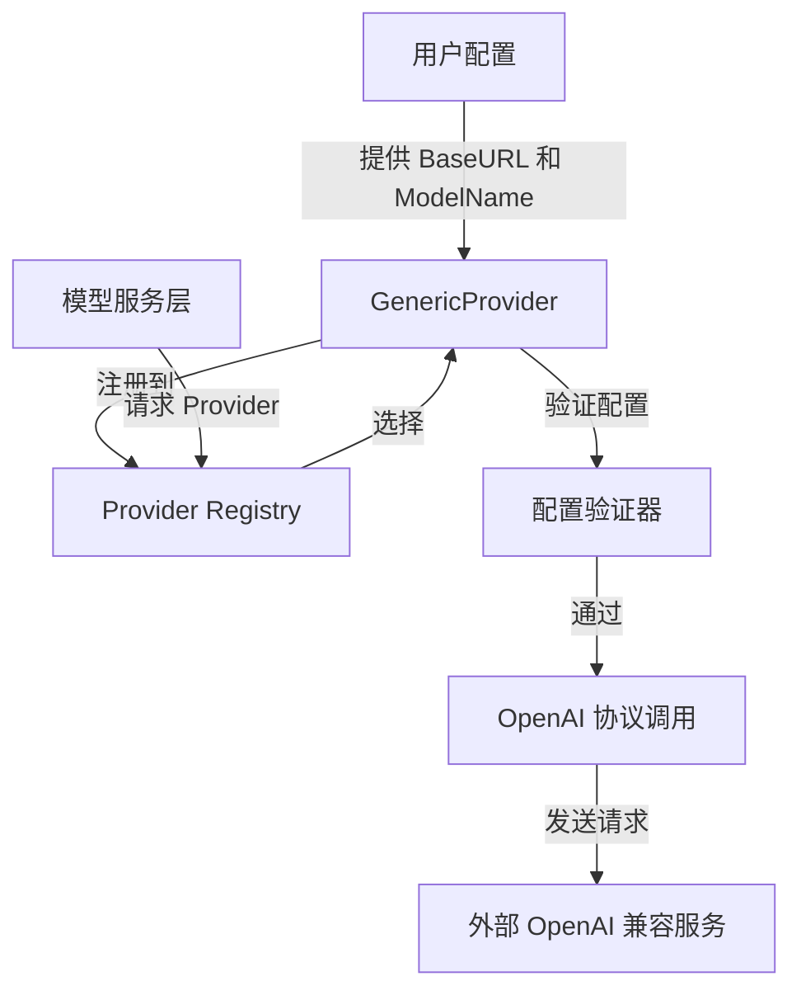

# OpenAI Protocol Generic Baseline Provider 模块深度解析

## 1. 问题背景与模块定位

在构建一个支持多种 AI 模型提供商的平台时，我们面临一个核心挑战：如何优雅地集成那些遵循 OpenAI API 协议但并非由 OpenAI 官方提供的模型服务？

想象一下，您的团队正在开发一个企业级 AI 应用平台，需要支持：
- 企业内部部署的自托管模型
- 新兴的第三方 AI 服务提供商
- 客户自定义的 OpenAI 兼容接口

一个简单的方案是为每个新提供商编写专用的适配器，但这会导致代码库膨胀，维护成本剧增。更糟糕的是，每次有新的兼容 OpenAI 协议的服务出现，都需要修改核心代码，违反了开闭原则。

这就是 `openai_protocol_generic_baseline_provider` 模块要解决的问题：它提供了一个**通用的 OpenAI 协议兼容提供商适配器**，让用户可以通过配置就能接入任何遵循 OpenAI API 协议的模型服务，而无需编写新代码。

## 2. 架构与数据流程

### 2.1 核心架构



### 2.2 模块角色

在整个系统中，`openai_protocol_generic_baseline_provider` 扮演着**基础适配器**的角色：

- **位于**：`model_providers_and_ai_backends/provider_catalog_and_configuration_contracts/openai_compatible_provider_catalog/openai_protocol_foundation_providers/`
- **依赖**：`provider_base_interfaces_and_config_contracts`（定义了 Provider 接口）
- **被依赖**：整个提供商生态系统，任何需要接入 OpenAI 兼容服务的地方都可以使用它

## 3. 核心组件深度解析

### 3.1 GenericProvider 结构体

```go
type GenericProvider struct{}
```

这是一个看似简单却设计巧妙的结构体。它没有任何字段，这意味着：
- 它是**无状态的**：所有状态都通过配置传递
- 它是**可重用的**：同一个实例可以服务多个不同的配置
- 它是**线程安全的**：没有共享状态，自然避免了并发问题

这种设计体现了一个重要的架构原则：**将状态与行为分离**。Provider 的行为是通用的，而状态（配置）则由外部管理。

### 3.2 init() 函数 - 自动注册机制

```go
func init() {
    Register(&GenericProvider{})
}
```

这是一个典型的 Go 语言惯用法：在包初始化时自动将 Provider 注册到全局注册表中。

**设计意图**：
- 遵循**插件模式**：新的 Provider 只需引入包即可自动注册
- 实现**开闭原则**：添加新 Provider 不需要修改注册表代码
- 支持**发现机制**：上层代码可以枚举所有可用的 Provider

这种设计让我想起了 Linux 的内核模块加载机制——模块自行声明自己的存在，内核负责管理和调度。

### 3.3 Info() 方法 - 元数据描述

```go
func (p *GenericProvider) Info() ProviderInfo {
    return ProviderInfo{
        Name:        ProviderGeneric,
        DisplayName: "自定义 (OpenAI兼容接口)",
        Description: "Generic API endpoint (OpenAI-compatible)",
        DefaultURLs: map[types.ModelType]string{}, // 需要用户自行配置填写
        ModelTypes: []types.ModelType{
            types.ModelTypeKnowledgeQA,
            types.ModelTypeEmbedding,
            types.ModelTypeRerank,
            types.ModelTypeVLLM,
        },
        RequiresAuth: false, // 可能需要也可能不需要
    }
}
```

这个方法返回 Provider 的元数据，其中有几个值得注意的设计决策：

1. **空的 DefaultURLs**：
   - 不是所有 Provider 都有默认 URL
   - 强制用户明确配置，避免假设带来的错误
   - 体现了"显式优于隐式"的设计哲学

2. **广泛的 ModelTypes 支持**：
   - 支持知识问答、嵌入、重排序、视觉语言模型
   - 尽可能覆盖常见场景，提高通用性
   - 但不做过度承诺，只支持明确验证过的类型

3. **RequiresAuth: false**：
   - 这是一个保守的默认值
   - 实际是否需要认证由用户的具体服务决定
   - 注释清楚说明了这一不确定性

### 3.4 ValidateConfig() 方法 - 配置验证

```go
func (p *GenericProvider) ValidateConfig(config *Config) error {
    if config.BaseURL == "" {
        return fmt.Errorf("base URL is required for generic provider")
    }
    if config.ModelName == "" {
        return fmt.Errorf("model name is required")
    }
    return nil
}
```

这是一个简洁但关键的验证逻辑。它只验证最核心的两个参数：

**设计意图分析**：
- **最小验证原则**：只验证必不可少的参数，给用户最大的灵活性
- **失败快速**：在配置阶段就发现问题，而不是等到实际调用时
- **清晰的错误信息**：明确指出缺少什么，帮助用户快速修复

为什么不验证更多参数？比如 API Key、超时设置等？因为：
1. 有些服务可能不需要 API Key（比如内部部署的无认证服务）
2. 超时等参数可能有合理的默认值
3. 过度验证会降低通用性，限制用户的使用场景

## 4. 依赖关系分析

### 4.1 依赖的模块

1. **provider_base_interfaces_and_config_contracts**：
   - 提供了 `Provider` 接口定义
   - 提供了 `ProviderInfo` 和 `Config` 结构体
   - 提供了 `Register()` 函数

2. **types** 包：
   - 提供了 `ModelType` 枚举
   - 定义了支持的模型类型

### 4.2 被依赖的模块

这个模块被整个提供商生态系统依赖，特别是：
- **openai_compatible_provider_catalog**：作为基础提供者
- **chat_completion_backends_and_streaming**：可能使用它来调用通用的 OpenAI 兼容服务
- **embedding_interfaces_batching_and_backends**：可能使用它来处理嵌入请求

### 4.3 数据契约

输入契约：
- `Config`：必须包含 `BaseURL` 和 `ModelName`
- 可选的其他配置项（根据具体服务需求）

输出契约：
- `ProviderInfo`：描述 Provider 的元数据
- 验证错误：如果配置不合法

## 5. 设计决策与权衡

### 5.1 无状态设计 vs 有状态设计

**选择**：无状态设计
- **优点**：线程安全、易于测试、可重用性高
- **缺点**：每次调用都需要传递完整配置，可能有轻微的性能开销
- **为什么这样选**：在这个场景下，配置的传递成本很低，而无状态带来的好处是巨大的

### 5.2 最小验证 vs 全面验证

**选择**：最小验证
- **优点**：灵活性高，适用范围广
- **缺点**：可能在运行时才发现某些配置问题
- **为什么这样选**：作为通用适配器，我们无法预知所有可能的配置需求，最小验证是最安全的选择

### 5.3 空的 DefaultURLs vs 提供示例 URL

**选择**：空的 DefaultURLs
- **优点**：强制用户明确配置，避免误用
- **缺点**：初次使用时可能不够直观
- **为什么这样选**：示例 URL 可能会误导用户，让他们以为可以直接使用，而实际上每个用户的服务 URL 都是不同的

### 5.4 RequiresAuth: false vs true

**选择**：false
- **优点**：保守的默认值，不会因为缺少认证信息而失败
- **缺点**：如果服务需要认证，用户需要额外配置
- **为什么这样选**：在不确定的情况下，选择最宽松的默认值，然后让用户根据需要收紧

## 6. 使用指南与最佳实践

### 6.1 基本使用

```go
// 1. 配置 GenericProvider
config := &provider.Config{
    BaseURL:   "https://your-custom-openai-compatible-service.com/v1",
    ModelName: "your-model-name",
    // 可选的其他配置
    APIKey: "your-api-key-if-needed",
}

// 2. 验证配置
genericProvider := &provider.GenericProvider{}
if err := genericProvider.ValidateConfig(config); err != nil {
    log.Fatalf("Invalid config: %v", err)
}

// 3. 使用配置调用服务（通过上层封装）
// ...
```

### 6.2 配置最佳实践

1. **始终提供明确的 BaseURL**：不要依赖任何默认值
2. **ModelName 要准确**：不同的服务可能有不同的命名约定
3. **根据需要配置认证**：即使 RequiresAuth 是 false，你的服务可能需要
4. **考虑超时设置**：通用适配器不验证超时，但你可能需要配置它

### 6.3 扩展点

虽然 GenericProvider 本身是通用的，但你可以通过以下方式扩展它：

1. **创建特定的 Provider 包装 GenericProvider**：
   - 例如，为某个知名的 OpenAI 兼容服务创建专用 Provider
   - 内部仍然使用 GenericProvider 的逻辑，但提供更好的默认值和验证

2. **自定义配置验证**：
   - 在 GenericProvider 的验证基础上，添加你自己的验证逻辑

3. **提供默认配置**：
   - 对于常用的服务，可以预配置好 BaseURL 和 ModelName

## 7. 边界情况与注意事项

### 7.1 常见陷阱

1. **忘记配置 BaseURL**：这是最常见的错误，验证会捕获它
2. **ModelName 拼写错误**：验证不会检查 ModelName 是否存在于远程服务中
3. **HTTPS vs HTTP**：确保你的 URL 协议正确，特别是对于内部服务
4. **API Key 位置**：不同的服务可能期望 API Key 在不同的位置（Header、Query 等）

### 7.2 已知限制

1. **不支持非标准的 OpenAI 协议扩展**：如果你的服务有自定义的扩展，GenericProvider 可能无法处理
2. **不验证远程服务的可用性**：配置验证只检查本地配置，不尝试连接远程服务
3. **不处理服务特定的错误码**：错误处理完全依赖于上层调用者

### 7.3 调试技巧

1. **启用详细日志**：查看实际发送到远程服务的请求
2. **使用 curl 测试**：先确认你的服务可以通过 curl 正常工作
3. **检查网络连接**：确保你的应用可以访问远程服务
4. **验证 API Key**：确认你的 API Key 有效且有足够的权限

## 8. 总结

`openai_protocol_generic_baseline_provider` 模块是一个精心设计的通用适配器，它解决了如何优雅地集成任意 OpenAI 兼容服务的问题。

它的核心设计理念是：
- **无状态**：简单、安全、可重用
- **最小验证**：灵活、通用、不限制用户
- **自动注册**：易于集成、遵循插件模式
- **明确配置**：显式优于隐式，避免假设

这个模块虽然代码量不大，但它体现了很多优秀的软件设计原则。它是整个提供商生态系统的基石，让平台可以轻松支持各种 OpenAI 兼容的模型服务，而无需为每个服务编写专门的代码。

对于新加入团队的开发者来说，理解这个模块的设计思想，将有助于你更好地理解整个提供商系统的架构，以及如何在自己的代码中应用类似的设计原则。
