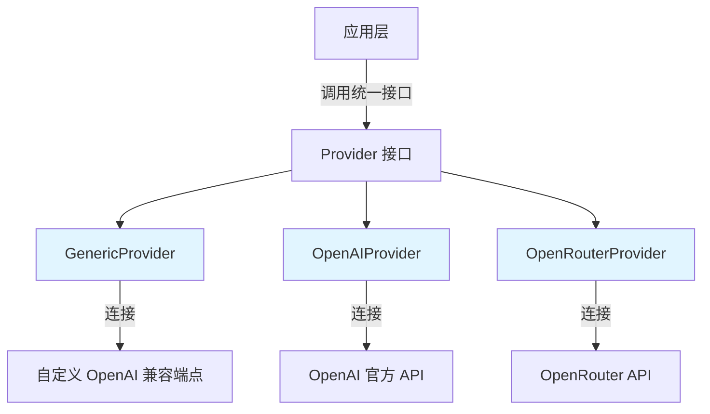

# OpenAI 协议基础提供者模块

## 概述

`openai_protocol_foundation_providers` 模块是一个适配器层，它将不同的 OpenAI 兼容模型服务（包括 OpenAI 官方、OpenRouter 和通用自定义端点）统一到一个一致的接口下。

想象一下这个模块就像一个**万能插座适配器**——不管你去哪个国家（使用哪个 OpenAI 兼容服务），你只需要带这个适配器，就能把你的设备（我们的应用）插到任何插座上（不同的 API 端点）。

## 架构概览



### 核心组件角色

- **GenericProvider**：通用适配器，用于用户自定义的 OpenAI 兼容端点
- **OpenAIProvider**：OpenAI 官方服务的专用适配器
- **OpenRouterProvider**：OpenRouter 模型聚合平台的适配器

每个提供者都实现了相同的接口，提供：
1. 元数据信息（名称、描述、支持的模型类型等）
2. 配置验证逻辑

## 设计决策分析

### 1. 提供者注册模式

**设计选择**：使用 `init()` 函数自动注册提供者到全局注册表

```go
func init() {
    Register(&GenericProvider{})
}
```

**为什么这样设计**：
- ✅ **自动发现**：新提供者只需实现接口并添加 `init()` 即可自动注册
- ✅ **解耦**：应用层不需要知道具体提供者的存在
- ⚠️ **隐式依赖**：注册发生在包初始化时，可能使依赖关系不那么明显

**替代方案考虑**：
- 显式手动注册：更清晰但更繁琐
- 使用依赖注入容器：更灵活但增加了复杂度

### 2. 配置验证分离

**设计选择**：每个提供者实现自己的 `ValidateConfig` 方法

```go
func (p *OpenAIProvider) ValidateConfig(config *Config) error {
    if config.APIKey == "" {
        return fmt.Errorf("API key is required for OpenAI provider")
    }
    // ...
}
```

**为什么这样设计**：
- ✅ **单一职责**：每个提供者知道自己需要什么配置
- ✅ **可扩展性**：新提供者可以定义自己的验证规则
- ✅ **类型安全**：验证逻辑与提供者实现紧耦合，减少配置错误

### 3. 模型类型支持的灵活性

**设计选择**：通过 `ModelTypes` 字段声明支持的模型类型，而不是硬编码

**为什么这样设计**：
- OpenAI 支持所有类型（QA、Embedding、Rerank、VLLM）
- OpenRouter 只支持 QA 和 VLLM
- GenericProvider 理论上支持所有类型，但取决于用户配置的端点

## 数据流程

当应用需要使用某个模型服务时，数据流如下：

1. **提供者发现**：应用从注册表中查找合适的提供者
2. **配置验证**：调用提供者的 `ValidateConfig` 检查配置是否完整
3. **元数据获取**：通过 `Info()` 获取提供者的显示名称、描述等信息
4. **实际调用**：（在其他模块中实现）使用配置好的端点进行 API 调用

## 使用指南

### 添加新的 OpenAI 兼容提供者

如果你需要添加一个新的 OpenAI 兼容服务提供者，只需：

1. 创建一个新的结构体，实现 `Provider` 接口
2. 在 `init()` 中调用 `Register()` 注册
3. 实现 `Info()` 方法返回元数据
4. 实现 `ValidateConfig()` 方法验证配置

### 配置示例

**OpenAI 官方服务**：
```go
config := &Config{
    Provider:  ProviderOpenAI,
    APIKey:    "sk-...",
    ModelName: "gpt-5.2",
}
```

**OpenRouter**：
```go
config := &Config{
    Provider:  ProviderOpenRouter,
    APIKey:    "sk-or-...",
    ModelName: "openai/gpt-5.2-chat",
}
```

**自定义端点**：
```go
config := &Config{
    Provider:  ProviderGeneric,
    BaseURL:   "https://your-custom-endpoint.com/v1",
    ModelName: "your-model-name",
    APIKey:    "optional-api-key",
}
```

## 注意事项和陷阱

1. **GenericProvider 的 BaseURL 必须配置**：不同于其他提供者，GenericProvider 没有默认 URL，必须显式配置
2. **OpenRouter 不支持 Embedding**：在 `Info()` 中已经声明了支持的模型类型，使用时注意检查
3. **API Key 的处理**：虽然 GenericProvider 标记为 `RequiresAuth: false`，但很多自定义端点仍需要 API Key
4. **模型名称格式**：不同服务的模型名称格式不同（OpenRouter 使用 `provider/model-name` 格式）

## 子模块

这个模块包含以下子模块，每个都有更详细的文档：

- [OpenAI 协议通用基准提供者](model_providers_and_ai_backends-provider_catalog_and_configuration_contracts-openai_compatible_provider_catalog-openai_protocol_foundation_providers-openai_protocol_generic_baseline_provider.md)
- [OpenAI 官方平台提供者](model_providers_and_ai_backends-provider_catalog_and_configuration_contracts-openai_compatible_provider_catalog-openai_protocol_foundation_providers-openai_official_platform_provider.md)
- [OpenRouter OpenAI 兼容提供者](model_providers_and_ai_backends-provider_catalog_and_configuration_contracts-openai_compatible_provider_catalog-openai_protocol_foundation_providers-openrouter_openai_compatible_provider.md)

## 与其他模块的关系

- **依赖**：这个模块依赖于 `internal/types` 模块中的 `ModelType` 定义
- **被依赖**：这个模块被上层的提供者目录和配置契约模块使用，为更具体的提供者实现提供基础
