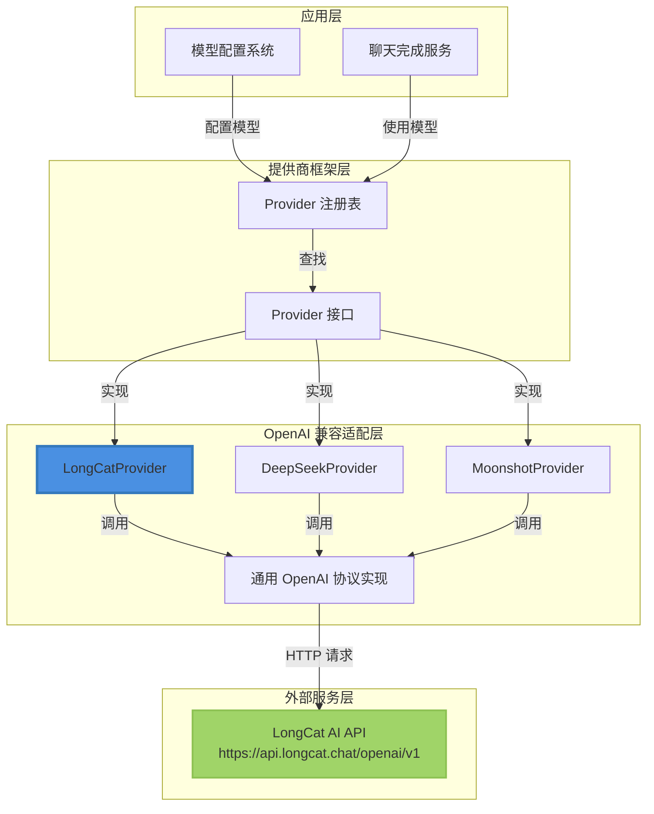

# LongCat OpenAI 兼容提供程序适配器技术深度解析

## 1. 问题与目标

### 1.1 问题空间

在构建多模型支持的 AI 系统时，我们面临一个常见挑战：不同的 AI 服务提供商虽然在底层技术实现上差异很大，但越来越多的提供商选择兼容 OpenAI 的 API 协议作为标准接口。然而，尽管遵循相同的协议，这些提供商仍有各自独特的特征——如特定的 API 端点、认证要求、模型命名约定和使用场景。

`longcat_openai_compatible_provider_adapter` 模块正是为了解决这一问题而设计的，它专门为美团的 LongCat AI 服务提供标准化的集成方式。

### 1.2 为什么需要专用适配器？

你可能会问：既然有了通用的 OpenAI 兼容适配器，为什么还需要为 LongCat 单独实现一个？

原因有三：
1. **默认配置自动化** - LongCat 有固定的 API 端点和特定的使用场景，专用适配器可以提供开箱即用的默认配置
2. **供应商自动检测** - 通过 URL 模式匹配，系统能自动识别并使用 LongCat 提供商，无需用户手动配置
3. **品牌和用户体验** - 为用户提供明确的供应商标识和描述，而不是将其隐藏在“通用”适配器下

## 2. 架构与心智模型

### 2.1 心智模型

可以把这个模块想象成一个**电源插头适配器**。电源插座是系统的通用 `Provider` 接口，不同国家的插头是各个 AI 提供商，而这个适配器就是让 LongCat 的插头能完美插入通用插座的转换器。

更具体地说：
- **系统** 是一个支持多种插头（提供商）的多功能插座板
- **`Provider` 接口** 是标准化的插座形状
- **`LongCatProvider`** 是一个转换器，将 LongCat 的特殊规格转换为标准形状

### 2.2 架构位置

这个模块位于 `model_providers_and_ai_backends` 架构层次中，具体来说是：
- **上层**：通过 [provider 注册表](model_providers_and_ai_backends-provider_catalog_and_configuration_contracts.md) 被系统发现和使用
- **同层**：与其他 OpenAI 兼容提供商适配器并列，如 [DeepSeek](model_providers_and_ai_backends-provider_catalog_and_configuration_contracts-openai_compatible_provider_catalog-mainstream_openai_compatible_model_platforms-deepseek_openai_compatible_provider_adapter.md)、[Moonshot](model_providers_and_ai_backends-provider_catalog_and_configuration_contracts-openai_compatible_provider_catalog-mainstream_openai_compatible_model_platforms-moonshot_openai_compatible_provider_adapter.md) 等
- **底层**：依赖通用的 OpenAI 协议实现来处理实际的 API 通信

### 2.3 架构图



这个架构图展示了 LongCatProvider 在整个系统中的位置。可以看到：

1. **调用流程**：应用层通过注册表找到 Provider，然后通过通用的 OpenAI 协议实现与外部服务通信
2. **统一接口**：所有提供商都实现相同的 Provider 接口，使应用层可以统一处理
3. **协议共享**：LongCatProvider 与其他 OpenAI 兼容提供商共享底层的协议实现


## 3. 核心组件深度解析

### 3.1 LongCatProvider 结构体

`LongCatProvider` 是一个极简的结构体，它本身不保存任何状态：

```go
type LongCatProvider struct{}
```

**设计意图**：这种无状态设计是有意为之的。提供商适配器只需提供元数据和验证逻辑，不需要维护运行时状态，这样的设计使得它可以安全地在多个 goroutine 间共享。

### 3.2 关键常量

```go
const (
    LongCatBaseURL = "https://api.longcat.chat/openai/v1"
)
```

这个常量定义了 LongCat AI 服务的默认 API 端点。注意它遵循 OpenAI 路径约定 `/openai/v1`，这进一步确认了它的 OpenAI 兼容性。

### 3.3 自动注册机制

```go
func init() {
    Register(&LongCatProvider{})
}
```

**工作原理**：Go 的 `init()` 函数在包被导入时自动执行。这意味着只要这个包被引入到程序中，`LongCatProvider` 就会自动注册到全局提供商注册表中，无需额外的初始化代码。

**设计权衡**：
- **优点**：使用简单，无需手动注册，符合"即插即用"的理念
- **缺点**：增加了隐式依赖，导入这个包会产生副作用（修改全局注册表）

### 3.4 Info() 方法 - 提供商元数据

```go
func (p *LongCatProvider) Info() ProviderInfo {
    return ProviderInfo{
        Name:        ProviderLongCat,
        DisplayName: "LongCat AI",
        Description: "LongCat-Flash-Chat, LongCat-Flash-Thinking, etc.",
        DefaultURLs: map[types.ModelType]string{
            types.ModelTypeKnowledgeQA: LongCatBaseURL,
        },
        ModelTypes: []types.ModelType{
            types.ModelTypeKnowledgeQA,
        },
        RequiresAuth: true,
    }
}
```

这个方法返回提供商的完整元数据。让我们逐一分析关键字段：

- **Name**: 使用 `ProviderLongCat` 常量作为唯一标识符
- **DefaultURLs**: 仅为 `ModelTypeKnowledgeQA` 类型配置了默认 URL，这表明 LongCat 主要用于知识问答场景
- **ModelTypes**: 明确声明只支持 `KnowledgeQA` 类型的模型
- **RequiresAuth**: 标记为需要认证，意味着必须提供 API key

**设计意图**：通过明确限制支持的模型类型，我们避免了用户尝试将 LongCat 用于不适合的场景（如嵌入），提供了更好的错误预防和用户体验。

### 3.5 ValidateConfig() 方法 - 配置验证

```go
func (p *LongCatProvider) ValidateConfig(config *Config) error {
    if config.BaseURL == "" {
        return fmt.Errorf("base URL is required for LongCat provider")
    }
    if config.APIKey == "" {
        return fmt.Errorf("API key is required for LongCat provider")
    }
    if config.ModelName == "" {
        return fmt.Errorf("model name is required")
    }
    return nil
}
```

这个方法执行三项基本验证：
1. BaseURL 不能为空（虽然有默认值，但用户可能会覆盖）
2. APIKey 不能为空
3. ModelName 不能为空

**设计决策**：注意这里没有验证 BaseURL 的格式或 APIKey 的有效性，只是检查它们是否存在。这种"浅层验证"是有意的：
- 更深层次的验证（如 APIKey 是否真的有效）需要网络请求，不适合在这个阶段进行
- 格式验证通常由更底层的 HTTP 客户端处理

## 4. 数据流程与集成

### 4.1 提供商发现与选择流程

LongCatProvider 通过两条主要路径被系统发现和使用：

1. **显式选择**：用户在配置中明确指定 `provider: "longcat"`
2. **自动检测**：系统通过 `DetectProvider()` 函数检测到 URL 包含 "longcat.chat" 时自动选择

### 4.2 典型数据流程

当系统需要使用 LongCat AI 时，数据流程如下：

1. **配置加载**：系统从数据库或配置文件加载模型配置
2. **提供商识别**：
   - 如果配置中指定了提供商名称，直接通过 `Get(ProviderLongCat)` 获取
   - 否则，通过 `DetectProvider()` 检查 BaseURL 是否匹配
3. **配置验证**：调用 `ValidateConfig()` 确保必要的参数都存在
4. **元数据获取**：调用 `Info()` 获取显示名称、描述等元数据
5. **实际调用**：使用验证后的配置进行 API 调用（这部分由更底层的 OpenAI 兼容实现处理）

## 5. 设计决策与权衡

### 5.1 无状态设计 vs 有状态设计

**选择**：无状态设计

**原因**：
- 提供商适配器本质上是策略对象，不需要维护状态
- 无状态使得对象可以安全地并发使用
- 简化了生命周期管理，不需要初始化和清理

**替代方案**：如果需要缓存某些提供商特定数据，可以考虑使用有状态设计，但会增加复杂性。

### 5.2 最小接口 vs 丰富接口

**选择**：最小接口（仅 `Info()` 和 `ValidateConfig()`）

**原因**：
- 遵循接口隔离原则，只定义必要的方法
- 不同提供商的差异主要在元数据和配置验证上，实际的 API 调用逻辑可以共享
- 保持了接口的稳定性，未来扩展更容易

### 5.3 注册表模式的使用

**选择**：使用全局注册表和自动注册

**原因**：
- 使得添加新提供商非常简单，只需实现接口并调用 `Register()`
- 支持运行时动态发现可用的提供商
- 解耦了提供商的实现和使用

**权衡**：
- 引入了全局状态，增加了测试的复杂性（需要注意注册表的清理）
- 初始化顺序变得重要（必须在使用前导入提供商包）

## 6. 使用指南与常见模式

### 6.1 基本配置示例

```go
config := &provider.Config{
    Provider:  provider.ProviderLongCat,
    BaseURL:   provider.LongCatBaseURL, // 或使用自定义端点
    APIKey:    "your-api-key-here",
    ModelName: "LongCat-Flash-Chat",
}
```

### 6.2 自动检测使用

只需设置正确的 BaseURL，系统会自动识别：

```go
config := &provider.Config{
    BaseURL:   "https://api.longcat.chat/openai/v1",
    APIKey:    "your-api-key-here",
    ModelName: "LongCat-Flash-Chat",
}
// 系统会自动检测这是 LongCat 提供商
```

### 6.3 验证配置

```go
longcatProvider, _ := provider.Get(provider.ProviderLongCat)
if err := longcatProvider.ValidateConfig(config); err != nil {
    log.Fatalf("配置无效: %v", err)
}
```

## 7. 边缘情况与注意事项

### 7.1 常见陷阱

1. **忘记导入包**：由于使用了 `init()` 自动注册，如果代码中没有导入这个包，提供商将不会出现在注册表中。
   
   **解决方法**：确保在主程序或初始化代码中导入 `_ "github.com/Tencent/WeKnora/internal/models/provider"`。

2. **模型名称错误**：`ValidateConfig()` 只检查模型名称是否存在，不验证它是否是 LongCat 支持的实际模型。
   
   **解决方法**：参考 LongCat AI 的官方文档，使用正确的模型名称，如 "LongCat-Flash-Chat" 或 "LongCat-Flash-Thinking"。

3. **BaseURL 路径错误**：确保包含完整路径 `/openai/v1`，不要只使用域名。

### 7.2 限制条件

- 当前只支持 `ModelTypeKnowledgeQA`，不支持嵌入或重排序模型
- 没有提供自定义超时或重试策略的机制，这些需要在更底层配置
- 不支持 LongCat 特有的非标准 API 扩展

## 8. 扩展与演进

如果未来需要扩展此适配器，可以考虑以下方向：

1. **支持更多模型类型**：如果 LongCat 开始提供嵌入模型，可以在 `ModelTypes` 和 `DefaultURLs` 中添加相应支持。

2. **添加额外配置字段**：通过 `ExtraFields` 添加提供商特定的配置选项，如推理参数的默认值。

3. **增强验证**：添加更复杂的配置验证逻辑，如模型名称的格式检查或 BaseURL 的模式匹配。

## 9. 相关模块

- [provider 核心接口与注册表](model_providers_and_ai_backends-provider_catalog_and_configuration_contracts.md) - 了解完整的提供商框架
- [OpenAI 协议基础提供商](model_providers_and_ai_backends-provider_catalog_and_configuration_contracts-openai_compatible_provider_catalog-openai_protocol_foundation_providers.md) - 了解底层的 OpenAI 协议实现
- [其他专业 OpenAI 兼容提供商](model_providers_and_ai_backends-provider_catalog_and_configuration_contracts-openai_compatible_provider_catalog-specialized_openai_compatible_provider_adapters.md) - 对比其他类似适配器的实现
