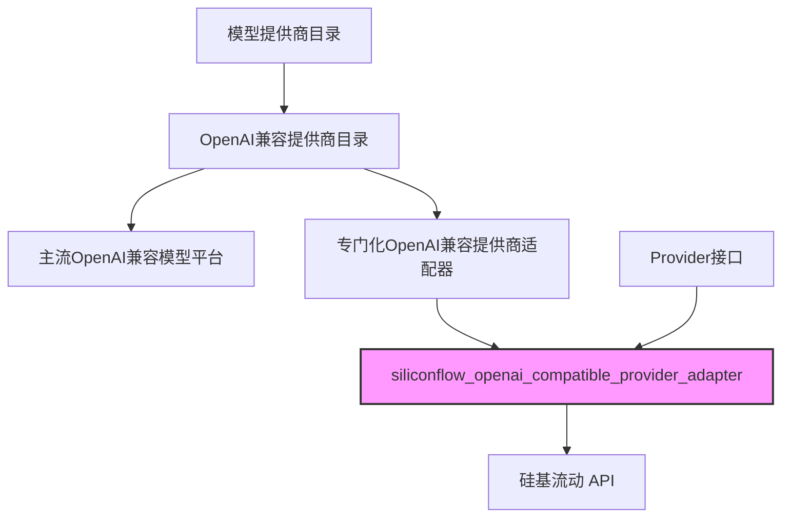
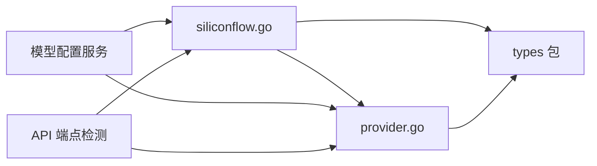

# siliconflow_openai_compatible_provider_adapter 模块技术深潜

## 1. 为什么这个模块存在？

### 问题空间

在构建多模型提供商集成系统时，我们面临一个核心挑战：不同的 AI 模型服务平台虽然都宣称"兼容 OpenAI 协议"，但实际上各自都有细微的差异。这些差异包括：

- 认证要求不同
- API 端点的默认 URL 不同
- 支持的模型类型和功能略有区别
- 配置验证的严格程度不同

如果没有专门的适配器层，我们的代码就会变得混乱不堪——到处是 `if provider == "siliconflow" { ... } else if provider == "..." { ... }` 这样的条件判断，难以维护和扩展。

### 解决方案设计思想

`siliconflow_openai_compatible_provider_adapter` 模块正是为了解决这个问题而设计的。它通过提供一个专门针对**硅基流动 SiliconFlow** 平台的适配器，将该平台的所有特定行为（默认 URL、支持的模型类型、认证要求等）封装在一个独立的组件中。

这种设计遵循了**开闭原则**（Open/Closed Principle）——对扩展开放，对修改关闭。当我们需要支持新的模型平台时，只需添加新的适配器，而不需要修改现有代码。

## 2. 核心架构

### 模块在系统中的位置



## 3. 核心组件分析

### SiliconFlowProvider 结构体

`SiliconFlowProvider` 是这个模块的核心组件，它实现了 `Provider` 接口，专门用于与硅基流动平台交互。

```go
// SiliconFlowProvider 实现硅基流动的 Provider 接口
type SiliconFlowProvider struct{}
```

**设计理念**：这个结构体是空的，不包含任何状态。这是一个有意的设计选择，因为：
- 提供商适配器本质上是无状态的——它们只提供元数据和配置验证功能
- 实际的 API 调用和状态管理在更高层次的组件中处理
- 无状态设计使得适配器可以安全地在多个 goroutine 中共享使用

### Info() 方法

```go
func (p *SiliconFlowProvider) Info() ProviderInfo {
    return ProviderInfo{
        Name:        ProviderSiliconFlow,
        DisplayName: "硅基流动 SiliconFlow",
        Description: "deepseek-ai/DeepSeek-V3.1, etc.",
        DefaultURLs: map[types.ModelType]string{
            types.ModelTypeKnowledgeQA: SiliconFlowBaseURL,
            types.ModelTypeEmbedding:   SiliconFlowBaseURL,
            types.ModelTypeRerank:      SiliconFlowBaseURL,
            types.ModelTypeVLLM:        SiliconFlowBaseURL,
        },
        ModelTypes: []types.ModelType{
            types.ModelTypeKnowledgeQA,
            types.ModelTypeEmbedding,
            types.ModelTypeRerank,
            types.ModelTypeVLLM,
        },
        RequiresAuth: true,
    }
}
```

**核心功能**：返回硅基流动提供商的元数据信息。

**设计细节**：
1. **统一的 BaseURL**：硅基流动平台的所有模型类型（知识问答、嵌入、重排序、VLLM）都使用相同的基础 URL `https://api.siliconflow.cn/v1`，这简化了配置
2. **全面的模型类型支持**：该平台支持系统中的所有 4 种模型类型，这是一个相当全面的支持范围
3. **强制认证**：`RequiresAuth: true` 表示所有 API 调用都必须提供 API 密钥

### ValidateConfig() 方法

```go
func (p *SiliconFlowProvider) ValidateConfig(config *Config) error {
    if config.APIKey == "" {
        return fmt.Errorf("API key is required for SiliconFlow provider")
    }
    return nil
}
```

**核心功能**：验证硅基流动提供商的配置是否有效。

**设计意图**：
- 只验证 API 密钥是否存在，因为这是硅基流动平台的唯一强制要求
- 不验证 BaseURL，因为用户可能会使用自定义的代理或内网部署
- 不验证 ModelName，因为模型名称可能会随时间变化，而且验证会增加维护成本

### 初始化和注册

```go
func init() {
    Register(&SiliconFlowProvider{})
}
```

**设计模式**：这是 Go 语言中常见的**自注册模式**。通过在 `init()` 函数中注册提供者，我们确保：
1. 只要导入了这个包，提供者就会自动注册到全局注册表中
2. 不需要在其他地方显式初始化和注册
3. 提供者的注册与其定义保持在同一个地方，提高了内聚性

## 4. 依赖关系与数据流

### 依赖关系图



### 关键数据流程

1. **系统启动时**：
   - 包被导入 → `init()` 函数执行 → `SiliconFlowProvider` 实例注册到全局注册表

2. **模型配置时**：
   - 系统需要获取硅基流动的元数据 → 调用 `Get(ProviderSiliconFlow)` → 获取 `SiliconFlowProvider` 实例 → 调用 `Info()` 方法

3. **配置验证时**：
   - 用户配置硅基流动模型 → 系统调用 `ValidateConfig(config)` → 检查 API 密钥是否存在

4. **URL 检测时**：
   - 用户只提供了 BaseURL → 系统调用 `DetectProvider(baseURL)` → 检测到包含 "siliconflow.cn" → 返回 `ProviderSiliconFlow`

## 5. 设计决策与权衡

### 1. 无状态设计 vs 有状态设计

**决策**：选择无状态设计

**理由**：
- 简化了并发使用，不需要考虑锁和同步
- 减少了内存占用，因为只需要一个实例
- 符合单一职责原则——适配器只负责提供元数据和验证配置，不负责执行 API 调用

**权衡**：
- 如果将来需要在适配器中缓存某些数据，就需要修改设计
- 所有上下文信息都必须通过参数传递，不能存储在结构体中

### 2. 严格验证 vs 宽松验证

**决策**：选择宽松验证，只验证 API 密钥

**理由**：
- 硅基流动平台可能会添加新的模型，宽松验证可以适应这种变化
- 用户可能使用自定义的 BaseURL（如代理或内网部署）
- 过早的验证会导致维护成本增加

**权衡**：
- 某些配置错误可能在实际调用 API 时才会被发现，而不是在配置时
- 可能需要更详细的错误处理和日志记录

### 3. 统一 BaseURL vs 分离 BaseURL

**决策**：选择统一 BaseURL

**理由**：
- 硅基流动平台实际上对所有模型类型使用相同的端点
- 简化了用户配置，不需要为不同类型配置不同的 URL
- 减少了出错的可能性

**权衡**：
- 如果硅基流动将来为不同模型类型使用不同的端点，就需要修改这个设计
- 失去了一定的灵活性

## 6. 使用指南与常见模式

### 基本使用

```go
// 获取硅基流动提供商
provider, ok := provider.Get(provider.ProviderSiliconFlow)
if !ok {
    // 处理错误
}

// 获取元数据
info := provider.Info()
fmt.Println("提供商名称:", info.DisplayName)
fmt.Println("支持的模型类型:", info.ModelTypes)

// 验证配置
config := &provider.Config{
    APIKey: "your-api-key",
    BaseURL: "https://api.siliconflow.cn/v1",
}
if err := provider.ValidateConfig(config); err != nil {
    // 处理验证错误
}
```

### 通过 URL 自动检测

```go
// 只提供 URL，让系统自动检测提供商
baseURL := "https://api.siliconflow.cn/v1/chat/completions"
providerName := provider.DetectProvider(baseURL)
if providerName == provider.ProviderSiliconFlow {
    fmt.Println("检测到硅基流动提供商")
}
```

## 7. 边缘情况与注意事项

### 1. API 密钥格式

**注意**：适配器只验证 API 密钥是否存在，不验证其格式是否正确。硅基流动的 API 密钥通常有特定的格式，但适配器不进行这种验证。

**原因**：API 密钥格式可能会变化，验证格式会增加维护成本。

**建议**：在实际调用 API 时，准备好处理认证错误。

### 2. 自定义 BaseURL

**注意**：适配器允许用户使用自定义的 BaseURL，这可能是代理、内网部署或其他兼容的服务。

**建议**：确保自定义的 BaseURL 确实兼容 OpenAI 协议，否则可能会在运行时出现错误。

### 3. 模型类型支持

**注意**：虽然适配器声称支持所有 4 种模型类型，但硅基流动平台可能不会在所有时间都支持所有类型的模型。

**建议**：在实际使用前，检查硅基流动平台的文档，确认所需的模型类型是否可用。

### 4. 并发安全性

**保证**：`SiliconFlowProvider` 是完全并发安全的，可以在多个 goroutine 中同时使用。

**原因**：它是无状态的，不包含任何可变数据。

## 8. 扩展与维护

### 如何添加新的模型类型

如果硅基流动平台添加了新的模型类型，需要进行以下修改：

1. 在 `internal/types/model.go` 中添加新的 `ModelType` 常量（如果尚未存在）
2. 在 `SiliconFlowProvider.Info()` 方法的 `DefaultURLs` 映射中添加新类型的 URL
3. 在 `ModelTypes` 切片中添加新类型

### 如何修改验证逻辑

如果需要更严格或更宽松的配置验证，只需修改 `ValidateConfig()` 方法：

```go
func (p *SiliconFlowProvider) ValidateConfig(config *Config) error {
    if config.APIKey == "" {
        return fmt.Errorf("API key is required for SiliconFlow provider")
    }
    // 添加新的验证逻辑
    if !strings.HasPrefix(config.APIKey, "sk-") {
        return fmt.Errorf("invalid API key format for SiliconFlow provider")
    }
    return nil
}
```

## 9. 相关模块参考

- [provider 接口定义](model_providers_and_ai_backends-provider_catalog_and_configuration_contracts.md) - 了解完整的提供者接口和注册表机制
- [OpenAI 协议基础提供者](model_providers_and_ai_backends-provider_catalog_and_configuration_contracts-openai_compatible_provider_catalog-openai_protocol_foundation_providers.md) - 了解 OpenAI 兼容提供者的基础实现
- [类型定义](core_domain_types_and_interfaces.md) - 了解 ModelType 和其他核心类型

## 10. 总结

`siliconflow_openai_compatible_provider_adapter` 模块是一个简洁但重要的组件，它将硅基流动平台的特定行为封装在一个独立的适配器中。通过遵循无状态设计、自注册模式和宽松验证原则，它提供了一个灵活、可维护的解决方案，使系统能够无缝集成硅基流动平台的多种模型服务。

这个模块虽然代码量不大，但它体现了良好的软件设计原则——将变化的部分隔离起来，通过统一的接口进行交互，从而提高了整个系统的可扩展性和可维护性。
