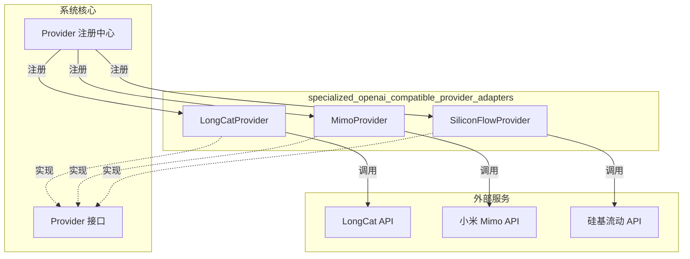

# specialized_openai_compatible_provider_adapters 模块技术详解

## 什么是这个模块？为什么它存在？

在构建一个支持多模型提供商的 AI 系统时，我们面临一个核心挑战：市场上存在大量遵循 OpenAI API 协议但各有细微差异的模型服务平台。这些平台（如 LongCat、小米 Mimo、硅基流动 SiliconFlow）虽然都声称是 "OpenAI 兼容" 的，但在认证方式、默认端点、支持的模型类型等方面存在差异。

**`specialized_openai_compatible_provider_adapters` 模块的使命是将这些 "OpenAI 兼容但不完全相同" 的提供商标准化，让系统其余部分能够以统一的方式与它们交互。**

你可以把这个模块想象成一个**电源适配器集合**：所有适配器都提供相同的 "输出接口"（我们系统的 Provider 抽象），但各自适应不同的 "输入插座"（各个专有提供商的特殊要求）。

## 核心抽象与心智模型

这个模块建立在一个简洁的抽象层次上：

```
系统核心 ←→ Provider 接口 ←→ 专用适配器 ←→ 外部 OpenAI 兼容 API
```

关键思想是：
1. **Provider 接口**定义了系统期望的统一契约
2. **专用适配器**（如 `LongCatProvider`、`MimoProvider`）实现这个接口，但内部处理各自平台的特殊性
3. **注册机制**让适配器能自动被系统发现和使用

每个 Provider 适配器主要负责两件事：
- **提供元数据**：平台名称、显示名称、支持的模型类型、默认 URL 等
- **验证配置**：确保用户提供的配置满足该平台的特定要求

## 架构概览



这个架构的优雅之处在于其**可扩展性**：当需要支持一个新的 OpenAI 兼容提供商时，只需添加一个新的 Provider 结构体并实现两个核心方法（`Info()` 和 `ValidateConfig()`），然后在 `init()` 函数中注册它即可。

## 核心组件详解

### LongCatProvider

**职责**：适配 LongCat AI 平台

LongCatProvider 的设计体现了一个有趣的设计决策：它**强制要求 BaseURL**。这与其他一些提供商不同，背后的原因是 LongCat 的 API 端点可能更具变化性，或者该平台鼓励用户明确指定他们要使用的端点。

```go
func (p *LongCatProvider) ValidateConfig(config *Config) error {
    if config.BaseURL == "" {
        return fmt.Errorf("base URL is required for LongCat provider")
    }
    // ... 其他验证
}
```

### MimoProvider

**职责**：适配小米 Mimo 平台

MimoProvider 采取了相对宽松的配置策略：它不强制要求 BaseURL（因为默认的 `https://api.xiaomimimo.com/v1` 通常足够），只要求 API 密钥和模型名称。

这种设计反映了小米 Mimo 平台的特性：它是一个更标准化、端点更稳定的服务。

### SiliconFlowProvider

**职责**：适配硅基流动 SiliconFlow 平台

SiliconFlowProvider 是这三者中**功能最丰富**的适配器。它不仅支持知识问答（KnowledgeQA），还支持嵌入（Embedding）、重排序（Rerank）和视觉语言模型（VLLM）。

```go
ModelTypes: []types.ModelType{
    types.ModelTypeKnowledgeQA,
    types.ModelTypeEmbedding,
    types.ModelTypeRerank,
    types.ModelTypeVLLM,
}
```

其验证逻辑也是最简单的：只要求 API 密钥。这表明硅基流动平台在设计上更加灵活，允许更多的配置默认值。

## 设计决策与权衡分析

### 1. 注册模式 vs 显式配置

**选择**：使用 `init()` 函数中的 `Register()` 调用自动注册

```go
func init() {
    Register(&LongCatProvider{})
}
```

**为什么这样做**：
- ✅ **无需配置**：添加新 Provider 后自动可用
- ✅ **发现机制**：系统可以动态枚举所有可用的 Provider
- ⚠️ **隐式依赖**：依赖 Go 的包初始化顺序，虽然通常不是问题

**替代方案**：使用显式的配置文件或注册中心。但对于这种相对稳定的 Provider 集合，自动注册的便利性超过了其潜在风险。

### 2. 验证逻辑的差异化

**观察**：每个 Provider 有不同的 `ValidateConfig()` 实现

| Provider | 要求 BaseURL | 要求 APIKey | 要求 ModelName |
|----------|-------------|------------|---------------|
| LongCat  | ✅          | ✅         | ✅            |
| Mimo     | ❌          | ✅         | ✅            |
| SiliconFlow | ❌      | ✅         | ❌            |

**设计意图**：每个 Provider 的验证逻辑反映了对应平台的**实际要求**，而不是追求统一。这种设计让系统在各平台上都能正常工作，同时在配置错误时提供清晰的反馈。

### 3. 只关注元数据和验证，不涉及实际调用

**选择**：这些 Provider 只提供元数据和配置验证，不处理实际的 API 调用

**为什么这样做**：
- ✅ **关注点分离**：元数据/验证 vs 实际调用是不同的关注点
- ✅ **复用**：实际调用逻辑可以在通用的 OpenAI 兼容客户端中实现
- ✅ **简单性**：Provider 结构体保持轻量和易于理解

这是一个很好的**单一职责原则**应用示例。

## 数据流与使用场景

让我们跟踪一个典型的使用流程：

1. **系统启动**：包初始化时，所有 Provider 通过 `init()` 函数自动注册
2. **用户配置**：用户选择 "硅基流动" 作为提供商，输入 API 密钥
3. **配置验证**：系统调用 `SiliconFlowProvider.ValidateConfig()` 检查配置
4. **元数据查询**：系统调用 `SiliconFlowProvider.Info()` 获取支持的模型类型
5. **实际使用**：系统使用通用的 OpenAI 兼容客户端和这些元数据进行 API 调用

## 与其他模块的关系

这个模块位于模型提供商架构中的**专用适配层**，它依赖并构建于：

- [openai_protocol_foundation_providers](model_providers_and_ai_backends-provider_catalog_and_configuration_contracts-openai_compatible_provider_catalog-openai_protocol_foundation_providers.md) - 提供基础的 OpenAI 协议支持
- [mainstream_openai_compatible_model_platforms](model_providers_and_ai_backends-provider_catalog_and_configuration_contracts-openai_compatible_provider_catalog-mainstream_openai_compatible_model_platforms.md) - 包含主流平台的适配器

## 新贡献者指南

### 注意事项

1. **注册机制**：不要忘记在 `init()` 函数中调用 `Register()`，否则你的 Provider 将不会被系统发现
2. **默认 URL**：在 `DefaultURLs` 中为支持的每种 `ModelType` 提供默认 URL
3. **验证逻辑**：`ValidateConfig()` 应该只验证该提供商**真正需要**的配置项，不要过度验证
4. **错误消息**：错误消息应该清晰指明缺少什么配置，例如 `"API key is required for X provider"`

### 如何添加一个新的 Provider

假设你要添加一个名为 "NewAI" 的 OpenAI 兼容提供商：

1. 创建 `newai.go` 文件
2. 定义 `NewAIProvider` 结构体
3. 实现 `Info()` 方法，提供元数据
4. 实现 `ValidateConfig()` 方法，验证必要配置
5. 在 `init()` 中调用 `Register(&NewAIProvider{})`

遵循现有模式，保持一致性，你的新 Provider 就能无缝集成到系统中。

## 子模块

- [longcat_openai_compatible_provider_adapter](model_providers_and_ai_backends-provider_catalog_and_configuration_contracts-openai_compatible_provider_catalog-specialized_openai_compatible_provider_adapters-longcat_openai_compatible_provider_adapter.md)
- [mimo_openai_compatible_provider_adapter](model_providers_and_ai_backends-provider_catalog_and_configuration_contracts-openai_compatible_provider_catalog-specialized_openai_compatible_provider_adapters-mimo_openai_compatible_provider_adapter.md)
- [siliconflow_openai_compatible_provider_adapter](model_providers_and_ai_backends-provider_catalog_and_configuration_contracts-openai_compatible_provider_catalog-specialized_openai_compatible_provider_adapters-siliconflow_openai_compatible_provider_adapter.md)
