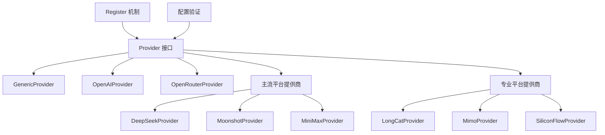

# OpenAI 兼容提供商目录

## 概述

想象一下，如果你有一套通用的电源插座规范（OpenAI API 协议），然后市面上有各种各样的设备（AI 模型提供商）都支持这个规范，你只需要一个适配器就能让它们全部工作。`openai_compatible_provider_catalog` 模块正是这样一个"适配器目录"——它提供了一个统一的接口层，让系统能够无缝地与各种遵循 OpenAI API 协议的 AI 模型提供商交互，而不必为每个提供商编写专门的集成代码。

这个模块解决的核心问题是**模型提供商的碎片化**。现在有越来越多的 AI 服务选择兼容 OpenAI 的 API 协议作为事实标准，但每个提供商在配置要求、支持的模型类型、默认端点等方面都有细微差异。该模块通过抽象这些差异，为上层应用提供了一致的体验。

## 架构概览



### 核心组件说明

1. **Provider 接口**：定义了所有提供商必须实现的核心方法，包括元数据查询和配置验证
2. **GenericProvider**：提供了一个通用的基线实现，可用于任何未特别适配的 OpenAI 兼容服务
3. **OpenAIProvider**：官方 OpenAI 平台的专门适配
4. **OpenRouterProvider**：OpenRouter 聚合平台的适配
5. **主流平台提供商**：DeepSeek、Moonshot、MiniMax 等主流模型平台的专门适配
6. **专业平台提供商**：LongCat、Mimo、SiliconFlow 等更专业领域平台的适配

### 数据流程

当系统需要使用某个 AI 模型提供商时：

1. **提供商注册**：每个提供商在包初始化时通过 `init()` 函数自动注册到全局注册表
2. **元数据查询**：系统根据提供商名称查找并获取其元数据（显示名称、描述、默认 URL、支持的模型类型等）
3. **配置验证**：在使用提供商之前，系统会调用 `ValidateConfig()` 方法验证配置是否完整有效
4. **服务调用**：通过统一的接口层与实际的 AI 服务交互（这部分由上层模块处理）

## 核心设计决策

### 1. 自注册模式 vs 集中式注册

**选择**：采用自注册模式，每个提供商在自己的 `init()` 函数中调用 `Register()`。

**原因**：
- **解耦**：添加新提供商时无需修改中央注册文件
- **可扩展性**：新提供商只需遵循接口规范即可自动集成
- **关注点分离**：每个提供商负责自己的注册逻辑

**权衡**：
- 优点：模块化强，添加新提供商简单
- 缺点：难以一眼看出所有已注册的提供商，需要查看各文件的 `init()` 函数

### 2. 元数据驱动设计

**选择**：每个提供商通过 `Info()` 方法返回完整的元数据描述，而不是在代码中硬编码各种特殊逻辑。

**原因**：
- **一致性**：所有提供商的描述信息都遵循统一结构
- **可配置性**：UI 可以直接使用这些元数据渲染提供商选择界面
- **可维护性**：修改提供商信息只需调整 `Info()` 方法

**权衡**：
- 优点：信息集中，易于维护和展示
- 缺点：`ProviderInfo` 结构需要精心设计以适应所有可能的提供商差异

### 3. 轻量级验证 vs 完整功能验证

**选择**：`ValidateConfig()` 只进行最基本的配置完整性检查，不进行实际的 API 连通性测试。

**原因**：
- **性能**：避免在配置阶段进行耗时的网络请求
- **职责分离**：配置验证只负责格式检查，连通性测试留给实际调用时处理
- **灵活性**：某些场景下可能需要先保存配置再测试连通性

**权衡**：
- 优点：快速、无副作用
- 缺点：无法提前发现配置错误（如无效的 API Key）

### 4. 专门提供商 vs 通用提供商

**选择**：同时提供通用的 `GenericProvider` 和针对特定平台的专门提供商。

**原因**：
- **覆盖范围**：`GenericProvider` 可以处理任何 OpenAI 兼容服务，即使没有专门适配
- **用户体验**：专门提供商提供更好的默认值和更精确的验证逻辑
- **渐进式适配**：可以先使用通用提供商，再根据需求添加专门适配

**权衡**：
- 优点：灵活性高，覆盖全面
- 缺点：需要维护两套逻辑，可能导致用户混淆

## 子模块概览

该模块分为三个主要子模块，每个都有其专门的职责：

### 1. [OpenAI 协议基础提供商](model_providers_and_ai_backends-provider_catalog_and_configuration_contracts-openai_compatible_provider_catalog-openai_protocol_foundation_providers.md)

这是模块的基础层，提供了最核心的提供商实现。该子模块包含 `GenericProvider`、`OpenAIProvider` 和 `OpenRouterProvider` 三个核心实现，它们共同构成了整个提供商目录的基石。`GenericProvider` 作为通用基线，能够处理任何 OpenAI 兼容服务；`OpenAIProvider` 提供了官方 OpenAI 平台的优化体验；而 `OpenRouterProvider` 则专门适配了聚合多种模型的 OpenRouter 平台。

### 2. [主流 OpenAI 兼容模型平台](model_providers_and_ai_backends-provider_catalog_and_configuration_contracts-openai_compatible_provider_catalog-mainstream_openai_compatible_model_platforms.md)

专注于国内主流的 AI 模型平台。该子模块包含 `DeepSeekProvider`、`MoonshotProvider` 和 `MiniMaxProvider` 三个专门适配，针对国内用户常用的模型平台提供优化体验。每个适配都考虑了各自平台的特殊要求，比如 Moonshot 需要显式配置 Base URL，而 MiniMax 则提供了国内外两个不同的默认端点。

### 3. [专业 OpenAI 兼容提供商适配器](model_providers_and_ai_backends-provider_catalog_and_configuration_contracts-openai_compatible_provider_catalog-specialized_openai_compatible_provider_adapters.md)

覆盖更专业领域和特定场景的提供商。该子模块包含 `LongCatProvider`、`MimoProvider` 和 `SiliconFlowProvider`，针对更细分的市场和特定需求提供支持。比如 SiliconFlow 提供了完整的模型类型支持，包括知识问答、嵌入、重排序和视觉语言模型，而 Mimo 则专注于小米生态系统的集成。

## 与其他模块的关系

`openai_compatible_provider_catalog` 模块在整个系统中扮演着**适配器层**的角色，它连接了上层应用和底层的 AI 服务提供商：

1. **上游依赖**：
   - 依赖 `provider_base_interfaces_and_config_contracts` 模块定义的核心接口和契约
   - 使用 `types` 模块中的 `ModelType` 等基础类型

2. **下游依赖**：
   - 被 `chat_completion_backends_and_streaming` 模块使用，用于实际的 API 调用
   - 被 `embedding_interfaces_batching_and_backends` 模块使用，用于向量嵌入服务
   - 被 `reranking_interfaces_and_backends` 模块使用，用于重排序服务

3. **数据契约**：
   - 与 `model_catalog_repository` 模块交互，存储和检索提供商配置
   - 通过 `Config` 结构与配置系统集成

## 关键实现细节

### 注册机制

每个提供商都通过 `init()` 函数自动注册：

```go
func init() {
    Register(&SomeProvider{})
}
```

这种设计确保了只要导入了提供商的包，它就会自动可用，无需额外的初始化代码。

### 配置验证

每个提供商的 `ValidateConfig()` 方法都针对其特定需求进行验证：

- **OpenAIProvider**：必须有 API Key 和模型名称
- **GenericProvider**：必须有 Base URL 和模型名称
- **OpenRouterProvider**：只需 API Key（模型名称可以通过 API 发现）
- **MoonshotProvider**：需要 Base URL、API Key 和模型名称

这些差异反映了每个提供商的独特要求和设计理念。

### 元数据设计

`ProviderInfo` 结构包含了丰富的元数据：

- **Name**：内部标识符
- **DisplayName**：用户友好的显示名称
- **Description**：简短描述，通常包含支持的模型示例
- **DefaultURLs**：按模型类型分类的默认端点 URL
- **ModelTypes**：支持的模型类型列表
- **RequiresAuth**：是否需要认证

## 新贡献者指南

### 常见陷阱

1. **忘记注册**：新提供商必须在 `init()` 中调用 `Register()`，否则不会被系统发现
2. **过度验证**：`ValidateConfig()` 应该只验证最基本的配置，不要尝试调用实际 API
3. **URL 硬编码**：即使有默认 URL，也应该允许用户通过配置覆盖
4. **模型类型限制**：确保提供商的 `ModelTypes` 列表与实际能力匹配

### 扩展点

1. **添加新提供商**：
   - 创建新文件，定义实现 `Provider` 接口的结构体
   - 在 `init()` 中注册
   - 实现 `Info()` 和 `ValidateConfig()` 方法

2. **增强验证逻辑**：
   - 可以在 `ValidateConfig()` 中添加更复杂的格式检查
   - 但避免进行网络请求或其他有副作用的操作

3. **扩展元数据**：
   - 如有需要，可以扩展 `ProviderInfo` 结构
   - 确保向后兼容，现有提供商不受影响

### 最佳实践

1. **保持简洁**：每个提供商应该只关注自己的特殊逻辑，不要添加不必要的复杂性
2. **文档完善**：在 `Info()` 的 `Description` 字段中提供有用的信息，如支持的模型示例
3. **合理默认**：提供合理的默认值，减少用户配置负担
4. **错误友好**：`ValidateConfig()` 返回的错误信息应该清晰明确，指导用户如何修复

## 实际应用场景与示例

### 典型使用流程

在实际应用中，使用 `openai_compatible_provider_catalog` 模块的典型流程如下：

1. **提供商发现**：系统首先通过注册表获取所有可用的提供商列表
2. **用户选择**：用户从列表中选择一个提供商（UI 可以使用 `Info()` 方法返回的元数据渲染）
3. **配置输入**：用户根据提供商要求输入必要的配置信息（API Key、Base URL、模型名称等）
4. **配置验证**：系统调用 `ValidateConfig()` 验证配置是否完整有效
5. **服务初始化**：使用验证后的配置初始化相应的服务客户端
6. **API 调用**：通过统一的接口调用 AI 服务

### 配置示例

以 OpenAI 提供商为例，一个典型的配置可能如下：

```go
config := &provider.Config{
    ProviderName: provider.ProviderOpenAI,
    APIKey:       "sk-...",
    ModelName:    "gpt-4",
    BaseURL:      provider.OpenAIBaseURL, // 可以省略，使用默认值
}
```

而对于通用提供商，用户需要提供更多信息：

```go
config := &provider.Config{
    ProviderName: provider.ProviderGeneric,
    BaseURL:      "https://my-custom-endpoint.com/v1",
    ModelName:    "my-custom-model",
    APIKey:       "optional-api-key", // 取决于具体服务
}
```

### 扩展新提供商

假设你需要添加一个名为 "NewAI" 的新提供商，步骤如下：

1. 创建 `newai.go` 文件
2. 定义 `NewAIProvider` 结构体
3. 实现 `Provider` 接口的 `Info()` 和 `ValidateConfig()` 方法
4. 在 `init()` 中注册提供商

```go
package provider

import (
    "fmt"
    "github.com/Tencent/WeKnora/internal/types"
)

const NewAIBaseURL = "https://api.newai.com/v1"

type NewAIProvider struct{}

func init() {
    Register(&NewAIProvider{})
}

func (p *NewAIProvider) Info() ProviderInfo {
    return ProviderInfo{
        Name:        "newai",
        DisplayName: "NewAI",
        Description: "newai-model-1, newai-model-2, etc.",
        DefaultURLs: map[types.ModelType]string{
            types.ModelTypeKnowledgeQA: NewAIBaseURL,
        },
        ModelTypes: []types.ModelType{
            types.ModelTypeKnowledgeQA,
        },
        RequiresAuth: true,
    }
}

func (p *NewAIProvider) ValidateConfig(config *Config) error {
    if config.APIKey == "" {
        return fmt.Errorf("API key is required for NewAI provider")
    }
    if config.ModelName == "" {
        return fmt.Errorf("model name is required")
    }
    return nil
}
```

## 总结

`openai_compatible_provider_catalog` 模块通过巧妙的设计，解决了 AI 模型提供商碎片化的问题。它采用自注册模式、元数据驱动设计和轻量级验证，为系统提供了一个统一、灵活、可扩展的提供商适配层。

这个模块的设计体现了**开闭原则**——对扩展开放，对修改关闭。添加新提供商只需创建新文件并遵循接口规范，无需修改现有代码。同时，它也展示了**适配器模式**的经典应用，将各种不同的提供商接口统一转换为系统内部的标准接口。

对于新加入团队的开发者来说，理解这个模块的设计理念和实现细节，将有助于更好地理解整个系统的 AI 服务集成架构。通过学习这个模块，你不仅能掌握如何与各种 AI 提供商交互，还能学到一种优雅的方式来处理类似的接口适配问题。
