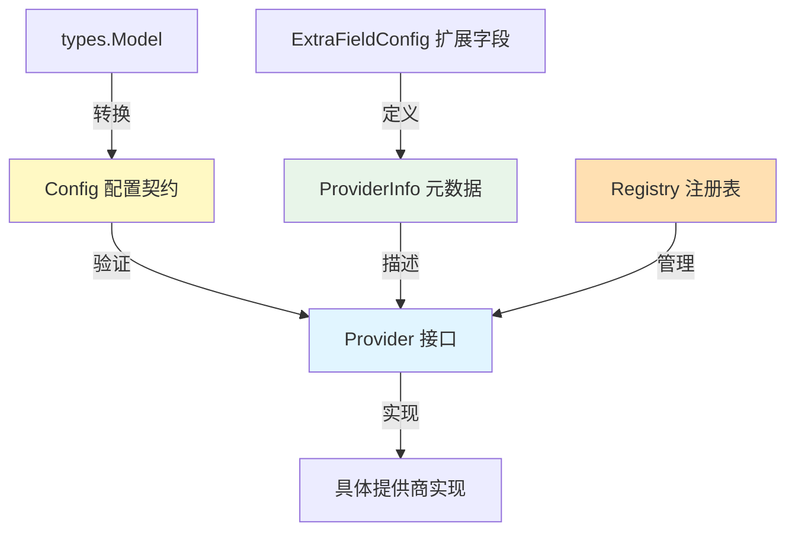

# Provider Base Interfaces and Config Contracts 模块解析

## 1. 问题空间与存在意义

在多供应商、多模型的 AI 生态系统中，系统需要与数十家不同的模型提供商对接，每家提供商都有自己的 API 协议、认证方式、配置参数和行为差异。如果直接在业务逻辑中硬编码这些差异，会导致代码高度耦合、难以维护和扩展。

### 为什么朴素的解决方案行不通

如果不使用这个模块，可能会出现以下问题：
- 每个新的模型提供商都需要修改核心业务逻辑
- 配置验证和解析散落在代码各处
- 没有统一的方式来获取提供商的元数据和能力描述
- 模型类型和提供商之间的映射关系混乱
- 无法灵活地扩展自定义的提供商实现

### 设计洞察

这个模块的核心设计思想是**契约驱动设计**和**策略模式**的结合：
- 定义统一的接口契约，所有提供商实现必须遵守
- 提供配置契约，确保配置数据的一致性和可验证性
- 建立注册表机制，实现提供商的动态发现和加载
- 支持从 BaseURL 自动检测提供商，提升用户体验

## 2. 架构与核心抽象

### 2.1 核心架构图



### 2.2 核心组件角色

- **Provider 接口**：定义了提供商必须实现的核心能力，包括获取元数据和验证配置
- **Config 结构体**：统一的配置数据结构，封装了所有提供商共有的配置项
- **ProviderInfo 结构体**：提供商的元数据描述，包括名称、支持的模型类型、默认 URL 等
- **ExtraFieldConfig 结构体**：定义提供商特有的扩展配置字段，支持动态表单生成
- **Registry 机制**：线程安全的全局注册表，负责提供商的注册、发现和查询

## 3. 核心组件深度解析

### 3.1 Provider 接口

```go
type Provider interface {
    // Info 返回服务商的元数据
    Info() ProviderInfo

    // ValidateConfig 验证服务商的配置
    ValidateConfig(config *Config) error
}
```

**设计意图**：
- **Info() 方法**：允许提供商自描述其能力和元数据，这是策略模式的核心，使得调用方不需要知道具体实现就能了解提供商的特性
- **ValidateConfig() 方法**：将配置验证逻辑封装在提供商内部，每个提供商可以根据自己的需求实现验证规则，实现了关注点分离

### 3.2 ProviderInfo 结构体

```go
type ProviderInfo struct {
    Name         ProviderName               // 提供者标识
    DisplayName  string                     // 可读名称
    Description  string                     // 提供者描述
    DefaultURLs  map[types.ModelType]string // 按模型类型区分的默认 BaseURL
    ModelTypes   []types.ModelType          // 支持的模型类型
    RequiresAuth bool                       // 是否需要 API key
    ExtraFields  []ExtraFieldConfig         // 额外配置字段
}
```

**设计亮点**：
- **DefaultURLs 映射**：通过 `types.ModelType` 作为键，支持不同模型类型使用不同的默认 URL，这是因为一些提供商的聊天和嵌入 API 可能使用不同的端点
- **ModelTypes 列表**：明确声明支持的模型类型，使得系统可以在运行时根据需要筛选合适的提供商
- **ExtraFields 扩展**：支持动态定义额外的配置字段，这使得系统可以在不修改核心代码的情况下支持提供商特有的配置项

### 3.3 Config 结构体

```go
type Config struct {
    Provider  ProviderName   `json:"provider"`
    BaseURL   string         `json:"base_url"`
    APIKey    string         `json:"api_key"`
    ModelName string         `json:"model_name"`
    ModelID   string         `json:"model_id"`
    Extra     map[string]any `json:"extra,omitempty"`
}
```

**设计考量**：
- **统一配置结构**：所有提供商使用相同的配置结构，简化了配置的存储、传输和处理
- **Extra 字段**：使用 `map[string]any` 存储提供商特有的配置项，提供了灵活性但也带来了类型安全的挑战，这是一个典型的灵活性与类型安全的权衡
- **ModelID 与 ModelName 分离**：区分了模型的唯一标识符和可读名称，这在多租户环境中很有用

### 3.4 Registry 机制

**设计特点**：
- **线程安全**：使用 `sync.RWMutex` 保护注册表，确保并发安全
- **惰性加载**：提供商可以在需要时注册，而不是在程序启动时全部加载
- **默认回退**：`GetOrDefault` 方法在找不到指定提供商时会回退到 `ProviderGeneric`，提高了系统的鲁棒性
- **按模型类型筛选**：`ListByModelType` 方法允许根据模型类型筛选提供商，这是一个常见的使用场景

### 3.5 DetectProvider 函数

```go
func DetectProvider(baseURL string) ProviderName {
    switch {
    case containsAny(baseURL, "dashscope.aliyuncs.com"):
        return ProviderAliyun
    // ... 其他检测规则
    default:
        return ProviderGeneric
    }
}
```

**设计意图**：
- **用户体验优化**：用户在配置模型时可能只知道 BaseURL，不知道具体的提供商名称，这个函数可以自动检测
- **兼容性处理**：对于自定义部署的模型，如果 URL 中包含特定的模式，也可以被正确识别
- **默认回退**：如果无法识别，会返回 `ProviderGeneric`，确保系统可以继续工作

## 4. 依赖关系与数据流动

### 4.1 主要依赖

- **types.Model**：从 [model_catalog_and_parameter_contracts](../core_domain_types_and_interfaces-identity_tenant_organization_and_configuration_contracts-model_catalog_and_parameter_contracts.md) 模块导入，用于从模型配置转换为提供商配置
- **types.ModelType**：定义了支持的模型类型，是提供商和模型类型之间映射的基础

### 4.2 数据流向

1. **配置转换**：
   - 输入：`types.Model` 对象
   - 处理：`NewConfigFromModel` 函数将模型配置转换为提供商配置
   - 输出：`Config` 对象

2. **提供商验证**：
   - 输入：`Config` 对象
   - 处理：调用提供商的 `ValidateConfig` 方法验证配置
   - 输出：验证结果（错误或 nil）

3. **提供商发现**：
   - 输入：提供商名称或 BaseURL
   - 处理：通过注册表或 `DetectProvider` 函数查找提供商
   - 输出：`Provider` 实例

## 5. 设计权衡与决策

### 5.1 灵活性 vs 类型安全

**决策**：使用 `map[string]any` 作为 `Extra` 字段的类型

**理由**：
- 不同的提供商可能有完全不同的扩展配置需求
- 使用 `map[string]any` 提供了最大的灵活性
- 类型安全的损失可以通过提供商的 `ValidateConfig` 方法来弥补

**权衡**：
- 优点：灵活性高，支持任意扩展配置
- 缺点：类型安全降低，需要在运行时进行类型断言和验证

### 5.2 注册表模式 vs 依赖注入

**决策**：使用全局注册表模式

**理由**：
- 提供商的数量相对固定，不会频繁变化
- 全局注册表使得提供商的访问非常方便
- 简化了提供商的注册和发现流程

**权衡**：
- 优点：使用简单，访问方便
- 缺点：全局状态使得测试变得复杂，可能会导致隐式依赖

### 5.3 提供商自动检测

**决策**：实现 `DetectProvider` 函数，通过 BaseURL 自动检测提供商

**理由**：
- 提升用户体验，用户不需要知道具体的提供商名称
- 对于自定义部署的模型，也可以通过 URL 模式进行识别
- 作为一种优雅的降级策略，当提供商名称未指定时仍能正常工作

**权衡**：
- 优点：用户体验好，容错性强
- 缺点：可能会出现误判，需要维护检测规则

## 6. 使用指南与常见模式

### 6.1 注册新的提供商

```go
// 1. 实现 Provider 接口
type MyProvider struct{}

func (p *MyProvider) Info() ProviderInfo {
    return ProviderInfo{
        Name:        "my_provider",
        DisplayName: "My Provider",
        Description: "My custom provider",
        DefaultURLs: map[types.ModelType]string{
            types.ModelTypeKnowledgeQA: "https://api.my-provider.com/v1",
        },
        ModelTypes:   []types.ModelType{types.ModelTypeKnowledgeQA},
        RequiresAuth: true,
    }
}

func (p *MyProvider) ValidateConfig(config *Config) error {
    if config.APIKey == "" {
        return errors.New("API key is required")
    }
    return nil
}

// 2. 注册提供商
func init() {
    Register(&MyProvider{})
}
```

### 6.2 使用提供商

```go
// 获取提供商
provider, ok := Get(ProviderOpenAI)
if !ok {
    provider = GetOrDefault(ProviderOpenAI)
}

// 验证配置
config := &Config{
    Provider: ProviderOpenAI,
    BaseURL:  "https://api.openai.com/v1",
    APIKey:   "your-api-key",
}

if err := provider.ValidateConfig(config); err != nil {
    // 处理错误
}
```

### 6.3 从模型配置创建提供商配置

```go
model := &types.Model{
    ID:   "model-123",
    Name: "gpt-4",
    Parameters: types.ModelParameters{
        Provider: "openai",
        BaseURL:  "https://api.openai.com/v1",
        APIKey:   "your-api-key",
    },
}

config, err := NewConfigFromModel(model)
if err != nil {
    // 处理错误
}
```

## 7. 边缘情况与注意事项

### 7.1 线程安全

- 注册表操作是线程安全的，但提供商的实现需要自己保证线程安全
- 如果提供商在 `ValidateConfig` 或其他方法中修改了内部状态，需要使用适当的同步机制

### 7.2 配置验证

- 即使配置通过了 `ValidateConfig`，也不能保证它一定能工作，因为网络问题、API 密钥失效等外部因素可能会导致失败
- 建议在实际使用前进行一次健康检查

### 7.3 扩展字段处理

- 当使用 `Extra` 字段时，需要注意类型断言的安全性
- 建议在 `ValidateConfig` 方法中对 `Extra` 字段进行严格的类型检查和验证

### 7.4 提供商检测

- `DetectProvider` 函数是基于 URL 模式匹配的，可能会出现误判
- 如果不确定，建议显式指定提供商名称
- 对于自定义部署的模型，可能需要使用 `ProviderGeneric`

### 7.5 默认回退行为

- `GetOrDefault` 函数会在找不到指定提供商时返回 `ProviderGeneric`
- 这可能会导致意外的行为，建议在使用前检查返回的提供商是否是预期的

## 8. 参考链接

- [OpenAI Compatible Provider Catalog](model_providers_and_ai_backends-provider_catalog_and_configuration_contracts-openai_compatible_provider_catalog.md)
- [Model Catalog and Parameter Contracts](../core_domain_types_and_interfaces-identity_tenant_organization_and_configuration_contracts-model_catalog_and_parameter_contracts.md)
- [Chat Completion Backends and Streaming](model_providers_and_ai_backends-chat_completion_backends_and_streaming.md)
