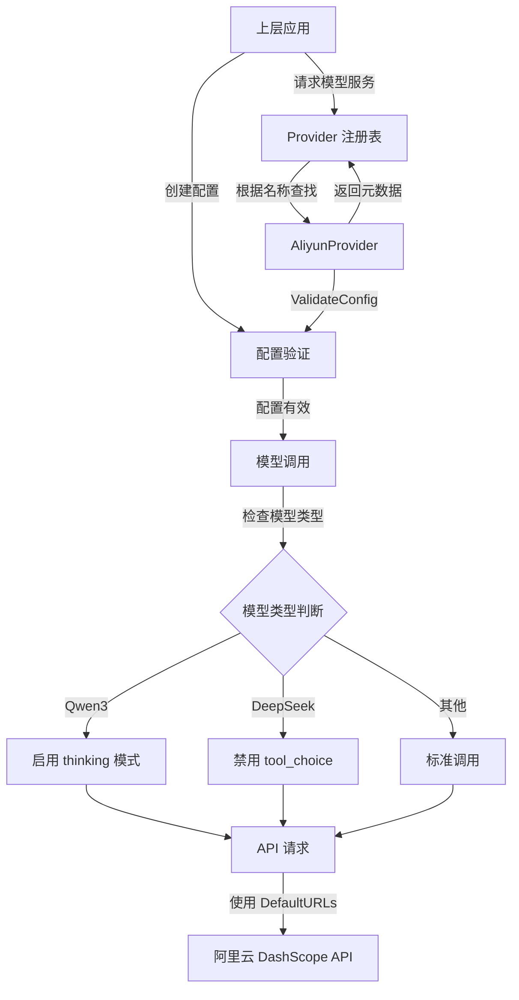

# 阿里云官方 Provider 集成模块深度解析

## 1. 模块概述

### 1.1 解决的问题

在多云 AI 服务集成的场景下，系统需要支持多种不同的模型提供商，每个提供商都有自己的 API 端点、认证方式、支持的模型类型和特殊行为。`aliyun_official_provider_integration` 模块专门解决了如何将阿里云 DashScope 平台的各种 AI 能力（包括聊天、嵌入、重排序等）统一集成到系统的 Provider 框架中的问题。

如果没有这个模块，系统将需要在各个调用点直接处理阿里云的特殊逻辑，导致代码重复、维护困难，并且难以与其他提供商保持一致的接口。

### 1.2 核心设计思想

这个模块的设计基于**提供者模式（Provider Pattern）**，它将阿里云 DashScope 的所有特性封装在一个统一的 `Provider` 接口实现中。核心思想是：
- 通过元数据描述提供商的能力
- 提供配置验证机制
- 封装特殊模型的行为差异
- 保持与系统中其他提供商的接口一致性

## 2. 核心组件深度解析

### 2.1 `AliyunProvider` 结构体

`AliyunProvider` 是这个模块的核心，它是一个空结构体，但通过方法实现了完整的 `Provider` 接口。

```go
type AliyunProvider struct{}
```

**设计意图**：使用空结构体是因为这个 Provider 不需要维护任何运行时状态，所有功能都通过方法和常量实现。这种设计使得该 Provider 可以作为单例安全地在系统中使用。

### 2.2 初始化与注册

```go
func init() {
    Register(&AliyunProvider{})
}
```

**设计意图**：使用 `init()` 函数进行自动注册是 Go 语言中常见的插件模式。这意味着只要导入了这个包，`AliyunProvider` 就会自动注册到全局的 Provider 注册表中，无需手动初始化。这种设计实现了**声明式集成**，降低了使用门槛。

### 2.3 `Info()` 方法

```go
func (p *AliyunProvider) Info() ProviderInfo {
    return ProviderInfo{
        Name:        ProviderAliyun,
        DisplayName: "阿里云 DashScope",
        Description: "qwen-plus, tongyi-embedding-vision-plus, qwen3-rerank, etc.",
        DefaultURLs: map[types.ModelType]string{
            types.ModelTypeKnowledgeQA: AliyunChatBaseURL,
            types.ModelTypeEmbedding:   AliyunChatBaseURL,
            types.ModelTypeRerank:      AliyunRerankBaseURL,
            types.ModelTypeVLLM:        AliyunChatBaseURL,
        },
        ModelTypes: []types.ModelType{
            types.ModelTypeKnowledgeQA,
            types.ModelTypeEmbedding,
            types.ModelTypeRerank,
            types.ModelTypeVLLM,
        },
        RequiresAuth: true,
    }
}
```

**设计意图**：
- **元数据驱动**：通过 `ProviderInfo` 结构体声明能力，而不是通过代码逻辑判断，使得系统可以在不实例化 Provider 的情况下了解其能力
- **多端点支持**：不同的模型类型使用不同的 BaseURL，这是阿里云 DashScope 的特殊之处——聊天和嵌入使用兼容 OpenAI 的端点，而重排序使用专用端点
- **能力声明**：明确列出支持的模型类型，便于系统进行能力匹配和验证

### 2.4 `ValidateConfig()` 方法

```go
func (p *AliyunProvider) ValidateConfig(config *Config) error {
    if config.APIKey == "" {
        return fmt.Errorf("API key is required for Aliyun DashScope")
    }
    if config.ModelName == "" {
        return fmt.Errorf("model name is required")
    }
    return nil
}
```

**设计意图**：
- **提前验证**：在实际调用 API 之前验证配置，避免无效请求
- **最小验证集**：只验证阿里云 DashScope 必需的配置项，保持灵活性
- **清晰的错误信息**：错误消息明确指出缺失的配置项，便于调试

### 2.5 辅助函数

#### `IsQwen3Model()`

```go
func IsQwen3Model(modelName string) bool {
    return strings.HasPrefix(modelName, "qwen3-")
}
```

**设计意图**：
- **特殊模型检测**：Qwen3 系列模型需要特殊处理 `enable_thinking` 参数，这个函数提供了统一的检测方式
- **命名约定依赖**：基于模型名称前缀的检测方式简单高效，但也意味着依赖于阿里云的命名约定

#### `IsDeepSeekModel()`

```go
func IsDeepSeekModel(modelName string) bool {
    return strings.Contains(strings.ToLower(modelName), "deepseek")
}
```

**设计意图**：
- **跨提供商模型支持**：虽然这是阿里云 Provider 的模块，但阿里云 DashScope 也托管了 DeepSeek 模型，需要特殊处理
- **不区分大小写**：使用 `strings.ToLower()` 确保检测的鲁棒性
- **功能限制标识**：DeepSeek 模型不支持 `tool_choice` 参数，这个函数帮助系统在运行时适配这种差异

## 3. 架构与数据流

### 3.1 在系统中的位置

`aliyun_official_provider_integration` 模块位于 `model_providers_and_ai_backends` 层次结构中，属于 `provider_catalog_and_configuration_contracts` 下的 `regional_and_cloud_platform_provider_catalog` 中的 `aliyun_ecosystem_providers`。

这个位置表明它是系统中众多 Provider 实现之一，与其他提供商（如 ModelScope、混元、千帆等）平级，共同构成了系统的多提供商支持层。

### 3.2 交互流程



### 3.3 数据流向

1. **初始化阶段**：
   - 包导入时，`init()` 函数自动注册 `AliyunProvider`
   - 注册表保存 Provider 实例引用

2. **能力发现阶段**：
   - 上层调用 `Info()` 方法获取 Provider 元数据
   - 系统根据返回的 `ProviderInfo` 了解支持的模型类型和默认端点

3. **配置验证阶段**：
   - 上层创建 `Config` 结构体
   - 调用 `ValidateConfig()` 验证配置完整性
   - 如果验证失败，返回明确的错误信息

4. **模型调用阶段**：
   - 根据模型类型选择对应的 BaseURL
   - 使用辅助函数检测特殊模型
   - 根据模型类型应用特殊处理逻辑
   - 执行实际的 API 调用

## 4. 设计决策与权衡

### 4.1 无状态 Provider 设计

**决策**：`AliyunProvider` 是一个空结构体，不维护任何状态。

**权衡**：
- ✅ **优点**：
  - 可以作为单例安全使用
  - 无需考虑并发安全问题
  - 内存占用小
- ❌ **缺点**：
  - 无法缓存任何状态（如认证令牌）
  - 所有配置必须通过参数传递

**适用场景**：阿里云 DashScope 使用 API Key 认证，无需维护复杂的会话状态，这种设计非常适合。

### 4.2 基于字符串的模型检测

**决策**：使用字符串前缀和包含检测来识别特殊模型。

**权衡**：
- ✅ **优点**：
  - 实现简单高效
  - 无需维护复杂的模型注册表
- ❌ **缺点**：
  - 依赖于命名约定
  - 如果阿里云更改模型命名方式，代码需要调整
  - 可能出现误判（如模型名中意外包含 "deepseek"）

**缓解措施**：
- 对于 Qwen3，使用明确的前缀检测
- 对于 DeepSeek，转换为小写后再检测，提高鲁棒性

### 4.3 多端点配置

**决策**：为不同的模型类型配置不同的 BaseURL。

**权衡**：
- ✅ **优点**：
  - 完全适配阿里云 DashScope 的架构
  - 聊天和嵌入可以使用 OpenAI 兼容模式，简化集成
  - 重排序使用专用端点，获得更好的性能
- ❌ **缺点**：
  - 增加了配置的复杂性
  - 需要维护多个端点的映射关系

**设计理由**：阿里云 DashScope 的这种架构是为了兼容 OpenAI 生态的同时提供更丰富的功能，这个设计正是为了适配这种混合架构。

### 4.4 自动注册模式

**决策**：使用 `init()` 函数自动注册 Provider。

**权衡**：
- ✅ **优点**：
  - 使用简单，只需导入包即可
  - 符合插件模式的设计理念
- ❌ **缺点**：
  - 注册顺序不可控
  - 如果有多个 Provider 同名，可能会覆盖
  - 即使不使用，也会占用注册表空间

**缓解措施**：系统应该在注册表中实现名称冲突检测，避免意外覆盖。

## 5. 使用指南与最佳实践

### 5.1 基本使用

由于 `AliyunProvider` 是自动注册的，使用非常简单：

```go
import (
    _ "github.com/Tencent/WeKnora/internal/models/provider"
    // 其他导入
)

// 获取 Provider
provider, err := GetProvider(ProviderAliyun)
if err != nil {
    // 处理错误
}

// 验证配置
config := &Config{
    APIKey:    "your-api-key",
    ModelName: "qwen-plus",
}
err = provider.ValidateConfig(config)
if err != nil {
    // 处理错误
}
```

### 5.2 特殊模型处理

当使用特殊模型时，需要注意：

```go
// Qwen3 模型
if IsQwen3Model(config.ModelName) {
    // 启用 thinking 模式
    request.EnableThinking = true
}

// DeepSeek 模型
if IsDeepSeekModel(config.ModelName) {
    // 不要设置 tool_choice 参数
    request.ToolChoice = nil
}
```

### 5.3 端点选择

根据模型类型选择正确的端点：

```go
info := provider.Info()
var baseURL string
switch modelType {
case types.ModelTypeRerank:
    baseURL = info.DefaultURLs[types.ModelTypeRerank]
default:
    baseURL = info.DefaultURLs[types.ModelTypeKnowledgeQA]
}
```

## 6. 注意事项与潜在问题

### 6.1 模型命名约定

**问题**：`IsQwen3Model` 和 `IsDeepSeekModel` 依赖于模型命名约定，如果阿里云更改命名方式，这些函数将失效。

**建议**：
- 考虑维护一个模型配置注册表，而不是仅依赖字符串检测
- 添加单元测试，监控阿里云模型命名的变化
- 在文档中明确说明这种依赖

### 6.2 端点变更

**问题**：如果阿里云更改 API 端点，硬编码的常量将失效。

**建议**：
- 将端点配置化，允许用户覆盖默认值
- 实现端点的自动发现或定期更新机制
- 在 `ProviderInfo` 中提供端点的版本信息

### 6.3 错误处理

**问题**：`ValidateConfig` 只验证基本配置，不验证 API Key 的有效性和模型名称的正确性。

**建议**：
- 考虑添加一个 `Ping()` 或 `TestConnection()` 方法
- 在首次调用时验证 API Key 和模型名称
- 提供更丰富的错误类型，便于上层处理

### 6.4 扩展点

当前模块的设计相对简单，如果未来需要更复杂的功能，可以考虑：

1. **模型目录服务**：提供可用模型的列表和详细信息
2. **配额管理**：跟踪 API 使用量和配额
3. **异步操作支持**：支持需要轮询的长时间运行操作
4. **更多特殊模型支持**：随着阿里云 DashScope 推出更多模型，添加相应的检测和适配逻辑

## 7. 总结

`aliyun_official_provider_integration` 模块是一个设计简洁但功能完整的 Provider 实现，它成功地将阿里云 DashScope 的多种 AI 能力集成到系统的统一框架中。

这个模块的关键价值在于：
- **统一接口**：将阿里云的特殊架构封装在标准接口后面
- **特殊处理**：优雅地处理了不同模型的行为差异
- **自动集成**：通过自动注册模式降低了使用门槛
- **元数据驱动**：通过声明式的元数据描述能力，而不是硬编码逻辑

虽然设计相对简单，但这个模块体现了良好的插件架构设计原则，为系统的多提供商支持奠定了坚实的基础。
