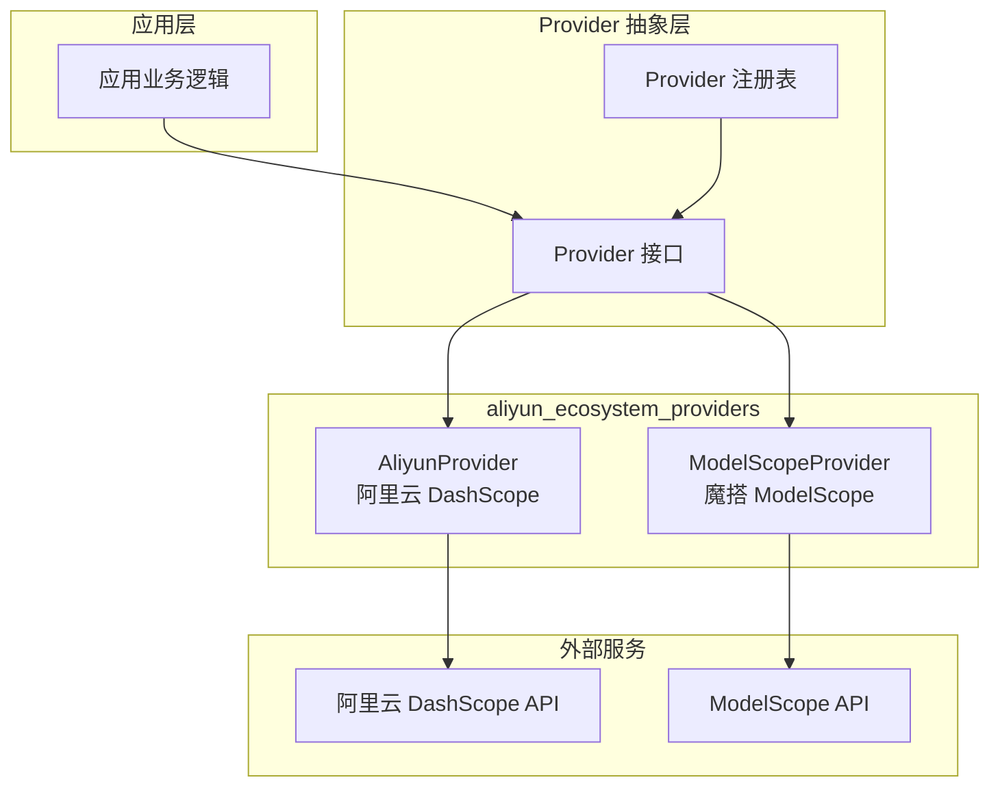
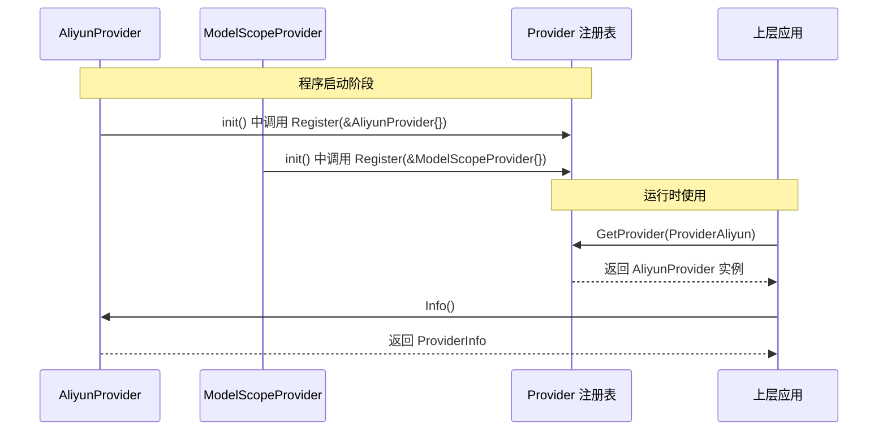

# aliyun_ecosystem_providers 模块技术深度解析

## 1. 模块概述

### 1.1 问题空间

想象一下，你的应用需要同时对接多个云平台的 AI 服务：阿里云的通义千问系列模型、ModelScope（魔搭）社区的开源模型，以及其他第三方服务。每个服务都有自己的 API 规范、认证方式、模型命名约定，甚至对同一功能（如流式响应）的实现细节也不同。

如果没有一个统一的抽象层，开发者就需要：
- 为每个云平台编写单独的客户端代码
- 处理各种平台特有的边缘情况（例如 Qwen3 模型的 `enable_thinking` 参数）
- 在应用逻辑中硬编码对特定平台的判断
- 每次添加新平台时修改核心业务代码

这就是 `aliyun_ecosystem_providers` 模块要解决的问题。它作为云平台 AI 服务的统一网关，将阿里云生态中不同平台的异构接口转换为应用可消费的统一接口。

### 1.2 核心价值

这个模块的核心价值在于**将平台差异从应用逻辑中剥离**，让上层代码可以像使用单一服务一样使用多个云平台的 AI 能力。它不是简单的 API 包装，而是一个精心设计的适配器层，处理平台特有的行为差异，同时保持统一的编程模型。

## 2. 架构设计

### 2.1 整体架构



### 2.2 架构解析

这个模块采用了经典的**策略模式**和**适配器模式**的组合：

1. **统一接口**：所有 Provider 实现相同的 `Provider` 接口，提供元数据信息和配置验证能力
2. **自动注册**：通过 `init()` 函数自动将 Provider 注册到全局注册表中
3. **平台适配**：每个 Provider 处理各自平台的特殊逻辑和差异

从依赖关系来看，这个模块是整个 provider 体系的"插件"，它依赖于基础的 provider 接口和类型定义，但不被其他核心模块直接依赖——上层代码通过 provider 注册表间接使用它。

## 3. 核心组件详解

### 3.1 AliyunProvider：阿里云 DashScope 适配器

**设计意图**：`AliyunProvider` 的核心职责是将阿里云 DashScope 服务的特性映射到系统的统一 Provider 模型中。

**关键特性**：
- 提供了两个不同的 BaseURL：一个用于 Chat/Embedding/VLLM，另一个专门用于 Rerank
- 支持四种模型类型：KnowledgeQA、Embedding、Rerank、VLLM
- 内置了模型特有的判断逻辑（`IsQwen3Model` 和 `IsDeepSeekModel`）

**设计细节解析**：

为什么需要两个不同的 BaseURL？这是因为阿里云 DashScope 的 Rerank 服务没有采用 OpenAI 兼容模式，而是使用了自己的 API 格式。这种设计在云服务中很常见——新服务往往提供兼容接口，而特定功能可能保留自己的实现。

```go
// 这种设计允许不同模型类型使用不同的端点
DefaultURLs: map[types.ModelType]string{
    types.ModelTypeKnowledgeQA: AliyunChatBaseURL,  // OpenAI 兼容
    types.ModelTypeEmbedding:   AliyunChatBaseURL,  // OpenAI 兼容
    types.ModelTypeRerank:      AliyunRerankBaseURL, // 专有格式
    types.ModelTypeVLLM:        AliyunChatBaseURL,  // OpenAI 兼容
},
```

**模型特定处理函数**：

`IsQwen3Model` 和 `IsDeepSeekModel` 这两个函数体现了一个重要的设计原则——**平台特定逻辑应该封装在 Provider 内部**。当上层代码需要处理这些模型的特殊行为时，它应该通过 Provider 接口提供的方法来判断，而不是自己硬编码模型名称前缀检查。

例如，Qwen3 模型需要特殊处理 `enable_thinking` 参数，而 DeepSeek 模型不支持 `tool_choice` 参数。这些差异被封装在 Provider 内部，上层代码不需要知道这些细节。

### 3.2 ModelScopeProvider：魔搭 ModelScope 适配器

**设计意图**：`ModelScopeProvider` 对接 ModelScope（魔搭）社区，这是阿里云推出的开源模型平台。

**与 AliyunProvider 的对比**：

| 特性 | AliyunProvider | ModelScopeProvider |
|------|---------------|-------------------|
| BaseURL 要求 | 有默认值，可选 | 必须显式配置 |
| 支持模型类型 | 4种（含 Rerank） | 3种（不含 Rerank） |
| 特殊模型处理 | 有（Qwen3、DeepSeek） | 无 |

**设计决策解析**：

为什么 ModelScopeProvider 要求必须配置 BaseURL，而 AliyunProvider 提供了默认值？

这反映了两个服务的不同定位：
- **阿里云 DashScope** 是一个稳定的商业服务，有固定的官方端点
- **ModelScope** 是一个开放平台，用户可能使用不同的部署环境（官方 API、私有部署、第三方镜像等）

这种设计决策是合理的——对于可能有多种部署方式的服务，不假设默认端点，强制用户明确配置，可以避免连接到错误环境的风险。

## 4. 数据流程

### 4.1 Provider 注册流程



### 4.2 配置验证流程

当上层代码需要使用某个 Provider 时，配置验证是一个关键步骤：

1. 上层代码从注册表获取 Provider 实例
2. 构造 `Config` 对象，包含 API Key、模型名称等信息
3. 调用 Provider 的 `ValidateConfig` 方法验证配置
4. 如果验证通过，继续使用；否则处理错误

这个流程确保了在实际调用 API 之前，配置的完整性和正确性就已经得到验证，避免了运行时的神秘错误。

## 5. 设计决策与权衡

### 5.1 注册机制的选择：init() 自动注册 vs 显式注册

**决策**：使用 `init()` 函数在包加载时自动注册 Provider。

**分析**：
- **优点**：
  - 使用简单，导入包即完成注册
  - 避免上层代码忘记注册的错误
  - 符合"插件"模式的使用体验
  
- **缺点**：
  - 注册顺序不确定（虽然在这个场景下不影响）
  - 无法灵活控制是否注册（例如测试中可能不需要）
  - 增加了包的隐式副作用

**为什么这个选择是合理的**：在这个场景下，Provider 是作为整个系统的基础设施存在的，我们总是希望它们被注册。自动注册简化了使用，而且没有引入实质性的风险。

### 5.2 模型特定逻辑的位置：封装在 Provider 内部 vs 上层处理

**决策**：将模型特定的判断逻辑（如 `IsQwen3Model`）封装在 Provider 包内部。

**分析**：
- **优点**：
  - 相关逻辑聚合在一起，符合高内聚原则
  - 上层代码不需要知道具体的模型命名规则
  - 便于未来扩展新的模型特殊处理
  
- **缺点**：
  - 这些函数是包级别的，不是 Provider 接口的一部分
  - 上层代码如果需要使用这些判断，需要直接依赖这个包

**改进建议**：考虑将这些模型特定的判断方法作为 Provider 接口的一部分，这样上层代码可以通过统一的接口访问这些功能，而不需要直接依赖具体实现。

### 5.3 默认值策略：提供默认 BaseURL vs 强制配置

**决策**：
- AliyunProvider 提供默认 BaseURL
- ModelScopeProvider 强制要求配置 BaseURL

**分析**：
这个看似不一致的决策实际上是合理的，因为它反映了两个服务的不同特性：
- 阿里云 DashScope 是一个中心化的商业服务，有固定的官方端点
- ModelScope 是一个开放平台，用户可能使用不同的部署方式

这种"根据服务特性定制默认策略"的设计，比一刀切的方案更符合实际使用场景。

## 6. 使用指南与注意事项

### 6.1 基本使用

使用这些 Provider 的正确方式是通过 provider 注册表，而不是直接实例化：

```go
// 错误方式：直接实例化
provider := &provider.AliyunProvider{}

// 正确方式：通过注册表获取
provider, err := provider.GetProvider(provider.ProviderAliyun)
if err != nil {
    // 处理错误
}
```

### 6.2 配置验证

在使用 Provider 之前，始终应该验证配置：

```go
config := &provider.Config{
    APIKey:    "your-api-key",
    ModelName: "qwen-plus",
    // 其他配置...
}

if err := provider.ValidateConfig(config); err != nil {
    // 配置不正确，处理错误
    log.Fatalf("Invalid config: %v", err)
}
```

### 6.3 注意事项与陷阱

1. **ModelScope 的 BaseURL 配置**：不要忘记为 ModelScopeProvider 配置 BaseURL，即使你使用的是官方端点。这是一个常见错误。

2. **模型名称的大小写**：`IsDeepSeekModel` 使用了 `strings.ToLower` 来处理大小写问题，这是一个好的实践。但在其他地方，模型名称的大小写可能很重要，特别是当直接传递给 API 时。

3. **Qwen3 模型的特殊处理**：如果你在使用 Qwen3 模型，确保查阅相关代码中关于 `enable_thinking` 参数的处理逻辑，这是一个平台特有的功能。

4. **扩展新的 Provider**：如果你想添加新的 Provider，遵循现有模式：
   - 实现 Provider 接口
   - 在 `init()` 中注册
   - 提供合理的默认值和验证逻辑

## 7. 总结

`aliyun_ecosystem_providers` 模块是一个精心设计的适配器层，它将阿里云生态中不同平台的 AI 服务统一到一个一致的接口下。它的设计体现了几个重要的软件设计原则：

- **封装变化**：将平台差异封装在 Provider 内部
- **自动注册**：通过 `init()` 函数实现插件式注册
- **合理默认**：根据服务特性提供不同的默认值策略
- **提前验证**：在配置使用前进行验证，避免运行时错误

这个模块虽然代码量不大，但它在整个系统中扮演着重要的角色——它让上层应用可以无缝地使用阿里云生态中的多种 AI 服务，而不需要关心底层的平台差异。
